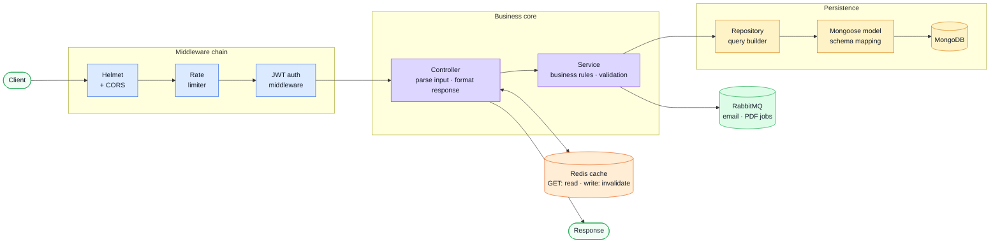
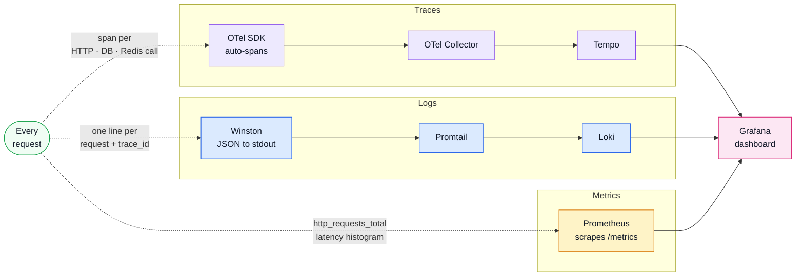

# Request Flow

The controller, service, repository and model below are **one module's** files, sitting side by side
in `src/modules/<name>/` — the flow crosses layers without leaving the directory. The middleware
chain and the datastores are the shared substrate every module travels through.

## End-to-end path

```mermaid
%%{init: {'flowchart': {'nodeSpacing': 60, 'rankSpacing': 90}}}%%
flowchart LR
    Client(["Client"])

    subgraph MW ["Middleware chain"]
        direction TB
        Helmet["Helmet\n+ CORS"]
        Rate["Rate\nlimiter"]
        Auth["JWT auth\nmiddleware"]
        Helmet --> Rate --> Auth
    end

    subgraph Core ["Business core"]
        direction TB
        Ctrl["Controller\nparse input · format response"]
        Svc["Service\nbusiness rules · validation"]
        Ctrl --> Svc
    end

    subgraph Persist ["Persistence"]
        direction TB
        Repo["Repository\nquery builder"]
        Model["Mongoose model\nschema mapping"]
        Mongo[("MongoDB")]
        Repo --> Model --> Mongo
    end

    Cache[("Redis cache\nGET: read · write: invalidate")]
    Queue[("RabbitMQ\nemail · PDF jobs")]
    Resp(["Response"])

    Client --> Helmet
    Auth   --> Ctrl
    Svc    --> Repo
    Ctrl  <--> Cache
    Svc    --> Queue
    Ctrl   --> Resp

    classDef client fill:#f0fdf4,stroke:#16a34a,color:#111827;
    classDef mw     fill:#dbeafe,stroke:#2563eb,color:#111827;
    classDef core   fill:#ddd6fe,stroke:#7c3aed,color:#111827;
    classDef data   fill:#fef3c7,stroke:#d97706,color:#111827;
    classDef cache  fill:#ffedd5,stroke:#ea580c,color:#111827;
    classDef queue  fill:#dcfce7,stroke:#16a34a,color:#111827;

    class Client,Resp client;
    class Helmet,Rate,Auth mw;
    class Ctrl,Svc core;
    class Repo,Model,Mongo data;
    class Cache cache;
    class Queue queue;
```

## Observability signals

Every request produces three independent signal streams in parallel with the flow above.

```mermaid
%%{init: {'flowchart': {'nodeSpacing': 55, 'rankSpacing': 80}}}%%
flowchart LR
    Req(["Every\nrequest"])

    subgraph Traces["Traces"]
        direction LR
        OTel["OTel SDK\nauto-spans"]
        Coll["OTel Collector"]
        Tempo["Tempo"]
        OTel --> Coll --> Tempo
    end

    subgraph Logs["Logs"]
        direction LR
        Win["Winston\nJSON to stdout"]
        Tail["Promtail"]
        Loki["Loki"]
        Win --> Tail --> Loki
    end

    subgraph Metrics["Metrics"]
        direction LR
        Prom["Prometheus\nscrapes /metrics"]
    end

    Grafana["Grafana\ndashboard"]

    Req -.->|"span per\nHTTP · DB · Redis call"| OTel
    Req -.->|"one line per\nrequest + trace_id"| Win
    Req -.->|"http_requests_total\nlatency histogram"| Prom

    Tempo --> Grafana
    Loki  --> Grafana
    Prom  --> Grafana

    classDef req   fill:#f0fdf4,stroke:#16a34a,color:#111827;
    classDef trace fill:#ede9fe,stroke:#7c3aed,color:#111827;
    classDef log   fill:#dbeafe,stroke:#2563eb,color:#111827;
    classDef met   fill:#fef3c7,stroke:#d97706,color:#111827;
    classDef ui    fill:#fce7f3,stroke:#db2777,color:#111827;

    class Req req;
    class OTel,Coll,Tempo trace;
    class Win,Tail,Loki log;
    class Prom met;
    class Grafana ui;
```

## What each layer does

| Layer                                 | Responsibility                                                                                                                                                                                       |
| ------------------------------------- | ---------------------------------------------------------------------------------------------------------------------------------------------------------------------------------------------------- |
| Middleware chain                      | Helmet sets security headers · CORS checks the origin · rate limiter blocks abuse · JWT auth verifies the token (or skips for public routes)                                                         |
| Redis cache                           | GET requests probe Redis first. A hit returns the stored response immediately — no controller, no database reached. On a write the controller invalidates related tags so stale entries are evicted. |
| Controller                            | Reads HTTP input, **validates it against the contract's Zod schema**, calls the service, formats the response envelope. Also where the module emits its audit action.                                |
| Service                               | Applies business rules over data that is already the right shape. Publishes async jobs to RabbitMQ when needed.                                                                                      |
| Repository → Mongoose model → MongoDB | Runs the actual database query. Repositories own query shape; models own schema. Controllers never touch either directly.                                                                            |
| RabbitMQ                              | Receives heavy async jobs (email, PDF). The HTTP handler responds immediately; a separate worker processes the job at its own pace.                                                                  |

## Cross-cutting strategies

### Security first

Things like [Helmet](../tools/security.md), CORS, cookies, auth, and rate limits happen near the edge.
That keeps the inside layers focused.

### Validation at the edge, rules inside

Shape validation happens in the **controller**, against the [Zod](../tools/runtime.md) schemas
generated from `openapi.yaml` — so a service is only ever called with data the contract already
accepted, and never has to ask whether a field is a string. Which sources a controller reads
(params, query, body, and in what precedence) is a property of the surface rather than of the
handler; [Request Input](./request-input.md) is the page for that.

The four steps every controller repeats — parse the body, answer 422, send a service refusal,
catch — live in `@infrastructure/http/controller` as `parseBody`, `rejectValidation`, `refused`
and `catchAs`. Helpers rather than a wrapper, deliberately: a wrapper that owned the chain would
move the stack trace off the handler, degrade the inference `parseBody`'s return type carries, and
hide the literal `.catch(` that `every-controller-catches.test.ts` looks for.

**Three endpoints deliberately do not parse a generated schema, and say so in place.**
`post-signup` and `put-account` are validated by their service against `zodUserSchema`, whose
messages come from the dictionary — parsing first would answer in Zod's own English and break the
`Content-Language` guarantee `tests/integration/locale.test.ts` asserts. `post-login` answers one
way for every wrong credential: parsing first makes a too-short password a 422 while a wrong
password of the right length is a 401, and it answers before `recordLoginFailure`, so the attempt
most worth recording never reaches the audit trail.

Business rules live in the
service, and the ones worth proving without a database live in `domain/`.

### Optional acceleration

[Redis cache hooks](../tools/redis-cache.md) speed up repeated reads, but the API still works when Redis is off.

### Async offloading

Heavy tasks (email, PDF generation) are pushed to [RabbitMQ](../tools/rabbitmq.md) so the HTTP response returns immediately.

### Signals everywhere

[Winston](../tools/winston.md), [Prometheus](../tools/prometheus.md), [OpenTelemetry](../tools/opentelemetry.md), and [Grafana](../tools/grafana.md) make it easier to debug the same request from multiple angles. Each log line carries a `trace_id` that links back to the full trace in Grafana → Tempo.

## The database error interpreter

`databaseErrorInterpreter` in `src/infrastructure/http/errors.ts` is the single place that decides
which driver failures describe the **request** rather than the server. One function, so the answer
is the same on all twelve models — a call-site `try`/`catch` is invisible to every endpoint that
did not think to write one.

| Raised by                    | Status | Why it is the caller's problem                                                                            |
| ---------------------------- | ------ | --------------------------------------------------------------------------------------------------------- |
| `CastError` (Mongoose)       | 422    | A value failed a schema path's cast — nearly always an ObjectId in a URL or a filter.                     |
| `BSONError` (driver)         | 422    | `new ObjectId(...)` itself refused: `''`, `'%00'`, `'undefined'`, anything not 24 hex characters.         |
| `E11000` duplicate key       | 409    | A unique index refused the write: something with that value already exists.                               |
| `ValidationError` (Mongoose) | 422    | A schema validator refused — a `required` path left empty, a value outside `min`/`max`, a failed `match`. |
| anything else                | 500    | Genuinely unrecognised.                                                                                   |

Every branch above exists because something describing the CALLER was reaching the 500 and being
reported as a server fault. `POST /products/search` is public and takes an `id` filter, so
`{"id": ""}` was an **unauthenticated** request producing a server error — an availability signal
as much as a correctness one.

### Three rules the branches share

- **Detected by `name`, not `instanceof`.** Both `bson` and `mongoose` reach this process as
  transitive dependencies of more than one package, and an `instanceof` against the wrong copy
  silently returns false.
- **The message is never the driver's.** E11000's text carries the index name and the duplicated
  value — user-supplied data, which has no business being echoed back. Mongoose's enumerates the
  failing paths, which describes the schema. Both are literals here instead.
- **Neither half of the tuple comes from the error.** `message` is prose, so parsing a status out
  of it yields `NaN`, and `res.status(NaN)` throws inside Express — a client error arriving as a 500.

### Why `ValidationError` is not already impossible

Request bodies are validated by Zod schemas generated from `openapi.yaml` before a controller runs,
so a Mongoose validator firing means the model is enforcing something the contract does not.
`POST /locales` was the worked example: a display name of one space satisfies `minLength: 1`, then
the schema's `trim` reduces it to `''` and `required` refuses it — a 500 for a stray space, on an
admin route, found by `tests/fuzz/endpoints.fuzz.test.ts` on its third generated case.

Closing it **at the contract** is still the better fix where the constraint can be expressed there.
This branch is the floor under that, across all twelve models at once.

### Where a fifth branch goes

In this function, carrying a comment naming which driver raises it and why its status is what it
is — not in a controller, and not as a `try`/`catch` at the call site.
`tests/fuzz/endpoints.fuzz.test.ts` is what surfaces these: a 500 out of it is this class of error
until something proves otherwise.

## What an unhandled error tells the client

The global handler answers in four branches, and the order is the point: a `MulterError` becomes
400, an `ExtendedError` is returned with the status and copy its thrower chose, a driver failure
that `databaseErrorInterpreter` recognises as a _client_ mistake becomes that 4xx, and everything
else is 500.

### The database branch is a safety net, not a substitute

Every controller ends its chain with a `.catch()` that calls `rejectDatabaseError`, so nothing
routinely relies on this branch. But a controller added later may forget one, and forgetting is
silent — a malformed `ObjectId` reported as a server fault rather than a bad request.
`tests/fuzz/endpoints.fuzz.test.ts` walks every spec operation and is what catches the next one.

### The 500 branch says nothing

`errors[]` carries a constant, never `error.message`. An unexpected error is precisely the case
where nobody chose the wording: a Mongoose validation error naming internal field paths, a driver
error naming hosts and ports, an `ENOENT` naming a filesystem layout, a third-party client quoting
a URL with a key in it. Any of those is free reconnaissance for an unauthenticated caller, and none
of it means anything to the person reading it.

The detail is not lost — it is logged with the request id and trace id, where an operator can act on
it and a stranger cannot.

## Why the flow matters

When you change behavior, ask:

- Is this an **API contract** change? Go to [API](../api/).
- Is this a **dependency or infrastructure** concern? Go to [Tools](../tools/).
- Is this a **layer ownership** issue? Go back to [Layers](./layers.md).
- Is this about **process lifecycle**, scaling, or shutdown? Go to [Clustering & Shutdown](./clustering.md).
