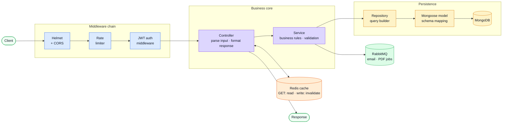
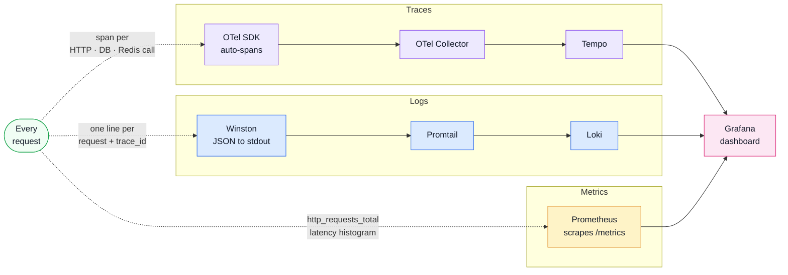
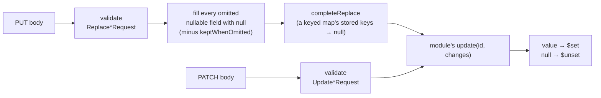
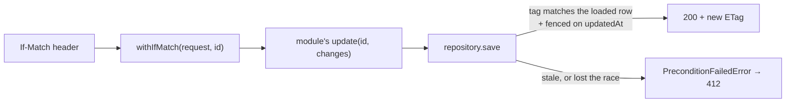
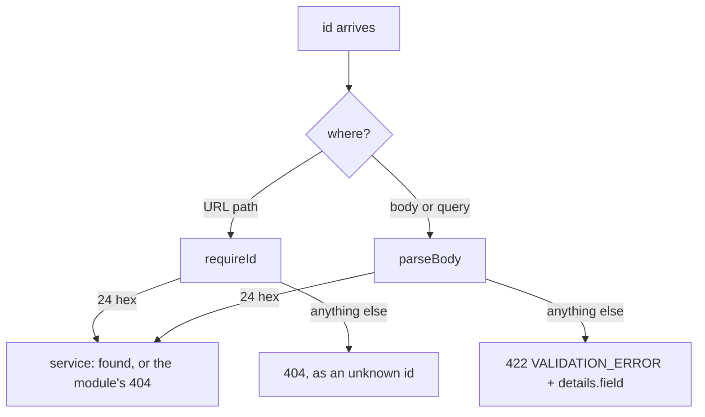

# Request Flow

The controller, service, repository and model below are **one module's** files, sitting side by side
in `src/modules/<name>/` — the flow crosses layers without leaving the directory. The middleware
chain and the datastores are the shared substrate every module travels through.

## End-to-end path

```mermaid
%%{init: {'flowchart': {'nodeSpacing': 60, 'rankSpacing': 90}}}%%
flowchart LR
    Client(["Client"])

    subgraph MW ["Middleware chain"]
        direction TB
        Helmet["Helmet\n+ CORS"]
        Rate["Rate\nlimiter"]
        Auth["JWT auth\nmiddleware"]
        Helmet --> Rate --> Auth
    end

    subgraph Core ["Business core"]
        direction TB
        Ctrl["Controller\nparse input · format response"]
        Svc["Service\nbusiness rules · validation"]
        Ctrl --> Svc
    end

    subgraph Persist ["Persistence"]
        direction TB
        Repo["Repository\nquery builder"]
        Model["Mongoose model\nschema mapping"]
        Mongo[("MongoDB")]
        Repo --> Model --> Mongo
    end

    Cache[("Redis cache\nGET: read · write: invalidate")]
    Queue[("RabbitMQ\nemail · PDF jobs")]
    Resp(["Response"])

    Client --> Helmet
    Auth   --> Ctrl
    Svc    --> Repo
    Ctrl  <--> Cache
    Svc    --> Queue
    Ctrl   --> Resp

    classDef client fill:#f0fdf4,stroke:#16a34a,color:#111827;
    classDef mw     fill:#dbeafe,stroke:#2563eb,color:#111827;
    classDef core   fill:#ddd6fe,stroke:#7c3aed,color:#111827;
    classDef data   fill:#fef3c7,stroke:#d97706,color:#111827;
    classDef cache  fill:#ffedd5,stroke:#ea580c,color:#111827;
    classDef queue  fill:#dcfce7,stroke:#16a34a,color:#111827;

    class Client,Resp client;
    class Helmet,Rate,Auth mw;
    class Ctrl,Svc core;
    class Repo,Model,Mongo data;
    class Cache cache;
    class Queue queue;
```

## Observability signals

Every request produces three independent signal streams in parallel with the flow above.

```mermaid
%%{init: {'flowchart': {'nodeSpacing': 55, 'rankSpacing': 80}}}%%
flowchart LR
    Req(["Every\nrequest"])

    subgraph Traces["Traces"]
        direction LR
        OTel["OTel SDK\nauto-spans"]
        Coll["OTel Collector"]
        Tempo["Tempo"]
        OTel --> Coll --> Tempo
    end

    subgraph Logs["Logs"]
        direction LR
        Win["Winston\nJSON to stdout"]
        Tail["Promtail"]
        Loki["Loki"]
        Win --> Tail --> Loki
    end

    subgraph Metrics["Metrics"]
        direction LR
        Prom["Prometheus\nscrapes /metrics"]
    end

    Grafana["Grafana\ndashboard"]

    Req -.->|"span per\nHTTP · DB · Redis call"| OTel
    Req -.->|"one line per\nrequest + trace_id"| Win
    Req -.->|"http_requests_total\nlatency histogram"| Prom

    Tempo --> Grafana
    Loki  --> Grafana
    Prom  --> Grafana

    classDef req   fill:#f0fdf4,stroke:#16a34a,color:#111827;
    classDef trace fill:#ede9fe,stroke:#7c3aed,color:#111827;
    classDef log   fill:#dbeafe,stroke:#2563eb,color:#111827;
    classDef met   fill:#fef3c7,stroke:#d97706,color:#111827;
    classDef ui    fill:#fce7f3,stroke:#db2777,color:#111827;

    class Req req;
    class OTel,Coll,Tempo trace;
    class Win,Tail,Loki log;
    class Prom met;
    class Grafana ui;
```

## What each layer does

| Layer                                 | Responsibility                                                                                                                                                                                                     |
| ------------------------------------- | ------------------------------------------------------------------------------------------------------------------------------------------------------------------------------------------------------------------ |
| Middleware chain                      | Helmet sets security headers · CORS checks the origin · rate limiter blocks abuse · JWT auth verifies the token (or skips for public routes)                                                                       |
| Redis cache                           | GET requests probe Redis first. A hit returns the stored response immediately — no controller, no database reached. On a write the controller invalidates related tags so stale entries are evicted.               |
| Controller                            | Reads HTTP input, **validates it against the contract's Zod schema**, calls the service, formats the response envelope.                                                                                            |
| Service                               | Applies business rules over data that is already the right shape, and **emits the module's audit action** — the write and the record of it are decided in one place. Publishes async jobs to RabbitMQ when needed. |
| Repository → Mongoose model → MongoDB | Runs the actual database query. Repositories own query shape; models own schema. Controllers never touch either directly.                                                                                          |
| RabbitMQ                              | Receives heavy async jobs (email, PDF). The HTTP handler responds immediately; a separate worker processes the job at its own pace.                                                                                |

The audit row moved. It used to say the controller was where a module emitted its audit action, and
the tree says otherwise: a module that records an action does it from `service.ts` or
`services/*.ts`, beside the write itself, and exactly **two controllers** in the whole tree emit —
both in `account`, both arguing in place why they have to.
`post-login` keeps the failure and success emits together at the handler because the success one may
only fire once the refresh token, the cookies and the access token all exist, which is a step later
than `login()` proving the credentials matched. `post-reset-request` emits **unconditionally**,
whether or not the address belongs to an account, because an emit reachable only after a user is
found would make the audit trail leak the existence the identical response deliberately hides — the
same user-enumeration guarantee, one layer down.

Both exceptions are about a fact the service cannot see: when the emit must fire, and whether it
fires at all. Anything decided by the write itself belongs with the write.

## Cross-cutting strategies

### Security first

Things like [Helmet](../tools/security.md), CORS, cookies, auth, and rate limits happen near the edge.
That keeps the inside layers focused.

### Validation at the edge, rules inside

Shape validation happens in the **controller**, against the [Zod](../tools/runtime.md) schemas
generated from `openapi.yaml` — so a service is only ever called with data the contract already
accepted, and never has to ask whether a field is a string. Which sources a controller reads
(params, query, body, and in what precedence) is a property of the surface rather than of the
handler; [Request Input](./request-input.md) is the page for that.

The four steps every controller repeats — parse the body, answer 422, send a service refusal,
catch — live in `@infrastructure/http/controller` as `parseBody`, `rejectValidation`, `refused`
and `catchAs`. Helpers rather than a wrapper, deliberately: a wrapper that owned the chain would
move the stack trace off the handler, degrade the inference `parseBody`'s return type carries, and
hide the literal `.catch(` that `scripts/eslint/controller-chain-must-catch.ts` looks for.

**Two endpoints deliberately do not parse a generated schema, and say so in place.**
`post-signup` is validated by its service against `zodUserSchema`, whose messages come from the
dictionary — parsing first would answer in Zod's own English and break the
`Content-Language` guarantee `tests/integration/locale.test.ts` asserts. `post-login` answers one
way for every wrong credential: parsing first makes a too-short password a 422 while a wrong
password of the right length is a 401, and it answers before `recordLoginFailure`, so the attempt
most worth recording never reaches the audit trail.

Business rules live in the
service, and the ones worth proving without a database live in `domain/`.

### Optional acceleration

[Redis cache hooks](../tools/redis-cache.md) speed up repeated reads, but the API still works when Redis is off.

### Async offloading

Heavy tasks (email, PDF generation) are pushed to [RabbitMQ](../tools/rabbitmq.md) so the HTTP response returns immediately.

### Signals everywhere

[Winston](../tools/winston.md), [Prometheus](../tools/prometheus.md), [OpenTelemetry](../tools/opentelemetry.md), and [Grafana](../tools/grafana.md) make it easier to debug the same request from multiple angles. Each log line carries a `trace_id` that links back to the full trace in Grafana → Tempo.

## PUT replaces, PATCH merges

The rules themselves — what each verb means, the status it answers, `null` versus `''`, the
415 guard — are on [Write Methods](../api/write-methods.md). This section is the mechanism.

Most resources with an update answer both verbs through one shared controller —
`createUpdateController` in `@infrastructure/surfaces/create-update-controller`. The verb only
changes the front of the pipeline; the module's own `update(id, changes)` never learns which one
produced the change-set.

**Not factory-backed:**

- **Entity translations** (`PUT`/`PATCH /locales/translations/{entityType}/{id}`) and the locale
  entries bulk import (`PUT`/`PATCH /locales/{locale}/tenants/{tenant}/entries`) are hand-written.
  Their bodies differ by verb where it matters: a PATCH locale entry merges field by field (a
  `null` clears one), a PUT states each locale whole.
- **PUT-only resources** — `PUT /locales/{locale}/entries/{entryId}`, `PUT /cart/{productId}`,
  `PUT /cart/shipping-method`, `PUT /wishlist/{productId}`, `PUT /account/addresses/{id}/default` —
  have no PATCH.

```mermaid
flowchart LR
    P["PUT body"] --> VR["validate<br/>Replace*Request"] --> F["fill every omitted<br/>nullable field with null<br/>(minus keptWhenOmitted)"] --> C["completeReplace<br/>(a keyed map's stored keys → null)"] --> U
    M["PATCH body"] --> VP["validate<br/>Update*Request"] --> U["module's update(id, changes)"]
    U --> S["value → $set<br/>null → $unset"]
```

- **The factory reads the clearable fields off the schema itself** (`clearableFields`: every field
  that accepts `null`), so nobody keeps the list by hand. A field that cannot be `null` is
  required by the PUT schema instead.
- **`keptWhenOmitted`** names fields outside the PUT representation that are nullable yet must
  survive an omission — `imageUrl`, whose only writer is an upload. An explicit `null` still
  clears it: the field is unset and the old file and thumbnail are deleted after the save.
- **`completeReplace`** is the PUT-only hook for a keyed map the schema alone cannot name: a
  product's `translations` sets every stored locale the body left out to `null`, the signal a
  PATCH uses to delete one.
- **A cleared field is unset on disk, never a stored `null`.** `clearedOrValue`
  (`@infrastructure/persistence/changes`) turns the change-set's `null` into `undefined`, which
  `.save()` writes as `$unset`.
- **The module's `update()` audits itself.** The factory never records an audit entry, so no
  update is logged twice.

`tests/cross-cutting/replace-patch-parity.test.ts` checks that each resource's PUT and PATCH
schemas declare the same fields.

**Conditional writes ride the same pipeline.** The update and delete factories run the module's
write inside `withIfMatch(request, id, …)`, which opens a precondition for that row. The
repository's `save`/`deleteOne` are where it is met, so no module writes precondition code — see
[Write Methods](../api/write-methods.md#conditional-writes-etag-and-if-match).

```mermaid
flowchart LR
    H["If-Match header"] --> W["withIfMatch(request, id)"] --> U["module's update(id, changes)"] --> R["repository.save"]
    R -->|"tag matches the loaded row<br/>+ fenced on updatedAt"| OK["200 + new ETag"]
    R -->|"stale, or lost the race"| E["PreconditionFailedError → 412"]
```

## A malformed id has one answer per position

Where an id sits decides the answer. "Malformed" means not this backend's own id: 24 hex
characters. The contract's shared `Id` is deliberately looser (see below), so a value can satisfy
the contract and still be refused here.

| The id is in…      | Malformed (`abc`)                                                     | Well-formed but unknown |
| ------------------ | --------------------------------------------------------------------- | ----------------------- |
| the **URL path**   | **404**, the same code and copy the module answers an unknown id with | 404                     |
| a **body field**   | **422** `VALIDATION_ERROR`, `details.field` names the field           | 404 from the service    |
| a **query filter** | **422** `VALIDATION_ERROR`, `details.field` names the field           | an empty list           |

```mermaid
flowchart TD
    A["id arrives"] --> B{"where?"}
    B -->|"URL path"| C["requireId"]
    B -->|"body or query"| D["parseBody"]
    C -->|"24 hex"| S["service: found, or the module's 404"]
    C -->|"anything else"| N["404, as an unknown id"]
    D -->|"24 hex"| S
    D -->|"anything else"| V["422 VALIDATION_ERROR + details.field"]
```

- **Path → 404.** The URL _is_ the resource asked for, so a broken one points at nothing, and the
  answer cannot tell a caller which ids this API issues. `requireId`
  (`src/infrastructure/http/ids.ts`) is the one check, called by every shared controller factory and
  by every hand-written controller with an id in its path, before the database is asked. It takes
  the module's own not-found copy, which is what makes the two answers byte-identical.
- **Field → 422 naming the field.** A body or query value is an argument, and a bad argument is a
  validation error that says which one. `parseBody` walks the request schema for the contract's `Id`
  fields (found by the shared pattern) and refuses each that is not an ObjectId, in the same list
  as every other bad field — so a body with a bad `quantity` and a bad `items.1.productId` reports
  both.
- **The contract's `Id`** is `minLength: 1`, `maxLength: 64`, `pattern: '^[0-9A-Za-z_-]+$'`: a
  storage-neutral bound (OWASP API4:2023, bound every string input) that fits an ObjectId, a ULID
  and a UUID, so the paired twin and the frontend's response validation keep working. The ObjectId
  rule is this backend's alone and never reaches the contract.
- **Why not 404 everywhere.** A 404 on `POST /cart` reads like a mistyped path, it cannot name the
  field (one body can carry several ids), and `quantity: -1` is already a 422 naming its field.

`tests/integration/malformed-ids.test.ts` walks every id site `openapi.yaml` declares and holds it
to the table, so a route added later is covered on its first run.

## The database error interpreter

`databaseErrorInterpreter` in `src/infrastructure/http/errors.ts` is the single place that decides
which driver failures describe the **request** rather than the server. One function, so the answer
is the same on every model — a call-site `try`/`catch` is invisible to every endpoint that
did not think to write one.

| Raised by                    | Status | Why it is the caller's problem                                                                                                                               |
| ---------------------------- | ------ | ------------------------------------------------------------------------------------------------------------------------------------------------------------ |
| `CastError` (Mongoose)       | 422    | A value failed a schema path's cast. A safety net: a malformed id is answered before the database, see [below](#a-malformed-id-has-one-answer-per-position). |
| `BSONError` (driver)         | 422    | `new ObjectId(...)` itself refused: `''`, `'%00'`, `'undefined'`, anything not 24 hex characters. The same safety net.                                       |
| `E11000` duplicate key       | 409    | A unique index refused the write: something with that value already exists.                                                                                  |
| `ValidationError` (Mongoose) | 422    | A schema validator refused — a `required` path left empty, a value outside `min`/`max`, a failed `match`.                                                    |
| any module's `ConflictError` | 409    | The write was refused for what it would make true — `access`'s `AccessInvariantError` today.                                                                 |
| `PreconditionFailedError`    | 412    | The caller's `If-Match` no longer describes the row — see [Conditional writes](../api/write-methods.md#conditional-writes-etag-and-if-match).                |
| anything else                | 500    | Genuinely unrecognised.                                                                                                                                      |

Every branch above exists because something describing the CALLER was reaching the 500 and being
reported as a server fault. `POST /products/search` is public and takes an `id` filter, so
`{"id": ""}` was an **unauthenticated** request producing a server error — an availability signal
as much as a correctness one.

### Three rules the branches share

- **The four driver/Mongoose branches are detected by `name`, not `instanceof`.** Both `bson` and
  `mongoose` reach this process as transitive dependencies of more than one package, and an
  `instanceof` against the wrong copy silently returns false. `ConflictError` is the one exception:
  it is our own class, defined once, here — a module subclasses it and `instanceof` is exactly the
  right tool, since there is no second copy of it anywhere to disagree with.
- **The message is never the driver's.** E11000's text carries the index name and the duplicated
  value — user-supplied data, which has no business being echoed back. Mongoose's enumerates the
  failing paths, which describes the schema. Both are literals here instead.
- **Neither half of the tuple comes from the error.** `message` is prose, so parsing a status out
  of it yields `NaN`, and `res.status(NaN)` throws inside Express — a client error arriving as a 500.

### Why `ValidationError` is not already impossible

Request bodies are validated by Zod schemas generated from `openapi.yaml` before a controller runs,
so a Mongoose validator firing means the model is enforcing something the contract does not.
`POST /locales` was the worked example: a display name of one space satisfies `minLength: 1`, then
the schema's `trim` reduces it to `''` and `required` refuses it — a 500 for a stray space, on a
keyed route, found by `tests/fuzz/endpoints.fuzz.test.ts` on its third generated case.

Closing it **at the contract** is still the better fix where the constraint can be expressed there.
This branch is the floor under that, across every model at once.

### Where a fifth branch goes

In this function, carrying a comment naming which driver raises it and why its status is what it
is — not in a controller, and not as a `try`/`catch` at the call site.
`tests/fuzz/endpoints.fuzz.test.ts` is what surfaces these: a 500 out of it is this class of error
until something proves otherwise.

## What an unhandled error tells the client

The global handler answers in four branches, and the order is the point: a `MulterError` becomes
400; a library that follows the `http-errors` contract (`expose: true`, a 4xx `.status`/
`.statusCode`) — body-parser's oversized-body and malformed-body rejections among them — answers
that declared status (400/413/415), never the library's own message; a driver failure that
`databaseErrorInterpreter` recognises as a _client_ mistake becomes that 4xx; and everything else
is 500. A middleware that already has the `Response` in hand — file upload validation, for one —
answers `rejectResponse` directly instead of throwing something for this handler to translate.

### The database branch is a safety net, not a substitute

Every controller ends its chain with a `.catch()` that calls `rejectDatabaseError`, so nothing
routinely relies on this branch. But a controller added later may forget one, and forgetting is
silent. `tests/fuzz/endpoints.fuzz.test.ts` walks every spec operation and is what catches the next
one. A malformed id is not that case: it is answered before the database by `requireId` and
`parseBody`, and a `CastError` reaching this branch means a route skipped them.

### The 500 branch says nothing

`errors[]` carries a constant, never `error.message`. An unexpected error is precisely the case
where nobody chose the wording: a Mongoose validation error naming internal field paths, a driver
error naming hosts and ports, an `ENOENT` naming a filesystem layout, a third-party client quoting
a URL with a key in it. Any of those is free reconnaissance for an unauthenticated caller, and none
of it means anything to the person reading it.

The detail is not lost — it is logged with the request id and trace id, where an operator can act on
it and a stranger cannot.

## Why the flow matters

When you change behavior, ask:

- Is this an **API contract** change? Go to [API](../api/).
- Is this a **dependency or infrastructure** concern? Go to [Tools](../tools/).
- Is this a **layer ownership** issue? Go back to [Layers](./layers.md).
- Is this about **process lifecycle**, scaling, or shutdown? Go to [Clustering & Shutdown](./clustering.md).
