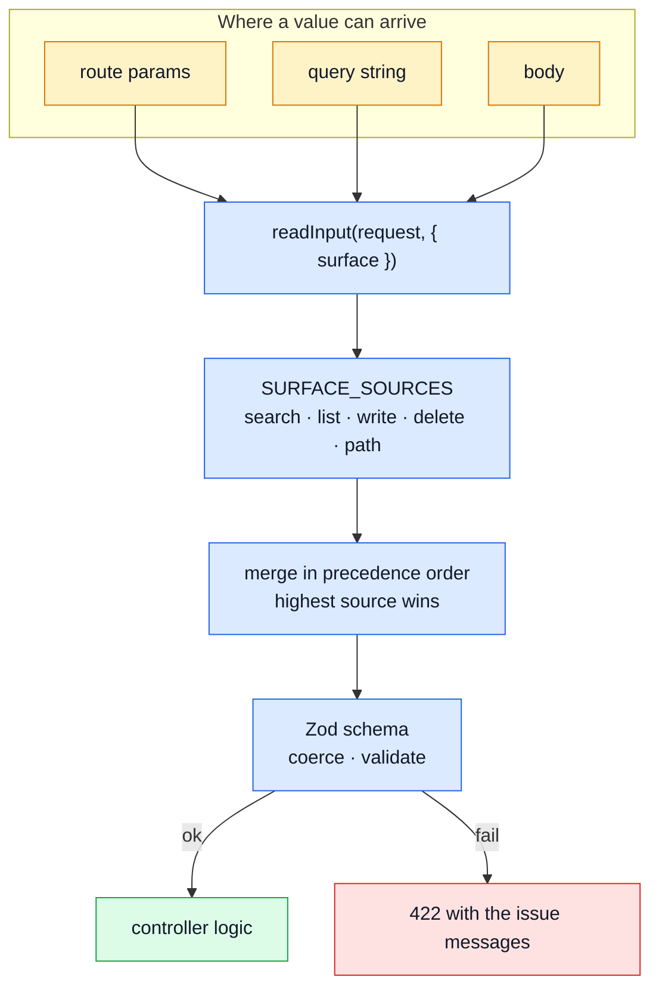

# Request Input

A value an endpoint needs may arrive as a route param, a query-string entry or a body field, and
the same endpoint often accepts more than one of those. That is deliberate: it lets a single
controller serve `GET /products?text=x` and `POST /products/search {"text":"x"}` without
duplicating the handler, which is what keeps long filter sets out of URLs.

What is _not_ deliberate is re-deriving the rules of that polymorphism at every call site. This
page is the single written statement of which sources each endpoint reads, in what order, and what
happens to the value on the way in.

## The shape in one picture



The load-bearing part is the middle: a controller names **which surface it is**, not which sources
to read. That is what keeps precedence a property of the endpoint's kind rather than of whichever
array the newest controller happened to pass.

## The table

Read "sources" left-to-right as precedence, highest first. A controller does not spell this array:
it names the **surface** it is (`search`, `list`, `write`, `delete`, `path`) and `SURFACE_SOURCES`
in `@infrastructure/http/request` maps that to the row below. The set is closed, so precedence is a
property of the surface rather than of whichever array the newest controller happened to pass — and
a sixth combination has to be added there deliberately, where it can be reviewed against the spec.
`tests/contract/request-sources.test.ts` pins the set for exactly that reason: adding one fails
that test once, which is the prompt to update this page alongside it.

| Surface  | Sources (highest first) | Used by                                                        |
| -------- | ----------------------- | -------------------------------------------------------------- |
| `search` | body, query             | the four endpoints with a `POST …/search` sibling              |
| `list`   | query                   | the four GET-only collection reads, which have no such sibling |
| `write`  | params, body            | `writeProducts`/`writeUsers`/`writeOrders`, cart PUT           |
| `delete` | params, query, body     | the three soft/hard delete controllers                         |
| `path`   | params                  | `DELETE /cart/{productId}`, which declares no body             |

`search` and `list` differ on one question: **is there a route that can carry a body?** A GET
cannot — RFC 9110 §9.3.1 gives content on a GET no defined semantics and the Fetch spec refuses to
send it, so the paired frontend could never use one — which makes `search` on a GET-only route a
claim about a source no client has. Where such a route is also cached the claim is worse than
decorative: `setCache` keys on the declared **query** parameters, so a body-borne filter is
invisible to the key. Give a collection read a real DTO form by adding `POST /x/search`, not by
declaring a body on its GET.

| Endpoint(s)                                                             | Parameter                                       | Sources (highest first) | Treatment                                      |
| ----------------------------------------------------------------------- | ----------------------------------------------- | ----------------------- | ---------------------------------------------- |
| `GET /products`, `POST /products/search`                                | `id`                                            | body, query             | first non-empty wins                           |
|                                                                         | `category`, `tag`                               | body, query             | merged, then `coerceStringArray(...)[0]`       |
|                                                                         | `page`, `pageSize`                              | body, query             | merged, then the shared pagination schema      |
|                                                                         | `text`, `minPrice`, `maxPrice`                  | body, query             | merged, then Zod                               |
| `GET /users`, `POST /users/search`                                      | `id`                                            | body, query             | first non-empty wins                           |
|                                                                         | `active`                                        | body, query             | merged, then Zod `value === 'true'`            |
|                                                                         | `page`, `pageSize`, `text`, `email`, `username` | body, query             | merged, then Zod (pagination shared)           |
| `GET /orders`, `POST /orders/search`                                    | `id`                                            | body, query             | first non-empty wins                           |
|                                                                         | `userId`                                        | body, query             | merged; **ignored for non-admin callers**      |
|                                                                         | `page`, `pageSize`, `productId`, `email`        | body, query             | merged, then Zod (pagination shared)           |
| `DELETE /products`, `DELETE /products/:id`, `DELETE /products/:id/hard` | `id`                                            | params, body            | validated as an ObjectId, 422 on failure       |
|                                                                         | `hardDelete`                                    | params, query, body     | boolean; 422 for anything that is not one      |
| `DELETE /users`, `DELETE /users/:id`, `DELETE /users/:id/hard`          | `id`                                            | params, body            | validated as an ObjectId, 422 on failure       |
|                                                                         | `hardDelete`                                    | params, query, body     | boolean; 422 for anything that is not one      |
| `DELETE /orders`, `DELETE /orders/:id`, `DELETE /orders/:id/hard`       | `id`                                            | params, body            | validated as an ObjectId, 422 on failure       |
|                                                                         | `hardDelete`                                    | params, query, body     | boolean; 422 for anything that is not one      |
| `POST /orders`, `PUT /orders`, `PUT /orders/:id`                        | `id`                                            | params, body            | first non-empty wins                           |
|                                                                         | everything else                                 | body                    | untouched                                      |
| `POST /products`, `PUT /products`, `PUT /products/:id`                  | `id`                                            | params, body            | first non-empty wins                           |
|                                                                         | `active`                                        | body                    | boolean; decoded only on `multipart/form-data` |
|                                                                         | `categories`, `tags`                            | body                    | string array; decoded only on multipart        |
|                                                                         | everything else                                 | body                    | untouched                                      |
| `POST /users`, `PUT /users`, `PUT /users/:id`                           | `id`                                            | params, body            | first non-empty wins                           |
|                                                                         | `admin`, `active`                               | body                    | boolean; decoded only on multipart             |
|                                                                         | everything else                                 | body                    | untouched                                      |
| `POST /cart`                                                            | `productId`, `quantity`                         | body                    | Zod, then `isValidObjectId`                    |
| `PUT /cart/:productId`                                                  | `productId`                                     | params, body            | first non-empty wins, then `isValidObjectId`   |
|                                                                         | `quantity`                                      | body                    | Zod                                            |
| `DELETE /cart/:productId`                                               | `productId`                                     | params, body            | first non-empty wins, then `isValidObjectId`   |
| `GET /feedback`, `POST /feedback/search`                                | `page`, `pageSize`                              | body, query             | merged, then the shared pagination schema      |
|                                                                         | `text`, `email`, `status`                       | body, query             | merged, passed through as strings              |
| `GET /inventory/levels`                                                 | `page`, `pageSize`, `lowOnly`                   | query                   | `lowOnly` decoded as a boolean, then Zod       |
| `GET /inventory/movements`                                              | `productId`                                     | query                   | first non-empty wins                           |
|                                                                         | `page`, `pageSize`, `reason`                    | query                   | then Zod                                       |
| `GET /locales/{locale}/entries`                                         | `page`, `pageSize`, `text`, `tenant`            | query                   | then the shared pagination schema              |
| `GET /observability/audit`                                              | `actor`, `action`, `outcome`, `since`           | query                   | first non-empty wins                           |
|                                                                         | `page`, `pageSize`                              | query                   | then the shared pagination schema              |

Pagination has exactly two authorities, and they answer different questions. `@infrastructure/http/schemas`
owns the **bounds** — `openapi.yaml` declares `minimum: 1` / `maximum: 100`, and every one of the
four search endpoints answers 422 for anything outside that, `GET /feedback` included.
`normalizePagination` (`@infrastructure/persistence/search`) owns the **defaults** — page 1, ten per page, or
`NODE_SETTINGS_PAGINATION_PAGE_SIZE` — and it runs on every search, which is why a controller
leaves an unspecified page absent rather than filling it in. Neither clamps: an out-of-range
request is rejected, not quietly turned into a different request.

## The rules behind the table

**Precedence is a `||` chain over the surface's sources.** An empty value falls through as if the
key were absent, so `?id=` on a route that also has a body `id` reads the body's. This is the one
place the migration to `readInput` unified two spellings that used to differ: `extractCustomId`
used `||` (empty falls through) while `extractAndValidateId` used `??` (empty wins). No endpoint's
declared contract distinguishes the two, and no test did either.

**Explicit `undefined` keys are dropped.** An object spread _keeps_ a key whose value is
`undefined`, and such a key handed to Mongoose becomes a `field: undefined` filter clause rather
than being ignored. The merge therefore does a second pass to remove them.

**Absent is not empty.** A field nobody sent comes back `undefined`, never `false` or `[]`. The
service layer assigns anything defined, so defaulting here would turn a partial update into a full
overwrite and silently wipe whatever the caller did not mention.

**Only the string transports are decoded.** A route param and a query entry are strings by
construction — `?active=false` is the _string_ `'false'`, which is truthy, and a repeated key is
what stands in for an array — so there is no type in them to destroy and a declared boolean coming
from either is always decoded. A body is decoded only when it is `multipart/form-data`, which has
the same problem for the same reason. A JSON body is passed through untouched, and that asymmetry
is load-bearing: coercing JSON too is how `{"active": "not-a-boolean"}` reached the validator as a
perfectly good `true` and answered 201 where the contract promises 422.
`tests/contract/request-contract.test.ts` is the guard.

**Decoding is not validation.** Whatever the decoder could not recognise is passed through
unchanged, so `?hardDelete=maybe` reaches a schema and answers 422 rather than being guessed at.
The schemas for the scalars more than one endpoint accepts live in `@infrastructure/http/schemas`.

## Declaring it

`readInput` (`@infrastructure/http/request`) takes the row of the table above as an argument:

```ts
const input = readInput(request, {
    // which surface this is; the sources and their precedence follow from it
    surface: 'delete',
    ids: ['id'],
    booleans: ['active', 'hardDelete'],
    stringArrays: ['categories', 'tags']
});
```

- `surface` — which route surface this is, and therefore which of `params`/`body`/`query` it reads
  and in what order (see the surface table above). Every key found in any of them ends up on the
  result; the categories below only change how _specific_ keys are resolved or typed.
- `ids` — scalar identifiers. A repeated key arrives as an array, so the first entry is taken, and
  the `||` chain above applies. Typed `string | undefined`; nothing is validated here.
- `booleans` / `stringArrays` — fields whose type survives a JSON body but not a string transport.
  Decoded per the rule above. Anything unrecognisable is passed through so the validator
  downstream rejects it rather than this layer inventing a value.

One route may also state a flag in its path rather than as a value. `DELETE /products/:id/hard`
means what `DELETE /products/:id?hardDelete=true` means; the `routeFlag('hardDelete')` middleware
(`@middlewares/route-flag`) writes it onto `request.params` so the controller keeps a single
declaration instead of growing a second entry point. Being a param, it also outranks a query entry
that contradicts it — the URL a caller aimed at is the more explicit statement of intent.

Every domain that deletes a persisted record offers the same three spellings, and offers them for
the same reason: the shape is a property of the domain, not a decision three route files each make.
Products, users and orders all do. Cart and feedback do not, and that is a decision rather than an
omission — a cart line is session-scoped, so there is no record to keep, and `deleteCartItem`
narrows its declaration to `['params']` to say so.

Two helpers deliberately stay outside `readInput`:

- `isValidObjectId` — an `id is string` type guard, which is a different job from extraction and
  earns its line at three cart call sites.
- `extractAndValidateId` — it _responds_ (422) as well as extracting. It is built on `readInput`
  internally.

## What is deliberately not done yet

`openapi.yaml` already states, per operation, where every parameter lives — `in: path`,
`in: query`, `requestBody`. That is the same information the declarations above carry by hand, so
generating them from the spec would make the discrepancies below _unwritable_: a controller could
not read a source the contract does not declare, because nobody would be writing the source list.

It is not done, and the order matters. Four things stand in the way, none fatal: one controller
serves several operations (`writeProducts`, `writeUsers` and `writeOrders` each cover three
operationIds with three different declared bodies), so a generated per-operation declaration would
have to be wired per route rather than per controller; `booleans`/`stringArrays` derive from the _multipart_ schema variant, not the JSON
one; `GET /products` and `POST /products/search` are two operations deliberately sharing one
controller, so their declarations would need unioning; and orval generates clients and schemas,
not server-side input declarations, so this would be new machinery to own.

The cheaper first move is a **test**, not a generator, and it exists:
`tests/contract/request-sources.test.ts`. It recovers the route table statically — `src/modules.ts` and each
`module.ts` for the enabled modules and their base paths, `src/app/routes.ts` for the system
router it still mounts by name, the router files for each mounted path and its controller — reads
that controller's `readInput` declarations, and asserts they are a subset of what `openapi.yaml`
allows. It also asserts the two sets of routes match: every mounted route is in the spec, and
every spec operation is mounted.

The comparison is per **controller**, against the union of every route it serves, and that is the
concession the first obstacle above forces. `getProducts` serves `GET /products` (query) and
`POST /products/search` (body) from one `surface: 'search'`; asserting that declaration
against either route alone would report the other's source as undeclared. What survives the union
is the real defect — a controller reading a source **no** route it serves declares, which is the
shape of all five closed discrepancies below. Splitting the declaration per operation is what
would let it tighten to per-route, and is the remaining work.

**A subset assertion over an empty set passes.** Both halves of that comparison are recovered by
regex from source that is free to be re-spelled, and both have gone quiet here. The scanner looked
for `sources: ['params', …]`, the spelling that predates the surface refactor; when the last of
those disappeared it matched nothing, every controller read as declaring nothing, and the check
passed for the whole repo without comparing a single declaration. It also read a `$ref`'d
parameter's location off the reference NAME, on the claim that "every shared parameter in this
spec is a path parameter" — which was never true (`PageParam`, `TextParam` and `IdParam` are all
`in: query`) and survived only because every route using them also carried an inline query
parameter to be found instead.

Both are fixed — the scanner reads `surface:` and maps it through `SURFACE_SOURCES` parsed from
`request.ts` itself, and references resolve against `components.parameters` — and the test now
carries a tripwire that asserts it recovered the surface table and a declaration from more than
ten controllers. Turning it back on immediately produced four findings, all the same shape: four
GET-only list controllers declaring `search`, and so reading a body no route of theirs declares.
That is what the `list` surface exists to say instead.

That test is also what makes generating the router safe. Routes written by hand sit next to a spec
written by hand, so a mismatch at least shows up in a diff; routes generated from a descriptor do
not, and a typo would silently mount something the spec never declared and orval never generated a
client for.

## Known discrepancies

None outstanding. Every one recorded here was resolved by correcting `openapi.yaml` — in both this
repo and the paired frontend — or the declaration that disagreed with it. See the _Closed_ list
below, which keeps each one's mechanism because every one of them names a way the same class of
bug can return.

The open item is not a discrepancy but a granularity: the comparison is per controller against the
union of its routes, so a source declared on one route it serves excuses that source on all of
them. `deleteUsers` is the live example — `DELETE /users/{id}` declares the `hardDelete` query
parameter, which until now silently excused `DELETE /users` reading a query parameter it did not
declare. That one is closed by declaring it (see below), but the mechanism that hid it is still
there, and per-operation declarations are what would remove it.

### Closed

- **Four GET-only list controllers declared the `search` surface,** and so read a body none of
  their routes declares: `GET /inventory/levels`, `GET /inventory/movements`,
  `GET /locales/{locale}/entries` and `GET /observability/audit`. None is cached, so none carried
  `GET /feedback`'s cache bug, but all four claimed a source no client can send. They declare
  `list` now. The check that should have caught them was the one that had gone quiet.
- **The collection deletes read `hardDelete` from a query they did not declare.** `DELETE /users`,
  `DELETE /products` and `DELETE /orders` share their controller with the `{id}` forms, so
  `surface: 'delete'` reads params, query and body on all three routes — but only the `{id}` forms
  declared the query parameter, and the per-controller union is what let the omission pass. The
  flag is now a shared `HardDeleteParam` referenced by all six delete operations, which is also
  what stops a fourth soft-deleting domain from offering two of the three spellings.

- **`GET /products` declared `productId` as its query filter while the controller read `id`.**
  The generated client sent the parameter, the API ignored it, and filtering the catalogue by id
  over the GET returned the unfiltered list — a filter that looked like it worked. The frontend
  had grown a rename around it (`productId: currentFilters.id`) with a comment asserting the
  opposite of the truth, and a unit test pinning the rename. The spec now declares `id`, matching
  what `SearchProductsRequest` always said for `POST /products/search`; both the workaround and
  the test that guarded it are gone.
- **`category` and `tag` were body-only in the spec** while the controller accepted them from the
  query on both `GET /products` and `POST /products/search`. Now declared as query parameters too.
- **`active`/`admin` were decoded, validated and stored on every user write route** while only
  `CreateUserRequest` declared them. Added to `UpdateUserRequest`, `UpdateUserByIdRequest` and
  both multipart variants. Not a privilege hole — the whole `/users` router is behind
  `isAuth, isAdmin` — but undeclared input all the same.
- **The path-form deletes read `hardDelete` from a body they did not declare.** `DELETE
/products/{id}` and `DELETE /users/{id}` now declare an optional `HardDeleteRequest` body. It
  carries only the flag: `{id}` already supplies the id and the path param wins, so a body `id`
  on those routes is unreachable rather than undocumented.
- **`DELETE /cart/{productId}` read a body it could never use.** Same unreachability, but here the
  spec was already right and the code was making the false claim, so the declaration lost `body`
  rather than the spec gaining one. `PUT /cart/{productId}` keeps it, because
  `UpdateCartItemByIdRequest` genuinely declares `productId`.
- **`GET /feedback` declared a JSON body and no query parameters** while the controller read both.
  The query parameters were declared first and the body kept, on the reasoning that it was read and
  had no `POST /feedback/search` sibling to carry the DTO form. That reasoning was wrong twice
  over, and the body is now gone: no browser could have sent it (the Fetch spec rejects a body on
  a GET), and `setCache(600, …)` keys on the declared **query** parameters, so a filter that did
  arrive in a body was invisible to the key — two different searches by the same admin shared one
  cached page for the cache's whole lifetime. The sibling exists now; `GET /feedback` is `list`.
- **`hardDelete` treated presence as the switch,** so `DELETE /products/:id?hardDelete=false`
  permanently deleted the product — the query value is the string `'false'`, which is truthy —
  while the spec typed the parameter `boolean` with `default: false`. A caller could destroy data
  by explicitly asking not to. It is now decoded and validated as the boolean it always was, and
  an uninterpretable value answers 422 rather than defaulting to the destructive option.
- **Pagination was bounded on three endpoints and not on the fourth.** `?pageSize=500` answered
  422 on `GET /products`, `/users` and `/orders` and a silently clamped 200 on `GET /feedback`,
  and neither answer was written down anywhere. All four now share `@infrastructure/http/schemas`.
- **`request.params.id` was read by every list controller.** `GET /products/:id`,
  `GET /users/:id` and `GET /orders/:id` route to the _item_ controllers;
  `getProducts`/`getUsers`/`getOrders` are only ever mounted on the collection and on `/search`,
  so that source could never fire. Dropped from their declarations, because a declaration naming
  a source is a claim about the route.
- **`hardDelete` was read from a `request.params` no route supplied.** It is a real param now:
  `routeFlag` puts it there for the `/hard` path form.
- **Nine operations answered 422 without declaring it.** `GET /products`, `/users`, `/orders`,
  `/feedback` and five of the delete operations have returned 422 for as long as they have
  validated anything; `openapi.yaml` listed only 200/401/403/404/500. Now declared, which is what
  lets the contract suite assert those responses at all.
