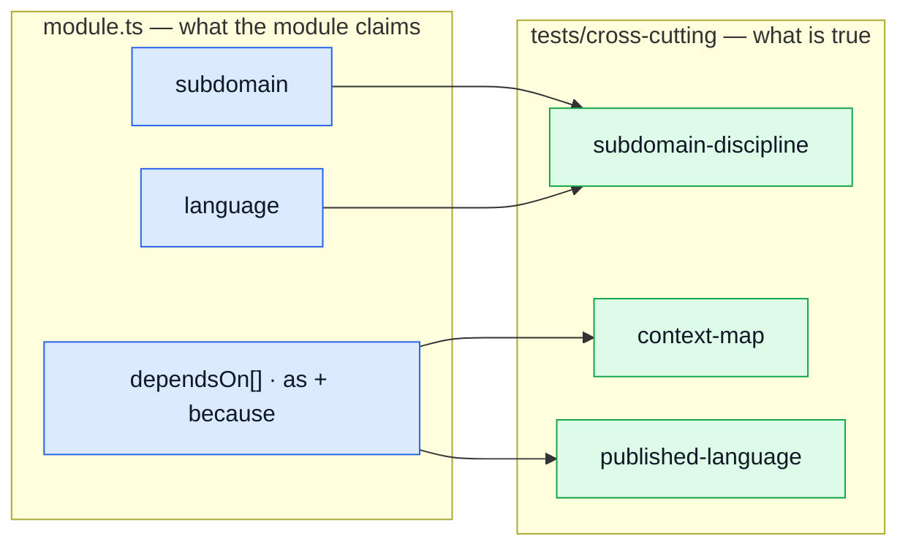

# Strategic DDD

**The part of Domain-Driven Design that pays for itself in a starter kit** — bounded contexts,
context mapping, ubiquitous language and subdomain distillation. All four are in the code, declared
per module and asserted by tests.

The other half — entities, value objects, aggregates, domain repositories — is **not** here, on
purpose. [`DDD_EXPLORATION.md`](https://github.com/) works out what adopting it would cost and why a
boilerplate should not. This page is about what _is_ adopted.

::: tip The distinction that matters
A folder per feature is a **packaging** decision. DDD is a **modelling** one. You can have immaculate
feature folders and zero DDD — that is the common case, and it is a good state.
[Domain layer](./domain-layer.md) §2–3 has the long version.
:::

---

## The problem this solves

Every architecture document says things like "orders owns the order lifecycle" and "authentication
is generic, do not over-model it". Those sentences are true when written and unverifiable forever
after. Six months later the document says one thing, the imports say another, and the document is
the one that loses — quietly, because nothing fails.

So each of these claims is a **field on the manifest** with a **test behind it**:



---

## 1. Bounded context — the folder

One module is one context. `rm -rf src/modules/wishlist` plus one line in `src/modules.ts` deletes
the domain, and anything that breaks is real coupling worth seeing.

This is the oldest rule in the repo and the one everything else hangs off. It is covered in
[Modules](./modules.md); the rest of this page assumes it.

## 2. Context map — typed edges

`dependsOn` is not a dependency list. It is a labelled graph:

```ts
dependsOn: [
    {
        module: 'delivery',
        as: 'published-language',
        because:
            'Prices a shipping method through `findShippingMethod`/`priceShipping` — pure functions over plain data, no shipment record in sight.'
    }
];
```

Four kinds, because four is what this codebase actually has:

| Kind                 | What it means                                                       | Cost when the upstream changes                   | Example             |
| -------------------- | ------------------------------------------------------------------- | ------------------------------------------------ | ------------------- |
| `conformist`         | reads the upstream's records as they are, no translation, no say    | **high** — the shape is your shape too           | `orders → products` |
| `customer-supplier`  | asks the upstream to _do_ something; its surface answers the demand | medium — the call survives, the payload may not  | `cart → orders`     |
| `published-language` | receives vocabulary, not records: pure functions over plain data    | **low** — neither side knows the other's storage | `cart → delivery`   |
| `shared-kernel`      | both read and write the same model                                  | **highest** — every change agreed twice          | `account → users`   |

Anticorruption layer is deliberately absent from the list. It is the right pattern for a model you
do not control, and everything nameable in `dependsOn` is a sibling in this repo. `payments` does
wrap an outside provider that way — behind `./providers`, which is not a registry edge.

### What the map is held to

`tests/cross-cutting/context-map.test.ts` asserts four things:

- **no declared edge that nothing imports.** A dependency that has already been undone still reads
  as coupling. `payments → users` was exactly that, and this is what found it.
- **no import that no edge declares.** ESLint stops a module reaching a sibling's _internals_;
  nothing until now stopped it reaching a sibling it never admitted to needing.
- **every edge has a reason a human wrote.** An edge whose `because` cannot be stated in a sentence
  is usually two edges, or a boundary in the wrong place.
- **`shared-kernel` stays rare.** One allowlisted entry. Adding a second is a deliberate edit with a
  reviewer attached, which is the only enforcement a judgement call can have.

### Reading the map

`cart` depends on five modules, and that is not a smell to refactor away — a checkout is the one
place where price, stock, address, shipping and the resulting order all have to agree at once. The
edges say _how_ it depends: two `conformist` reads, two `customer-supplier` calls, one
`published-language`. The last of those is the cheapest relationship in the table and the one to
copy: `delivery` publishes two pure functions and no storage at all.

## 3. Ubiquitous language — per context, not per app

Each module declares the terms it uses, defined **as it means them**:

```ts
language: {
    'Soft delete': 'Withdrawal from sale, reversible. The row survives so orders that embedded it stay readable.';
}
```

That is `products`. In `users`, `Soft delete` is "a destroyed account, kept for the audit trail". Two
different things, correctly, and a single shared glossary would have to flatten them into one entry
that is wrong in both places. **That divergence is the bounded-context pattern**, which is why the
glossary lives per module rather than in a `docs/` page — and why `subdomain-discipline.test.ts`
asserts that at least one term _does_ mean two things, as a demonstration that the structure permits
it.

It also keeps the promise the registry makes everywhere else: adding a domain edits no file outside
its own folder, and `rm -rf` takes the vocabulary with the code.

## 4. Subdomain distillation — where to spend effort

DDD's own advice is the part most often skipped: tactical patterns belong in the **core** domain, and
everything else should use the simplest thing that works. Each module says which it is.

| Subdomain    | Meaning                                                         | Here                                                                     |
| ------------ | --------------------------------------------------------------- | ------------------------------------------------------------------------ |
| `core`       | the reason the product exists — worth entities and invariants   | `products`, `orders`, `cart`                                             |
| `supporting` | specific to this business, not a differentiator — keep it plain | `payments`, `delivery`, `inventory`, `wishlist`                          |
| `generic`    | a solved problem, interchangeable with something bought         | `users`, `account`, `audit-logs`, `locales`, `observability`, `feedback` |

The enforced rule is one-directional: **a `generic` module may not carry a `domain/` folder.** A
pure-rules layer inside authentication or i18n is effort spent on the part of the system that should
stay replaceable.

There is deliberately **no** rule that `core` must have one. `products` is core and has none, because
its rules are currently thin enough to live in the service. That is a fair thing to notice and not a
violation — a test that forced the folder would only produce empty ones.

::: warning These values are an example, not a finding
A boilerplate has no core domain. It cannot know what the next project's will be, and what it ships
— products, orders, cart — is the textbook case of a _generic_ subdomain dressed as a core one. The
mechanism is the deliverable; the first thing a real project should do is re-decide every row of
that table.
:::

## 5. Published language — the barrel, held to a size

`index.ts` is the one surface a sibling may import, and ESLint already stops anyone reaching past it.
What ESLint cannot say is whether the surface is the right **size** — and that is the half that rots.
An export costs nothing to add, nothing to keep, and quietly promises every other module that a shape
will not move.

The rule: **a module publishes exactly what a sibling imports. No sibling, no barrel.**

Two things deliberately do not count as a consumer:

- **the module's own specs.** A spec importing its own barrel is the module talking to itself; it
  should reach `../model` like the rest of the module. Otherwise a module could keep an export alive
  by testing it.
- **`index.ts` re-exporting for its own convenience.**

Applying that rule removed 36 exports and one whole barrel. `feedback` now has no `index.ts` — the
same position `observability` and `locales` were already in, and the inconsistency
an earlier audit recorded. With no barrel, the lint boundary makes it structural: a sibling cannot
import the module at all, rather than being asked politely not to.

The narrowest surface in the repo is `delivery`: two pure functions. The widest is `users`, and it is
wide for a reason that is now visible on the map rather than only in that file's docblock — it is the
`shared-kernel` end of the one shared-kernel edge.

---

## What this does not give you

Everything above is about **boundaries and vocabulary**. None of it makes an invalid `Order`
unconstructable, makes `Money` a type, or turns `status: string` into a closed set with legal
transitions. Those are tactical patterns, they are genuinely absent, and the two cheapest of them —
`Money` and `OrderStatus` — are the ones worth taking on their own if a project ever wants them.

See [Domain layer](./domain-layer.md) for the thin `domain/` folder that exists today, and
`DDD_EXPLORATION.md` for what going further would cost.
