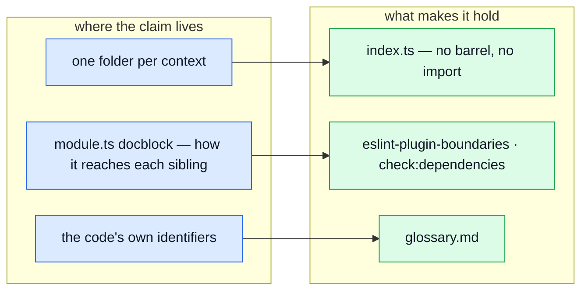

# Strategic DDD

**The part of Domain-Driven Design that pays for itself in a starter kit** — bounded contexts,
context mapping, ubiquitous language and subdomain distillation. All four are in the code — as
folders, imports, identifiers and barrels, which is where they can be seen rather than asserted.

The other half — entities, aggregates, domain repositories — is **not** here, on purpose.
`TACTICAL_DDD_PLAN.md`, beside this repo in the workspace, prices adopting it — the cost, the order
of work, and what would have to be true first. The two cheapest patterns did land, because they
fixed live bugs rather than imposing a shape — see [Tactical DDD](./tactical-ddd.md). This page is
about what _is_ adopted at the strategic level.

::: tip The distinction that matters
A folder per feature is a **packaging** decision. DDD is a **modelling** one. You can have immaculate
feature folders and zero DDD — that is the common case, and it is a good state.
[Domain layer](./domain-layer.md) §2–3 has the long version.
:::

---

## The problem this solves

Every architecture document says things like "orders owns the order lifecycle" and "authentication
is generic, do not over-model it". Those sentences are true when written and unverifiable forever
after. Six months later the document says one thing, the imports say another, and the document is
the one that loses — quietly, because nothing fails.

The answer this repo settled on is to keep each claim **where the thing it describes is written**,
so a reader meets both at once, and to let the boundary itself be structural rather than described:

An earlier version of this page described two manifest fields and three tests instead. They are
gone: see §2 and §4 below for what each was and why prose next to the imports turned out to be the
better home for it.

---

## 1. Bounded context — the folder

One module is one context. `rm -rf src/modules/wishlist` plus one line in `src/modules.ts` deletes
the domain, and anything that breaks is real coupling worth seeing.

This is the oldest rule in the repo and the one everything else hangs off. It is covered in
[Modules](./modules.md); the rest of this page assumes it.

## 2. Context map — how a module reaches its siblings

A module's imports are its dependency list. What they do not say is what KIND of reach each one is,
and the kinds differ enormously in what they cost when the upstream moves:

| Kind                 | What it means                                                       | Cost when the upstream changes                   | Example             |
| -------------------- | ------------------------------------------------------------------- | ------------------------------------------------ | ------------------- |
| `conformist`         | reads the upstream's records as they are, no translation, no say    | **high** — the shape is your shape too           | `orders → products` |
| `customer-supplier`  | asks the upstream to _do_ something; its surface answers the demand | medium — the call survives, the payload may not  | `cart → orders`     |
| `published-language` | receives vocabulary, not records: pure functions over plain data    | **low** — neither side knows the other's storage | `cart → delivery`   |
| `shared-kernel`      | both read and write the same model                                  | **highest** — every change agreed twice          | `account → users`   |

Anticorruption layer is deliberately absent from the list. It is the right pattern for a model you
do not control, and every module here is a sibling in this repo. `payments` does wrap an outside
provider that way — behind `./providers`.

### Where the map lives

In the docblock at the top of each module's `module.ts`, in prose, next to the imports it describes.

This used to be a `dependsOn` field on the manifest — a typed array of `{ module, as, because }`
edges — with a 217-line cross-cutting test holding each edge to the four kinds above, checking the
`because` was a sentence, and reconciling declared edges against real `import` statements. It is
gone, and it is worth saying why, because the reasoning applies to any labelled-graph field
someone is tempted to add back:

- **Nothing read it at runtime.** Not the registry, not the router, not the event bus. It was
  documentation with a type annotation.
- **It was self-reported.** Because it was not derived from real imports, it could not prove two
  modules do not cycle — only that a developer's annotations agreed with each other.
- **The enforcement that matters is structural and still there.** `eslint-plugin-boundaries` refuses
  an import that reaches past a sibling's `index.ts`, and `check:dependencies` re-checks the graph
  transitively. A module with no barrel cannot be imported by a sibling at all. Those are the rules
  with teeth; `dependsOn` was a description sitting beside them.

See `OVERENGINEERED.md` §1 and §5 for the full argument and what came out with it.

### Reading the map

`cart` reaches five modules, and that is not a smell to refactor away — a checkout is the one place
where price, stock, address, shipping and the resulting order all have to agree at once. Its
docblock says _how_ it depends on each: two `conformist` reads, two `customer-supplier` calls, one
`published-language`. The last of those is the cheapest relationship in the table and the one to
copy: `delivery` publishes two pure functions and no storage at all.

## 3. Ubiquitous language — per context, not per app

**The language lives in the identifiers.** `Reserved`, `Available`, `softDelete`, `OrderStatus` —
those are the ubiquitous language, and they are what a change to the model has to move. That is
Evans' actual requirement: the model and the language co-evolve, and the code is the primary
expression of both.

What an identifier cannot carry is the meaning behind it, and that lives in
**[Glossary](./glossary.md)** — one section per module, because the same word legitimately means
different things in two of them. `Soft delete` is a withdrawal from sale in `products` and a
destroyed account in `users`. Two different things, correctly. A single flat glossary would have to
collapse them into one entry that is wrong in both places, and **that divergence is the
bounded-context pattern**.

::: tip It used to be a manifest field
Each module declared a `language: {}` map. It was removed: nothing read it, nothing checked it was
true, and it sat in `module.ts` rather than beside the model field or serializer each entry actually
described — so the constraint-bearing definitions were furthest from the code they constrained. The
prose moved to the glossary page; the constraints belong on the symbols.
:::

## 4. Subdomain distillation — where to spend effort

DDD's own advice is the part most often skipped: tactical patterns belong in the **core** domain, and
everything else should use the simplest thing that works.

| Subdomain    | Meaning                                                         | Here                                                                     |
| ------------ | --------------------------------------------------------------- | ------------------------------------------------------------------------ |
| `core`       | the reason the product exists — worth entities and invariants   | `products`, `orders`, `cart`                                             |
| `supporting` | specific to this business, not a differentiator — keep it plain | `payments`, `delivery`, `inventory`, `wishlist`                          |
| `generic`    | a solved problem, interchangeable with something bought         | `users`, `account`, `audit-logs`, `locales`, `observability`, `feedback` |

The rule of thumb that follows: **a `generic` module should not carry a `domain/` folder.** A
pure-rules layer inside authentication or i18n is effort spent on the part of the system that should
stay replaceable. There is deliberately no converse rule — `products` is core and has no `domain/`,
because its rules are currently thin enough to live in the service, and a rule that forced the
folder would only produce empty ones.

::: warning These values are an example, not a finding
A boilerplate has no core domain. It cannot know what the next project's will be, and what it ships
— products, orders, cart — is the textbook case of a _generic_ subdomain dressed as a core one. The
mechanism is the deliverable; the first thing a real project should do is re-decide every row of
that table.
:::

This table is the whole of the classification. Each module used to also carry a `subdomain` field on
its manifest, with a test refusing a `domain/` folder inside a `generic` one — and that test's own
docblock conceded both halves of the problem: whether a classification stays HONEST was never
checked (nothing stops every module drifting to `core`), and in a boilerplate the values are a
worked example rather than a finding. A label nobody can be held to does not need a field, and a
judgement call the reader has to make anyway reads better as a table than as a type error.

## 5. Published language — the barrel

`index.ts` is the one surface a sibling may import, and ESLint stops anyone reaching past it. That
boundary is structural: a module with no `index.ts` cannot be imported by a sibling at all, rather
than being asked politely not to. `feedback`, `observability` and `locales` are all in that
position, and none of them is reachable from another module.

The convention for what goes in one: **a module publishes what a sibling imports, and not more.** An
export costs nothing to add, nothing to keep, and quietly promises every other module that a shape
will not move. Applying that once removed 36 exports and one whole barrel.

A repository export deserves more thought than a type export, and the asymmetry is worth stating
even though nothing enforces it. `OrderDocument` leaving the barrel promises a shape will not move.
`productRepository` leaving the barrel is a handle on a collection: whoever holds it can create,
update and delete rows of a module it does not own, with that module's service — and every rule,
event, counter and audit line the service carries — bypassed. `modules/inventory/index.ts` states
the case by refusing:

> The repositories, both models and every counter primitive are deliberately absent. This module
> exists so that nothing outside it can move a stock number, and publishing a repository would hand
> back the ability it was created to take away.

Both of these used to be tests — one failing any export no sibling imported, one demanding a written
justification per published repository and asserting the justification was a sentence. The
decisions they encoded are still the decisions; what they cost was 369 lines re-litigating them on
every run, and an unused export is a thing `knip` reports over the whole tree for free. See
`OVERENGINEERED.md` §8.

The narrowest surface in the repo is `delivery`: two pure functions. The widest is `users`, and it
is wide because it is the `users` end of the one shared-kernel relationship in the repo — `account`
authenticates the record `users` administers.

---

## What this does not give you

Everything above is about **boundaries and vocabulary**. None of it makes an invalid `Order`
unconstructable, and none of it gives a repository a domain object to return. Those are tactical
patterns and they are genuinely absent.

Two exceptions, both taken because the rule was already written down in several places and had
stopped agreeing with itself: `Money` and the order lifecycle table. Neither needs an aggregate, and
neither is a step toward one — [Tactical DDD](./tactical-ddd.md) has both.

See [Domain layer](./domain-layer.md) for the `domain/` folder as it stands, and
`TACTICAL_DDD_PLAN.md` for what going further would cost.
