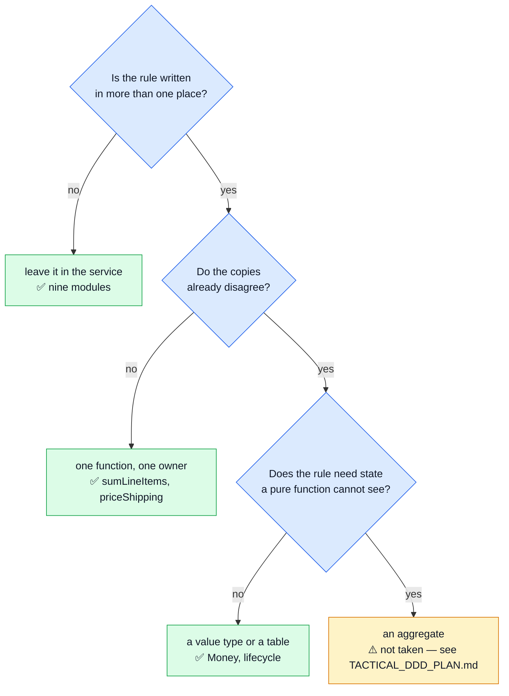
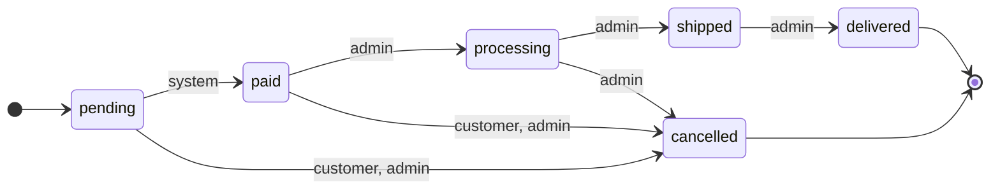
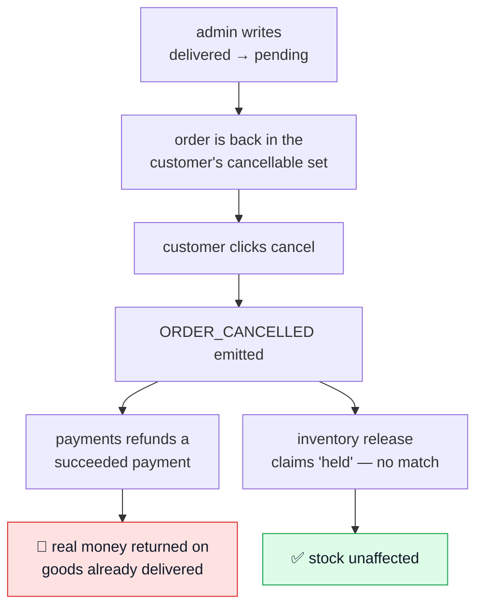
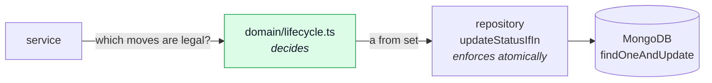
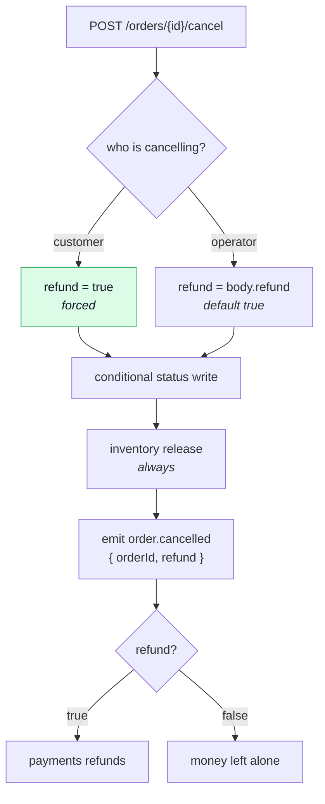
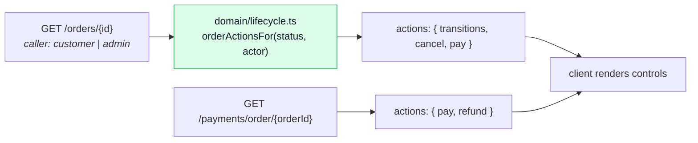
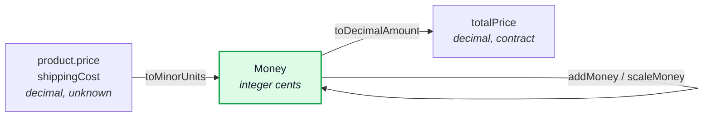
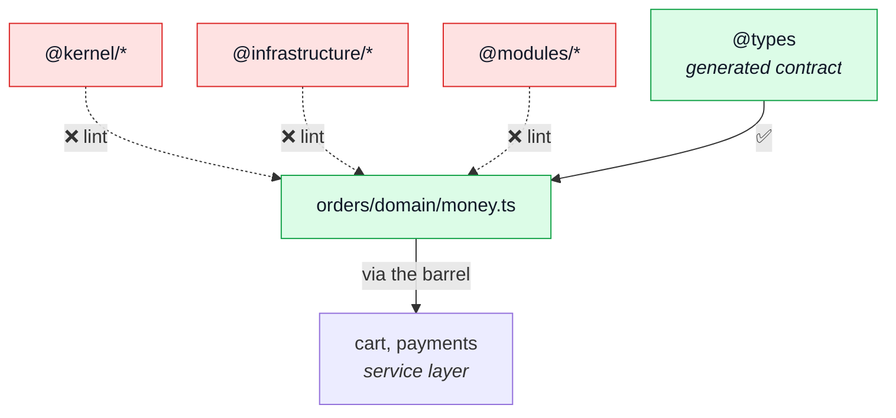

# Tactical DDD

**The half of Domain-Driven Design this repo takes selectively** — value objects, invariants,
aggregates. [Strategic DDD](./strategic-ddd.md) covers the other half, which is adopted wholesale.

Two tactical patterns are in the code. Both live in `src/modules/orders/domain/`, both are plain
data with functions in front of them, and both were taken for the same reason: a rule was already
written down in more than one place, and the copies had stopped agreeing.

Everything else — aggregates, domain repositories, mappers, a read model — is deliberately absent.
`TACTICAL_DDD_PLAN.md`, beside this repo in the workspace, prices that decision.

## Why these two and not the rest

The usual failure mode is adopting the shape without the pressure that justifies it. The test used
here is narrow: **is the rule already duplicated, and do the copies disagree?**

Both patterns below cleared the middle branch. Nothing in the codebase has cleared the right one.

---

## 1. The order lifecycle

`src/modules/orders/domain/lifecycle.ts` — which status may follow which, and who may make the move.

### What it does and does not own

The **set** of statuses is not its business. `OrderStatus` is generated from `openapi.yaml` into
`@api/models`, so the six values are contract-first and single-sourced. What the enum cannot carry
is the **edges** between them, and the **actor** each edge belongs to.

Three absences are load-bearing:

- **Nothing reaches `paid` but `system`.** An operator cannot mark an order paid by hand — money
  landing is a fact from outside the application. `payments/module.ts` has always stated this in its
  glossary; the table is where it holds.
- **A customer's cancel stops at `paid`.** The refund listener is what makes `paid` cancellable;
  past that the order is in the fulfilment queue and cancelling becomes an operator's decision.
- **`shipped` has no cancel edge at all.** Goods in transit come back as a return, which is a flow
  of its own rather than a status the order rewinds into.

### The actor is part of the table, not beside it

"Which status may follow `paid`" has no single answer — it depends on who is asking. Splitting the
actor into a second table would let the two disagree, so it rides on the edge itself.

`system` is not a privilege level above `admin`. It is **narrower**: the moves an operator may never
make by hand, because something outside the application has to have happened first. Money landing is
the only one today.

### What it replaced

Lifecycle knowledge used to live in three places that did not agree.

| Where                            | What it encoded                                    | The problem                                          |
| -------------------------------- | -------------------------------------------------- | ---------------------------------------------------- |
| `orders/service.ts`              | `CANCELLABLE_ORDER_STATUSES = ['pending', 'paid']` | correct, but local                                   |
| `payments/service.ts`            | `if (order.status !== 'pending')`                  | a second module asserting the lifecycle from outside |
| `orders/service.ts`, admin write | `order.status = data.status`                       | **no guard at all**                                  |

That third row was a live bug rather than an untidiness:

Every individual write site in this codebase is defensively coded, which is why only one half of
that sequence caused damage. `inventory` claims the reservation conditionally, so a stale release
finds nothing. `payments` guards the refund on the payment's own status — but that payment really
was `succeeded`, so the guard passed.

### How it is enforced

Four call sites, all reading the same rows:

| Call site                                | Question asked                             |
| ---------------------------------------- | ------------------------------------------ |
| `orders/service.ts` — `update`           | `canTransition(from, to, 'admin')`         |
| `orders/service.ts` — `cancelById`       | `statusesLeadingTo(cancelled, 'customer')` |
| `payments/service.ts` — `createIntent`   | `canTransition(from, paid, 'system')`      |
| `payments/service.ts` — `confirmPayment` | `statusesLeadingTo(paid, 'system')`        |

`cancelById` asks as `customer` whoever is calling: an admin reaching that route is running the
customer's cancellation on their behalf, and it should behave identically. The moves that belong to
the operator are the ones the admin write makes.

### Deciding and enforcing stay separate

The table decides. `updateStatusIfIn` in `src/modules/orders/repository.ts` still enforces, and is
unchanged — it is the conditional write that makes exactly one racing writer win. The table only
decides which `from` set that write is handed.

A refusal answers **409** with `ORDER_TRANSITION_NOT_ALLOWED`, and carries
`details: { from, to, allowed }` so a client can offer the moves that are still open rather than
making the operator guess. The guard runs before any field is assigned, so a refused request is
never a partial write.

### Compensation is policy, and it travels with the fact

A cancellation has consequences — the stock comes back, and usually the money does too. Who decides
which, and where that decision lives, is a separate question from which moves are legal.

`order.cancelled` carries a `refund` flag rather than the listener inferring one:

Three things this shape buys. A customer cannot waive their own refund, because `paid` is
cancellable precisely on the promise that the money comes back — the flag is overwritten, not
trusted. An operator can cancel without refunding, which is the replacement-going-out case. And the
event fires either way, so the record of what happened does not depend on what was compensated;
suppressing it for the no-refund case would make `order.cancelled` mean "cancelled and refunded",
which is not what it says.

Returning money on its own is a separate route, `POST /payments/order/{orderId}/refund`, because it
is a separate act: a goodwill refund leaves the order where it is. It lives in `payments` rather
than `orders` for a structural reason — `payments` already depends on `orders`, so an order module
reaching back for a refund would close a cycle the registry rejects at boot.

### What is still NOT modelled

Cancelling is two calls a client may make together, not one operation with one set of consequences.
An aggregate would make it the latter, with `Order.cancel()` owning the release, the refund policy
and the status move as one indivisible thing. That is priced in `TACTICAL_DDD_PLAN.md`; what exists
today is the honest decomposition rather than the modelled whole.

---

## 2. Capabilities: the server answers what a client may do

A client has to decide what controls to show. Doing that from the record alone means
re-implementing the rules — a status dropdown listing every enum value, a cancel button testing for
`pending` or `paid`, a pay form testing for `pending`. Three copies of server rules, in a separately
deployed codebase, with nothing able to notice when they drift.

So the server sends the answer. `Order.actions` and `PaymentActions` are computed per REQUEST, not
stored:

**Why per caller.** The answer depends on the role: a customer may cancel a paid order, an operator
may also advance it, and nobody may mark it paid by hand. A stored field could not say that. The
response cache keys on the user, so an operator's answer is never served to a customer.

**Why the split across two modules.** Each answers for what it owns. `orders` says which status
moves are open and whether the order still awaits payment; `payments` says whether money can come
back. Neither guesses at the other's half, and no new dependency edge is created — which matters,
because `payments` already depends on `orders` and the reverse would be a cycle the registry
rejects at boot.

**Why `pay` appears on both.** They answer different questions. `Order.actions.pay` is "this order
still awaits payment", which is what decides whether to offer a card form on an order with no
payment record yet. `PaymentActions.pay` is "this specific intent can be confirmed", which already
folds the order's status in — so once a payment exists, its own answer is the one that counts, and
the panel flips the instant a charge lands rather than waiting for the order to be re-read.

**Why `paid` is never in `transitions`.** No request may make that move; it follows a confirmed
charge. Publishing it as a capability while withholding it as a transition is the distinction
between "you may see this is possible" and "you may do this".

The client's side of the bargain is to decide nothing. A control is enabled when the server says so
and disabled otherwise, which is what makes a rule change on the API move the interface without the
interface being edited.

---

## 3. Money

`src/modules/orders/domain/money.ts` — a branded integer count of minor units.

### The boundary, which is the whole design

`openapi.yaml` types every monetary field `number`/`double`, and nothing about that moved. What
changed is the arithmetic _between_ the boundaries.

Two functions in, one out. Every intermediate is an integer, so the sum is exact and
order-independent — no accumulator can round differently depending on the sequence it saw the lines
in. The rounding rule exists once, in this file, instead of once in `totals.ts` and again inline in
`model.ts`.

### Why a brand rather than a class

A class would give the domain layer an object identity to maintain, a `toJSON` every serialization
path must know about, and a shape Mongoose would try to store. A branded number is **the same
integer at runtime** and a distinct type at compile time — which is the whole benefit:
`toDecimalAmount` is the only way back to a plain `number`, so an amount cannot be summed with a raw
price by accident or written to a document without passing the boundary that rounds it.

### Totality is checked at every step, not at the end

`Number.MAX_VALUE` is a finite price whose product with a quantity is not. Once one term is
`Infinity`, a later negative term makes the running total `NaN` — which reaches the customer as a
blank price. So every construction point funnels through one private `asMoney`, which answers
"nothing owed" for anything non-finite, and normalises `-0` away as a second spelling of an amount
with one meaning.

That is a property over every possible input, which is why
`src/modules/orders/tests/unit/money.property.test.ts` is property-based rather than a table of
examples. It found the `-0` case.

### Why it lives in `orders`, and why a shared kernel was not an option

`orders` is the only module that does money **arithmetic**. `cart` and `payments` read
`sumLineItems` through the orders barrel; `delivery` returns flat rates from a table. The modules
that look like they share the concept share a _function_, and that function already has an owner.

There is also a hard constraint. The domain layer may not import `@kernel/*`, `@infrastructure/*`,
`@modules/*` or even `../*` — see the folder rule in `eslint.config.ts`. A jointly-owned value type,
the textbook **Shared Kernel**, would have to sit somewhere no `domain/` folder can reach it.

If a type is ever genuinely shared across contexts, that rule needs revisiting first. That is a
design decision, not a config edit.

### No currency in the type — yet

The shop is single-currency per deployment: `payments/service.ts` stamps `defaultCurrency()` on
every payment and nothing reads a second one. A currency tag today would be a field with exactly one
possible value, checked against itself.

The day a second currency exists it belongs **on this type** rather than beside the amount — an
`addMoney` that refuses a mismatch is precisely the reason to put it here. `payments/repository.ts`
currently takes `{ amount, currency }`, which is the shape that lets two currencies be added.

---

## 4. What is still absent

| Concept                              | Today                                                          |
| ------------------------------------ | -------------------------------------------------------------- |
| Entity                               | none — a Mongoose document is the model                        |
| Value object                         | `Money` only, internal to the arithmetic                       |
| Aggregate root                       | implicit only                                                  |
| Repository returning domain objects  | no — returns `OrderDocument`                                   |
| Invariants at construction           | no — schema validators, plus the lifecycle table on the writes |
| Read model separate from write model | no — one model, one search spec                                |

One tell that the pressure is real: the `__v` conditional write in `cart/repository.ts`
(`clearLinesIfUnchanged`) and `updateStatusIfIn` in `orders/repository.ts` are **aggregate
versioning**, hand-rolled twice because there is no aggregate to hang it on. The need exists; only
the vocabulary is missing.

The line this repo draws: a value type or a rules table where the rule is real and already
duplicated, and no aggregate until something needs state a pure function cannot see.

## Related pages

- [Domain layer](./domain-layer.md) — what earns a place in `domain/`, and the lint rule
- [Strategic DDD](./strategic-ddd.md) — the half adopted wholesale
- `TACTICAL_DDD_PLAN.md` (workspace root) — what an aggregate slice would cost, and the conditions
  that would make it the right call
