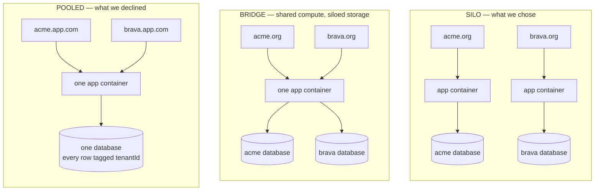
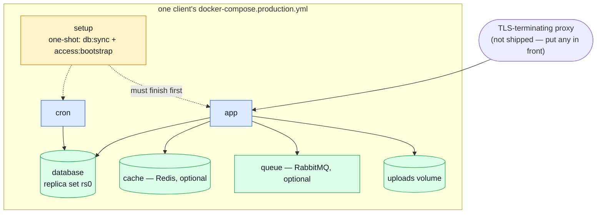
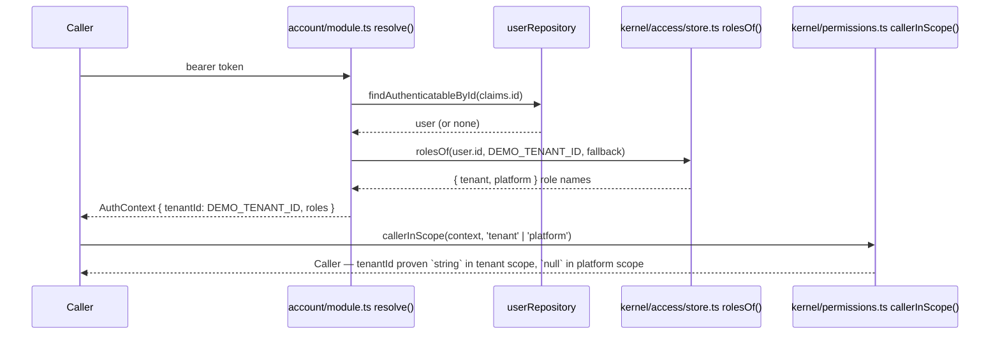

# Tenancy

The code underneath this page is **tenant-aware**: roles, memberships and a `tenants` collection
all exist, and the conformance suite proves the model works for more than one organisation. What
this deployment **ships** is one organisation per running stack, on purpose. This page is why, and
what that decision actually costs.

## 1 · What a "tenant" even is

Think of an apartment building. Every unit has its own lock, its own lease, its own mail slot — one
building, many households who never see each other's rooms. In software, a **tenant** is one
customer organisation of a system built to serve many: one shop, one law firm, one non-profit.

The building analogy stops there, because software has a choice a real building doesn't: whether
those households share one structure at all, or each gets its own building. That choice is what the
rest of this page is about — drop the analogy and read on.

## 2 · The three models, drawn

| Model      | What's shared | What optimises for                                             |
| ---------- | ------------- | -------------------------------------------------------------- |
| **Silo**   | Nothing       | Isolation and simplicity — the boundary is a machine, not code |
| **Bridge** | Compute       | Fewer processes to run, still one database per client          |
| **Pooled** | Everything    | Cost per client, self-service onboarding                       |

AWS's own SaaS guidance treats all three as legitimate — silo is not "the one you build before you
build multi-tenancy properly," it is the option with the strongest isolation of the three, because
nothing but a network boundary separates one client's data from another's.

## 3 · Our choice, and the trade

**Silo.** One compose stack, one database, per client organisation. We are trading **operational
repetition** — automatable, and visible the moment it breaks — for the **security risk** pooled
tenancy always carries: one forgotten `tenantId` filter away from showing a client someone else's
data, which is OWASP's own #1 API risk
([API1:2023, Broken Object Level Authorization](https://owasp.org/API-Security/editions/2023/en/0xa1-broken-object-level-authorization/)).

|                             | Silo (chosen)                      | Pooled (declined)                        |
| --------------------------- | ---------------------------------- | ---------------------------------------- |
| Code to write               | **~0** — it already works this way | ~30–45 days, a third security-critical   |
| Cross-tenant leak           | **Structurally impossible**        | One forgotten filter away, always        |
| GDPR erasure for one client | **Drop a database**                | A careful cascade across ~22 collections |
| Data residency per client   | **Per-client, trivially**          | One region for everyone                  |
| Noisy neighbour             | **Impossible**                     | Needs per-tenant rate limits             |
| Cost per client             | One stack's RAM (~1–1.5 GB)        | Marginal                                 |
| Shipping a fix to everyone  | **N deployments**                  | One deploy                               |
| Backups                     | **N to run and test**              | One                                      |
| Onboarding a client         | Provision a stack                  | An API call                              |

For non-profit clients holding EU personal data, trading operational repetition for security risk
is the right way round.

## 4 · What one client stack contains

Five services, four named volumes (database, its keyFile, the cache, uploads), one published port —
or none, once the [Traefik overlay](../tools/two-client-stacks.md#many-clients-behind-one-proxy)
fronts several stacks on one host. `COMPOSE_PROJECT_NAME` is the only thing that changes between
clients: it namespaces every container, network and volume, and selects that client's `.env`.

## 5 · How a request finds its organisation

**Today's real path**, drawn from the merged code rather than a plan for it:

**There is no lookup.** `DEMO_TENANT_ID` is a constant in `@kernel/access/seed` — the Django
`SITE_ID` pattern: one organisation per database means its id can be fixed at build time instead of
resolved at boot. `AuthContext.tenantId` is a plain, non-nullable `string`; `Caller` is a
discriminated union on `scope`, so a tenant-scope caller's id is proven by the type, not asserted
with a runtime `!`. A stranger and the system actor both carry the same constant — everyone browses
the one shop.

**What a pooled deployment would replace:** this one constant, with a per-request lookup (a
subdomain, a host header, a claim) — nothing downstream changes, because every rule already reads
the tenant from the resolved caller rather than from anything the request itself names.

## 6 · Why the code still has tenant columns

The platform/organisation split is real work, silo or not — an "operator" role administers the
**installation** (health, metrics, every shop), while every other role acts inside **one**
organisation. That split earns its keep regardless of how many organisations exist.

Three collections still carry an explicit column, and each earns it:

| Collection                                  | Why it stays                                                                                                                  |
| ------------------------------------------- | ----------------------------------------------------------------------------------------------------------------------------- |
| `roles`, `memberships`                      | The platform-vs-organisation split — not tenancy scaffolding, the authorization model itself                                  |
| `webhooksubscriptions`, `webhookdeliveries` | Silo doesn't remove the concept of "whose subscription this is," it just means there's one shop's worth                       |
| `apikeys`                                   | The minter's CURRENT roles are re-derived from memberships stored under this id on every check — load-bearing, not decoration |

Neither is on either public API contract — keeping the column costs nothing outside the backend,
and removing it would be a two-module refactor with no functional gain.

**One place it stays half-scoped, deliberately not fixed:** the webhooks fan-out
(`src/modules/webhooks/services/publish.ts`) matches every enabled subscription against an event
with no tenant filter at all. Correct here — there is only one shop's subscriptions to match. See
[§10](#10-what-we-deliberately-did-not-build) for what pooled would have to fix about exactly this.

## 7 · The glossary of the three "tenants"

The word means three different things in this codebase, and confusing them costs a bad afternoon:

1. **`locales.tenant`** — a translation KEYSPACE (`demo-be`, `demo-fe`, `mobile`), enumerated in
   `src/modules/locales/tenants.ts` and published at `GET /locales/tenants`. Nothing to do with an
   organisation.
2. **`roles.tenantId` / `memberships.tenantId` / `webhooks.tenant` / `apikeys.tenant`** — the
   organisation this whole page is about.
3. **The industry sense** — a customer of a SaaS product, the sense every section above uses.

Under silo this is a comprehension problem, never a correctness one: nothing conflates the two
concepts at runtime. It becomes a rename candidate only if `/locales/tenants` is ever versioned for
an unrelated reason — renaming it today would be a breaking contract change for no functional gain.

## 8 · Hands-on: two clients on your laptop

The full walkthrough — bringing up two independent stacks, granting the first owner, placing a real
order, and the two demonstrations that make silo a fact rather than a claim (an order in one stack
invisible to the other; deleting one stack leaving the other untouched) — lives on its own page:
**[Two Client Stacks](../tools/two-client-stacks.md)**. Everything there was run for real, not
sketched — including two rough edges an actual attempt surfaces that a diagram never would (a
podman-specific dependency-chain limit, and `mongodump --oplog`'s full-dump-only restriction).

## 9 · When to revisit this decision

Not a date — a trigger. Reopen the decision when **any** of these becomes true:

- More than ~15–20 client stacks, and updating them has become the thing you dread.
- A single client needs many isolated organisations **inside** their own instance.
- Self-service signup — a client onboards without anyone provisioning a stack for them.

Until then, the answer to "should this be pooled multi-tenant?" is **no, on purpose**.

## 10 · What we deliberately did not build

**Pooled multi-tenancy** — one process, one database, every row tagged `tenantId`, a CASL filter on
every read. It is real work: 4 of 16 modules would need a tenant-scoped read filter added
(`products`, `orders`, `payments`, `locales` already have the machinery; twelve others don't), and
only 6 of 22 Mongoose models carry an organisation column today.

**A concrete example of what "declined, not merely undone" means:** the webhooks fan-out matches
every enabled subscription against an event, unconditionally. That is correct in silo — there is
only one shop's worth of subscriptions — and would be a real leak in pooled: one client's order
events delivered to every other client's webhook endpoint. Choosing silo didn't just skip writing a
filter here; it removed the need for one. Building pooled later means finding every place like this
one, not just the ones with an obvious column already sitting unused.

## Where to go next

| You want to                                   | Read                                               |
| --------------------------------------------- | -------------------------------------------------- |
| See the full authorization model this sits on | [Authorization](./authorization.md)                |
| Run two stacks for real                       | [Two Client Stacks](../tools/two-client-stacks.md) |
| Back up what one stack holds                  | [Backups](../tools/backups.md)                     |
| Pick a host that can run one stack            | [Hosting](../tools/hosting.md)                     |
