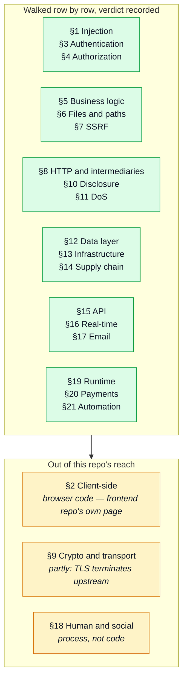
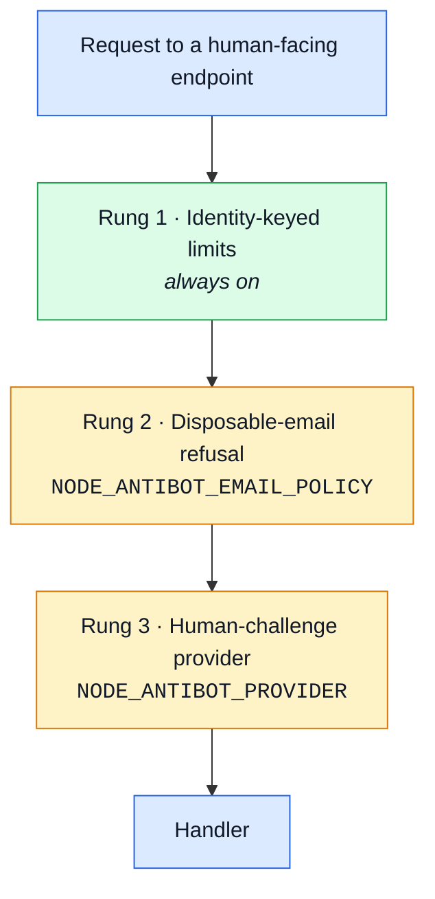

# Web Attack Defences

The [Web Attack Catalog](./web-attack-catalog.md) is deliberately theory-only — every flaw a
website can have, with no word about this codebase. This page is the other half: which catalog row
each control stops, and where that control lives. A "clean" verdict is only useful to the next
reader if it says against what, so the perimeter this repo reviewed and left alone is mapped here
too, not just the rows a change actually touched.

Scoped to this backend, and now walked across the whole catalog rather than the authentication
half of it. Personal-data handling (retention, consent, redaction, the export/erasure endpoints)
is a different lens on an overlapping set of files; see [Data Protection](./data-protection.md)
for that side of it. The paired Vue frontend owns the browser-side rows (§2 in full, the client
half of §9 and §14) on its own
[Web Attack Defences](https://github.com/Guebbit/boilerplate-vue-frontend/blob/main/docs/theory/web-attack-defences.md)
page. A handful of rows need both halves to close — CSRF, clickjacking, cookie flags, CORS,
missing security headers, the honeypot field, and validating the shared contract at the boundary —
and those are marked **shared** below, with their other half named inline rather than left to
"see the frontend".

## How far each catalog section is walked

"Walked" means every row in the section was read against the code and given a verdict — a control
with a location, an explicit "not mitigated, and why", or "this repo has no such surface".
Silence is not one of the three.

## Revocation and session lifetime

| Catalog row (§3 unless noted)                              | Control                                                                                                                                                        | Where                                                                      |
| ---------------------------------------------------------- | -------------------------------------------------------------------------------------------------------------------------------------------------------------- | -------------------------------------------------------------------------- |
| Missing invalidation                                       | password change, deactivation and soft-delete each revoke every refresh token                                                                                  | `account/services/authentication.ts`, `users/service.ts#update`            |
| JWT — no revocation                                        | refresh tokens are checked against the live, stored set on every use, not just signature-verified                                                              | `account/session/jwt.ts#verifyRefreshToken`, `users/repository.ts`         |
| Insufficient session expiry (deactivated/deleted accounts) | a deactivated or soft-deleted account stops authenticating on its very next request, not merely at its next login                                              | `users/repository.ts#findAuthenticatableById`, `account/module.ts#resolve` |
| Refresh-token misuse — reuse after rotation                | a refresh token replayed after it was rotated away revokes the account's entire refresh set                                                                    | `account/session/jwt.ts#rotateRefreshToken`, `TokenReuseError`             |
| Session hijacking / sidejacking                            | rotating the refresh token's value on every exchange makes a stolen cookie detectable on its next presentation, not silently reusable for the rest of its life | `account/session/jwt.ts#rotateRefreshToken`                                |
| Predictable session tokens                                 | a random `jti` per mint, so two logins in the same second cannot collide into one revocable session                                                            | `account/session/jwt.ts#createRefreshToken`                                |
| Secrets at rest in plaintext (§9)                          | refresh, reset and delete-confirmation tokens are stored as sha256 digests, never the live value                                                               | `users/model.ts#hashToken`                                                 |

## A boot that refuses

| Catalog row (§13)               | Control                                                                                                                                                                                                                                                                                                                       | Where                                                       |
| ------------------------------- | ----------------------------------------------------------------------------------------------------------------------------------------------------------------------------------------------------------------------------------------------------------------------------------------------------------------------------- | ----------------------------------------------------------- |
| Security misconfiguration       | the app refuses to start if `NODE_TOKEN_ACCESS`/`NODE_TOKEN_REFRESH`/`NODE_TOTP_ENCRYPTION_KEY`/`NODE_METRICS_TOKEN` are unset, too short, or still the shipped placeholder; also on a missing `NODE_URL`, a production `NODE_CORS_ORIGIN` left to its localhost default, and an SMTP host configured without its credentials | `kernel/required-config.ts`, each module's `requiredConfig` |
| Insecure defaults of frameworks | a misconfigured `NODE_TRUST_PROXY_HOPS` warns loudly rather than silently trusting a spoofable `X-Forwarded-For`                                                                                                                                                                                                              | `app/security.ts`                                           |
| Secrets in environment          | the demo dataset/seed interlock refuses to run against a build that isn't explicitly `NODE_DEMO` and non-production                                                                                                                                                                                                           | `app/demo.ts`                                               |

## Hardening — the small ones

| Catalog row                                      | Control                                                                                                                                                      | Where                                                                  |
| ------------------------------------------------ | ------------------------------------------------------------------------------------------------------------------------------------------------------------ | ---------------------------------------------------------------------- |
| Unbounded queries (§11)                          | `page`, not only `pageSize`, is capped                                                                                                                       | `infrastructure/http/schemas.ts`, `shared/contracts/openapi.root.yaml` |
| Timing attack on comparison / User enumeration   | a login miss compares against a dummy bcrypt hash, so an unknown email costs the same as a wrong password                                                    | `account/services/authentication.ts#DUMMY_PASSWORD_HASH`               |
| JWT — `alg: none` / key confusion                | `{ algorithms: ['HS256'] }` pinned on every verify                                                                                                           | `account/session/jwt.ts`                                               |
| Log injection / log forging (§1), CRLF injection | `x-request-id` is validated against a UUID shape before it's ever reflected back or written to a log line                                                    | `app/request-context.ts`                                               |
| Large request bodies (§11)                       | an explicit `limit` on `express.json()`/`express.urlencoded()`, rather than trusting the library default                                                     | `app/security.ts`                                                      |
| Vulnerable dependencies (§14)                    | the production tree carries one `low`, unreachable; the alarm that keeps it that way is the CI `audit` job — see [Supply chain](#supply-chain--14-re-walked) | `package.json`                                                         |

## Step-up authentication

| Catalog row (§3)                     | Control                                                                                                                                                                                         | Where                                                                                                                                     |
| ------------------------------------ | ----------------------------------------------------------------------------------------------------------------------------------------------------------------------------------------------- | ----------------------------------------------------------------------------------------------------------------------------------------- |
| Email-change without re-verification | the whole reason this wave exists: changing the email, deleting the account, session management, checkout and payment confirmation all demand proof of a RECENT session, not merely a valid one | `kernel/middlewares/authorizations.ts#requireFreshAuth`, mounted per-route in `account/routes.ts`, `cart/routes.ts`, `payments/routes.ts` |
| JWT — no revocation (freshness half) | `auth_time`/`amr` are carried claims, never derived from the clock — a token minted before step-up existed reads as infinitely old and is asked to re-prove itself                              | `account/session/jwt.ts`'s `TokenData` doc                                                                                                |
| Remember-me token flaws              | the "remember me" tiers set the refresh cookie's own lifetime, but do not exempt a sensitive action from the freshness check above — a long-lived session still has to step up                  | `account/session/config.ts#RefreshTokenExpiryTime`                                                                                        |

## Two-factor authentication

| Catalog row (§3)                                                | Control                                                                                                                                                                                                                                                                                   | Where                                                                                                                                                  |
| --------------------------------------------------------------- | ----------------------------------------------------------------------------------------------------------------------------------------------------------------------------------------------------------------------------------------------------------------------------------------- | ------------------------------------------------------------------------------------------------------------------------------------------------------ |
| OTP / 2FA bypass — attempt cap                                  | a dedicated rate limiter bounds guesses against ONE still-live login challenge, independent of the account/address budgets                                                                                                                                                                | `infrastructure/http/middlewares/rate-limit.ts#mfaChallengeLimiter`                                                                                    |
| OTP / 2FA bypass — response tampering                           | the challenge is server-verified end to end; there is no client-visible intermediate `{ok:false}` a caller could rewrite                                                                                                                                                                  | `account/services/two-factor.ts#verifyLoginChallenge`                                                                                                  |
| OTP / 2FA bypass — replay                                       | the RFC 6238 time step of the last accepted code is tracked per account; the identical code cannot verify twice                                                                                                                                                                           | `account/two-factor/totp.ts#verifyTotpCode`; a delivered code is deleted the moment it is spent                                                        |
| JWT — no revocation / token confusion                           | the login challenge is not a JWT at all — it's a single-use, revocable, hashed-at-rest token, the same mechanism `password-reset` uses, so it fails ordinary token verification outright rather than needing a dedicated rejection, and a right code spends it before a session is minted | `users/model.ts#tokenAdd`, `account/services/tokens.ts#findLiveToken`/`spendLiveToken`, proven by `tests/integration/two-factor.test.ts`'s bypass test |
| Secrets at rest in plaintext (§9)                               | a device secret is AES-256-GCM encrypted with a versioned key, never plaintext; a delivered code is an HMAC under the same key, since six digits fall to a bare digest; backup codes are hashed the way refresh tokens are                                                                | `account/two-factor/`                                                                                                                                  |
| Brute force / Credential stuffing / Password spraying (partial) | a second factor is a real second control past the password, on top of the rate limiting that already bounded these rows                                                                                                                                                                   | `account/two-factor/`, `account/routes.ts`                                                                                                             |

### What two-factor auth adds, honestly

A defence that lists only what it stops and never what it newly exposes is marketing. Two things
worth naming:

- **§3 OTP / 2FA bypass is now a real row against this codebase**, in the way any TOTP
  implementation is — the attempt cap and replay tracking above are what keep it closed rather
  than what makes it not apply.
- **§3 SIM swap and §18 MFA fatigue / push bombing are rows this repo deliberately stays out of
  reach of, by not building the factor they attack.** No SMS or email code — both mostly
  re-verify a channel an attacker may already hold, email especially, since the mailbox is
  already the password-reset path — and no push approval, which brings MFA fatigue with it by
  construction. §3 WebAuthn / passkeys is the acknowledged next step, and the reason `amr` is
  carried as an array rather than a boolean: a future `amr: ['hwk']` is a new value, not a new
  guard.

## The perimeter the auth waves reviewed clean

Not touched by the authentication plan, and reviewed while working through it — mapped here
because "clean" is only a useful verdict against a named row.

| Catalog row                                         | Control                                                                                                                                                                                                                                                                                                                      | Where                                                                                                                                                                                  |
| --------------------------------------------------- | ---------------------------------------------------------------------------------------------------------------------------------------------------------------------------------------------------------------------------------------------------------------------------------------------------------------------------- | -------------------------------------------------------------------------------------------------------------------------------------------------------------------------------------- |
| Missing security headers (§13) — **shared**         | `helmet()`, applied globally; the frontend's own static server sets the equivalent set (`X-Content-Type-Options`, `Referrer-Policy`, `Permissions-Policy`) for the responses this app never touches                                                                                                                          | `app/security.ts`                                                                                                                                                                      |
| Permissive CORS (§13/§2) — **shared**               | an explicit origin allowlist, not `*` — load-bearing because the frontend sends every request with `withCredentials: true`, which a browser refuses to honour against a wildcard origin                                                                                                                                      | `app/security.ts`                                                                                                                                                                      |
| Cookie flag omissions (§3) — **shared**             | the refresh cookie (`jwt`) is `httpOnly`, `sameSite: 'lax'`, `secure` in production; the `isAuth` UI hint this app also sets alongside it is deliberately none of those, since it carries no credential — the frontend maintains its own copy of that same hint client-side, plus a `rememberMe` marker, for the same reason | `account/session/cookies.ts#createRefreshCookie`, `#createLoggedCookie`                                                                                                                |
| No WAF / rate limiting at the edge (§13)            | a global per-address burst brake, plus the credential-specific budgets identity/address pair below it                                                                                                                                                                                                                        | `infrastructure/http/middlewares/rate-limit.ts`                                                                                                                                        |
| Insufficient logging and monitoring (§13)           | every 429 logs at `warn`, audited or not — the limiters mount before the request logger, so a refusal short-circuits ahead of the only thing that would otherwise record it                                                                                                                                                  | `infrastructure/http/middlewares/rate-limit.ts#refuse`                                                                                                                                 |
| Brute force / Credential stuffing (§3)              | `credentialLimiters` — two independent budgets, per account and per address, spent only by failures                                                                                                                                                                                                                          | `infrastructure/http/middlewares/rate-limit.ts#credentialLimiters`                                                                                                                     |
| Large request bodies via uploads (§11)              | a dedicated, tighter budget for routes that accept an image, separate from the general burst brake                                                                                                                                                                                                                           | `infrastructure/http/middlewares/rate-limit.ts#uploadLimiter`                                                                                                                          |
| NoSQL injection (§1)                                | search input reaching a `$regex` filter is escaped before it gets there                                                                                                                                                                                                                                                      | `infrastructure/persistence/search.ts#escapeRegex`                                                                                                                                     |
| Excessive data exposure / IDOR (§10 / §4)           | a caller's own resource is looked up scoped to their id, not fetched by id and checked after                                                                                                                                                                                                                                 | `orders/repository.ts#findByIdScoped` and the equivalent per module                                                                                                                    |
| Sensitive data in logs / Credential leakage (§10)   | password hashes, live tokens and (configurably) personal fields are redacted or hashed before a log line is written                                                                                                                                                                                                          | `infrastructure/adapters/logger.ts#SENSITIVE_FIELDS`                                                                                                                                   |
| CSRF, on the API in general (§2) — **shared**       | no ambient cookie authenticates a mutation — every write requires an `Authorization: Bearer` header the browser never attaches on its own, only code the frontend runs can; the refresh cookie the browser DOES send automatically only reaches `GET /account/refresh`, which mints a token rather than acting on one        | this backend accepts no other credential shape on a write route; the frontend attaches the header — `boilerplate-vue-frontend/src/infrastructure/http/interceptors.ts#onRequest` there |
| CSRF on the OAuth callback (§3) — **shared**        | a double-submit `state` cookie, minted and set in the same response that hands it to the provider; the callback rejects a mismatch with 400 — the frontend's only role is the top-level navigation that starts the dance                                                                                                     | `account/oauth/state.ts`, `account/controllers/get-oauth-callback.ts`                                                                                                                  |
| Open redirect / callback confusion (§3/§7)          | the redirect URI and the post-login frontend URL are both derived from server config (`NODE_URL`, `NODE_FRONTEND_URL`), never from the request or the provider's response                                                                                                                                                    | `account/oauth/config.ts#oauthRedirectUri`                                                                                                                                             |
| Pre-emptive account takeover via OAuth linking (§3) | a provider identity is linked to an existing email only once that provider reports the address as verified; an unverified match is rejected rather than linked                                                                                                                                                               | `account/services/oauth.ts#loginOrCreateFromOAuth`                                                                                                                                     |

## Input at the boundary — §1 beyond NoSQL

Every write endpoint parses its body against the Zod schema orval generates from `openapi.yaml`,
in `parseBody`. Every body schema is `.strict()` (`orval.config.ts#override.zod.strict.body`), so
an unknown key answers 422 rather than being silently stripped — a mass-assignment attempt never
reaches a service, and now the contract says so truthfully too.

| Catalog row (§1)                          | Control                                                                                                                                                                                                                                                  | Where                                                                                     |
| ----------------------------------------- | -------------------------------------------------------------------------------------------------------------------------------------------------------------------------------------------------------------------------------------------------------- | ----------------------------------------------------------------------------------------- |
| NoSQL injection                           | a body value that is an operator object fails its `z.string()` before it can reach a filter — `POST /account/login` reads `email` raw, and the SERVICE parses it against `LoginBody` before the query                                                    | `infrastructure/http/controller.ts#parseBody`, `account/services/authentication.ts#login` |
| Aggregation / pipeline injection          | no pipeline stage, field name or `$expr` operand is ever built from request input; the three `$expr` uses compare two stored fields                                                                                                                      | `products/repository.ts`, `users/repository.ts`                                           |
| ORM / query-builder injection             | no client-controlled sort: `findAll` takes `sort` from the repository's own `DEFAULT_SORT`, and no contract operation declares a sort parameter                                                                                                          | `infrastructure/persistence/create-repository.ts`                                         |
| Regex injection / ReDoS                   | `new RegExp` appears nowhere; the only `$regex` patterns come from `toSearchPattern`, which strips C0/DEL and escapes every metacharacter                                                                                                                | `infrastructure/persistence/search.ts#toSearchPattern`                                    |
| Mass assignment / autobinding             | two layers: the strict schema above refuses an undeclared key outright, and even a declared-but-unwanted one has no assignment to reach — the admin write path spreads `request.body`, but `users/service.ts#update` assigns field by field              | `users/service.ts#update`                                                                 |
| Mass assignment — privilege fields        | `zodProfileSchema` (self-service `PUT /account`) is the strict schema, scoped to six named fields; `admin`/`active`/`password` aren't among them, so a user cannot promote themselves through their own profile — refused with 422, not silently ignored | `account/services/profile.ts#zodProfileSchema`                                            |
| OS command injection / argument injection | no `child_process`, `exec` or `spawn` anywhere in `src/`                                                                                                                                                                                                 | —                                                                                         |
| Code injection / `eval`                   | no `eval`, `new Function` or `vm` anywhere in `src/`                                                                                                                                                                                                     | —                                                                                         |
| SSTI / expression-language injection      | EJS templates interpolate with `<%= %>`, which HTML-escapes; `<%- %>` appears only on `include(…)` of a fixed layout path                                                                                                                                | `shared/templates/`                                                                       |
| XXE / XML injection                       | nothing parses XML; every body is JSON, urlencoded or multipart                                                                                                                                                                                          | —                                                                                         |
| Insecure deserialization                  | `JSON.parse` only, and the two places it runs on untrusted bytes degrade to a miss / a dead-letter rather than throwing                                                                                                                                  | `infrastructure/http/middlewares/cache.ts`, `infrastructure/adapters/queue.ts`            |
| Log injection / CRLF injection            | see the `x-request-id` row above; no other request-controlled value is written to a log line unstructured                                                                                                                                                | `app/request-context.ts`                                                                  |
| Host header injection                     | `request.hostname`, `Host` and `X-Forwarded-Host` are read nowhere; every generated link is built from `NODE_URL` / `NODE_FRONTEND_URL`                                                                                                                  | `account/emails.ts`, `account/oauth/config.ts`                                            |
| Path / URL parameter injection            | see §6 below — a stored filename is 16 random bytes plus an extension from a closed set, never any part of what the client sent                                                                                                                          | `infrastructure/adapters/storage.ts#resolveUploadFilename`                                |
| CSV / formula injection                   | nothing exports a spreadsheet; the account export answers JSON                                                                                                                                                                                           | `account/services/export.ts`                                                              |

## Money, stock and the order lifecycle — §5 and §20

The three modules the plan named. What makes this section short is that the arithmetic and the
transitions each live in one place: `orders/domain` owns both, and `cart`, `payments` and
`inventory` read them rather than restating them.

| Catalog row                                | Control                                                                                                                                                                                                                                                                       | Where                                                                           |
| ------------------------------------------ | ----------------------------------------------------------------------------------------------------------------------------------------------------------------------------------------------------------------------------------------------------------------------------- | ------------------------------------------------------------------------------- |
| Price manipulation (§5/§20)                | no request ever carries a price. A line's amount is the joined product's `price`; the payment intent freezes `orderTotal(order)`, the same function the order serializer and the confirmation email call                                                                      | `orders/domain/totals.ts#orderTotal`, `payments/service.ts#createIntent`        |
| Trusting user-supplied identifiers (§5)    | the buyer is `authContext.id`; the shipping address is resolved through `addressForCheckout(userId, addressId)`, so naming someone else's entry refuses the checkout before anything is written                                                                               | `cart/services/checkout.ts`, `account/services/addresses.ts`                    |
| Negative or zero quantities (§5)           | `quantity` is `integer, minimum: 1` in the contract, so the generated schema rejects `0` and `-1` at the controller                                                                                                                                                           | `cart/openapi.yaml`, `api/schemas.zod.ts`                                       |
| Integer overflow / precision loss (§5/§20) | money is a branded integer count of minor units; `addMoney`/`scaleMoney` normalise a non-finite result to zero, and the single conversion back to decimals happens on the way out                                                                                             | `orders/domain/money.ts`                                                        |
| Rounding and precision (§20)               | there is no per-line rounding to harvest: `toMinorUnits` rounds once per unit price, and everything after it is integer addition                                                                                                                                              | `orders/domain/money.ts#toMinorUnits`                                           |
| Currency confusion (§5/§20)                | the currency is `NODE_DEFAULT_CURRENCY`, read server-side and frozen onto the payment document; no endpoint accepts one                                                                                                                                                       | `payments/config.ts`, `payments/model.ts`                                       |
| Unit / measurement confusion (§5)          | shipping is priced from the basket's own line total by `priceShipping`, against a method resolved from a server-side table — the request names an id, never a cost                                                                                                            | `delivery/`, `cart/services/checkout.ts`                                        |
| Race condition / double spend (§5)         | checkout empties the cart under the `__v` it read the lines at, so exactly one of two racing checkouts wins; the loser retracts its own order and answers 409                                                                                                                 | `cart/repository.ts#clearLinesIfUnchanged`                                      |
| Checkout race (§20)                        | the units are held by a conditional reserve keyed on the order id, and `updateStatusIfIn` re-asserts the precondition inside the write — a stale read cannot land a status change                                                                                             | `inventory/service.ts#reserveForOrder`, `orders/repository.ts#updateStatusIfIn` |
| Workflow step skipping (§5)                | `payments` asks the order lifecycle whether `paid` is still reachable rather than comparing against a literal; the order's move to `paid` is the gate, and a charge whose order slipped away is refunded on the spot                                                          | `payments/service.ts#settlePayment`                                             |
| State-machine violations (§5)              | `ORDER_LIFECYCLE` is a total map from status to the moves it permits AND the actor each belongs to, so "cancel after shipped" and "a customer marking their own order paid" are both absent edges                                                                             | `orders/domain/lifecycle.ts`                                                    |
| Refund / return abuse (§5/§20)             | the conditional `succeeded → refunded` move IS the idempotence; nothing else in the module may move money, and both callers come through `performRefund`                                                                                                                      | `payments/service.ts#performRefund`                                             |
| Inventory reservation abuse (§5)           | a hold carries `expiresAt` (`NODE_RESERVATION_TTL_MINUTES`, 30 by default) and a batched sweep expires stale ones — an abandoned cart returns its units instead of holding them forever. The sweep is an admin endpoint an external cron calls, not a timer this process owns | `inventory/config.ts`, `POST /inventory/reservations/sweep`                     |
| Stored card data (§20)                     | No card number ever reaches this API — `POST /payments/{id}/confirm` takes an opaque provider handle, and the four digits on a payment document come from the provider's own answer                                                                                           | `payments/providers/index.ts`                                                   |
| Payment callback forgery / replay (§20)    | no surface **while the provider is a stub** — `fake` is called outbound and answers in-process, so nothing inbound decides an order is paid. The condition is written into the port itself, because it stops holding the day a real implementation is added                   | `payments/providers/index.ts#PaymentProvider`                                   |
| Multi-step / workflow bypass (§4)          | `POST /cart/checkout` and `POST /payments/:id/confirm` both sit behind `requireFreshAuth(REAUTH_TIME_CRITICAL)`, so the money steps cannot be reached with a merely-valid session                                                                                             | `cart/routes.ts`, `payments/routes.ts`                                          |

## Files, uploads and paths — §6

The upload pipeline is three gates in a fixed order, composed in one place so a route cannot mount
half of it: declared type, then actual bytes, then quarantine-and-digest.

| Catalog row (§6)                      | Control                                                                                                                                                                     | Where                                                                              |
| ------------------------------------- | --------------------------------------------------------------------------------------------------------------------------------------------------------------------------- | ---------------------------------------------------------------------------------- |
| Unrestricted file upload              | three raster formats only, and the pipeline is composed by `wrapUpload` rather than assembled per route                                                                     | `infrastructure/adapters/storage.ts#upload`                                        |
| Content-type / extension confusion    | the declared MIME decides the stored extension; the bytes are then read and must identify as that same type, so `shell.php.jpg` and a PNG stored as `.jpg` both fail        | `infrastructure/adapters/image-signatures.ts`, `storage.ts#validateUploadedImages` |
| Stored file served with wrong headers | SVG is refused by name — it is XML browsers execute — so `express.static`, which types by extension, can never answer `text/html` or `image/svg+xml` from an upload path    | `image-signatures.ts#SUPPORTED_IMAGE_FORMATS`                                      |
| Filename injection / path traversal   | the client's `originalname` is discarded whole: the stored name is 16 random bytes of hex plus an extension from the closed set                                             | `storage.ts#resolveUploadFilename`                                                 |
| Insecure direct file access (§4)      | 128 bits of randomness in the name is what makes another user's upload unguessable, and `index: false` removes the listing that would make it unnecessary                   | `app/static-assets.ts`                                                             |
| Insecure temp files                   | uploads stage under `NODE_UPLOAD_STAGING_PATH` (system temp by default), NOT under `public/` — nothing is world-reachable between "multer wrote it" and "the checks passed" | `storage.ts#uploadStagingPath`                                                     |
| Decompression bomb / image bomb       | `limitInputPixels` caps the DECODED pixel count at 50 M before any resize runs, which the 5 MB byte ceiling on its own does not                                             | `infrastructure/adapters/image.ts`                                                 |
| Image-processing exploits             | every accepted image is decoded and re-encoded through libvips into the same format, so a payload smuggled in an ancillary chunk does not survive the round trip            | `image.ts#digestImage`                                                             |
| Metadata leakage                      | EXIF/ICC/XMP are dropped on re-encode; orientation is baked into the pixels first so the strip does not rotate the photo                                                    | `image.ts#decode`                                                                  |
| Directory listing                     | `index: false` on the static mount                                                                                                                                          | `app/static-assets.ts`                                                             |
| Backup / source exposure              | `dotfiles: 'ignore'` — a stray `.env` under `public/` is a 404, not a disclosure; `.dockerignore` keeps `.git`, `.env`, coverage and reports out of the image               | `app/static-assets.ts`, `.dockerignore`                                            |
| Zip slip / symlink tricks             | no surface: nothing extracts an archive or follows a client-named path                                                                                                      | —                                                                                  |
| LFI / RFI / SSI injection             | no surface: no include-style loader, no server-side includes                                                                                                                | —                                                                                  |

## The server as a client — §7

| Catalog row (§7)                  | Control                                                                                                                                                          | Where                                                                             |
| --------------------------------- | ---------------------------------------------------------------------------------------------------------------------------------------------------------------- | --------------------------------------------------------------------------------- |
| SSRF — basic, blind, via redirect | every outbound `fetch` in `src/` has a hard-coded host: the two OAuth providers' token and profile endpoints, and the analytics collector at its configured host | `account/oauth/providers/`, `infrastructure/observability/analytics/umami.ts`     |
| Webhook / callback abuse          | no surface: no endpoint accepts a URL to call back, and no field stores one                                                                                      | —                                                                                 |
| Cloud metadata access             | reachable only through an SSRF primitive, and there is none                                                                                                      | —                                                                                 |
| SSRF via the PDF renderer         | Chromium receives HTML through `setContent`, never a URL, and every value the invoice template prints goes through `<%= %>`                                      | `infrastructure/adapters/pdf.ts`, `shared/templates/documents/orders.invoice.ejs` |

## Proxies, caches and the HTTP layer — §8

| Catalog row (§8)                               | Control                                                                                                                                                                                                                                                  | Where                                                  |
| ---------------------------------------------- | -------------------------------------------------------------------------------------------------------------------------------------------------------------------------------------------------------------------------------------------------------- | ------------------------------------------------------ |
| Trusted-proxy misconfiguration                 | `trust proxy` is a HOP COUNT from `NODE_TRUST_PROXY_HOPS`, never `true`, so Express counts back from the forgeable end of `X-Forwarded-For`                                                                                                              | `app/security.ts`                                      |
| Host header attacks                            | nothing reads `Host`; see the §1 row above                                                                                                                                                                                                               | —                                                      |
| Web cache poisoning / cache-key confusion      | the raw query string is NOT part of the cache key — only the route's declared `keyParameters`, pre-sorted and JSON-serialized — so `?anything=else` cannot mint an entry                                                                                 | `infrastructure/http/middlewares/cache.ts#getCacheKey` |
| Web cache deception                            | the response cache is keyed by caller (`getCacheScope`) and locale, so a private answer cannot be stored under a shared key                                                                                                                              | `cache.ts#getCacheScope`                               |
| Cache poisoning by size                        | an entry over `NODE_REDIS_CACHE_MAX_BYTES` is skipped rather than stored, and only 2xx responses are written at all                                                                                                                                      | `cache.ts#serializeCachedResponse`                     |
| Range / partial-content leaks, `103` confusion | no surface: this process serves JSON and static files, and the reverse proxy in front of it is out of this repo                                                                                                                                          | —                                                      |
| HTTP request smuggling / desync                | not this repo's layer — one Node process behind whatever proxy the deployment puts in front. `docker-compose.production.yml` binds the API to loopback precisely so one is required                                                                      | `docker-compose.production.yml`                        |
| Slow HTTP (Slowloris, slow POST)               | `headersTimeout` 15s and `requestTimeout` 120s, down from Node's 60s/300s — the one DoS the rate limiter cannot see, since it counts requests and these send a fraction of one per connection. Both bound RECEIVING only, so a slow render is unaffected | `app/security.ts#applyServerTimeouts`                  |

## The data layer — §12

| Catalog row (§12)                   | Control                                                                                                                                                                                                                                                                                                                   | Where                                                                 |
| ----------------------------------- | ------------------------------------------------------------------------------------------------------------------------------------------------------------------------------------------------------------------------------------------------------------------------------------------------------------------------- | --------------------------------------------------------------------- |
| Exposed database / broker           | neither Mongo, Redis nor RabbitMQ publishes a port in the production compose file; they are reachable on the compose network and nowhere else                                                                                                                                                                             | `docker-compose.production.yml`                                       |
| Default / weak DB credentials       | `MONGO_ROOT_PASSWORD`, `MONGO_APP_PASSWORD`, `RABBITMQ_PASSWORD` and `REDIS_PASSWORD` all use compose's `:?` form, so the stack refuses to start rather than falling back to a default                                                                                                                                    | `docker-compose.production.yml`                                       |
| Over-privileged DB account          | the app authenticates as a `readWrite` user scoped to its own database, created by `docker/mongo-init.js` — the root account `MONGO_INITDB_ROOT_*` creates is never used at runtime                                                                                                                                       | `docker-compose.production.yml`, `docker/mongo-init.js`               |
| Weak cache / broker credentials     | Redis carries `--requirepass`, the same value `NODE_REDIS_URL` embeds — it also backs the rate-limit store, so an unauthenticated reader could otherwise reset budgets or read another user's cached response                                                                                                             | `docker-compose.production.yml`                                       |
| Missing tenant / owner scope        | the owner clause rides IN the read, and a caller with no id yields `''`, which is not a valid ObjectId — a bug here is a 500, never a widened query                                                                                                                                                                       | `kernel/authorization.ts#createOwnerScope`                            |
| Cache poisoning (application cache) | the key carries the caller and the locale as well as the route — see §8 above                                                                                                                                                                                                                                             | `infrastructure/http/middlewares/cache.ts`                            |
| Stale authorization in cache        | `invalidateCache` clears by tag on every write, and `getCacheScope` means a revoked caller reads their own bucket rather than a shared one                                                                                                                                                                                | `cache.ts#invalidateCache`                                            |
| Secrets in database                 | refresh, reset, delete-confirmation and backup-code tokens are stored as sha256 digests; a TOTP device secret is AES-256-GCM under a versioned key                                                                                                                                                                        | `users/model.ts#hashToken`, `account/two-factor/`                     |
| Queue / event poisoning             | every consumed message is validated against the contract's own generated schema before a handler sees it; a mismatch dead-letters rather than requeues, since a payload that does not match will not start matching on a retry. `.strict()`, so a field the contract never declared is refused rather than passed through | `infrastructure/adapters/queue.ts`, `src/types/asyncapi.generated.ts` |
| Orphaned / residual data            | soft-deleted rows are filtered by the repository's own `visibleScope`, not by each caller remembering to                                                                                                                                                                                                                  | `infrastructure/persistence/create-repository.ts`                     |
| Unbounded / unindexed queries       | `findAll` applies a 1000-row backstop when no limit is named, and both `page` and `pageSize` are capped at the contract layer                                                                                                                                                                                             | `create-repository.ts`, `infrastructure/http/schemas.ts`              |
| ObjectId leakage                    | ids are identifiers, never secrets: every read that takes one is scoped, so knowing an id grants nothing                                                                                                                                                                                                                  | `kernel/authorization.ts`                                             |

## The API surface — §15

| Catalog row (§15)                               | Control                                                                                                                                                                                                                                        | Where                                                                                 |
| ----------------------------------------------- | ---------------------------------------------------------------------------------------------------------------------------------------------------------------------------------------------------------------------------------------------- | ------------------------------------------------------------------------------------- |
| Improper inventory management                   | routes are mounted from each module's own manifest, so the route table and the module list cannot drift                                                                                                                                        | `app/routes.ts`, `kernel/registry.ts`                                                 |
| Broken function-level authorization (§4)        | one app-wide assertion rather than twelve local ones: every write route is authenticated AND admin-guarded unless it is listed, with a reason, in `WRITE_EXCEPTIONS` — so a thirteenth module inherits the guarantee instead of opting into it | `tests/cross-cutting/write-routes-are-guarded.test.ts`                                |
| Forced browsing (§4)                            | the same test enumerates the EFFECTIVE route table from the mounted routers, so a route nobody wrote a suite for is still covered                                                                                                              | `tests/cross-cutting/write-routes-are-guarded.test.ts`, `step-up-auth-routes.test.ts` |
| Version downgrade                               | no surface: there is one unversioned API, so there is no older version still routable                                                                                                                                                          | —                                                                                     |
| Webhook forgery / replay                        | no surface: nothing receives a webhook                                                                                                                                                                                                         | —                                                                                     |
| GraphQL rows (introspection, aliases, batching) | no surface: REST only                                                                                                                                                                                                                          | —                                                                                     |
| Bulk / export endpoints                         | `POST /account/export` answers the caller's OWN data and requires a fresh session; the admin listings page at 100 rows                                                                                                                         | `account/routes.ts`, `infrastructure/http/schemas.ts`                                 |
| Unsafe consumption of upstream APIs             | an OAuth provider's profile response is read for a fixed set of fields, and an unverified email is refused rather than trusted                                                                                                                 | `account/oauth/providers/`, `account/services/oauth.ts`                               |
| Content negotiation confusion                   | Express is given exactly three parsers — JSON, urlencoded, multipart — so there is no XML branch to negotiate into                                                                                                                             | `app/security.ts`                                                                     |
| Missing rate limits per key / user              | the global brake is per address; `credentialLimiters` adds a per-account budget on the credential routes specifically                                                                                                                          | `infrastructure/http/middlewares/rate-limit.ts`                                       |
| API key leakage                                 | the one static credential is `NODE_METRICS_TOKEN`, compared with `timingSafeEqual` and DENIED by default when unset                                                                                                                            | `rate-limit.ts#isMetricsScraper`                                                      |

## Real-time — §16

One surface: `GET /observability/events`, Server-Sent Events, admin-only.

| Catalog row (§16)                             | Control                                                                                                                                                          | Where                                                   |
| --------------------------------------------- | ---------------------------------------------------------------------------------------------------------------------------------------------------------------- | ------------------------------------------------------- |
| Unauthenticated upgrade                       | `isAdminViaCookie` verifies the refresh cookie the way `GET /account/refresh` does — signature AND presence on the user document, so a revoked token is rejected | `kernel/middlewares/authorizations.ts#isAdminViaCookie` |
| Missing origin check                          | `EventSource` is subject to CORS, and the allowlist is explicit rather than reflected — a foreign origin cannot read the stream                                  | `app/security.ts`                                       |
| Broadcast leakage                             | the stream carries process metrics only: request volumes, error rates, latency, uptime, heap. No user data fans out through it                                   | `infrastructure/observability/stream.ts`                |
| Message injection / per-message authorization | one-way by construction: the server writes, the client never sends                                                                                               | `stream.ts`                                             |
| Unencrypted `ws://`                           | not this repo's layer — TLS terminates at the reverse proxy the production compose file requires by binding to loopback                                          | `docker-compose.production.yml`                         |

## Email — §17

| Catalog row (§17)            | Control                                                                                                                                                                                                     | Where                                           |
| ---------------------------- | ----------------------------------------------------------------------------------------------------------------------------------------------------------------------------------------------------------- | ----------------------------------------------- |
| Template injection in email  | EJS interpolates with `<%= %>`, which HTML-escapes; the only `<%- %>` in the templates is `include(…)` of a fixed layout path                                                                               | `shared/templates/emails/`                      |
| Link poisoning               | every link in an email is `NODE_URL` plus a route and a token — the `Host` header is not read anywhere in this codebase                                                                                     | `account/emails.ts`                             |
| Notification content leakage | a delivered 2FA code is the only secret an email carries, and it is single-use, time-boxed and deleted the moment it is spent                                                                               | `account/two-factor/delivered-codes.ts`         |
| Header injection             | the contact form's `subject` is user text and it IS concatenated into the mail's Subject — nodemailer's `mime-node` strips CR/LF from every header value, so the stop is the LIBRARY's, not this codebase's | `feedback/emails.ts#contactRequestEmail`        |
| Address parser differentials | the recipient is always a stored, validated `user.email` or the operator mailbox from config — never a value assembled at send time                                                                         | `infrastructure/adapters/mailer.ts`             |
| Open relay                   | no surface: this application is an SMTP client, never a server                                                                                                                                              | —                                               |
| Email bombing / resend abuse | `credentialLimiters` on `/reset`, `/verify-request` and the 2FA send route; `mfaSendLimiter` bounds outbound codes separately from guesses                                                                  | `infrastructure/http/middlewares/rate-limit.ts` |

## Runtime and process — §19

| Catalog row (§19)                              | Control                                                                                                                                                         | Where                                                                |
| ---------------------------------------------- | --------------------------------------------------------------------------------------------------------------------------------------------------------------- | -------------------------------------------------------------------- |
| Unhandled rejections / exceptions              | both are registered: a rejection is audited, an uncaught exception is audited and then exits — the state after one is unknown, so the only safe move is to stop | `app/error-handling.ts#installErrorHandling`                         |
| Environment-variable trust                     | `environmentNumber` bounds every numeric env read, and the boot gate refuses to start on a missing, too-short or placeholder secret                             | `infrastructure/runtime/environment.ts`, `kernel/required-config.ts` |
| Path resolution quirks                         | `toPosixPath` is the one normalisation, and it is safe only because the names it sees are random hex — which is stated where it is written                      | `infrastructure/http/uploads.ts#toPosixPath`                         |
| `vm` / sandbox escape, `eval`, `child_process` | none of the three appears in `src/`                                                                                                                             | —                                                                    |
| Weak `Math.random` tokens                      | every token, code, filename, `jti` and IV comes from `node:crypto` — `randomBytes`, `randomUUID` or `randomInt`                                                 | `account/`, `infrastructure/adapters/storage.ts`                     |
| Container running as root                      | the production image drops to the `node` user after the last `apk`/`npm` step, and `--ignore-scripts` keeps a transitive postinstall from running at build time | `docker/Dockerfile.production`                                       |
| Debugger / inspector exposed                   | nothing passes `--inspect`; `npm start` is `tsx src/cluster.ts`                                                                                                 | `package.json`                                                       |

## Automation and abuse — §21

Every limit below is keyed on an IP ADDRESS, and that is the section's weakness rather than a
detail of it. Residential proxy pools cost about $20 for millions of addresses, and one IPv6
customer is handed 18 quintillion. So these bound one person on one connection, and bound almost
nothing about someone who is actually trying — see [What is still open](#what-is-still-open).

| Catalog row (§21)           | Control                                                                                                                                                                                                                                                                                                     | Where                            |
| --------------------------- | ----------------------------------------------------------------------------------------------------------------------------------------------------------------------------------------------------------------------------------------------------------------------------------------------------------- | -------------------------------- |
| Spam via forms — **shared** | a honeypot field (`website`) the contract declares and nothing persists: a non-empty value writes the row as `spam` and skips the notification, and the bot still gets its 201 so it learns nothing — the frontend builds the field itself (`aria-hidden`, `tabindex="-1"`, invisible to a sighted visitor) | `feedback/service.ts#create`     |
| Fake account creation       | `credentialLimiters` on signup — a per-address and a per-identity budget                                                                                                                                                                                                                                    | `account/routes.ts`              |
| Scraping                    | every listing is paginated and capped at 100 rows per page, with `page` capped too, so there is no one call that returns the catalogue                                                                                                                                                                      | `infrastructure/http/schemas.ts` |
| Review / vote manipulation  | no surface: there are no ratings, reviews or votes                                                                                                                                                                                                                                                          | —                                |
| SMS pumping                 | no surface: no SMS factor exists — see "What two-factor auth adds, honestly" above                                                                                                                                                                                                                          | —                                |

### A ladder for what the table above doesn't cover

Every control above is keyed on an IP address, which residential proxy pools ($20 for millions of
addresses) and IPv6 (18 quintillion per customer) make a weak bound on anyone actually trying — see
[What is still open](#what-is-still-open). Closing that gap is not one control but a ladder: each
rung independent, off by default, switched on by one environment variable, so a deployment climbs
only as far as its abuse actually justifies. Rungs 1-3 are built; rung 1 is always on and the
other two are off until a deployment says otherwise.

| Rung                         | What it costs an attacker                                                                                                                     | Why it isn't on by default                                                                                                                         |
| ---------------------------- | --------------------------------------------------------------------------------------------------------------------------------------------- | -------------------------------------------------------------------------------------------------------------------------------------------------- |
| 1 — identity-keyed limits    | keying signup/contact/reset on the submitted address, not only the caller's, plus a per-block budget (a /64, a /24) above the per-address one | it isn't off — no switch, no dependency, this is what the limits should already do                                                                 |
| 2 — refuse disposable email  | a blocklist, optionally backed by an MX check, on signup                                                                                      | a blocklist is upkeep, and an aggressive one refuses real people using forwarding services                                                         |
| 3 — human-challenge provider | an actual solve, though solver farms exist to pass it                                                                                         | a third-party script in the pages, a data-protection question, an accessibility cost — a deployment's decision, not a boilerplate's to make for it |

Rung 3 follows the same port shape as `PaymentProvider` (`payments/providers/index.ts`): a `none`
no-op ships in the box and always passes (what every test and the demo run through), a real vendor
is a name away behind `NODE_ANTIBOT_PROVIDER`, and its public parameters (site key, etc.) are read
from `GET /antibot/config` so the frontend knows whether to render a challenge at all. Turnstile
ships as the worked example; a deployment that wants no third party at all plugs a self-hosted
proof-of-work implementation into the same registry — see
[antibot](../modules/antibot.md#choosing-a-provider).

Login carries a conditional form of rung 3 rather than the unconditional one signup/reset/contact
use: `loginChallengeGate` delegates to `humanChallengeGate` only once `credentialLimiters`' identity
budget is at least half spent, so an honest first try never sees a challenge but a credential-
stuffing run does before it exhausts the budget rung 1 already bounds.

## Supply chain — §14, re-walked

`npm audit --omit=dev` reports ONE advisory in the production tree: `esbuild`'s development-server
file read, which is `low` and unreachable — `tsx` uses esbuild as a transpiler and never starts its
server. Everything else was closed by taking the fixes below.

| Advisory                                                                          | Was it reachable?                                                                                                                              | Closed by                          |
| --------------------------------------------------------------------------------- | ---------------------------------------------------------------------------------------------------------------------------------------------- | ---------------------------------- |
| `mongoose` — prototype pollution via a `__proto__`-prefixed dotted path           | **Yes**, in principle — every write goes through mongoose, though the generated Zod schemas strip unknown keys before a body reaches a service | 9.3.3 → 9.9.5 (patched from 9.7.4) |
| `qs` — array-limit bypass, and DoS via attacker-controlled `isBuffer`             | **Yes** — `express.urlencoded({ extended: true })` parses with `qs`                                                                            | 6.15.3 → 6.16.0                    |
| `body-parser` — an invalid `limit` silently disables size enforcement             | **Operator-triggered** — the limit is `NODE_JSON_BODY_LIMIT`; a typo removed the ceiling rather than failing loudly                            | 2.2.2 → 2.3.0                      |
| `puppeteer-core` → `@puppeteer/browsers` → `extract-zip` (symlink path traversal) | **No** — `extract-zip` serves the browser DOWNLOAD path, and this repo always runs against an `executablePath`                                 | 24.x → 25.10 (major)               |

The puppeteer major was taken even though its advisory was unreachable: "unreachable" is a claim
that has to be re-proved after every puppeteer change, which costs more over time than the upgrade
did once. What it cost once was real — v25 ships ESM only, so the test suite now maps the package
to a stub (`tests/support/puppeteer-core.stub.ts`) rather than parsing it, and `setContent` lost
`networkidle0`, which `adapters/pdf.ts` replaced with `'load'`.

| Catalog row (§14)                    | Control                                                                                                                                                                                         | Where                                       |
| ------------------------------------ | ----------------------------------------------------------------------------------------------------------------------------------------------------------------------------------------------- | ------------------------------------------- |
| Install scripts                      | the runtime image installs with `--ignore-scripts`, so no transitive `postinstall` runs at build time                                                                                           | `docker/Dockerfile.production`              |
| Lockfile tampering                   | `npm ci`, never `npm install`, in both image stages — it installs exactly the lockfile and never rewrites it                                                                                    | `docker/Dockerfile.production`              |
| Third-party scripts / CDN compromise | no surface on this side: this process serves JSON and its own static files, and loads no remote script                                                                                          | —                                           |
| Build-pipeline compromise            | the build stage IS the gate: `tsc --noEmit && eslint` must pass or no image is produced                                                                                                         | `docker/Dockerfile.production`              |
| Base-image vulnerabilities           | pinned to `node:25-alpine` by major only, so a rebuild picks up patches — and only a rebuild does                                                                                               | `docker/Dockerfile.production`              |
| Vulnerable dependencies              | `npm audit --omit=dev` runs on every push and PR, deliberately OUTSIDE the `ci` gate — a transitive finding with no non-breaking fix must not block every merge, so it alerts rather than gates | `.github/workflows/ci.yml`, the `audit` job |

## What is still open

The catalog's own honesty rule, applied to the whole walk: a row with no control gets said out
loud. Two lists — decisions, and findings.

### Deliberate, and why

- **§18 MFA fatigue / push bombing, §3 SIM swap** — see "What two-factor auth adds" above: not
  mitigated because the factor they attack was never built.
- **Self-service 2FA reset by email** — deliberately absent. Recovery from a lost authenticator
  and lost backup codes is admin-assisted only (`DELETE /users/:id/2fa`), audited, and requires
  no code — the one deliberate exception, made loudly rather than inherited from a convenience
  endpoint. A mailbox-based reset would reduce 2FA to mailbox possession, the exact thing it
  exists to defend against.
- **§3 Enforcing 2FA on admins** — open: worth wanting, but a policy layer on top of everything
  above, and it needs an answer for the admin who enrols nothing and locks the panel. Not
  answered here.
- **§3 2FA bypass via linked OAuth provider** — `GET /account/oauth/:provider/callback` mints a
  session without consulting `twoFactorEnabledAt`. An account with a linked provider has an
  unchallenged way in, so 2FA on this deployment is a control on the password path only. See
  [Security](../tools/security.md#what-is-not-covered).
- **§8 request smuggling, §9 TLS, §13 edge WAF** — one Node process, no proxy in this repo.
  `docker-compose.production.yml` binds the API to loopback so a TLS-terminating proxy is
  structurally required, and that proxy's configuration is deliberately out of scope here.
- **§2 Client-side, past the shared rows above** — XSS, DOM clobbering, `postMessage`, tabnabbing
  and CSP are the frontend's rows alone, walked on its own
  [Web Attack Defences](https://github.com/Guebbit/boilerplate-vue-frontend/blob/main/docs/theory/web-attack-defences.md)
  page. CSRF, clickjacking, cookie flags, CORS and missing security headers needed both halves and
  are marked **shared** in the tables above rather than deferred wholesale to the other repo.

### Found by this walk, not yet answered

- **§17 Unverified email at signup / §3 pre-account-takeover.** Nothing enforces `verified`: no
  route, no middleware, no guard reads it. An account bound to an address its holder does not own
  can order, check out and pay. The OAuth link path is the only place that demands a verified
  address, and it demands it of the PROVIDER, not of this account.
- **§21 Insufficient anti-automation.** Nothing anywhere asks whether a caller is a person.
  Deliberately unanswered rather than overlooked — see
  [A ladder for what the table above doesn't cover](#a-ladder-for-what-the-table-above-doesnt-cover)
  for the shape of an answer and why no rung of it is on by default.
- **§20 The PSP is a stub, and three rows are "no surface" only because of it.** Callback forgery,
  callback replay and 3-D Secure bypass all arrive together the day a real processor is wired in,
  because a live PSP decides that an order is paid by sending THIS server a request from the
  internet. The requirements — verify the signature over the raw body, refuse a repeated event id,
  never trust a browser-reported status — are stated on the provider port rather than here, so the
  person writing the integration reads them before writing the happy path.

## Keeping this page true

Nothing enforces it structurally, the same caveat the catalog itself carries. A file named in the
table above that moves or is renamed should update its row in the same commit; a control removed
without removing its row here is worse than never having written the row.

The supply-chain table is the one section with a shelf life measured in weeks rather than commits:
it records what `npm audit --omit=dev` said on the day it was walked, and it is stale the moment a
lockfile moves. Re-run it, do not trust it.
