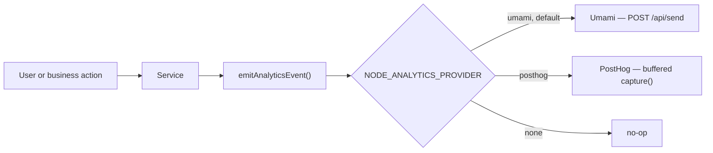
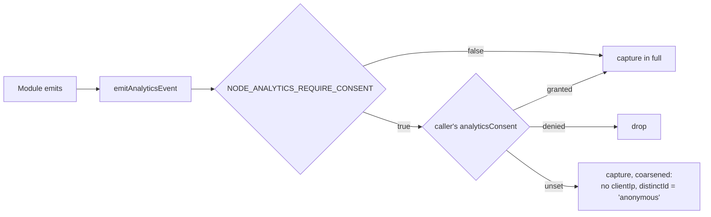

# Product Analytics

## Why it is here

Product analytics answers **business** questions — "how many users abandon checkout?" — where
[Prometheus](./prometheus.md) answers operational ones and [Tempo](./tempo.md) answers
per-request ones. Signup, login, product view, cart, checkout and order events show where that
belongs without polluting every file.

Every module emits through one helper, and none of them knows where the event lands.

## Event flow



Which implementation answers is a deployment decision, not a code path — the same shape
`NODE_PAYMENT_PROVIDER` uses in `@modules/payments/providers`. A name this build does not carry
throws at the first event rather than recording nothing quietly.

## Where an event is emitted from

**From the service that performs the operation, always.** The controller layer emits per
_route_; the service layer emits per _operation_ — and where more than one route reaches one
operation, or one route reaches an operation by more than one path, those two are not the same
set. `order_created` is the proof this rule exists for at all: for a while it fired only from the
admin-order route, and a customer completing checkout — a second path to the same fact, "an order
now exists" — created one and reported nothing. Two different routes producing the same
operation is common enough (checkout and the admin order form, a wishlist move-to-cart and a
plain add) that a controller-level emit is a coverage bet the controller cannot see itself making.

**A method serving more than one meaning is split first, emitted second.** `cartGetForView` and
`cartGetForBadge` read the identical cart; only the first is a `cart_viewed` moment, and each is
its own named function rather than one function with a flag — a flag is one more thing a future
call site can get wrong, a name is not. The same shape applies to `cartItemAdd`/
`cartItemUpdateQuantity` (one write, two routes, two meanings) and to a shared read wrapped by a
dedicated caller-specific function (`getOwnProfile` beside the admin-shared `userService.getById`)
rather than an emit added to the shared function itself.

## Caller context

A service function that emits needs the caller's address, user-agent and trace id, and the
service tier is defined by never seeing a `Request` — so those fields travel as a `CallerContext`
(`src/infrastructure/http/request.ts`), built once by `callerContextOf(request)` at the top of the
controller and passed down as an ordinary parameter to whichever service call ends up emitting.

**This is deliberately not how the PHP twin does it**, and that is the one place the two backends
are meant to differ rather than converge. BE's services read `AnalyticsContext::current()` off an
ambient value, which is safe there because a PHP-FPM request _is_ the process — there is no
concurrent second request whose context could bleed into this one. Node serves every request in
one process, so "the current request" exists only inside an `AsyncLocalStorage`, which any async
boundary can drop; an ambient accessor here would occasionally return the wrong request, or none,
silently — the exact failure mode this file's naming discipline and the checklist's coverage rule
both exist to remove. Threading a plain parameter instead means a missing context is a compile
error, not a row attributed to nobody.

## Consent

Every event carries the caller's IP and a distinct id, which under PostHog is a directly
identified behavioural profile. `emitAnalyticsEvent` is the one choke point every module's event
already passes through, so the consent gate lives there rather than at each call site:



Consent travels through `CallerContext` the same way `ip`/`userAgent` do. For a logged-in caller
it is the stored `users.analyticsConsent` (tri-state: `granted` / `denied` / unset — read fresh
from the account on every request, via `AuthContext`), settable through `PUT /account`. For
anonymous traffic there is no account to read, so the frontend forwards the visitor's own choice
on the `X-Analytics-Consent` request header instead.

`NODE_ANALYTICS_REQUIRE_CONSENT` defaults `true` — Art. 25(2) says the private setting is the
default one. Set it `false` only after taking your own legal advice about server-side, non-cookie
analytics.

## Choosing a provider

|                                     | `umami` (default)                            | `posthog`            | `none` |
| ----------------------------------- | -------------------------------------------- | -------------------- | ------ |
| Hosting                             | self-hosted, already in `docker-compose.yml` | cloud or self-hosted | —      |
| Visitor identity                    | hash of IP + user-agent                      | `distinct_id`        | —      |
| Identity-level funnels              | no                                           | yes                  | —      |
| Shares a database with the frontend | yes                                          | no                   | —      |

`umami` is the default because it is the instance this repo's own compose stack starts, and the
one the paired frontend reports to — so both halves of a shared funnel land in one database. The
event catalogue is byte-identical across the two repos and guarded by `check:spec-identity`,
which only means something if both halves arrive in the same place.

Pick `posthog` when the funnel is identity-shaped. Umami keys visitors on a hash of IP and
user-agent, so _"this logged-in user did X then Y"_ is not a question it can answer:
`distinctId` travels as an ordinary `user_id` event property and is filterable, but it is not the
join key. The cost is a hosted dependency in an otherwise fully self-hosted estate.

## Configuration

```bash
NODE_ANALYTICS_PROVIDER=umami       # umami | posthog | none

# provider: umami
NODE_UMAMI_INGEST_HOST=http://umami:3000
NODE_UMAMI_WEBSITE_ID=00000000-0000-4000-8000-000000000001

# provider: posthog
NODE_POSTHOG_API_KEY=phc_...
NODE_POSTHOG_HOST=https://app.posthog.com
```

`GET /observability/health` reports the active one as `telemetry.analytics` — `{ provider, configured }`, so a provider selected without its credentials is visible rather than indistinguishable from a working one.

::: warning `NODE_UMAMI_INGEST_HOST` is not `NODE_UMAMI_HOST`
`NODE_UMAMI_HOST` is declarative — the **public** origin a browser loads the tracking script
from, and what health reports. The API dials Umami from inside the network, where that public
origin is usually wrong: under compose it is `http://localhost:3080`, and `localhost` inside the
API container _is_ the API. Unset, the ingest host falls back to the public one, which is correct
only where both reach Umami at the same address.
:::

## Naming

> **`<subject>_<past-tense verb>`, snake_case, lower-case ASCII. Subject first, always.**

Four clauses, derived from the names already emitted rather than invented:

1. **Subject leads, verb closes**, and the verb is past tense — the event already happened.
   `cart_viewed`, `order_created`, `payment_succeeded`, `user_signed_up`.
2. **Singular subject = one instance. Plural = the collection.** `product_viewed` is one product;
   `products_searched` is the catalogue. `order_created` against `orders_viewed`.
3. **A thing inside a thing takes a compound subject**: `<container>_<item>_<verb>`.
   `cart_item_added`, `cart_item_removed`, `wishlist_item_added`.
4. **One noun per domain.** Never two words for the same thing — the products domain is
   `product`/`products` throughout, never `catalogue`.

### An outcome is a different event, not a property

`checkout_completed`/`checkout_failed` and `payment_succeeded`/`payment_declined` are pairs on
purpose, and must not be collapsed into one name plus an `outcome` property. The
[audit trail](./events-and-logging.md) does the opposite — there `outcome` is a mandatory field and
never appears in the action name — because the two systems are asked different questions. Audit is
sliced **across** actions (_"show me everything that failed"_); analytics is counted **per name**
(_"how many reached this step"_), and Umami keys on the name. In audit the outcome is a _dimension_
of one action; in analytics it is a _different event_.

### Renaming is not free

Umami keys on the string and carries no history forward, so a rename after deployment ends one
series and starts another. Decide the name once, here, rather than after a dashboard depends on it.

### Where a name lives

With the code that emits it — `src/modules/<name>/analytics.ts`, one module, one owner. There is no
second place: the paired frontend emits no custom events, so every name in the shared Umami website
is written here. `tests/cross-cutting/analytics-events.test.ts` sweeps the module folders and fails
when two of them claim one name or one value.

## One namespace, two repositories

The backend and the paired frontend write into ONE Umami website. The frontend's half of that used
to be a published catalogue, checked against this one; it is now empty by construction, which is a
stronger guarantee than any check was.

**The frontend emits nothing custom.** Its pageviews — including SPA route changes — are written by
the Umami tag itself, and everything with an API request behind it is emitted here, from the handler
that decided it: where it cannot be blocked by an extension, lost with the tab, or forged from a
console. So every custom name in the website has exactly one emitter, and no fact can be counted
twice.

**This repository refuses a collision inside itself.** `tests/cross-cutting/analytics-events.test.ts`
fails when two modules claim one constant name or one event string, and when a module declares names
without the `declare module` block that puts them in `AnalyticsEventMap`. It is why a module that
declares no names is worth noticing: one that emits nothing used to be indistinguishable from one
with nothing to emit.

**The two backends' own vocabularies are NOT compared, and that is a decision rather than a gap.**
The deployment model is one backend at a time — the PHP one with the frontend, or the Node one with
the frontend, never both — so a gate diffing the two would guard a state that cannot occur in a
deployment. It also has no honest home: neither repository can see the other, so it would live
outside both or be duplicated in each. What replaces it is that the two vocabularies are identical
today, and that the rule above is written in both trees, at the place where the next name is chosen.

Written down because that argument is not obvious and will otherwise be re-derived.

## Two things Umami does not tell you

**A missing `User-Agent` header discards the event, and returns `200`.** Verified against umami
2.14: the same payload sent with and without the header returns `200` both times, and only the
one carrying it appears in `website_event`. The drop is undetectable from the response, so the
provider never omits the header — it forwards the caller's, and substitutes a recognisable
server placeholder for events with no browser behind them (a webhook, a scheduled job, a queue
consumer).

**An unknown website id is a `404`.** This one is loud, and it is what you get when the id the
API sends does not match the one the instance was seeded with.

## Attribution

A server-side event has no browser behind it, so the API forwards the caller's address
(`X-Forwarded-For`) and user-agent. Without that, every event the API emits would attribute to
the API itself and an entire product's traffic would collapse onto one "visitor".

## External references

- [Umami `/api/send`](https://umami.is/docs/api/sending-stats) — the endpoint both halves post to
- [PostHog Node.js library](https://posthog.com/docs/libraries/node) — the client behind the `posthog` provider

## Related pages

- [Events & Logging](./events-and-logging.md) — analytics vs audit vs logs, and when to use which
- [Frontend Observability](./frontend-observability.md) — the browser half, which reports to the same Umami
