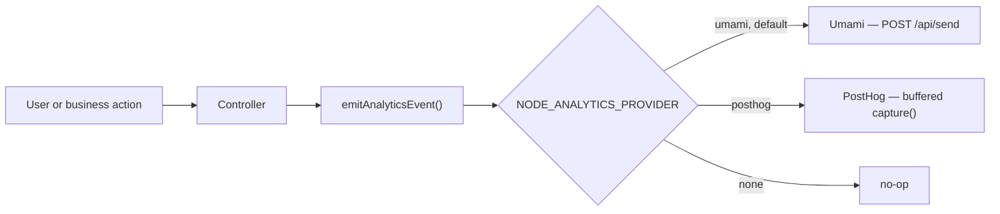

# Product Analytics

## Why it is here

Product analytics answers **business** questions — "how many users abandon checkout?" — where
[Prometheus](./prometheus.md) answers operational ones and [Tempo](./tempo.md) answers
per-request ones. Signup, login, product view, cart, checkout and order events show where that
belongs without polluting every file.

Twenty-one controllers emit through one helper, and none of them knows where the event lands.

## Event flow



Which implementation answers is a deployment decision, not a code path — the same shape
`NODE_PAYMENT_PROVIDER` uses in `@modules/payments/providers`. A name this build does not carry
throws at the first event rather than recording nothing quietly.

## Choosing a provider

|                                     | `umami` (default)                            | `posthog`            | `none` |
| ----------------------------------- | -------------------------------------------- | -------------------- | ------ |
| Hosting                             | self-hosted, already in `docker-compose.yml` | cloud or self-hosted | —      |
| Visitor identity                    | hash of IP + user-agent                      | `distinct_id`        | —      |
| Identity-level funnels              | no                                           | yes                  | —      |
| Shares a database with the frontend | yes                                          | no                   | —      |

`umami` is the default because it is the instance this repo's own compose stack starts, and the
one the paired frontend reports to — so both halves of a shared funnel land in one database. The
event catalogue is byte-identical across the two repos and guarded by `check:spec-identity`,
which only means something if both halves arrive in the same place.

Pick `posthog` when the funnel is identity-shaped. Umami keys visitors on a hash of IP and
user-agent, so _"this logged-in user did X then Y"_ is not a question it can answer:
`distinctId` travels as an ordinary `user_id` event property and is filterable, but it is not the
join key. The cost is a hosted dependency in an otherwise fully self-hosted estate.

## Configuration

```bash
NODE_ANALYTICS_PROVIDER=umami       # umami | posthog | none

# provider: umami
NODE_UMAMI_INGEST_HOST=http://umami:3000
NODE_UMAMI_WEBSITE_ID=00000000-0000-4000-8000-000000000001

# provider: posthog
NODE_POSTHOG_API_KEY=phc_...
NODE_POSTHOG_HOST=https://app.posthog.com
```

`GET /observability/health` reports the active one as `integrations.analytics`.

::: warning `NODE_UMAMI_INGEST_HOST` is not `NODE_UMAMI_HOST`
`NODE_UMAMI_HOST` is declarative — the **public** origin a browser loads the tracking script
from, and what health reports. The API dials Umami from inside the network, where that public
origin is usually wrong: under compose it is `http://localhost:3080`, and `localhost` inside the
API container _is_ the API. Unset, the ingest host falls back to the public one, which is correct
only where both reach Umami at the same address.
:::

## Two things Umami does not tell you

**A missing `User-Agent` header discards the event, and returns `200`.** Verified against umami
2.14: the same payload sent with and without the header returns `200` both times, and only the
one carrying it appears in `website_event`. The drop is undetectable from the response, so the
provider never omits the header — it forwards the caller's, and substitutes a recognisable
server placeholder for events with no browser behind them (a webhook, a scheduled job, a queue
consumer).

**An unknown website id is a `404`.** This one is loud, and it is what you get when the id the
API sends does not match the one the instance was seeded with.

## Attribution

A server-side event has no browser behind it, so the API forwards the caller's address
(`X-Forwarded-For`) and user-agent. Without that, every event the API emits would attribute to
the API itself and an entire product's traffic would collapse onto one "visitor".

## External references

- [Umami `/api/send`](https://umami.is/docs/api/sending-stats) — the endpoint both halves post to
- [PostHog Node.js library](https://posthog.com/docs/libraries/node) — the client behind the `posthog` provider

## Related pages

- [Events & Logging](./events-and-logging.md) — analytics vs audit vs logs, and when to use which
- [Frontend Observability](./frontend-observability.md) — the browser half, which reports to the same Umami
