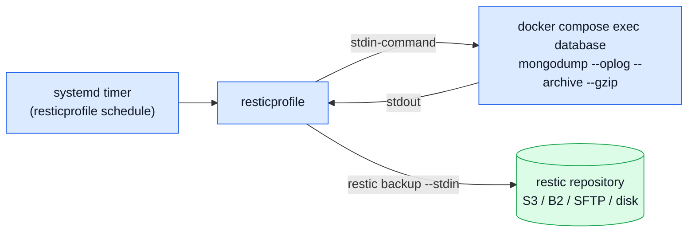

# Backups

The compose file bundles a database. Nothing bundles a backup — that is deliberate: a backup only
matters once it can restore, so this page is config an operator owns and verifies, not a script the
app ships and forgets.



## Why resticprofile, not a shell script

**[restic](https://restic.net)** is the consensus default for this kind of job: one static binary,
the largest community of the options, and a release cadence that keeps up
(0.19.1, 2026-07-05). It is provider-neutral by construction — the same command writes to an
S3-compatible bucket, Backblaze B2, Azure, GCS, an SFTP host, a REST server or a local disk;
[Where to run it](./hosting.md) is a choice a deployment makes on its own, never one this repo
makes for it.

**[resticprofile](https://creativeprojects.github.io/resticprofile/)** is what keeps N
near-identical client profiles from becoming N near-identical shell scripts. One base profile
carries what every client shares — the retention policy, the check settings — and each client
profile `inherit`s it, overriding only what actually differs: the repository and the dump command.
Silo means one profile per client is the same shape every time, which is exactly what inheritance
is for.

## The config

`docker/resticprofile.example.toml` ships the shape, not real secrets — copy it outside the repo
the same way `clients/<name>/.env` lives outside the repo, and add one `[<client>]` section per
stack:

```toml
[default]
    password-file = '/etc/resticprofile/restic-password'
    repository = 's3:https://s3.example.com/change-me'
    [default.retention]
        keep-daily = 7
        keep-weekly = 4
        keep-monthly = 6
        prune = true

[acme]
    inherit = 'default'
    repository = 's3:https://s3.example.com/change-me/acme'
    [acme.backup]
        stdin = true
        stdin-command = '''
            docker compose --env-file clients/acme/.env -f docker-compose.production.yml \
                exec -T database sh -c 'mongodump --host localhost --port 27017 \
                -u "$MONGO_INITDB_ROOT_USERNAME" -p "$MONGO_INITDB_ROOT_PASSWORD" \
                --authenticationDatabase admin --oplog --archive --gzip'
        '''
    [acme.schedule]
        schedule = '03:30'
```

**No secret touches the host shell.** `$MONGO_INITDB_ROOT_USERNAME`/`$MONGO_INITDB_ROOT_PASSWORD`
are expanded by the `database` container's own shell, from the environment
`docker-compose.production.yml` already sets there — the same credentials the container was
started with, never typed or interpolated on the host.

Install the schedule once, per host, after adding every client's section:

```bash
resticprofile schedule --all
```

## Why `--oplog`, and the restriction it comes with

**`--oplog` makes the dump consistent ACROSS collections**, not just within one — without it, a
dump that takes several seconds while orders keep arriving can capture an order after its payment
but before its inventory reservation, or the reverse. A one-node replica set (see
[Two Client Stacks](./two-client-stacks.md)) genuinely populates `local.oplog.rs`, so `--oplog`
is a real mechanism here, not a no-op on a single member.

**Verified directly against this repo's own compose stack, the restriction the original sketch
missed:** `mongodump --oplog` refuses to run scoped to one database —
_"bad option: --oplog mode only supported on full dumps"_. So the command above dumps the whole
deployment (`admin`, `local`, `config`, and the client's own database together), never
`--db=<name>`. That is the correct shape for a consistent snapshot; restoring is where the
distinction matters:

| Situation                                       | Restore command                                                                 | Why                                                                                                                                                                                                            |
| ----------------------------------------------- | ------------------------------------------------------------------------------- | -------------------------------------------------------------------------------------------------------------------------------------------------------------------------------------------------------------- |
| Ordinary case — give a client its own data back | `mongorestore --archive=... --gzip --nsInclude="<client>.*" --drop`             | `--nsInclude` and `--oplogReplay` cannot be combined; this restores the client's collections as of the dump's end, not perfectly cross-collection consistent, which is an acceptable trade for the common case |
| Disaster recovery / the quarterly drill below   | `mongorestore --archive=... --gzip --oplogReplay` into a **throwaway** instance | Full, oplog-consistent restore — but restoring `admin`/`local` over a LIVE replica set's own identity is not what you want, hence a throwaway target                                                           |

Both verified end to end against this repo's own stack: a full `--oplog` dump, a selective
`--nsInclude` restore of just the client's database, and — separately — a full `--oplogReplay`
restore.

## The rules that hold wherever it runs

- **Snapshots from the same provider are a complement, not a backup.** Same account, same blast
  radius as a compromised API token — keep the restic repository with a different provider than
  wherever the client's own stack runs.
- **[3-2-1-1-0](https://www.avepoint.com/blog/backup/3-2-1-backup-rule):** three copies, two media,
  one off-site, one immutable (restic's append-only mode), zero unverified restores.
- **A full restore drill, quarterly.** Restore into a throwaway container (the disaster-recovery
  row above) and count documents. At more than a handful of clients, rotate which one gets drilled
  rather than testing all of them every time.
- **[Percona Backup for MongoDB](https://docs.percona.com/percona-backup-mongodb/index.html)** is
  the upgrade path once a single `mongodump` window stops being fast enough — physical backups
  plus real point-in-time recovery. It refuses a standalone instance outright, which is one more
  reason the bundled database runs as a replica set from day one.

## Where to go next

| You want to                                   | Read                                        |
| --------------------------------------------- | ------------------------------------------- |
| Understand the replica set this backs up      | [Two Client Stacks](./two-client-stacks.md) |
| See every index/data-migration concept        | [Data](../reference/data.md)                |
| Pick where the restic repository itself lives | [Hosting](./hosting.md)                     |
