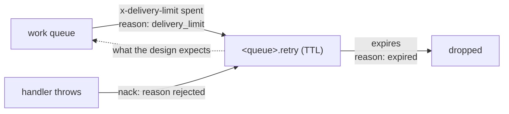

# Broker testing

`npm run test:broker` runs the queue adapter (`src/infrastructure/adapters/queue.ts`) against a
**real RabbitMQ**. About 20 seconds, and it needs a broker.

## Why the unit suite is not enough

`tests/unit/infrastructure/adapters/queue.test.ts` mocks `amqplib`. It proves the arguments we pass
(`x-delivery-limit`, a TTL, a dead-letter target) and never what RabbitMQ does with them. Every
case in `tests/broker/queue-broker.test.ts` is one only a broker can answer:

| Case                                   | What only a real broker proves                                                                                                            |
| -------------------------------------- | ----------------------------------------------------------------------------------------------------------------------------------------- |
| topology                               | quorum, `at-least-once`, `reject-publish`, TTL and `x-delivery-limit` declare on the image; a second declare is not `PRECONDITION_FAILED` |
| retry                                  | a throwing handler gets the job back after the TTL, with the `x-death` count `deathCountFor` reads                                        |
| parking                                | spent attempts land in `<queue>.dead` and `parkedCounts()` sees them; a `false` handler parks without a retry                             |
| a consumer that dies without answering | the job comes back with a higher `x-delivery-count` while under the limit; **past it, it is dropped** (see below)                         |
| priority                               | `high` is delivered before `normal`, with no `x-max-priority` opt-in                                                                      |
| prefetch                               | a consumer holds at most `prefetch` unacknowledged jobs                                                                                   |
| reconnect                              | a connection closed from the broker's side is recovered and the consumer is re-bound                                                      |

Left out as redundant: the webhook path through the broker (the live e2e and
`modules/webhooks/tests/integration/delivery.test.ts`), and publish-confirm refusal and timeout — a
broker cannot be made to refuse on demand without testing RabbitMQ itself, and the unit tests cover
our branch.

## Known gap: a crashed consumer's job is dropped

One case, named `KNOWN GAP`, passes while it documents a defect. The retry design in
[RabbitMQ](./rabbitmq.md#queue-type-quorum) says a message that exhausts `x-delivery-limit` re-enters
the retry cycle. The broker does not do that:

RabbitMQ discards a message that returns to a queue already in its `x-death` when no step of the
cycle was `rejected` ([dead-letter cycles](https://www.rabbitmq.com/docs/dlx#dead-letter-cycles)).
A `nack` is `rejected`, so the handler-throws path survives its own round trip; the delivery limit
is not, so the job is gone — in the broker's log as `Dead-letter queues cycle detected`. When the
adapter is fixed, that case must flip to assert the job is parked (or redelivered).

## The broker

`NODE_TEST_RABBITMQ_URL` if set; otherwise the suite starts `rabbitmq:4-management` with
`${CONTAINER_ENGINE:-podman}` through `tests/support/container-engine.ts` and removes it afterwards.
CI sets the variable, because a service container is already listening there.

| Variable                            | Unset (default)                                     | Set                                       |
| ----------------------------------- | --------------------------------------------------- | ----------------------------------------- |
| `NODE_TEST_RABBITMQ_URL`            | the suite starts and stops its own container        | that broker (needs the management plugin) |
| `NODE_TEST_RABBITMQ_MANAGEMENT_URL` | the AMQP URL's host on port 15672, same credentials | that HTTP API                             |
| `NODE_TEST_RABBITMQ_IMAGE`          | `docker.io/library/rabbitmq:4-management`           | the image the container starts            |

The **management** image, although production runs `rabbitmq:4-alpine`: two cases read the declared
arguments back and close a connection from the broker's side, and only the HTTP API does either.

Each run declares everything inside a **vhost of its own** and deletes it afterwards. The adapter's
queue and exchange names are fixed, so a shared broker that remembered a previous run would answer
`PRECONDITION_FAILED` to the next.

The suite **fails** rather than skips when neither a URL nor an engine is available: a green skip
reads exactly like a green pass, and this is the only thing that checks the adapter against a real
broker.

## Shape of the suite

| Choice                                                          | Why                                                                                                      |
| --------------------------------------------------------------- | -------------------------------------------------------------------------------------------------------- |
| own config, `jest.config.broker.js`                             | `tests/support/setup.ts` and the shared mongod are wrong here; `npm test` stays free of a container      |
| `NODE_QUEUE_RETRY_DELAY_SECONDS=1`, `NODE_QUEUE_MAX_ATTEMPTS=2` | a retry takes seconds, not the production 30                                                             |
| a fresh module copy per adapter                                 | `queue.ts` keeps its channel in module state; two copies are two processes                               |
| `NODE_ENV=development` for the reconnect case                   | under `test` the adapter's recovery gets `maxRetries: 0` (`RECOVERY_OPTIONS`) and would never reconnect  |
| crashing consumers are raw `amqplib`                            | the adapter cannot "die"; a channel closed without an ack is what a dead worker looks like to the broker |

## Why it is not in `complete`

A container engine and a ~20 second run, on a gate that otherwise needs neither. It sits in
`complete:manual` beside `test:prism` and `test:cluster`, and runs in CI on every push in its own
`broker` job with a RabbitMQ service container.
