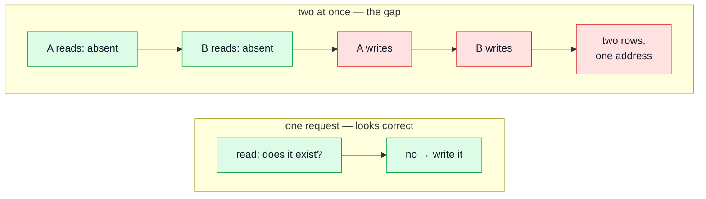

# Concurrency Testing

Every other suite asks _"does this operation do the right thing?"_ This one asks _"does it still, when N of them happen at once?"_

That is a question no other layer can answer — including mutation testing, which runs one mutant against a **serial** suite by construction.

## The idea

Most write paths are read-then-write:

The window between the read and the write is where the bug lives. It is small, and it is entirely reachable — a double-clicked submit button is enough. **No application-level check can close it**, because the gap _is_ between the check and the write. Only the database can refuse the second write, and only if something told it to.

## Assert invariants, never orderings

This is the rule that makes these tests stable instead of flaky.

_Wrong:_ "the first request wins."
_Right:_ "exactly one request wins."

Which participant wins is the database's business and varies run to run. That exactly one does is the property. Every case here is written that way, and a case that asserts an ordering will eventually fail for a reason that is not a bug — and then get deleted.

## `Promise.allSettled`, never `Promise.all`

The whole point of a race is that some participants lose, and **losing is the correct outcome**: nine of ten signups for one address must fail.

`Promise.all` rejects on the first rejection and discards every other result — which throws away precisely the outcomes being asserted. `allSettled` keeps them all.

## Two things that quietly make these tests worthless

**Rate limiting.** `authRateLimiter` is mounted on exactly the endpoints these tests hammer — signup, login, reset — at ten per IP per window. At that budget a ten-participant signup race sits exactly on the limit and twelve starts returning 429s.

The trap is that the test still **passes**: "not two users" is trivially true when two of the requests never reached the handler. So the limits are raised in `tests/support/setup.ts`, and the shared assertion rejects a 429 explicitly rather than lumping it into "not a success". One case keeps a small, freshly-constructed limiter to prove the budget is still enforced rather than switched off.

**`--runInBand`.** It serialises test _files_, not the requests inside a test. `Promise.allSettled` is still genuinely concurrent. Removing the flag would not make these "more concurrent" — it would make them flaky for an unrelated reason, because parallel jest workers would share one in-memory Mongo.

## The four races, and their shapes

Reading the code found four. Two were ordinary bugs; the other two are worth knowing as patterns.

| Pattern                                                          | Symptom                                                                                       | Fix                                                                                            |
| ---------------------------------------------------------------- | --------------------------------------------------------------------------------------------- | ---------------------------------------------------------------------------------------------- |
| **Check-then-insert** against a non-unique index                 | Two accounts on one address                                                                   | Unique index — _after_ teaching the error interpreter to answer 409, or the race becomes a 500 |
| **Read → write → clear**, with nothing tying step 3 to step 1    | One cart becomes two orders; the customer is charged twice                                    | Conditional write on the version read, plus a compensating delete for the loser                |
| **Read-modify-write** on a document array (`push` then `save()`) | Concurrent logins silently lose sessions; the user is logged out immediately after logging in | Atomic `$push` / `$pull`, evaluated by the database at write time                              |
| **Contended upsert** carrying its condition in the filter        | _(none — this one was already correct)_                                                       | Nothing. It was correct, documented, and completely untested; the tests were the deliverable   |

The last row is the interesting one. Correct code with no tests is one refactor away from incorrect code, and its retry branch, attempt budget and duplicate-key check were all live mutants behind a comment explaining why they worked.

## Order matters when fixing a race

Closing a race can make things worse if done in the wrong order. Adding a unique index **before** the error interpreter knows what a duplicate-key error means converts a data bug into an availability bug — a 500 on an ordinary signup, and an alert at three in the morning.

So: teach the error layer first, add the constraint second, migrate third. The migration itself refuses to run against a database that already holds duplicates, rather than failing halfway through with a driver error naming one of them.

## Not every read-modify-write is a lost update

An array field edited in memory and then `save()`d _looks_ like the classic lost-update shape, and
in this codebase mostly is not — which matters, because "fixing" a race that does not exist adds
churn and the false confidence of a test that never could have failed.

Mongoose records the **change**, not the resulting value. So:

| Written as                                          | Mongoose sends            | Concurrent-safe                         |
| --------------------------------------------------- | ------------------------- | --------------------------------------- |
| `doc.tokens.push(entry)` then `save()`              | `$push`                   | **yes** — two writers keep both entries |
| `doc.tokens = doc.tokens.filter(…)` then `save()`   | `$set` of the whole array | **no**                                  |
| `doc.tokens = [...doc.tokens, entry]` then `save()` | `$set` of the whole array | **no**                                  |

The hazard is **rebuilding** the array, not mutating it. And the second row is the trap, because
filtering to remove an element is the obvious way to write it and reads as more functional than the
alternative — while turning a targeted removal into a wholesale overwrite that erases whatever
another request added in between. On `tokens` that means "log out everywhere" silently restoring a
session, or a password-reset link going missing.

Two things follow, and the second is the reason this section exists:

1. Prefer operators that describe a change — `$push`, `$pull`, `$inc`, a filtered `updateOne` — over
   any code that assigns a whole array or document back.
2. **Check which shape you actually have before writing the fix.** The way to find out is to break
   it deliberately: rewrite the append as a rebuild and confirm the suite goes red. If reverting the
   "fix" leaves every test green, there was no bug to fix, and the honest outcome is a test pinning
   the invariant plus a comment saying why — not a changelog entry claiming a race was closed.

## Recording the hit rate

A race test that never actually races is a green test that measured nothing. Each file records, in a comment, how often the race was observed to be contended over repeated runs — so a future reader can tell "this passes because the code is correct" from "this passes because the race never happened".

## File map

| Path                                               | Contents                                                                              |
| -------------------------------------------------- | ------------------------------------------------------------------------------------- |
| `tests/integration/concurrency/auth-races.test.ts` | Signup, login, token revocation, one-time reset tokens, and the limiter proof         |
| `tests/integration/concurrency/cart-races.test.ts` | Cart upsert under contention, checkout, account deletion racing a cart write          |
| `tests/support/race.ts`                            | `raceN`, status helpers, and the shared "no 5xx, no 429, nobody hung up" assertion    |
| `tests/support/setup.ts`                           | Where the rate-limit budgets are raised, and why they are raised rather than disabled |

Run with `npm run test:integration` — they are part of the ordinary integration suite, not a separate command, because they gate merges like the rest of it.

## Related pages

- [Integration Testing](./integration-testing.md) — the harness these are built on
- [MongoDB & Mongoose](./mongodb-mongoose.md) — indexes, the migration rule, atomic update operators
- [Mutation Testing](./mutation-testing.md) — the layer that structurally cannot answer this question
- [Testing & Docs](./testing-and-docs.md) — the map
