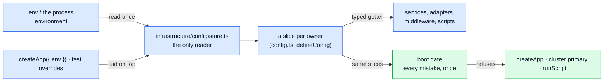
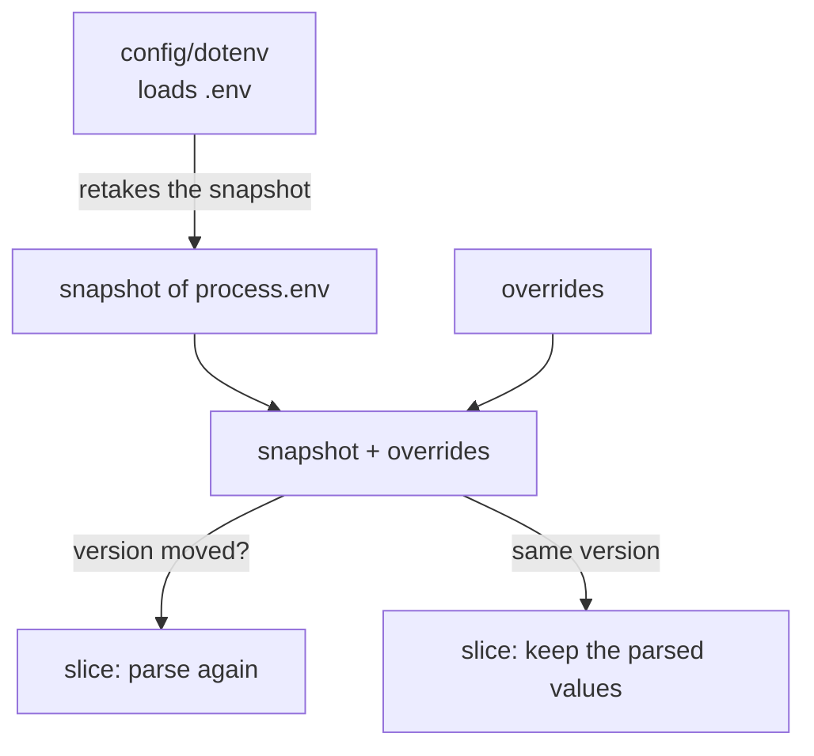
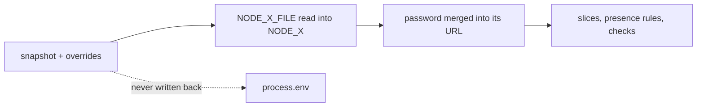

# Configuration

Every environment variable is read in **one layer**, checked **once at boot**, and handed to the
rest of the code as a **typed, frozen object**.



## The standard

Laravel, AdonisJS, NestJS and Spring Boot all converge on it. This repo follows it on Zod 4, which
was already a dependency.

| Rule                                  | Where it is enforced here                                                           |
| ------------------------------------- | ----------------------------------------------------------------------------------- |
| Read the environment in one layer     | `no-restricted-properties` on `process.env` in `src/`, off only in `config.ts`      |
| Validate once at boot, list every one | `assertConfig` from `registerModules`, `runScript` and the cluster primary          |
| Parse once, expose a frozen object    | The store snapshots `process.env` at the first read; a slice parses once per change |
| Everything else reads that object     | Getters such as `vatRateDefault()` keep their signature; only their body moved      |
| Tests override config through a seam  | `tests/support/environment.ts`; lint refuses a `process.env` write in a test        |

A junk value **refuses to boot**. It never falls back to the default:
`NODE_MAX_UPLOAD_BYTES=5mb` used to become 5 MB, quietly. Blank counts as unset.

## Who owns what

| Layer          | File                                                               | Holds                                                        |
| -------------- | ------------------------------------------------------------------ | ------------------------------------------------------------ |
| Seam           | `src/infrastructure/config/{fields,define,store}.ts`               | Field builders, `defineConfig`, the gate, the one env reader |
| Infrastructure | `src/infrastructure/<dir>/config.ts`                               | The adapters' variables, one slice per adapter               |
| Kernel         | `src/kernel/config.ts`                                             | Step-up windows, outbox retry                                |
| App tier       | `src/app/config.ts`                                                | Server bounds, security.txt, **the list of every slice**     |
| A module       | `src/modules/<name>/config.ts` + `config: [slice]` on the manifest | Its own variables; deleting the module deletes its gate      |

## Add a variable

1. Put it in **its owner's** `config.ts`, with a builder and a one-line `describe`.
2. Keep the getter's signature; read the slice inside it.
3. A module lists the slice on its manifest (`config: [mySlice.slice]`). Infrastructure and app
   slices are listed in `src/app/config.ts`.
4. `npm run regenerate` rewrites the reference below.
5. Add its line to [`.env-example`](#env-example), in the section it belongs to.
   `npm run check:env-example` fails until you do. A variable something else sets (npm, a script)
   takes `setBy: '<who>'` instead, and needs no line.

```ts
// src/modules/products/config.ts
export const productsConfig = defineConfig({
    name: 'products',
    shape: {
        NODE_VAT_RATE_DEFAULT: decimal({
            default: 0.22,
            min: 0,
            lessThan: 1,
            required: { minLength: 1 }
        })
    }
});
export const vatRateDefault = (): number => productsConfig().NODE_VAT_RATE_DEFAULT;
```

| Builder                        | Reads                                                                |
| ------------------------------ | -------------------------------------------------------------------- |
| `int` / `decimal`              | A whole-string number, with `min` / `max` / `lessThan`               |
| `flag`                         | `1 true yes on` and `0 false no off`, either case                    |
| `choice`                       | One of a closed set (a function for a registry filled later)         |
| `text` / `secret`              | Trimmed text; `secret` is never echoed and can carry a presence rule |
| `csv`                          | A comma-separated list, blank members dropped                        |
| `keyRing` / `versionedKeyRing` | A rotation ring, newest first; `version:key` for the second          |

## `.env-example`

The reference below is generated; `.env-example` is **not**, and `npm run check:env-example` (part
of `complete`) keeps it from drifting. A slice carries a name, a type, a default and one line. The
file carries what an operator needs: sections, `MUST SET` warnings, invented values, who else reads
a variable. Generating it from the slices would lose all of that.

| Drift                                                         | Caught                                                      |
| ------------------------------------------------------------- | ----------------------------------------------------------- |
| A slice declares a variable the file never shows              | Yes: named in the failure                                   |
| The file shows a variable no slice declares and no file reads | Yes: docker-compose, scripts and libraries count as readers |
| A value in the file differs from the slice's default          | No: values are invented or development-flavoured on purpose |

A placeholder a slice refuses at boot is checked elsewhere: `tests/unit/scripts/setup/first-run.test.ts`
fills every one from the file.

## Two kinds of rule

| Kind         | Example                                        | Applied                                  |
| ------------ | ---------------------------------------------- | ---------------------------------------- |
| **Shape**    | Is it a number? Is it in the set?              | Every read, every environment, tests too |
| **Presence** | Length, still the placeholder, production-only | At boot, skipped under `NODE_ENV=test`   |

Presence is not a shape rule because an unset secret is a correct state on a developer machine.
`isRelaxedEnvironment()` (development or test, nothing else) decides who is a developer.

Cross-field rules (`NODE_TOKEN_REUSE_WINDOW_MS` must exceed `NODE_TOKEN_ROTATION_GRACE_MS`; an SMTP
host needs its credentials) are a slice's `check`, and run at boot with the parsed values.

A **provider selector** (`NODE_PAYMENT_PROVIDER`, `NODE_ANTIBOT_PROVIDER`, …) is plain text in its
slice, because the valid names live in a registry that imports the slice. A shape-less
`…ProviderProbe` slice, next to the registry, runs the resolver once at boot instead.

## Read once, override on top

The store copies `process.env` the **first** time anything asks, and never again. What changes the
answer afterwards is an **override**: a layer of names and values on top of that copy. A slice
parses its variables once and keeps the result until the store changes.



| Who writes an override          | How                                                            |
| ------------------------------- | -------------------------------------------------------------- |
| `createApp({ env })`            | `installEnvironment`: for the life of the process              |
| The demo and scenario launchers | `installEnvironment`, before the app is imported               |
| A test                          | `tests/support/environment.ts`, below; undone after every case |

`createApp({ env })` is the injection point: the variables are laid over the process environment,
pass through the same parser and boot gate, and `process.env` is never written. The slices are
process-wide, so the last app built wins. A setting read at **import** time (a rate limiter's
budget) only sees it if it was installed before the first import of `src/app.ts`, which is why the
launchers install theirs first.

Every entry point imports `config/dotenv` instead of `dotenv/config`. It loads `.env` and tells the
store, so a read that happened earlier (tracing, a launcher) does not freeze a snapshot without it.

## Secrets as files

`NODE_X_FILE=/run/secrets/x` stands in for `NODE_X=<the secret>`. A secret in the environment shows in
`docker inspect` and in every child process; a file mounted into one container does neither. The
store resolves it while it builds the merged environment, so every slice, presence rule and
cross-field check sees the value and nothing downstream knows a file existed.



| Rule                     | Why                                                                                  |
| ------------------------ | ------------------------------------------------------------------------------------ |
| The file wins            | Both set is a deployment mid-move, not a mistake worth refusing                      |
| An empty file is unset   | A managed service has no secret to put in a file compose insists on mounting         |
| A trailing newline goes  | Only the one `echo` or an editor adds; any other whitespace is the secret's          |
| `NODE_*` only            | `GIT_INDEX_FILE` and friends name a file for another tool, not a secret for this app |
| Never into `process.env` | That would hand the value to every child process again                               |
| An unreadable file stops | The error names the variable and path, never a value                                 |

**Connection URLs carry no password.** The URL stays in plain config; each password is its own
variable, and the loader merges it into the URL, replacing any it carried:

| URL                         | Password                         | Its file form                         |
| --------------------------- | -------------------------------- | ------------------------------------- |
| `NODE_DB_URI`               | `NODE_DB_PASSWORD`               | `NODE_DB_PASSWORD_FILE`               |
| `NODE_REDIS_URL`            | `NODE_REDIS_PASSWORD`            | `NODE_REDIS_PASSWORD_FILE`            |
| `NODE_RABBITMQ_URL`         | `NODE_RABBITMQ_PASSWORD`         | `NODE_RABBITMQ_PASSWORD_FILE`         |
| `NODE_RATE_LIMIT_REDIS_URL` | `NODE_RATE_LIMIT_REDIS_PASSWORD` | `NODE_RATE_LIMIT_REDIS_PASSWORD_FILE` |

The merge uses a standard parser, not hand-written parsing. A Mongo URI (`mongodb://`,
`mongodb+srv://`) goes through `mongodb-connection-string-url`, the parser the `mongodb` driver
itself uses: the WHATWG `URL` refuses a multi-host replica-set string
(`mongodb://a:27017,b:27017/db`). Every other URL goes through Node's `URL`. Both percent-encode
the password, keep the user the URL names, and a URL that does not parse is left as it was.

The generated reference below marks every secret that has a file form. `check:env-example` accepts
a `NODE_X_FILE` line in `.env-example` for any such secret. How the production stack uses this:
[docs/getting-started-production.md](../getting-started-production.md).

## In tests

`tests/support/setup-environment.ts` gives every worker a set of `??=` defaults. It is the first
import of `setup.ts`, so they land before the store's first read. Jest gives each test **file** its
own copy of `process.env`, so a file starts from the same snapshot whatever ran before it.

A test never writes `process.env`: the store would not see it. `no-restricted-syntax` refuses an
assignment, a `delete` or an `Object.assign` onto it in `tests/` and every `src/modules/*/tests/`,
and names the helper. Overrides last **one case**: a `setupFilesAfterEnv` hook resets them after
every test, back to what the file began with (the file sandbox's directories).

| Helper                                                | Use                                                                                    |
| ----------------------------------------------------- | -------------------------------------------------------------------------------------- |
| `setEnvironment({ NAME: 'x', OTHER: undefined })`     | Override for the rest of the case; `undefined` unsets                                  |
| `withEnvironment` / `withEnvironmentOverrides`        | Override for a body, restore after                                                     |
| `withoutEnvironment` / `withoutEnvironmentInThisFile` | Unset for the body, or before every case of the file                                   |
| `setProcessEnvironment({ NAME: 'x' })`                | The REAL `process.env`, for a script or library that reads it; restored after the case |
| `slice.slice.inspect(env)`                            | Judge a plain object against a slice, no process                                       |
| `assertConfigIn(slices, env)`                         | The whole gate against a plain object                                                  |

Set a value in a `beforeEach`, not a `beforeAll`: the reset runs after the first case. A suite that
re-imports a module (`jest.resetModules()`) keeps its overrides, because the store's state lives on
`globalThis`, not in the module.

## Reference

Every variable, generated from the slices by `npm run docs:config` and checked in `complete`. Rate
limit budgets are in [Security](./security.md#the-rate-limit-budgets).

<!-- config-reference:start -->

### environment

| Variable   | Type | Default | Rules | What it does                                                                                     |
| ---------- | ---- | ------- | ----- | ------------------------------------------------------------------------------------------------ |
| `NODE_ENV` | text | —       | —     | development or test relaxes the safety switches; anything else, unset included, is a deployment. |

### logging

| Variable                   | Type                                                  | Default | Rules | What it does                                                                  |
| -------------------------- | ----------------------------------------------------- | ------- | ----- | ----------------------------------------------------------------------------- |
| `NODE_SERVICE_NAME`        | text                                                  | `api`   | —     | The service name stamped on every log line, span and health payload.          |
| `NODE_LOG_LEVEL`           | one of error, warn, info, http, verbose, debug, silly | —       | —     | Minimum severity logged. Unset: debug on a developer machine, info elsewhere. |
| `NODE_LOG_PERSONAL_FIELDS` | one of hash, redact, plain                            | `hash`  | —     | How personal fields appear in logs: keyed hash, redacted, or plain.           |

### server

| Variable                            | Type                  | Default | Rules | What it does                                                                                               |
| ----------------------------------- | --------------------- | ------- | ----- | ---------------------------------------------------------------------------------------------------------- |
| `NODE_PORT`                         | whole number 1..65535 | `3000`  | —     | The port the server binds.                                                                                 |
| `NODE_HOST`                         | text                  | —       | —     | The address to bind. Unset binds every interface.                                                          |
| `NODE_GRACEFUL_SHUTDOWN_TIMEOUT_MS` | whole number >= 1     | `15000` | —     | How long a stop waits for in-flight work before forcing exit. Keep it below the orchestrator grace period. |

### cluster

| Variable                             | Type              | Default | Rules | What it does                                         |
| ------------------------------------ | ----------------- | ------- | ----- | ---------------------------------------------------- |
| `NODE_ENABLE_CLUSTERING`             | switch            | `off`   | —     | Run a primary that forks workers.                    |
| `NODE_CLUSTER_WORKERS`               | whole number >= 0 | `0`     | —     | Worker count. 0 means one per available core.        |
| `NODE_CLUSTER_CRASH_WINDOW_MS`       | whole number >= 1 | `60000` | —     | The window a worker crash is counted over.           |
| `NODE_CLUSTER_CRASH_BACKOFF_BASE_MS` | whole number >= 1 | `500`   | —     | Delay before the first respawn after a crash.        |
| `NODE_CLUSTER_CRASH_BACKOFF_MAX_MS`  | whole number >= 1 | `30000` | —     | Ceiling the respawn backoff doubles up to.           |
| `NODE_CLUSTER_SHUTDOWN_TIMEOUT_MS`   | whole number >= 1 | `15000` | —     | Grace before the primary kills a worker on shutdown. |
| `NODE_CLUSTER_CRASH_LIMIT`           | whole number >= 1 | `10`    | —     | Crashes in one window before the primary gives up.   |

### database

| Variable            | Type                  | Default                    | Rules                                            | What it does                                                                                                                                                                                     |
| ------------------- | --------------------- | -------------------------- | ------------------------------------------------ | ------------------------------------------------------------------------------------------------------------------------------------------------------------------------------------------------ |
| `NODE_DB_URI`       | text                  | —                          | —                                                | A full Mongo URI. Wins over the host, port and name below when set.                                                                                                                              |
| `NODE_DB_PASSWORD`  | text                  | —                          | secret: never logged; or `NODE_DB_PASSWORD_FILE` | Password merged into `NODE_DB_URI`, replacing any it carries (a URI only: the host/port form has no user). Read from `NODE_DB_PASSWORD_FILE` in a deployment, so the URI itself holds no secret. |
| `NODE_MONGODB_HOST` | text                  | `127.0.0.1`                | —                                                | Mongo host.                                                                                                                                                                                      |
| `NODE_MONGODB_PORT` | whole number 1..65535 | `27017`                    | —                                                | Mongo port.                                                                                                                                                                                      |
| `NODE_MONGODB_NAME` | text                  | `boilerplate-node-backend` | —                                                | Database name.                                                                                                                                                                                   |

### tracing

| Variable                             | Type | Default | Rules | What it does                                                  |
| ------------------------------------ | ---- | ------- | ----- | ------------------------------------------------------------- |
| `OTEL_EXPORTER_OTLP_ENDPOINT`        | text | —       | —     | OTLP collector for every signal. Unset drops spans.           |
| `OTEL_EXPORTER_OTLP_TRACES_ENDPOINT` | text | —       | —     | OTLP collector for traces only; wins over the endpoint above. |
| `npm_package_version`                | text | —       | —     | Set by npm when started through a script; stamped on spans.   |

### pseudonymisation

| Variable             | Type | Default | Rules                                                                                                                                        | What it does                                                                                            |
| -------------------- | ---- | ------- | -------------------------------------------------------------------------------------------------------------------------------------------- | ------------------------------------------------------------------------------------------------------- |
| `NODE_PSEUDONYM_KEY` | text | —       | required, 16+ characters, never the `.env-example` placeholder, outside development/test; secret: never logged; or `NODE_PSEUDONYM_KEY_FILE` | Root secret for keyed hashes of personal data in logs and fingerprints. Every digest throws without it. |

### pii-encryption

| Variable                  | Type                                                              | Default | Rules                                                   | What it does                                                            |
| ------------------------- | ----------------------------------------------------------------- | ------- | ------------------------------------------------------- | ----------------------------------------------------------------------- |
| `NODE_PII_ENCRYPTION_KEY` | versioned key ring (`version:key`, comma-separated, newest first) | `empty` | secret: never logged; or `NODE_PII_ENCRYPTION_KEY_FILE` | Key ring encrypting personal fields at rest (addresses, phone numbers). |

### breached-passwords

| Variable                               | Type              | Default | Rules | What it does                                                       |
| -------------------------------------- | ----------------- | ------- | ----- | ------------------------------------------------------------------ |
| `NODE_PASSWORD_BREACH_LIST`            | switch            | `on`    | —     | Refuse a password on the bundled breach list.                      |
| `NODE_PASSWORD_BREACH_HIBP`            | switch            | `off`   | —     | Also ask Have I Been Pwned (k-anonymity range lookup). Fails open. |
| `NODE_PASSWORD_BREACH_HIBP_TIMEOUT_MS` | whole number >= 1 | `1500`  | —     | How long the HIBP lookup may take before it is skipped.            |

### mail

| Variable              | Type                  | Default | Rules                                          | What it does                                                                                         |
| --------------------- | --------------------- | ------- | ---------------------------------------------- | ---------------------------------------------------------------------------------------------------- |
| `NODE_MAIL_TRANSPORT` | text                  | `smtp`  | —                                              | The mail transport. Production has `smtp`; a name this process does not register is refused at boot. |
| `NODE_SMTP_HOST`      | text                  | —       | —                                              | SMTP server. Unset leaves email second factors off.                                                  |
| `NODE_SMTP_PORT`      | whole number 1..65535 | `587`   | —                                              | 587 STARTTLS, 465 implicit TLS, 25 relay.                                                            |
| `NODE_SMTP_NAME`      | text                  | —       | —                                              | Hostname announced in the SMTP EHLO greeting.                                                        |
| `NODE_SMTP_USER`      | text                  | —       | —                                              | SMTP AUTH user.                                                                                      |
| `NODE_SMTP_PASS`      | text                  | —       | secret: never logged; or `NODE_SMTP_PASS_FILE` | SMTP AUTH password.                                                                                  |
| `NODE_SMTP_SENDER`    | text                  | —       | —                                              | Default From address, e.g. `Shop <shop@example.com>`.                                                |
| `NODE_E2E_RUN`        | switch                | `off`   | —                                              | Set by `e2e:serve`. Refuses a non-local SMTP host so a live suite cannot mail real people.           |

### mail-files

| Variable                          | Type              | Default                  | Rules | What it does                                                                                     |
| --------------------------------- | ----------------- | ------------------------ | ----- | ------------------------------------------------------------------------------------------------ |
| `NODE_MAIL_SPOOL_PATH`            | text              | `tmp/storage/mail-spool` | —     | Where an attachment waits between the request and the mail. Mount a volume here in a deployment. |
| `NODE_MAIL_SPOOL_RETENTION_HOURS` | whole number >= 1 | `1`                      | —     | Hours a spooled attachment is left alone before the sweep counts it abandoned.                   |
| `NODE_EMAIL_TEMPLATES_DIR`        | text              | —                        | —     | A flat directory of EJS templates that overrides every module’s own.                             |

### queue

| Variable                         | Type                  | Default     | Rules                                                  | What it does                                                                                                                                               |
| -------------------------------- | --------------------- | ----------- | ------------------------------------------------------ | ---------------------------------------------------------------------------------------------------------------------------------------------------------- |
| `NODE_RABBITMQ_URL`              | text                  | —           | secret: never logged; or `NODE_RABBITMQ_URL_FILE`      | A full AMQP URL. Wins over the fragments below.                                                                                                            |
| `NODE_RABBITMQ_HOST`             | text                  | `127.0.0.1` | —                                                      | Broker host.                                                                                                                                               |
| `NODE_RABBITMQ_PORT`             | whole number 1..65535 | —           | —                                                      | Broker port. The fragment that switches the queue on: unset (and no URL) means no queue.                                                                   |
| `NODE_RABBITMQ_USER`             | text                  | `guest`     | —                                                      | Broker user (guest works over localhost only).                                                                                                             |
| `NODE_RABBITMQ_PASSWORD`         | text                  | `guest`     | secret: never logged; or `NODE_RABBITMQ_PASSWORD_FILE` | Broker password. Also merged into `NODE_RABBITMQ_URL` when that is set, replacing any it carries. Read from `NODE_RABBITMQ_PASSWORD_FILE` in a deployment. |
| `NODE_RABBITMQ_ENABLED`          | switch                | `on`        | —                                                      | Kill switch that leaves the URL in place.                                                                                                                  |
| `NODE_QUEUE_MAX_ATTEMPTS`        | whole number >= 1     | `5`         | —                                                      | Deliveries a job gets before it is parked.                                                                                                                 |
| `NODE_QUEUE_RETRY_DELAY_SECONDS` | whole number >= 1     | `30`        | —                                                      | How long a failed job waits before it is redelivered.                                                                                                      |

### redis

| Variable                   | Type                  | Default                    | Rules                                               | What it does                                                                                                           |
| -------------------------- | --------------------- | -------------------------- | --------------------------------------------------- | ---------------------------------------------------------------------------------------------------------------------- |
| `NODE_REDIS_URL`           | text                  | —                          | secret: never logged; or `NODE_REDIS_URL_FILE`      | A full Redis URL. Wins over host and port.                                                                             |
| `NODE_REDIS_PASSWORD`      | text                  | —                          | secret: never logged; or `NODE_REDIS_PASSWORD_FILE` | Password merged into `NODE_REDIS_URL`, replacing any it carries. Read from `NODE_REDIS_PASSWORD_FILE` in a deployment. |
| `NODE_REDIS_HOST`          | text                  | `127.0.0.1`                | —                                                   | Redis host.                                                                                                            |
| `NODE_REDIS_PORT`          | whole number 1..65535 | —                          | —                                                   | Redis port. Unset (and no URL) means no Redis.                                                                         |
| `NODE_REDIS_CACHE_PREFIX`  | text                  | `boilerplate-node-backend` | —                                                   | Prefix of every cache key. Staging and production must differ.                                                         |
| `NODE_REDIS_CACHE_ENABLED` | switch                | `on`                       | —                                                   | Kill switch for the cache that leaves Redis up.                                                                        |

### images

| Variable                          | Type              | Default          | Rules | What it does                                                                      |
| --------------------------------- | ----------------- | ---------------- | ----- | --------------------------------------------------------------------------------- |
| `NODE_IMAGE_MAX_INPUT_PIXELS`     | whole number >= 1 | `50000000`       | —     | Decoded pixel ceiling. The decompression-bomb guard.                              |
| `NODE_IMAGE_MAX_DIMENSION`        | whole number >= 1 | `2048`           | —     | Longest side of a stored image, in pixels.                                        |
| `NODE_IMAGE_THUMBNAIL_DIMENSION`  | whole number >= 1 | `320`            | —     | Longest side of a thumbnail, in pixels.                                           |
| `NODE_PUBLIC_PATH`                | text              | `public`         | —     | The directory served at the site root, where a promoted image lands.              |
| `NODE_QUARANTINE_RETENTION_HOURS` | whole number >= 1 | `24`             | —     | Hours a quarantined upload is left alone before the sweep counts it abandoned.    |
| `NODE_QUARANTINE_PATH`            | text              | `tmp/quarantine` | —     | Where an upload waits for its digest job. Must survive a restart: mount a volume. |

### pdf

| Variable                    | Type | Default                     | Rules | What it does                                     |
| --------------------------- | ---- | --------------------------- | ----- | ------------------------------------------------ |
| `PUPPETEER_EXECUTABLE_PATH` | text | `/usr/bin/chromium-browser` | —     | The Chromium binary (puppeteer-core ships none). |

### antibot

| Variable                            | Type                       | Default  | Rules                                                         | What it does                                                                   |
| ----------------------------------- | -------------------------- | -------- | ------------------------------------------------------------- | ------------------------------------------------------------------------------ |
| `NODE_ANTIBOT_PROVIDER`             | text                       | `none`   | —                                                             | The human-challenge provider: none, turnstile or altcha.                       |
| `NODE_ANTIBOT_EMAIL_POLICY`         | one of off, disposable, mx | `off`    | —                                                             | What a signup address must pass: nothing, not-disposable, or has an MX record. |
| `NODE_ANTIBOT_EMAIL_ALLOWLIST`      | comma-separated list       | `empty`  | —                                                             | Domains exempt from the email policy.                                          |
| `NODE_ANTIBOT_EMAIL_DENYLIST_EXTRA` | comma-separated list       | `empty`  | —                                                             | Domains refused on top of the upstream disposable list.                        |
| `NODE_ANTIBOT_ALTCHA_SECRET`        | text                       | —        | secret: never logged; or `NODE_ANTIBOT_ALTCHA_SECRET_FILE`    | HMAC secret for altcha challenges (16+ characters).                            |
| `NODE_ANTIBOT_ALTCHA_COST`          | whole number >= 1          | `100000` | —                                                             | Work an altcha challenge takes to solve. Higher taxes bots and visitors alike. |
| `NODE_ANTIBOT_TURNSTILE_SITE_KEY`   | text                       | —        | —                                                             | Public Turnstile site key.                                                     |
| `NODE_ANTIBOT_TURNSTILE_SECRET`     | text                       | —        | secret: never logged; or `NODE_ANTIBOT_TURNSTILE_SECRET_FILE` | Turnstile secret key.                                                          |

### site

| Variable            | Type                 | Default                 | Rules                                             | What it does                                                                                                                                      |
| ------------------- | -------------------- | ----------------------- | ------------------------------------------------- | ------------------------------------------------------------------------------------------------------------------------------------------------- |
| `NODE_URL`          | text                 | —                       | required, 1+ characters                           | This API’s public origin. OAuth redirect URIs and security.txt are built from it.                                                                 |
| `NODE_FRONTEND_URL` | text                 | `http://localhost:8080` | required, 1+ characters, outside development/test | The paired frontend’s origin. Links in mail and the OAuth callback point here. Unset allows `http://localhost:8080` in development and test only. |
| `NODE_CORS_ORIGIN`  | comma-separated list | `empty`                 | required, 1+ characters, outside development/test | Origins allowed to call this API with credentials, comma-separated. Unset allows `http://localhost:8080`.                                         |

### rate-limit

| Variable                         | Type              | Default      | Rules                                                          | What it does                                                                                                                                 |
| -------------------------------- | ----------------- | ------------ | -------------------------------------------------------------- | -------------------------------------------------------------------------------------------------------------------------------------------- |
| `NODE_RATE_LIMIT_WINDOW_MS`      | whole number >= 1 | `60000`      | —                                                              | The window every `shared` budget counts over.                                                                                                |
| `NODE_RATE_LIMIT_REDIS_ENABLED`  | switch            | `on`         | —                                                              | Kill switch: false counts in memory even when a Redis URL is inherited.                                                                      |
| `NODE_RATE_LIMIT_REDIS_URL`      | text              | —            | secret: never logged; or `NODE_RATE_LIMIT_REDIS_URL_FILE`      | The limiter’s own Redis. Falls back to the cache’s.                                                                                          |
| `NODE_RATE_LIMIT_REDIS_PASSWORD` | text              | —            | secret: never logged; or `NODE_RATE_LIMIT_REDIS_PASSWORD_FILE` | Password merged into `NODE_RATE_LIMIT_REDIS_URL`, replacing any it carries. Read from `NODE_RATE_LIMIT_REDIS_PASSWORD_FILE` in a deployment. |
| `NODE_RATE_LIMIT_REDIS_PREFIX`   | text              | `rate-limit` | —                                                              | Key namespace of every counter, apart from the cache’s.                                                                                      |

### uploads

| Variable                     | Type              | Default                             | Rules | What it does                                                                        |
| ---------------------------- | ----------------- | ----------------------------------- | ----- | ----------------------------------------------------------------------------------- |
| `NODE_MAX_UPLOAD_BYTES`      | whole number >= 1 | `5242880`                           | —     | Largest accepted upload, in bytes.                                                  |
| `NODE_UPLOAD_STAGING_PATH`   | text              | `/tmp/node-api-uploads`             | —     | Where multer writes before the content checks. Set when temp is small or read-only. |
| `NODE_PENDING_IMAGE_URL`     | text              | `/images/system/pending.png`        | —     | The placeholder image shown until a digest job finishes.                            |
| `NODE_PENDING_THUMBNAIL_URL` | text              | `/images/system/pending-thumb.webp` | —     | The placeholder thumbnail shown until a digest job finishes.                        |

### response-cache

| Variable                       | Type              | Default  | Rules | What it does                                                                   |
| ------------------------------ | ----------------- | -------- | ----- | ------------------------------------------------------------------------------ |
| `NODE_REDIS_CACHE_DEV_TTL_MAX` | whole number >= 0 | `30`     | —     | Caps a route’s cache TTL, in seconds, on a developer machine. 0 lifts the cap. |
| `NODE_REDIS_CACHE_MAX_BYTES`   | whole number >= 1 | `262144` | —     | Largest response body the cache will store.                                    |

### idempotency

| Variable                           | Type              | Default | Rules | What it does                                                                      |
| ---------------------------------- | ----------------- | ------- | ----- | --------------------------------------------------------------------------------- |
| `NODE_IDEMPOTENCY_RETENTION_HOURS` | whole number >= 1 | `24`    | —     | How long a stored idempotent response is replayable. Changing it needs `db:sync`. |

### locales

| Variable                          | Type                 | Default | Rules | What it does                                              |
| --------------------------------- | -------------------- | ------- | ----- | --------------------------------------------------------- |
| `NODE_DEFAULT_LOCALE`             | text                 | `en`    | —     | The locale a request falls back to when it asks for none. |
| `NODE_FALLBACK_LOCALE`            | text                 | `en`    | —     | The locale a missing translation key falls back to.       |
| `NODE_SUPPORTED_LOCALES`          | comma-separated list | `empty` | —     | The languages offered. Unset lists every dictionary file. |
| `NODE_LOCALE_OVERRIDE_REFRESH_MS` | whole number >= 1    | `60000` | —     | How long a worker may serve copy another worker edited.   |

### persistence

| Variable                             | Type              | Default | Rules | What it does                                                                |
| ------------------------------------ | ----------------- | ------- | ----- | --------------------------------------------------------------------------- |
| `NODE_SETTINGS_PAGINATION_PAGE_SIZE` | whole number >= 1 | `10`    | —     | Page size when the caller asks for none. Capped at 100.                     |
| `NODE_LEASE_RETENTION_DAYS`          | whole number >= 1 | `30`    | —     | Days an untouched job-lease document survives. Changing it needs `db:sync`. |

### analytics

| Variable                         | Type   | Default | Rules                                                | What it does                                                                 |
| -------------------------------- | ------ | ------- | ---------------------------------------------------- | ---------------------------------------------------------------------------- |
| `NODE_ANALYTICS_PROVIDER`        | text   | `umami` | —                                                    | Where product events go: umami, posthog or none.                             |
| `NODE_ANALYTICS_REQUIRE_CONSENT` | switch | `on`    | —                                                    | Only capture an event when the caller consented (GDPR Art. 25(2) default).   |
| `NODE_UMAMI_HOST`                | text   | —       | —                                                    | Umami’s PUBLIC origin, where a browser loads the tracker.                    |
| `NODE_UMAMI_INGEST_HOST`         | text   | —       | —                                                    | The address this server dials to send events. Falls back to the public host. |
| `NODE_UMAMI_WEBSITE_ID`          | text   | —       | —                                                    | The Umami website id events are attributed to.                               |
| `NODE_POSTHOG_API_KEY`           | text   | —       | secret: never logged; or `NODE_POSTHOG_API_KEY_FILE` | PostHog write-only project key.                                              |
| `NODE_POSTHOG_HOST`              | text   | —       | —                                                    | PostHog host. Explicit: a default would pick a region for you.               |

### reauthentication

| Variable                     | Type              | Default | Rules | What it does                                                 |
| ---------------------------- | ----------------- | ------- | ----- | ------------------------------------------------------------ |
| `NODE_REAUTH_TIME_CRITICAL`  | whole number >= 0 | `300`   | —     | Seconds since sign-in a money or credential action accepts.  |
| `NODE_REAUTH_TIME_SENSITIVE` | whole number >= 0 | `900`   | —     | Seconds since sign-in an identity or session change accepts. |

### outbox

| Variable                     | Type              | Default | Rules | What it does                                                        |
| ---------------------------- | ----------------- | ------- | ----- | ------------------------------------------------------------------- |
| `NODE_OUTBOX_RETENTION_DAYS` | whole number >= 1 | `7`     | —     | Days a published row is kept. Changing it needs `db:sync`.          |
| `NODE_OUTBOX_MAX_ATTEMPTS`   | whole number >= 1 | `10`    | —     | Failed dispatches before a row is parked as dead.                   |
| `NODE_OUTBOX_LEASE_SECONDS`  | whole number >= 1 | `60`    | —     | How long a relay’s claim on a row lasts. Must outlast one dispatch. |

### app

| Variable                          | Type              | Default  | Rules | What it does                                                                                                    |
| --------------------------------- | ----------------- | -------- | ----- | --------------------------------------------------------------------------------------------------------------- |
| `NODE_JSON_BODY_LIMIT`            | text              | `100kb`  | —     | Largest JSON or form body, as `bytes`-style text. Explicit rather than express’s implicit default.              |
| `NODE_HTTP_HEADERS_TIMEOUT_MS`    | whole number >= 1 | `15000`  | —     | How long a client may take to send its headers (slowloris bound).                                               |
| `NODE_HTTP_REQUEST_TIMEOUT_MS`    | whole number >= 1 | `120000` | —     | How long a client may take to send a whole request, body included.                                              |
| `NODE_HTTP_KEEP_ALIVE_TIMEOUT_MS` | whole number >= 1 | `5000`   | —     | Idle keep-alive lifetime. Raise it above the proxy’s own idle timeout.                                          |
| `NODE_TRUST_PROXY_HOPS`           | whole number >= 0 | `0`      | —     | Reverse proxies in front of the API. Too low buckets callers together; too high lets one forge X-Forwarded-For. |
| `NODE_SECURITY_CONTACT`           | text              | —        | —     | security.txt Contact (RFC 9116). Unset publishes nothing.                                                       |
| `NODE_SECURITY_EXPIRES`           | text              | —        | —     | security.txt Expires, an ISO date. Unset publishes nothing.                                                     |
| `NODE_SECURITY_POLICY_URL`        | text              | —        | —     | security.txt Policy link.                                                                                       |

### account

| Variable                          | Type              | Default                                | Rules | What it does                                                                                                                   |
| --------------------------------- | ----------------- | -------------------------------------- | ----- | ------------------------------------------------------------------------------------------------------------------------------ |
| `NODE_FRONTEND_LINK_VERIFY`       | text              | `verify-email/confirm?token={token}`   | —     | Template of the email-verification link.                                                                                       |
| `NODE_FRONTEND_LINK_RESET`        | text              | `password-reset/confirm?token={token}` | —     | Template of the password-reset link.                                                                                           |
| `NODE_FRONTEND_LINK_DELETE`       | text              | `account-delete/confirm?token={token}` | —     | Template of the account-deletion link.                                                                                         |
| `NODE_FRONTEND_LINK_EMAIL_CHANGE` | text              | `email-change/confirm?token={token}`   | —     | Template of the email-change link.                                                                                             |
| `NODE_PASSWORD_RESET_TTL_MS`      | whole number >= 1 | `3600000`                              | —     | How long a reset link works. Shorter is safer.                                                                                 |
| `NODE_INACTIVE_ACCOUNT_DAYS`      | whole number >= 0 | `0`                                    | —     | Days of inactivity before the reaper warns, then deletes, a customer account (never staff or an administrator). 0 disables it. |
| `NODE_EMAIL_VERIFY_TTL_MS`        | whole number >= 1 | `86400000`                             | —     | How long a verification link works.                                                                                            |

### account-sessions

| Variable                         | Type                                                              | Default    | Rules                                                                                                                    | What it does                                                                         |
| -------------------------------- | ----------------------------------------------------------------- | ---------- | ------------------------------------------------------------------------------------------------------------------------ | ------------------------------------------------------------------------------------ |
| `NODE_TOKEN_REFRESH_TIME_SHORT`  | whole number >= 1                                                 | `604800`   | —                                                                                                                        | Refresh-token lifetime in seconds for a browser-session login.                       |
| `NODE_TOKEN_REFRESH_TIME_MEDIUM` | whole number >= 1                                                 | `2592000`  | —                                                                                                                        | Refresh-token lifetime in seconds for the medium “remember me” tier.                 |
| `NODE_TOKEN_REFRESH_TIME_LONG`   | whole number >= 1                                                 | `31536000` | —                                                                                                                        | Refresh-token lifetime in seconds for the long “remember me” tier.                   |
| `NODE_TOKEN_ACCESS_TIME`         | whole number >= 1                                                 | `600`      | —                                                                                                                        | Access-token lifetime in seconds.                                                    |
| `NODE_TOKEN_ACCESS`              | key ring (comma-separated, newest first)                          | `empty`    | required, 16+ characters, never the `.env-example` placeholder; secret: never logged; or `NODE_TOKEN_ACCESS_FILE`        | Access-token signing ring, newest first.                                             |
| `NODE_TOKEN_REFRESH`             | key ring (comma-separated, newest first)                          | `empty`    | required, 16+ characters, never the `.env-example` placeholder; secret: never logged; or `NODE_TOKEN_REFRESH_FILE`       | Refresh-token signing ring, newest first.                                            |
| `NODE_TOTP_ENCRYPTION_KEY`       | versioned key ring (`version:key`, comma-separated, newest first) | `empty`    | required, 16+ characters, never the `.env-example` placeholder; secret: never logged; or `NODE_TOTP_ENCRYPTION_KEY_FILE` | Ring encrypting second-factor material at rest, `version:key`, newest first.         |
| `NODE_TOKEN_ROTATION_GRACE_MS`   | whole number >= 0                                                 | `10000`    | —                                                                                                                        | How long a just-rotated refresh token is still honoured (a page-load race).          |
| `NODE_TOKEN_REUSE_WINDOW_MS`     | whole number >= 1                                                 | `86400000` | —                                                                                                                        | How long a rotated-away refresh token is remembered, so replaying it reads as theft. |

### account-oauth

| Variable                          | Type | Default | Rules                                                           | What it does                |
| --------------------------------- | ---- | ------- | --------------------------------------------------------------- | --------------------------- |
| `NODE_OAUTH_GOOGLE_CLIENT_ID`     | text | —       | —                                                               | Google OAuth client id.     |
| `NODE_OAUTH_GOOGLE_CLIENT_SECRET` | text | —       | secret: never logged; or `NODE_OAUTH_GOOGLE_CLIENT_SECRET_FILE` | Google OAuth client secret. |
| `NODE_OAUTH_GITHUB_CLIENT_ID`     | text | —       | —                                                               | GitHub OAuth client id.     |
| `NODE_OAUTH_GITHUB_CLIENT_SECRET` | text | —       | secret: never logged; or `NODE_OAUTH_GITHUB_CLIENT_SECRET_FILE` | GitHub OAuth client secret. |

### audit-logs

| Variable                    | Type              | Default | Rules | What it does                                              |
| --------------------------- | ----------------- | ------- | ----- | --------------------------------------------------------- |
| `NODE_AUDIT_RETENTION_DAYS` | whole number >= 1 | `90`    | —     | Days an audit entry is kept. Changing it needs `db:sync`. |

### cart

| Variable                   | Type              | Default | Rules | What it does                                                 |
| -------------------------- | ----------------- | ------- | ----- | ------------------------------------------------------------ |
| `NODE_CART_RETENTION_DAYS` | whole number >= 1 | `365`   | —     | Days an untouched cart is kept. Changing it needs `db:sync`. |

### example

| Variable                       | Type                  | Default | Rules | What it does                                                                 |
| ------------------------------ | --------------------- | ------- | ----- | ---------------------------------------------------------------------------- |
| `NODE_EXAMPLE_BODY_MAX_LENGTH` | whole number 1..20000 | `5000`  | —     | Longest body, in characters, an example may have. The contract allows 20000. |

### feedback

| Variable                       | Type              | Default | Rules | What it does                                                          |
| ------------------------------ | ----------------- | ------- | ----- | --------------------------------------------------------------------- |
| `NODE_CONTACT_NOTIFY_EMAIL`    | text              | —       | —     | Mailbox notified of a contact request. Falls back to the SMTP sender. |
| `NODE_FEEDBACK_RETENTION_DAYS` | whole number >= 1 | `730`   | —     | Days a ticket is kept. Changing it needs `db:sync`.                   |
| `NODE_EXPORT_INCLUDE_FEEDBACK` | switch            | `off`   | —     | Include a person’s tickets (matched by email) in their data export.   |

### inventory

| Variable                       | Type              | Default | Rules | What it does                                               |
| ------------------------------ | ----------------- | ------- | ----- | ---------------------------------------------------------- |
| `NODE_RESERVATION_TTL_MINUTES` | whole number >= 0 | `30`    | —     | Minutes a stock hold survives without payment.             |
| `NODE_LOW_STOCK_THRESHOLD`     | whole number >= 0 | `5`     | —     | Availability at or under which a product wants restocking. |

### invoicing

| Variable                   | Type | Default | Rules | What it does                                      |
| -------------------------- | ---- | ------- | ----- | ------------------------------------------------- |
| `NODE_EINVOICING_PROVIDER` | text | `pdf`   | —     | The e-invoicing implementation. Only `pdf` ships. |

### locales-tenants

| Variable                      | Type                 | Default   | Rules | What it does                                                   |
| ----------------------------- | -------------------- | --------- | ----- | -------------------------------------------------------------- |
| `NODE_LOCALE_TENANT_BACKEND`  | text                 | `demo-be` | —     | The id of the API’s own translation tenant.                    |
| `NODE_LOCALE_TENANT_FRONTEND` | text                 | `demo-fe` | —     | The id of the default frontend translation tenant.             |
| `NODE_LOCALE_TENANTS_EXTRA`   | comma-separated list | `empty`   | —     | Further frontend tenants as `id=Label` pairs, comma-separated. |

### observability

| Variable                  | Type | Default | Rules                                                                                              | What it does                                                               |
| ------------------------- | ---- | ------- | -------------------------------------------------------------------------------------------------- | -------------------------------------------------------------------------- |
| `NODE_METRICS_TOKEN`      | text | —       | required, never the `.env-example` placeholder; secret: never logged; or `NODE_METRICS_TOKEN_FILE` | Bearer token a Prometheus scraper presents. Unset refuses every scrape.    |
| `NODE_LOKI_HOST`          | text | —       | —                                                                                                  | Loki host; reported by the health payload only.                            |
| `NODE_FARO_COLLECTOR_URL` | text | —       | —                                                                                                  | Faro collector for browser telemetry; reported by the health payload only. |

### orders

| Variable                                  | Type                  | Default       | Rules                   | What it does                                                                                                                    |
| ----------------------------------------- | --------------------- | ------------- | ----------------------- | ------------------------------------------------------------------------------------------------------------------------------- |
| `NODE_SHOP_COUNTRY`                       | text                  | —             | required, 1+ characters | The shop’s own country, ISO-3166: the only jurisdiction VAT is charged at.                                                      |
| `NODE_SHOP_LEGAL_NAME`                    | text                  | —             | required, 1+ characters | The shop’s legal name, printed on invoices and the withdrawal notice.                                                           |
| `NODE_SHOP_VAT_NUMBER`                    | text                  | —             | —                       | VAT identification number. Unset prints none rather than a fake one.                                                            |
| `NODE_SHOP_STREET`                        | text                  | —             | required, 1+ characters | The shop’s street address (invoice Art. 226(f); CRD Art. 6(1)(c)).                                                              |
| `NODE_SHOP_CITY`                          | text                  | —             | required, 1+ characters | The shop’s city.                                                                                                                |
| `NODE_SHOP_ZIP`                           | text                  | —             | required, 1+ characters | The shop’s postal code.                                                                                                         |
| `NODE_SHOP_EMAIL`                         | email address         | —             | required, 1+ characters | The address a customer writes to (CRD Art. 6(1)(c)). Not the no-reply sender.                                                   |
| `NODE_SHOP_PHONE`                         | text                  | —             | required, 1+ characters | The shop’s telephone number (CRD Art. 6(1)(c), since the Omnibus Directive).                                                    |
| `NODE_RETURN_ADDRESS_NAME`                | text                  | —             | —                       | Who the return parcel is addressed to.                                                                                          |
| `NODE_RETURN_ADDRESS_STREET`              | text                  | —             | —                       | Return address street.                                                                                                          |
| `NODE_RETURN_ADDRESS_CITY`                | text                  | —             | —                       | Return address city.                                                                                                            |
| `NODE_RETURN_ADDRESS_ZIP`                 | text                  | —             | —                       | Return address postal code.                                                                                                     |
| `NODE_RETURN_ADDRESS_COUNTRY`             | text                  | —             | —                       | Return address country, ISO-3166 alpha-2.                                                                                       |
| `NODE_RETURN_POSTAGE_PAYER`               | one of consumer, shop | `consumer`    | —                       | Who bears the direct cost of returning goods. Drives the withdrawal wording.                                                    |
| `NODE_SHIP_TO_COUNTRIES`                  | comma-separated list  | `empty`       | —                       | Countries a physical order may ship to, ISO-3166, comma-separated. Unset: the shop’s own.                                       |
| `NODE_DEFAULT_CURRENCY`                   | text                  | `EUR`         | —                       | The one ISO-4217 currency this shop trades in.                                                                                  |
| `NODE_BANK_TRANSFER_BENEFICIARY`          | text                  | —             | —                       | Account name a transfer is made out to. Unset with the IBAN: transfer is not offered.                                           |
| `NODE_BANK_TRANSFER_IBAN`                 | text                  | —             | —                       | Account IBAN, validated at boot.                                                                                                |
| `NODE_BANK_TRANSFER_BIC`                  | text                  | —             | —                       | Account BIC/SWIFT. Optional.                                                                                                    |
| `NODE_BANK_TRANSFER_HOLD_HOURS`           | whole number >= 1     | `168`         | —                       | Hours stock is held for an unpaid transfer order.                                                                               |
| `NODE_BANK_TRANSFER_MAX_OPEN_PER_ACCOUNT` | whole number >= 0     | `2`           | —                       | Pending transfer orders one account may hold at once.                                                                           |
| `NODE_ORDER_EFFECT_RETRY_MINUTES`         | whole number >= 0     | `5`           | —                       | Grace before the sweep retries a cancelled order’s refund.                                                                      |
| `NODE_WITHDRAWAL_PERIOD_DAYS`             | whole number >= 21    | `30`          | —                       | Days a consumer may withdraw. At least 21: the law’s 14, plus room for any weekend or holiday roll-over, which is not computed. |
| `NODE_ORDER_PII_RETENTION_DAYS`           | whole number >= 1     | `3650`        | —                       | Days before a terminal order’s personal data is erased.                                                                         |
| `NODE_FRONTEND_LINK_ORDER`                | text                  | `orders/{id}` | —                       | Template of the link to an order page.                                                                                          |

### payments

| Variable                                | Type              | Default | Rules                                                                                                                                 | What it does                                                                                                           |
| --------------------------------------- | ----------------- | ------- | ------------------------------------------------------------------------------------------------------------------------------------- | ---------------------------------------------------------------------------------------------------------------------- |
| `NODE_PAYMENT_PROVIDER`                 | text              | —       | —                                                                                                                                     | The card payment provider a deployment registers. Unset: no card payments, and checkout offers only the other methods. |
| `NODE_PAYMENT_WEBHOOK_SECRET`           | text              | —       | required, never the `.env-example` placeholder, outside development/test; secret: never logged; or `NODE_PAYMENT_WEBHOOK_SECRET_FILE` | The secret the provider signs webhook deliveries with. Unset when no provider is configured; 16+ characters once set.  |
| `NODE_STRIPE_SECRET_KEY`                | text              | —       | secret: never logged; or `NODE_STRIPE_SECRET_KEY_FILE`                                                                                | Stripe secret key. A test-mode key refuses boot outside development/test.                                              |
| `NODE_PAYMENT_EFFECT_RETRY_MINUTES`     | whole number >= 0 | `1`     | —                                                                                                                                     | Age a `pendingEffects` marker must reach before the sweep acts on it.                                                  |
| `NODE_PAYMENT_ABANDONED_RETENTION_DAYS` | whole number >= 1 | `30`    | —                                                                                                                                     | Days an abandoned payment attempt is kept before the sweep deletes it.                                                 |

### products

| Variable                | Type          | Default | Rules                   | What it does                                               |
| ----------------------- | ------------- | ------- | ----------------------- | ---------------------------------------------------------- |
| `NODE_VAT_RATE_DEFAULT` | decimal 0..<1 | `0.22`  | required, 1+ characters | The VAT rate of a product with no tax class (0.22 is 22%). |
| `NODE_VAT_RATE_REDUCED` | decimal 0..<1 | `0.1`   | required, 1+ characters | The VAT rate of a product whose tax class is `reduced`.    |

### webhooks

| Variable                               | Type                                                              | Default | Rules                                                                                                                              | What it does                                                              |
| -------------------------------------- | ----------------------------------------------------------------- | ------- | ---------------------------------------------------------------------------------------------------------------------------------- | ------------------------------------------------------------------------- |
| `NODE_WEBHOOK_SECRET_ENCRYPTION_KEY`   | versioned key ring (`version:key`, comma-separated, newest first) | `empty` | required, 16+ characters, never the `.env-example` placeholder; secret: never logged; or `NODE_WEBHOOK_SECRET_ENCRYPTION_KEY_FILE` | Ring encrypting stored subscription secrets, `version:key`, newest first. |
| `NODE_WEBHOOK_SUBSCRIPTION_CAP`        | whole number >= 1                                                 | `20`    | —                                                                                                                                  | Subscriptions one tenant may hold — the fan-out guard.                    |
| `NODE_WEBHOOK_DELIVERY_RETENTION_DAYS` | whole number >= 1                                                 | `30`    | —                                                                                                                                  | Days a delivery row is kept. Changing it needs `db:sync`.                 |

### scenario-seeds

| Variable                            | Type | Default                | Rules                                                             | What it does                                                                                               |
| ----------------------------------- | ---- | ---------------------- | ----------------------------------------------------------------- | ---------------------------------------------------------------------------------------------------------- |
| `NODE_SEED_ADMIN_PASSWORD`          | text | `Demo-Admin1!`         | secret: never logged; or `NODE_SEED_ADMIN_PASSWORD_FILE`          | The owner (`admin`) seed account's password. Keep it identical to the paired frontend's own `.env`.        |
| `NODE_SEED_USER_PASSWORD`           | text | `Demo-User1!`          | secret: never logged; or `NODE_SEED_USER_PASSWORD_FILE`           | The customer seed account's password. Keep it identical to the paired frontend's own `.env`.               |
| `NODE_SEED_EDITOR_PASSWORD`         | text | `Demo-Editor1!`        | secret: never logged; or `NODE_SEED_EDITOR_PASSWORD_FILE`         | The editor seed account's password. Keep it identical to the paired frontend's own `.env`.                 |
| `NODE_SEED_MODERATOR_PASSWORD`      | text | `Demo-Moderator1!`     | secret: never logged; or `NODE_SEED_MODERATOR_PASSWORD_FILE`      | The moderator seed account's password. Keep it identical to the paired frontend's own `.env`.              |
| `NODE_SEED_UNVERIFIED_PASSWORD`     | text | `Demo-Unverified1!`    | secret: never logged; or `NODE_SEED_UNVERIFIED_PASSWORD_FILE`     | The unverified persona seed account's password. Keep it identical to the paired frontend's own `.env`.     |
| `NODE_SEED_TWO_FACTOR_PASSWORD`     | text | `Demo-TwoFactor1!`     | secret: never logged; or `NODE_SEED_TWO_FACTOR_PASSWORD_FILE`     | The two-factor persona seed account's password. Keep it identical to the paired frontend's own `.env`.     |
| `NODE_SEED_PENDING_EMAIL_PASSWORD`  | text | `Demo-PendingEmail1!`  | secret: never logged; or `NODE_SEED_PENDING_EMAIL_PASSWORD_FILE`  | The pending-email persona seed account's password. Keep it identical to the paired frontend's own `.env`.  |
| `NODE_SEED_BANNED_PASSWORD`         | text | `Demo-Banned1!`        | secret: never logged; or `NODE_SEED_BANNED_PASSWORD_FILE`         | The banned persona seed account's password. Keep it identical to the paired frontend's own `.env`.         |
| `NODE_SEED_SECOND_SHOPPER_PASSWORD` | text | `Demo-SecondShopper1!` | secret: never logged; or `NODE_SEED_SECOND_SHOPPER_PASSWORD_FILE` | The second-shopper persona seed account's password. Keep it identical to the paired frontend's own `.env`. |
| `NODE_SEED_MANAGER_PASSWORD`        | text | `Demo-Manager1!`       | secret: never logged; or `NODE_SEED_MANAGER_PASSWORD_FILE`        | The manager seed account's password. Keep it identical to the paired frontend's own `.env`.                |
| `NODE_SEED_WAREHOUSE_PASSWORD`      | text | `Demo-Warehouse1!`     | secret: never logged; or `NODE_SEED_WAREHOUSE_PASSWORD_FILE`      | The warehouse seed account's password. Keep it identical to the paired frontend's own `.env`.              |
| `NODE_SEED_SUPPORT_PASSWORD`        | text | `Demo-Support1!`       | secret: never logged; or `NODE_SEED_SUPPORT_PASSWORD_FILE`        | The support seed account's password. Keep it identical to the paired frontend's own `.env`.                |
| `NODE_SEED_OPERATOR_PASSWORD`       | text | `Demo-Operator1!`      | secret: never logged; or `NODE_SEED_OPERATOR_PASSWORD_FILE`       | The platform operator seed account's password. Keep it identical to the paired frontend's own `.env`.      |

### scenario-webhook-sink

| Variable                     | Type | Default | Rules | What it does                                                                                                                                               |
| ---------------------------- | ---- | ------- | ----- | ---------------------------------------------------------------------------------------------------------------------------------------------------------- |
| `NODE_WEBHOOK_DEMO_SINK_URL` | text | —       | —     | The demo webhook sink (https), seeded as a subscription. Its origin is exempt from the SSRF private-address check in a process that loads the dev preload. |

<!-- config-reference:end -->

## Libraries

| Library                 | Why                                                                                                                          |
| ----------------------- | ---------------------------------------------------------------------------------------------------------------------------- |
| [Zod](https://zod.dev/) | Already the validation library. `z.stringbool`, `z.preprocess` and aggregated issues cover what envalid or t3-env would add. |

envalid and t3-env are maintained but each is a thin wrapper; t3-env parses at import, which is the
side effect `createApp()` removed. Fail-closed environment switches are
[Security](./security.md#one-environment-switch).
