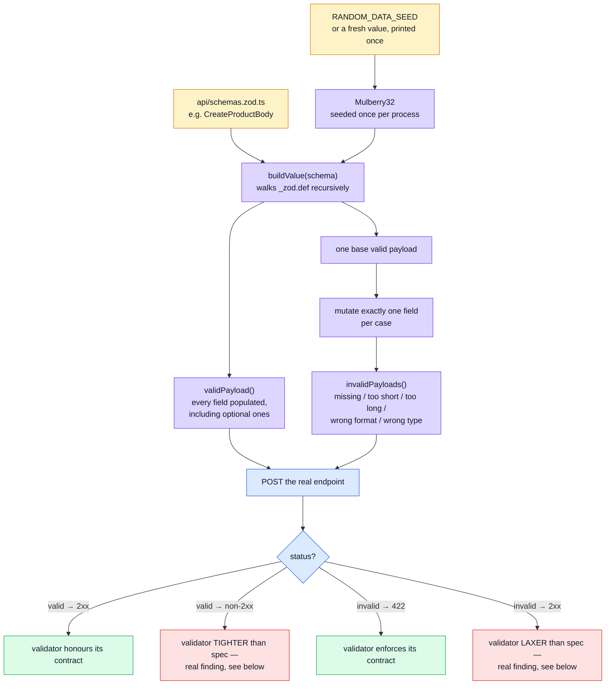

# Contract-Derived Request Data

[Contract Testing](./contract-testing.md) answers "does the _response_ match `openapi.yaml`?" This page is the mirror image, and structurally different rather than just "the same idea applied to requests": for every write endpoint, does the API accept every payload its own contract declares legal, and reject exactly what it declares illegal? Neither question can be answered by hand-written factories (`tests/support/factories/*`) — they encode one known-good scenario each. This layer generates data **from the contract itself**, so it can ask "for _any_ legal input", not "for this one".

## Tools

| Tool                                                                                              | Role                                                                                                                            |
| ------------------------------------------------------------------------------------------------- | ------------------------------------------------------------------------------------------------------------------------------- |
| `tests/support/contract-data.ts`                                                                  | An in-repo zod v4 AST walker — `validPayload(schema)` / `invalidPayloads(schema)`                                               |
| zod v4's `_zod.def`                                                                               | Zod's own typed, public introspection surface (not an implementation-detail hack) — see `node_modules/zod/v4/core/schemas.d.ts` |
| A hand-rolled Mulberry32 PRNG                                                                     | Deterministic, seeded, reproducible fixture values — see "Why not `@faker-js/faker`"                                            |
| [Jest](https://jestjs.io/) + [jest-openapi](https://github.com/openapi-library/OpenAPIValidators) | Same runner and response-shape matcher as [Contract Testing](./contract-testing.md)                                             |

## Why an in-repo walker instead of a library

`zod-fixture` and `@anatine/zod-mock` both exist for exactly this purpose. Both lag zod majors, and this project is on zod v4 — a dependency-version-lag risk not worth taking for what's really about 150 lines of schema-AST traversal. `_zod.def` is zod v4's own typed introspection surface, so the walker isn't reading private internals; it's reading the same shape zod itself exposes.

## Why not `@faker-js/faker`

Tried first, and worth documenting because the failure is instructive. `@faker-js/faker@10` ships **ESM-only**. This project's Jest setup (`ts-jest`, `module: "node16"`, no `transformIgnorePatterns` override — see [Unit Testing](./unit-testing.md)) can't load it:

```
SyntaxError: Cannot use import statement outside a module
    at tests/support/contract-data.ts:22:1
    import { faker } from '@faker-js/faker';
```

Fixing that means teaching Jest to transform an ESM dependency inside `node_modules` — a config change with a much larger blast radius than this file's actual requirement, which is only "deterministic, reproducible-by-seed values", not faker's realism. A ~10-line Mulberry32 generator has no such problem and pulls in zero new dependencies.

```ts
const createRandom = (seed: number) => {
    let state = seed >>> 0;
    return (): number => {
        state = (state + 0x6d2b79f5) >>> 0;
        let t = state;
        t = Math.imul(t ^ (t >>> 15), t | 1);
        t ^= t + Math.imul(t ^ (t >>> 7), t | 61);
        return ((t ^ (t >>> 14)) >>> 0) / 4294967296;
    };
};
```

## Architecture



## The two entry points

```ts
export const validPayload = <T>(schema: ZodTypeAny): T => {
    /* every field, valid */
};
export const invalidPayloads = (schema: ZodTypeAny): IInvalidPayloadCase[] => {
    /* one violation each */
};
```

`validPayload()` walks the schema and, for every zod node type it understands (`string`, `number`, `boolean`, `literal`, `enum`, `array`, `object`, `optional`/`nullable`/`default`, `record`, `union`), produces a value satisfying that node's own `checks` (`min_length`, `max_length`, `greater_than`, `less_than`, and the `email`/`url`/`datetime`/`uuid` string formats). Numbers are always generated as whole numbers — a deliberate choice: a schema field like `CreateOrderBody`'s `items[].quantity` is `zod.number().min(1)` with no explicit `.int()`, but `openapi.yaml` declares it `type: integer`; generating an integer satisfies both, a float would only satisfy the first.

`invalidPayloads()` builds one `validPayload()` result, then for every field produces one payload per constraint it can violate:

- a required field, **missing**
- a string shorter than its `min_length`, or longer than its `max_length`
- a string that isn't a valid email / URL where the schema declares that format
- a number below its minimum, or above its maximum
- an array with fewer than its minimum item count
- anything else: a wrong-typed value, as a fallback

Both are seeded once per process — not reseeded per call — from `RANDOM_DATA_SEED` or a fresh value, printed to the console the first time either function runs. Repeated calls in one test file draw different-but-reproducible values from the same seeded stream (so, e.g., two generated users get distinct emails), and a flaky-looking failure reproduces exactly by re-running with the printed `RANDOM_DATA_SEED=<n>`.

### Why `RANDOM_DATA_SEED` and not a name of its own

The paired frontend reads a variable of **exactly this name** to seed its own random-data generator (`tests/mocks/shared/mockProfilesRandom.ts` there, driving `npm run test:e2e:random`). One name across both repos buys something concrete: a seed printed by a failing nightly run on one side is a number the other side can reproduce.

The PRNGs stay separate — Mulberry32 here, faker's Mersenne Twister there — and given one seed the two produce entirely unrelated values. That is intended, not a defect to fix later. The two generators produce **opposite halves of the same contract** (requests here, responses there) from different schema surfaces (zod `_zod.def` here, orval factories there); making the streams agree would buy nothing and would couple two implementations that are independently correct. What the shared name buys is a shared vocabulary, not shared output.

## Endpoint-specific glue

The walker only knows what a zod schema can express. Two things it structurally can't:

- **Cross-field rules.** `SignupBody.passwordConfirm` has its own independent `.min(8)`, with no `.refine()` tying it to `password` — the "must match" rule lives in application code, not the schema. `request-contract.test.ts` patches `passwordConfirm = payload.password` after generating, skipping that patch only for the one test case where `passwordConfirm` itself is the field under test.
- **Referential validity.** `CreateOrderBody.userId` / `items[].productId` are opaque strings to the schema — nothing in `openapi.yaml` can say "must reference a real document". The test file creates a real product and a real user first and patches their ids in, again skipping the patch for whichever field a given `invalidPayloads()` case is actually testing (an earlier version of this file didn't skip correctly for `userId` and silently "fixed" every one of its own violation cases — worth knowing if you're extending this pattern to a new endpoint).

## Real findings, left as findings

Running this against the current API surfaced genuine, pre-existing drift between `openapi.yaml` and the hand-written validators layered on top of the generated schemas (`src/modules/users/validation.ts` and `src/modules/products/model.ts` extend `CreateUserBody`/`CreateProductBody` with additional rules). None are fixed by this test file — closing a spec/validator gap means either loosening the spec or tightening the validator (or, for the one 500, fixing a crash), and that's a call for whoever owns the endpoint, not something a test file should paper over by generating a "nicer" payload to dodge the finding.

| Endpoint / field                                                              | Spec says         | Validator actually does                                                                                                                                         |
| ----------------------------------------------------------------------------- | ----------------- | --------------------------------------------------------------------------------------------------------------------------------------------------------------- |
| `CreateUserRequest.username`, `CreateProductRequest.title`                    | no minimum length | hand-tightened to `.min(3)` / `.min(5)` — **tighter than the contract**                                                                                         |
| `CreateProductRequest`/`CreateUserRequest`/`SignupRequest` `.imageUrl`        | `format: uri`     | overridden to a plain `z.string()` (holds a relative upload path) — **laxer than the contract**                                                                 |
| `CreateProductRequest.price`                                                  | `minimum: 0`      | only `.refine()`d to be present — the non-negative constraint isn't checked at all                                                                              |
| `CreateProductRequest.active`/`categories`/`tags`, `CreateUserRequest.active` | boolean / array   | coerced (`!!request.body.active`, `coerceStringArray(...)`) **before** zod validation runs, so a wrong-typed value never reaches the check that would reject it |
| `POST /users` with a wrong-typed `admin`                                      | should be `422`   | returns **`500`** — malformed input crashing the request instead of being rejected cleanly                                                                      |

### A finding in the generator itself

Adding `default: true` to `active` on the create bodies broke two of these tests, and the defect was here rather than in the API. `isOptionalField` asked `defOf(schema).type === 'optional'`, but a field declared `default:` in `openapi.yaml` generates `zod.boolean().default(…)`, whose `_zod.def` type is `'default'`. So the walker called it required and `invalidPayloads()` emitted a "missing required field" case for it — asserting a 422 the API can never give, since omitting the field is the entire purpose of a default.

The check now accepts `'optional'` and `'default'`. It still rejects `'nullable'` on purpose: a nullable field must be present and may only hold `null`, so folding it in would silently delete real coverage.

Worth remembering when extending the walker: `unwrapField` had handled `'default'` correctly from the start. The two functions disagreed about what a wrapper meant, and nothing compared them — the bug only surfaced when a spec first used the feature.

## File map

| Path                                      | Contents                                                                                                                                                                                          |
| ----------------------------------------- | ------------------------------------------------------------------------------------------------------------------------------------------------------------------------------------------------- |
| `tests/support/contract-data.ts`          | The walker: `validPayload`, `invalidPayloads`, the PRNG, the zod introspection helpers                                                                                                            |
| `tests/contract/request-contract.test.ts` | One `describe` per write endpoint (`/users`, `/products`, `/orders`, `/cart`, `/feedback/contact`, `/account/signup`, `/account/login`); the endpoint-specific glue lives here, not in the walker |
| `api/schemas.zod.ts`                      | The generated `*Body` schemas this file walks                                                                                                                                                     |

## Commands

Runs as part of the contract suite — no separate script:

| Command                                      | Effect                                                |
| -------------------------------------------- | ----------------------------------------------------- |
| `npm run test:contract`                      | `jest tests/contract --runInBand`, includes this file |
| `RANDOM_DATA_SEED=<n> npm run test:contract` | Reproduce a specific run's generated data             |

Excluded from [Mutation Testing](./mutation-testing.md) the same way the rest of `tests/contract/` is — Stryker's `testPathIgnorePatterns` already covers the whole directory, so this file needed no extra configuration to stay out of the (unit-only) mutation run.

## Related pages

- [Contract Testing](./contract-testing.md) — the response-shape mirror of this page
- [Testing](./testing-and-docs.md) — suite overview
- [Unit Testing](./unit-testing.md) — the `tsconfig.jest.json` note this page's ESM finding builds on
- The paired frontend repo's `docs/tools/e2e-random-profile.md` (`boilerplate-vue-frontend`) — same idea (generate from the contract, not a fixed scenario), applied to responses instead of requests
