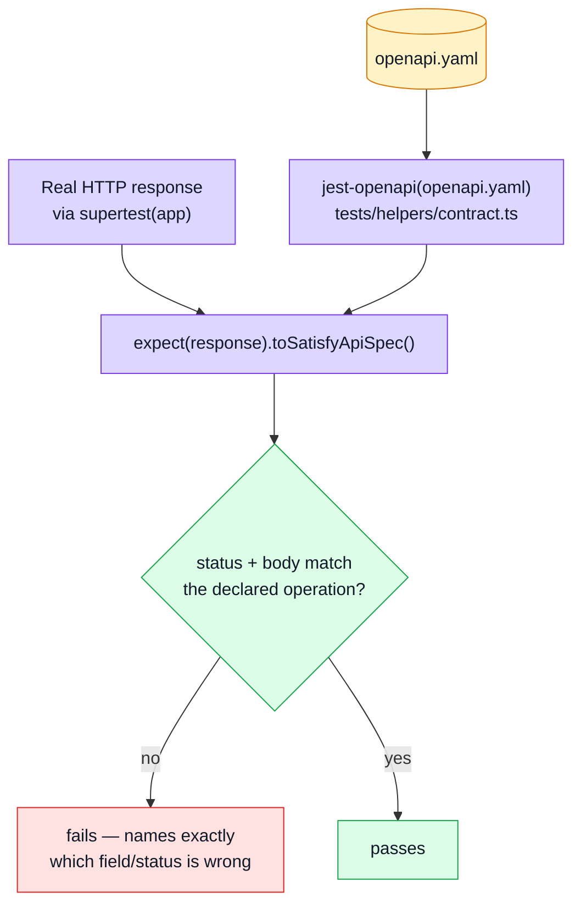

# Contract Testing (Response Shape)

The layer that answers: **does the wire response match `openapi.yaml`, exactly?** Not "does the business logic look right" (that's [Unit Testing](./unit-testing.md)) and not "is the right middleware mounted" (that's [Integration Testing](./integration-testing.md)) — specifically, does the _serialized JSON_ match the contract other services and the paired frontend are written against, including the fields that must **not** be there.

This is one half of "contract testing" in this codebase. The other half — does a _request_ the contract declares legal actually get accepted — is [Contract-Derived Request Data](./contract-request-data.md), a newer and structurally different layer. This page is about responses.

## Tools

| Tool                                                                 | Role                                                                                                                                                  |
| -------------------------------------------------------------------- | ----------------------------------------------------------------------------------------------------------------------------------------------------- |
| [jest-openapi](https://github.com/openapi-library/OpenAPIValidators) | Adds `expect(response).toSatisfyApiSpec()` — validates a real HTTP response against the operation `openapi.yaml` declares for that method+path+status |
| [supertest](https://github.com/ladjs/supertest)                      | Same HTTP harness as [Integration Testing](./integration-testing.md)                                                                                  |

## Why not Zod

`api/schemas.zod.ts` is generated from the same spec, and it's tempting to reach for `schema.parse(response.body)` instead of a second library. `tests/helpers/contract.ts` explains in detail why that doesn't work here:

1. **These schemas are generated non-strict.** They emit `zod.object`, whose default behaviour is to _strip_ unknown keys. `schema.parse(body)` on a response that leaks `password` passes — having silently deleted the evidence first. (Orval _can_ emit `zod.strictObject` via `override.zod.strict` — the frontend turns it on for its MSW mock layer, see that repo's `docs/tools/mocking.md` — so this is a configuration choice here, not a hard limitation of the tool.)
2. **More decisively: nothing on this side validates a _response_ with Zod at all.** The generated schemas are used for request bodies (see [Contract-Derived Request Data](./contract-request-data.md)). A response never meets them, strict or not.

So the entire over-serialization bug class — a `_id`/`__v` reaching a response, a `password`/`tokens` leak, a populated `product` object riding along on a cart line — is invisible without a tool that validates against the **spec document itself**. That's what `jest-openapi` does; Zod remains the right tool for field-level checks and for request payloads, just not for this.

## Architecture



## Patterns

Every file starts the same way — one import for the matcher, `setupTestDb()` for a real in-memory Mongo (most contract tests create real records through repositories or factories, then assert on what the route returns):

```ts
import '../helpers/contract';
import { setupTestDb } from '../helpers/setup-test-db';
import { api, authenticateAs } from '../helpers/http';

setupTestDb();

it('matches the contract for an admin caller', async () => {
    const { bearer } = await authenticateAs('admin');
    const response = await api().get('/users').set('Authorization', bearer);

    expect(response.status).toBe(200);
    expect(response).toSatisfyApiSpec();
});
```

Three recurring shapes across `tests/contract/*.test.ts`:

- **Role branches, both sides.** `orders.test.ts` asserts `GET /orders/{id}` for both an admin caller and a non-admin caller — the suite exists specifically because those two branches once returned _different shapes_ (the non-admin path aggregated computed totals in, the admin path did a plain `findById` and didn't), and nothing before this layer crossed HTTP to notice.
- **Credential-leak guards as explicit assertions, backed by the contract as the general case.** `users.test.ts` keeps a hand-written `assertNoCredentials()` (checks the serialized JSON for `password`, `tokens`, a bcrypt hash prefix) _and_ `toSatisfyApiSpec()`. The explicit check is a readable statement of intent; the contract check is what makes it general — `openapi.yaml`'s `User` schema declares `additionalProperties: false`, so _any_ undeclared field fails, not just the two named here.
- **Error shapes, not just success shapes.** Every file also drives the 401/403/404/422 branches through the real route and checks those against the spec too — a `ValidationErrorResponse` that drifts from what's declared is exactly as much a contract break as a success response would be.

## File map

| Path                                      | Contents                                                                                                     |
| ----------------------------------------- | ------------------------------------------------------------------------------------------------------------ |
| `tests/helpers/contract.ts`               | Registers `jest-openapi` against `openapi.yaml`; the "why not Zod" reasoning lives in this file's own header |
| `tests/contract/system.test.ts`           | `/`, `/observability/*`                                                                                      |
| `tests/contract/users.test.ts`            | `/users`, `/account` — the credential-leak guard                                                             |
| `tests/contract/products.test.ts`         | `/products`                                                                                                  |
| `tests/contract/orders.test.ts`           | `/orders` — the role-branch guard                                                                            |
| `tests/contract/cart.test.ts`             | `/cart`                                                                                                      |
| `tests/contract/feedback.test.ts`         | `/feedback`, `/feedback/contact` — the one genuinely public write endpoint                                   |
| `tests/contract/request-contract.test.ts` | The other half — see [Contract-Derived Request Data](./contract-request-data.md)                             |
| `tests/helpers/http.ts`                   | `api()`, `authenticateAs()` — shared with [Integration Testing](./integration-testing.md)                    |

## Commands

| Command                 | Effect                            |
| ----------------------- | --------------------------------- |
| `npm run test:contract` | `jest tests/contract --runInBand` |

## Related pages

- [Testing](./testing-and-docs.md) — suite overview
- [Contract-Derived Request Data](./contract-request-data.md) — the request-shape mirror of this page
- [Integration Testing](./integration-testing.md) — same HTTP harness, asserts wiring instead of shape
- [OpenAPI Workflow](../api/openapi-workflow.md)
