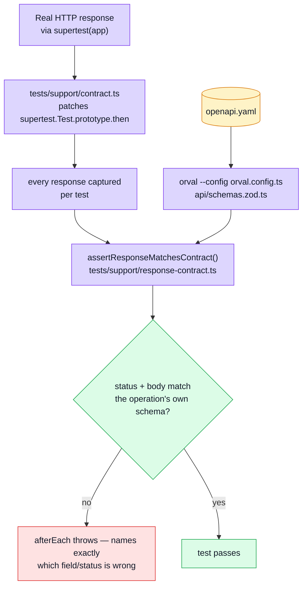

# Contract Testing (Response Shape)

The layer that answers: **does the wire response match `openapi.yaml`, exactly?** Not "does the business logic look right" (that's [Unit Testing](./unit-testing.md)) and not "is the right middleware mounted" (that's [Integration Testing](./integration-testing.md)) — specifically, does the _serialized JSON_ match the contract other services and the paired frontend are written against, including the fields that must **not** be there.

This is one half of "contract testing" in this codebase. The other half — does a _request_ the contract declares legal actually get accepted — is [Contract-Derived Request Data](./contract-request-data.md), a newer and structurally different layer. This page is about responses.

## Tools

| Tool                                            | Role                                                                                                                                                     |
| ----------------------------------------------- | -------------------------------------------------------------------------------------------------------------------------------------------------------- |
| [orval](https://orval.dev/)                     | Generates one strict, format-checking Zod schema per operation **and** documented status (`Login200Response`, `Login422Response`, …) from `openapi.yaml` |
| [supertest](https://github.com/ladjs/supertest) | Same HTTP harness as [Integration Testing](./integration-testing.md)                                                                                     |

## Why Zod works here

A plain `schema.parse(response.body)` would not be enough on its own: Zod's `zod.object` silently _strips_ unknown keys by default, so a leaked `password` would pass, evidence deleted. Two `orval.config.ts` settings make the generated schemas the actual judge instead:

- `strict.response` emits `zod.strictObject`, so an undeclared field fails instead of vanishing.
- `generateEachHttpStatus` emits one schema per DOCUMENTED STATUS, not just the success one, so a 401 or a 422 body is judged against its own declared shape too.

`tests/support/response-contract.ts` is the judge built on those schemas; the frontend judges its own responses the same way (`boilerplate-vue-frontend/src/infrastructure/http/validate.ts`).

## Architecture


```mermaid
%%{init: {'flowchart': {'nodeSpacing': 50, 'rankSpacing': 65}}}%%
flowchart TB
    Spec[("openapi.yaml")] --> Orval["orval --config orval.config.ts\napi/schemas.zod.ts"]
    Real["Real HTTP response\nvia supertest(app)"] --> Patch["tests/support/contract.ts\npatches supertest.Test.prototype.then"]
    Patch --> Capture["every response captured\nper test"]
    Capture --> Judge["assertResponseMatchesContract()\ntests/support/response-contract.ts"]
    Orval --> Judge
    Judge --> Check{"status + body match\nthe operation's own schema?"}
    Check -->|no| Fail["afterEach throws — names exactly\nwhich field/status is wrong"]
    Check -->|yes| Pass["test passes"]

    classDef spec fill:#fef3c7,stroke:#d97706,color:#111827;
    classDef test fill:#ddd6fe,stroke:#7c3aed,color:#111827;
    classDef check fill:#dcfce7,stroke:#16a34a,color:#111827;
    classDef fail fill:#fee2e2,stroke:#dc2626,color:#111827;
    class Spec spec;
    class Orval,Real,Patch,Capture,Judge test;
    class Check,Pass check;
    class Fail fail;
```

## Patterns

Every file starts the same way — one import for its side effect, `setupTestDb()` for a real in-memory Mongo (most contract tests create real records through repositories or factories, then assert on what the route returns). Nothing else is needed: EVERY response the test receives over `api()` is captured and judged automatically, in a shared `afterEach` — including a setup login or seed write nobody thought to assert on directly.

```ts
import '@tests/contract';
import { setupTestDb } from '@tests/setup-test-db';
import { api, authenticateAs } from '@tests/http';

setupTestDb();

it('matches the contract for an unrestricted caller', async () => {
    const { bearer } = await authenticateAs('admin');
    const response = await api().get('/users').set('Authorization', bearer);

    expect(response.status).toBe(200);
});
```

Two recurring shapes across the per-module `api.contract.test.ts` files:

- **Role branches, both sides.** `orders`' suite asserts `GET /orders/{id}` for both an unrestricted caller and a scoped one — the suite exists specifically because those two branches once returned _different shapes_ (the scoped path aggregated computed totals in, the unscoped path did a plain `findById` and didn't), and nothing before this layer crossed HTTP to notice. `authenticateAs('admin' | 'user')` covers those two; `authenticateAsRole('editor')` and friends drive any other preset role through the same HTTP surface.
- **Credential-leak guards as explicit assertions, backed by the contract as the general case.** `users`' suite keeps a hand-written `assertNoCredentials()` (checks the serialized JSON for `password`, `tokens`, a bcrypt hash prefix) alongside the automatic contract check. The explicit check is a readable statement of intent; the contract check is what makes it general — `openapi.yaml`'s `User` schema declares `additionalProperties: false`, so _any_ undeclared field fails, not just the two named here.

Every file also drives the 401/403/404/422 branches through the real route: the automatic check judges those against their OWN documented schema (`GetUsers401Response`, not the success one), so a `ValidationErrorResponse` that drifts from what's declared is exactly as much a contract break as a success response would be. A response that is a genuine, deliberate deviation — not a bug — opts out per call site with `excludeFromSpecCheck`, from `tests/support/contract.ts`.

## File map

**A module's contract suite is co-located with the module**, one file per domain, so it is deleted
along with it. Only the specs that belong to no domain stayed central.

| Path                                                     | Contents                                                                                                             |
| -------------------------------------------------------- | -------------------------------------------------------------------------------------------------------------------- |
| `tests/support/contract.ts`                              | Patches `supertest` to capture every response and judge it in one `afterEach`; `excludeFromSpecCheck` is the opt-out |
| `tests/support/response-contract.ts`                     | The judge itself: matches a response's method+path+status to its generated Zod schema and parses the body            |
| `src/modules/<name>/tests/contract/api.contract.test.ts` | One per routed module. Everything under that module's `basePath`                                                     |
| `src/modules/users/tests/contract/…`                     | `/users` — the credential-leak guard, `assertNoCredentials()`                                                        |
| `src/modules/orders/tests/contract/…`                    | `/orders` — the role-branch guard, unrestricted and scoped caller                                                    |
| `tests/contract/system.test.ts`                          | `/` — the one route that belongs to no module                                                                        |
| `tests/contract/route-spec-parity.test.ts`               | Every mounted route is in the spec, and every spec operation is mounted                                              |
| `tests/contract/request-contract.test.ts`                | The other half — see [Contract-Derived Request Data](./contract-request-data.md)                                     |
| `tests/support/http.ts`                                  | `api()`, `authenticateAs()` — shared with [Integration Testing](./integration-testing.md)                            |

## Commands

| Command                 | Effect                                                            |
| ----------------------- | ----------------------------------------------------------------- |
| `npm run test:contract` | `jest tests/contract 'src/modules/.*/tests/contract' --runInBand` |

## Related pages

- [Testing](./testing-and-docs.md) — suite overview
- [Contract-Derived Request Data](./contract-request-data.md) — the request-shape mirror of this page
- [Integration Testing](./integration-testing.md) — same HTTP harness, asserts wiring instead of shape
- [OpenAPI Workflow](../api/openapi-workflow.md)
