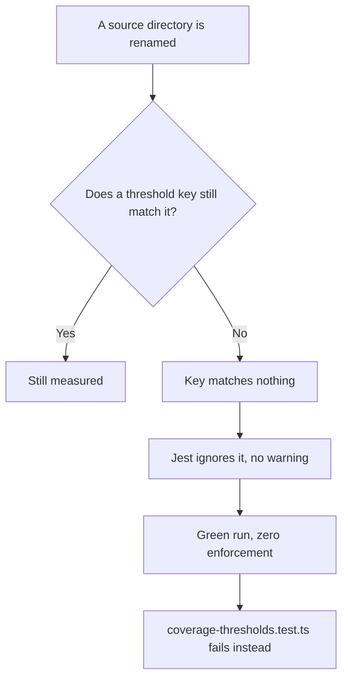

# Coverage & Confidence

**Which number tells you the test suite is good, and which numbers only look like they do.**

Four things in this repository measure the tests rather than the code. They overlap, they disagree,
and the overlaps are not all redundancy — some of them are the point. This page is the map.

::: tip The one-line version
**Mutation testing is the instrument. Coverage is the smoke alarm. Pass rate is not negotiable.**
:::

---

## 1. The three numbers, ranked

| Number             | The question                                 | If it is low                                  |
| ------------------ | -------------------------------------------- | --------------------------------------------- |
| **Pass rate**      | did every assertion hold                     | something is **broken**. Fix it now.          |
| **Mutation score** | would a test **notice** if this code changed | the suite is **weak here**. The real verdict. |
| **Coverage**       | did this line **execute** during that run    | that run did not **reach** this code.         |

Pass rate is absolute and has no threshold. One failing test is a red build. Nothing below softens
that, and no percentage anywhere in this repo applies to it.

The other two rank, and the ranking is not a matter of taste.

### Why mutation testing outranks coverage

Coverage asks whether a line ran. That is a low bar, and it is trivially gamed without meaning to:

```ts
// 100% coverage. Zero assertions about the result.
it('does not explode', () => {
    expect(() => calculateTotal(order)).not.toThrow();
});
```

Every line of `calculateTotal` executes. Coverage says 100%. Change `+` to `-` inside it and this
test still passes — so the test was never testing the arithmetic.

Mutation testing asks the question that matters. Stryker rewrites the code — flips a comparison,
drops a call, changes a boundary, returns an empty array — reruns the tests, and checks that
**something goes red**. A mutant that survives is a change nobody would have caught.

The relationship is one-directional, and that is what makes the ranking real:

> **An uncovered line cannot kill a mutant.** So every coverage gap already appears as surviving
> mutants — while a covered line with no real assertion appears only in the mutation score.

**Mutation score subsumes coverage.** Where the two disagree, the mutation score is right.

---

## 2. So why keep coverage at all?

Because of latency, not information.

|                              | Runtime                                          | Runs on            |
| ---------------------------- | ------------------------------------------------ | ------------------ |
| `npm run test:unit:coverage` | seconds                                          | every push         |
| `npm run mutation`           | minutes — the files a branch changed             | every pull request |
| `npm run mutation:full`      | far longer — it reruns the suite once per mutant | weekly, sharded    |

Coverage is the **smoke alarm**: cheap, fast, and it tells you something changed shape. Mutation
testing is the **inspection**: slow, thorough, authoritative.

That is not redundancy. Two instruments answering one question at different costs is a normal and
correct arrangement — the mistake would be reading the fast one as the verdict.

**What this means in practice:** the coverage floors in `jest.config.js` are a **ratchet**
("do not get worse"), never a target, and never evidence that code is well tested. Read them as
nothing more than a tripwire between mutation runs.

---

## 3. Redundancy, and things that only look like it

The interesting cases are the ones people delete by mistake.

### Genuinely redundant

- **A coverage floor on a file whose mutation score is enforced.** Same question, weaker
  instrument. The floor adds nothing the mutation score does not already say.
- **A test asserting a line runs**, where another test asserts what it produces.

### Looks redundant, is not

- **Integration tests vs unit tests over the same service.** They fail differently. A unit test
  says the calculation is wrong; an integration test says the calculation is right and the router
  never calls it. Deleting either loses a distinct failure.
- **`tests/contract/` vs `tests/integration/`.** Both drive real HTTP. Contract checks the response
  against `openapi.yaml` — a shape the app can get wrong while behaving correctly, and which a
  second repository consumes.
- **`tests/fuzz/` vs everything.** Generated hostile input against the spec. It asks what happens
  on inputs nobody thought to write down, which is by definition not covered by the tests someone
  wrote.
- **ESLint vs dependency-cruiser.** ESLint sees one file's imports; dependency-cruiser sees the
  graph. "May not import" and "may not REACH, through any number of hops" are different rules, and
  the second is the one that catches a domain file reaching storage through a helper.

### The rule

> Two checks are redundant when one **subsumes** the other — when passing the stronger one makes
> failing the weaker one impossible. If they can disagree, they are measuring different things and
> both earn their place.

Mutation score subsumes coverage. Integration does not subsume unit; contract does not subsume
integration.

---

## 4. Mutation testing is the primary instrument here

This is a decision, recorded so it is not re-litigated by accident.

`npm run mutation` / `npm run mutation:full` and their per-file scores in `mutation-baseline.json`
are **the** judgement of whether this suite is any good. Everything else is either a faster proxy
for it (coverage) or a different question entirely (contract, fuzz, cluster).

Consequences worth stating:

- **Do not chase a coverage number.** Raising coverage without raising the mutation score means
  writing tests that execute code without asserting anything about it, which is worse than nothing —
  it buys a green number and hides the gap.
- **A surviving mutant is a real finding**, even at 100% coverage. It is usually a missing
  assertion, occasionally a mutant that cannot be killed because the code has no observable effect —
  in which case the code, not the test, is the thing to look at.
- **The baseline is a ratchet**, like the coverage floors: `check-baseline.ts` compares
  each file against its recorded score with a 1-point tolerance, so the gate is "do not get worse"
  rather than an absolute grade.

### The `high` / `low` / `break` thresholds

`stryker.json` carries `high: 80`, `low: 60`, `break: null`. `high`/`low` only colour the report —
`break` is deliberately unset, because a single global percentage over the whole scope hides exactly
the file that matters (see [The per-file ratchet](./mutation-testing.md#the-per-file-ratchet)). The
ratchet in `mutation-baseline.json` is the real gate. Either way, none of these numbers are
**comparable to a coverage percentage** — killing 80% of mutants is a far stronger statement than
executing 80% of lines.

---

## 5. ⚠️ The blind spot that used to exist, and why closing it took a memory fix first

::: warning Historical: mutation testing used to exclude the service layer entirely
Until 2026-09-20 `stryker.config.json` mutated `src/modules/*/**/*.ts` — controllers, services, <!-- doc-paths:ignore -->
repositories, models — while excluding `tests/integration/`, `tests/contract/` and their co-located
equivalents from the tests it ran. **It mutated code whose killing tests it never executed.** Those
mutants were reported `NoCoverage`, which scores as 0%, and 153 of 254 files in that ruler's
baseline sat at 0% for that reason rather than because the tests were weak.

**One ruler now.** `stryker.json` is the only config, and it always loads `tests/integration/` — see
[one ruler](./mutation-testing.md#one-ruler). More tests running can only kill more mutants, never
fewer, so this closes the blind spot rather than trading it for a different one. The price is
real: every mutation run now starts a real Mongo, so the per-mutant cost is higher — which is why
the full sweep is sharded and weekly rather than an unsharded nightly (below, and
[The three commands](./mutation-testing.md#the-three-commands)).

**The exclusion was a memory-leak workaround, not an oversight**, and understanding why it existed
still matters — the leak it worked around had to be fixed BEFORE the ruler could be merged. Loading
the integration suites into a mutation run used to trigger an unbounded memory leak. Measured on
`delivery/service.ts` (54 mutants), 2026-08-29:

| Configuration                            | Score     | Time | OOM restarts |
| ---------------------------------------- | --------- | ---- | ------------ |
| unit suites only (the old default)       | 0.0%      | 5s   | 0            |
| + integration & contract                 | **64.8%** | 812s | **23**       |
| + integration & contract, `ignoreStatic` | 62.0%     | 582s | **46**       |

The middle row is the prize: 50 of those 54 mutants go from `NoCoverage` to tested, and 35 die. The
third row is the diagnosis — ignoring static mutants made the run _faster_ and the OOMs _twice as
frequent_, because static mutants were forcing the process restarts that had been incidentally
flushing the leak. It is why `ignoreStatic` stays off permanently — see
[the measured ratio](./mutation-testing.md#static-mutants-open-question).

**The leak is `bson`, not the database and not the machine.** `node_modules/bson/lib/bson.cjs`
allocates a 17 MiB scratch buffer at module scope, on every evaluation. Jest gives each test FILE a
fresh module registry, so every file reaching mongoose pays 17 MiB again — roughly ten copies per
mutant, accumulating in a worker Stryker never exits. A normal `npm test` never notices, because its
workers exit and return the memory.

**Why a bigger machine does not help.** `--max-old-space-size` bounds V8's old space, and
`ArrayBuffer` backing stores live outside it: V8 sees a comfortable heap, feels no pressure to
collect, and RSS grows regardless — a worker capped at 1400 MB was measured at 6.6 GB. More RAM buys
more mutants before the crash, never a finished run. A cap is the wrong lever against _this_ leak —
it is the right one against V8's flat ~4.2 GB default ceiling, a different failure with the same
label ([the heap cap](./mutation-testing.md#worker-heap-cap)). `scripts/mutation/stryker-run.ts`
aborts a run that OOMs more than six times in ten minutes as one that will not converge.

**This is now fixed, and the fix was one setting.** `stryker.json` sets `maxTestRunnerReuse: 1`,
restarting the test runner after every mutant so the copies cannot accumulate. Measured on the same
file: **0 OOM restarts, 406s instead of 812s, identical 64.81% score.** The restart costs less than
the crash-and-retry it replaces. That fix is what made merging the two rulers into one viable at
all — [one ruler](./mutation-testing.md#one-ruler) is how it is scheduled now.

The full investigation, including the three measurements that disproved the database hypothesis, is
in [Mutation Testing → the OOM strand loop](./mutation-testing.md).
:::

::: warning Which number to read
There is one baseline now, `mutation-baseline.json`, and every score in it comes from the ruler that
runs `tests/integration/` too — so a 0% on a controller, service or repository is a real finding,
not an artefact of the ruler that used to skip those suites. The pending reseed
([one ruler](./mutation-testing.md#one-ruler)) is what makes the numbers currently on disk
comparable to that statement — until it runs, treat the committed file as stale.
:::

## 6. Where each number is currently trustworthy

Honesty about instruments in use matters more than the instruments.

**Coverage.** `test:unit:coverage` runs `tests/unit`, `tests/cross-cutting` and each module's own
`tests/unit` — not the integration or contract suites. So a service covered entirely by integration
specs reads near zero, and that is a fact about the RUN, not about the code. The floors were
re-fitted to what that run actually measures on 2026-08-29; [How the floors are
written](#how-the-floors-are-written) explains what they do and do not buy.

**Mutation.** `stryker.json` mutates `src/modules/*/**/*.ts` and runs the integration suites that
reach the service and repository layers, so it no longer shares coverage's blind spot there —
though a file can still read 100% line coverage and a low mutation score, which is a different
finding: the lines run, nothing asserts on what they did. See
[Mutation Testing](./mutation-testing.md) for the current shape.

**A single combined coverage run was tried and abandoned.** Every suite under one instrumented
process dies on a V8 fatal assertion with the fuzz suite, and on
`FATAL ERROR: JavaScript heap out of memory` (~4 GB, ~8 minutes) without it. It would need an
enlarged heap or per-suite runs with merged reports: real machinery, for the weaker instrument,
answering a question mutation testing answers better. Recorded so nobody spends the afternoon again.

## 7. How the floors are written {#how-the-floors-are-written}

`coverageThreshold` in `jest.config.js` is a map of key → minima. How a key is SHAPED decides what
it measures, and the two shapes fail differently:

- A key naming a **directory** (`src/modules/`) pools every file beneath it into ONE total. Four
  files at 0% hide behind six at 95%, and the gate stays green.
- A key that is a **glob** (a wildcard segment, or a recursive `.ts` wildcard) is applied to each
  matching file separately, and Jest prints one failure per file, naming it.

Only the second is a gate. Under the pooled form this repo passed a 70% floor on `src/middlewares/` <!-- doc-paths:ignore -->
while `auth-jwt.ts`, `locale.ts` and `metrics-scraper.ts` each sat at 0% — and `metrics-scraper.ts` <!-- doc-paths:ignore -->
holds `isMetricsScraper`, the credential check on the Prometheus endpoint.

### The three tiers a floor takes

`jest.config.js` builds every entry through one helper rather than repeating four numbers:

| Written as       | Means                                                                      |
| ---------------- | -------------------------------------------------------------------------- |
| `STANDARD`       | 70/70/70 — a file with its own unit suite                                  |
| `PARTIAL`        | 25/70/0 — integration- and contract-covered; the unit layer only grazes it |
| `UNTESTED`       | 0/0/0 — nothing drives it at all                                           |
| `floor(s, b, f)` | a measured value, for the keys that fit no tier                            |

`floor` takes `lines` as a fourth parameter defaulting to `statements`, because `coverageProvider:
'v8'` derives both from the same range data — every floor in the repo measures identical on the two.
The parameter stays overridable rather than hard-coded, since another provider would let them
diverge.

Raising a tier raises every key using it at once, which is the point of it being one value. A bare
`floor(...)` call is a per-key record and moves on its own.

**`PARTIAL` is the honest name for the blind spot** in section 5. A repository or service floored at
`functions: 0` is not untested — the unit suite simply calls none of its exports, because the suites
that do are excluded from this run. Branches stay floored at 70 because the unit suite does reach
the guard clauses. Read a `PARTIAL` key as "the unit layer did not get worse", never as a grade.

::: warning A tier is a claim that decays
Floors are measured records, and code improves after they are written. `pdf.ts` and `stream.ts` sat
at `0/0/0` while both had reached 100/100/100 — the label had been false for weeks, because nothing
re-fits a floor automatically and these thresholds are not in the commit gate (see the note under
[§2](#_2-so-why-keep-coverage-at-all)). When a negated exemption's file climbs back above its tier,
delete the negation: `adapters/!(pdf|mailer).ts` and
`observability/!(stream|metrics-http|tracer).ts` both collapsed into plain globs that way.
:::

### The drift trap

**A threshold key matching no file is silently ignored.** It does not warn, it does not fail — it
reads like a gate and enforces nothing. Every rename of a source directory has to re-check these
keys, because the failure mode is a green run rather than an error.
`tests/cross-cutting/coverage-thresholds.test.ts` exists to turn the next such rename red.



### The exemption mechanism

One file below the rest is exempted in TWO parts, and both are required:

1. Negate it out of the glob with an extglob — `src/infrastructure/adapters/!(pdf|mailer).ts`.
2. Give it its own key at its measured value.

It cannot simply get a lower key alongside the glob. **Jest adds a file to EVERY matching group**
rather than picking the most specific, so both checks run and the stricter one still fails it. An
exemption has to leave the glob to be an exemption.

Barrels are excluded the same way (`domain/!(index).ts`). A pure re-export file's `functions`
metric counts the re-export arrows, "covered" only if something imported the barrel during the run
— that measures wiring, not testing, and four `domain/index.ts` files dragged one key's `functions`
floor from 100 to 0 while every file with logic in it measured 100.

### What `functions: 0` means, which is nothing

Ten of twelve `repository.ts`, eight of nine `service.ts` and twelve of seventeen `services/*.ts`
files report 0% functions on this run. That is not a set of outliers to carve out — carving out ten
of twelve leaves a rule with two members — it is the key saying it does not apply to this suite.
Those keys still floor `statements`, `branches` and `lines`; the `functions` entry is a formality.

### Controllers are deliberately unfloored

They report ~0% on the unit run because `tests/contract/` and `tests/integration/` cover them,
driving the real app over HTTP — a legitimate choice for handlers this thin. A floor here would
measure the wrong suite, and the only way to satisfy it would be unit tests duplicating the
contract suite less well. If they ever need a floor, it belongs on a coverage run that includes
those suites.

### Read them as a ratchet

The floors are a record of where the code IS, not a target: a drop fails the build, an improvement
should be ratcheted up. Several are low, for the reason the controller note gives spread wider —
this run is `tests/unit` + `tests/cross-cutting` + each module's own `tests/unit`, and excludes
integration and contract. Two ways out, both decisions rather than chores:

1. Add a second coverage run including the integration and contract suites, and put the real floors
   there. That is the run these numbers are asking for.
2. Leave it, and read the job as "the unit layer did not get worse", which is what it honestly is.

A file matched by no key is UNMEASURED, not zero.

---

## Related pages

- [Mutation Testing](./mutation-testing.md) — the run, the baseline ratchet, the OOM history
- [Unit Testing](./unit-testing.md) · [Integration Testing](./integration-testing.md) ·
  [Contract Testing](./contract-testing.md) · [Fuzz Testing](./fuzz-testing.md)
- [Tests](../reference/tests.md) — every suite, file by file
