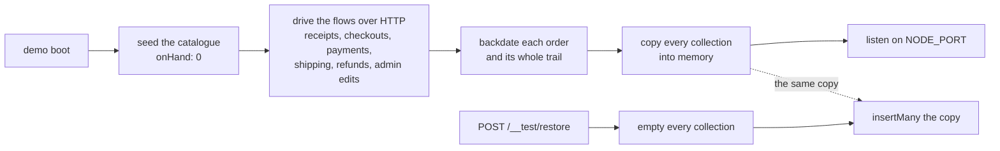

# The demo profile

The real API, booted self-contained and disposable:

```sh
npm run demo               # :3000 — in-memory Mongo, seeded, cache/queue disabled
NODE_PORT=3101 npm run demo   # several run side by side; each owns its own database
```

One process, no Docker: `scenarios/run-server.ts` starts a `mongodb-memory-server` (the same dependency the test suite already uses), points `NODE_DB_URI` at it, force-disables Redis and RabbitMQ — a supported deployment shape that `/observability/health` reports as `disabled` rather than as an error — raises the rate limits to the test allowance, and boots `src/app.ts` exactly as any other profile would. Kill the process and nothing survives it.

The shop it serves is not a set of rows somebody wrote. It is [built by using the application](#how-a-scenario-is-built) — the catalogue is seeded, and then the orders, payments, shipments, refunds and audit entries are produced by driving the real endpoints at boot.

## Who it is for

**The paired frontend, mostly.** `boilerplate-vue-frontend`'s dev server and its default e2e suite run against this profile instead of a hand-written mock of this API — its shard runner boots one instance per shard (ports 3101+), so four Cypress processes each own a private universe. That is the deal the two repos struck when the frontend retired its MSW layer: one implementation of the behaviour, served by the code that owns it, with determinism coming from the seeds rather than from an imitation. See the frontend's `docs/tools/demo-profile.md` for its half of the story, and [Testing & Docs](./testing-and-docs.md) for what the pairing catches.

It is also the lightest way for a human to get a working API for anything — a quick curl, a schema check, a demo on a machine with nothing but Node.

## The control surface

`npm run demo` calls `enableDemoProfile()` in-process, before `src/app.ts` is even imported — the only call site, so no environment variable can switch this on. It additionally mounts three routes, before the 404 catch-all and inert in every other profile:

| Route                  | What it does                                                                                                                                                                                                                                                                                                                                                                                  |
| ---------------------- | --------------------------------------------------------------------------------------------------------------------------------------------------------------------------------------------------------------------------------------------------------------------------------------------------------------------------------------------------------------------------------------------- |
| `POST /__test/restore` | Empty every collection and put a named scenario back — `{ "scenario": "shop" }` (the default, the furnished shop) or `{ "scenario": "blank" }` (roles, the four named accounts and locales only) — then clear the outbox, refresh the locale overlay and flush the cache. A REPLAY of the copy this process built at boot, not a rebuild: roughly 10 ms, fast enough to run once per e2e spec |
| `GET /__test/scenario` | What is currently restored: the name, every seed account's login, and `subjects` — one row id per guarantee name (`order.paid`, `product.outOfStock`, …). The only way to address a specific order, since order ids are minted at boot rather than pinned                                                                                                                                     |
| `GET /__test/emails`   | The emails the app "sent" since the last restore. In demo mode the mailer (`src/infrastructure/adapters/mailer.ts`) records to an in-memory outbox (`demo-outbox.ts`) instead of talking to SMTP, with the reset/verify token lifted out of the link — a password-reset spec is the token in the email, or it is nothing                                                                      |

The routes are unauthenticated on purpose: the profile only ever binds beside an in-memory database that `npm run demo` created seconds earlier. There is nothing to protect and no deployment that mounts them — `enableDemoProfile()` is called nowhere but `scenarios/run-server.ts`.

## The two seed accounts

Their ids and credentials live in `scenarios/accounts.ts` — outside `src/` entirely, like every
other scenario file, even though `users` owns the record.

Several scenario files need a piece of them: `users` seeds the accounts, `account` seeds the address
book an order ships to, `wishlist` seeds a row belonging to a person, and `flows/shop-history.ts`
signs each of them in. Reaching into `@modules/users` for that would buy a `src/`-crossing import
for six string literals that are pure data. Repeating the ids in each of those files is worse in
the other direction: a drift is a dangling reference nothing catches until a demo renders an empty
page.

Note what is deliberately **not** shared: the account records. A sibling gets the handle it needs to
name a person without taking on the shape of a user.

::: warning Two things not to change
**The credentials must stay fixed.** `cy.loginAs()` in the paired frontend types them into a real
login form. Everything else about the dataset can move; these are the part a human reads off a
page and types. The passwords are overridable via `NODE_SEED_ADMIN_PASSWORD`/
`NODE_SEED_USER_PASSWORD` — change both `.env` files together, never one alone.

**The password is stored plaintext on purpose.** `userSchema`'s pre-save hook hashes it on the way
in, so a hash written there would drift from that hook and lose its plaintext. It never reaches a
response — `password` is `select: false` and the user transform omits it — which is why
`scenarios/subjects.ts` and `@scenarios/accounts` state these credentials as literals rather than
reading them back off a serialized user.
:::

## How a scenario is built

A scenario has two halves. The rows a shop starts with are SEEDED — the catalogue, the languages,
the accounts, the address book. Everything a shop ACCUMULATES is produced by using it: the flow
runner signs each account in and drives the real endpoints, so every order carries the payment,
stock movements, reservation, shipment and audit entries the application itself wrote.



Why once, and why a copy:

- **A flow is not idempotent.** Checking out twice makes two orders. Running the flows per restore
  would grow the shop every time a spec started.
- **A restore has to be cheap.** Replaying rows skips the fourteen bcrypt cost-12 hashes a reseed
  pays for and the three hundred requests the flows make. A `shop` restore is around 10 ms.
- **The flows need a listening app.** They get a throwaway loopback listener of their own
  (`scenarios/flows/loopback.ts`), opened before `NODE_PORT` is bound and closed after — so the
  readiness probe never sees a shop halfway through its own history.

The same `buildScenario` runs behind `npm run scenario:apply` against a real database, which boots
the application in-process for exactly this reason. It refuses a database that already holds
anything unless `--reset` is given: seeding on top of a shop that already has a past would give it
a second one.

### Row ids are not literals

Products, languages and accounts keep pinned ids — `scenarios/subjects.ts` is the one place they
are written. Orders, payments and shipments do not: they are minted when the flows run. Ask
`GET /__test/scenario` for them by guarantee name, or chain a list request. Each module declares
the names it promises in its own `module.ts` (`AppModule.scenario`), and
`tests/integration/scenarios/shop.test.ts` builds the whole scenario for real and holds the two
lists equal in both directions.

## What it deliberately is not

- **Not the full stack.** Cache and queue run `disabled`, so invalidation behaviour and the queue-backed email/PDF paths are not exercised. That is the live profile's job — the frontend's `test:e2e:live` against `compose:restart`, which its CI requires on every PR.
- **Not persistent.** `scenario:apply` against the compose stack is the path that survives a restart; this one is a fresh world per process, which is precisely what makes it a test fixture. A live backend never mounts `/__test/*` at all — `scenario:apply --describe-to=<file>` writes the same JSON `GET /__test/scenario` serves, which is how the frontend's live e2e profile learns the same ids.
- **Not a mock.** Nothing here imitates anything: same routes, same validators, same serializers, same visibility rules as production. When a demo-profile answer surprises you, believe it — that is the API.
