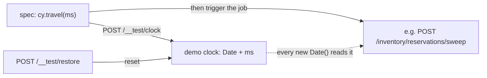
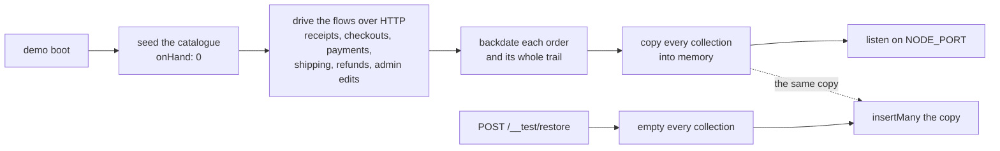

# The demo profile

The real API, booted self-contained and disposable:

```sh
npm run demo               # :3000 — in-memory Mongo, seeded, cache/queue disabled
NODE_PORT=3101 npm run demo   # several run side by side; each owns its own database
NODE_TEST_MONGO_URI=mongodb://127.0.0.1:27017 npm run demo   # a compose Mongo instead; persists
```

One process, no Docker by default: `scenarios/run-server.ts` resolves a Mongo through `startEphemeralMongo()` — the same resolver the test suites use — points `NODE_DB_URI` at the `demo` database on it, force-disables Redis and RabbitMQ — a supported deployment shape that `/observability/health` reports as `disabled` rather than as an error — raises the rate limits to the test allowance, and calls `createApp().start()` exactly as any other profile's `src/serve.ts` would. Unset `NODE_TEST_MONGO_URI`, kill the process, and nothing survives it; set it, and the shop is still there on the next boot.

The shop it serves is not a set of rows somebody wrote. It is [built by using the application](#how-a-scenario-is-built) — the catalogue is seeded, and then the orders, payments, shipments, refunds and audit entries are produced by driving the real endpoints at boot.

## Who it is for

**The paired frontend, mostly.** `boilerplate-vue-frontend`'s dev server and its default e2e suite run against this profile instead of a hand-written mock of this API — its shard runner boots one instance per shard (ports 3101+), so four Cypress processes each own a private universe. That is the deal the two repos struck when the frontend retired its MSW layer: one implementation of the behaviour, served by the code that owns it, with determinism coming from the seeds rather than from an imitation. See the frontend's `docs/tools/demo-profile.md` for its half of the story, and [Testing & Docs](./testing-and-docs.md) for what the pairing catches.

It is also the lightest way for a human to get a working API for anything — a quick curl, a schema check, a demo on a machine with nothing but Node.

## The control surface

`npm run demo` calls `enableDemoProfile()` in-process, before `src/app.ts` is even imported — the only call site, so no environment variable can switch this on. It additionally mounts six routes, before the 404 catch-all and inert in every other profile:

| Route                     | What it does                                                                                                                                                                                                                                                                                                                                                                                  |
| ------------------------- | --------------------------------------------------------------------------------------------------------------------------------------------------------------------------------------------------------------------------------------------------------------------------------------------------------------------------------------------------------------------------------------------- |
| `POST /__test/restore`    | Empty every collection and put a named scenario back — `{ "scenario": "shop" }` (the default, the furnished shop) or `{ "scenario": "blank" }` (roles, the four named accounts and locales only) — then clear the outbox, refresh the locale overlay and flush the cache. A REPLAY of the copy this process built at boot, not a rebuild: roughly 10 ms, fast enough to run once per e2e spec |
| `GET /__test/scenario`    | What is currently restored: the name, every seed account's login, and `subjects` — one row id per guarantee name (`order.paid`, `product.outOfStock`, …). The only way to address a specific order, since order ids are minted at boot rather than pinned                                                                                                                                     |
| `GET /__test/clock`       | The demo clock: `{ now, offsetMs }` — what `Date.now()` answers, and how far it is ahead of real time                                                                                                                                                                                                                                                                                         |
| `POST /__test/clock`      | Move the clock FORWARD: `{ "advanceMs": 3600000 }`. Never back (a negative or non-numeric value is a 400). Moves nothing else: a job that should react is triggered through its own door — the reservation sweep is `POST /inventory/reservations/sweep`. A restore puts it back to real time. Jumps beyond the refresh-token lifetime end the session, so log in again                       |
| `POST /__test/jobs/:name` | Run one background job now, through the same service function its `scripts/ops/` script calls. `reap-orders` scrubs the PII of orders past their retention window and answers `{ job, result }` (how many it scrubbed); any other name is a 404. Move the clock first, then run the job                                                                                                       |
| `GET /__test/emails`      | The emails the app "sent" since the last restore. In demo mode the mailer (`src/infrastructure/adapters/mailer.ts`) records to an in-memory outbox (`demo-outbox.ts`) instead of talking to SMTP, with the reset/verify token lifted out of the link — a password-reset spec is the token in the email, or it is nothing                                                                      |

The routes are unauthenticated on purpose: the profile only ever binds beside an in-memory database that `npm run demo` created seconds earlier. There is nothing to protect and no deployment that mounts them — `enableDemoProfile()` is called nowhere but `scenarios/run-server.ts`.

Two values the paired e2e suite needs from the demo backend, both set in `scenarios/run-server.ts` or by whoever boots it:

| Variable                      | Demo value                                        | Why                                                                                                                                       |
| ----------------------------- | ------------------------------------------------- | ----------------------------------------------------------------------------------------------------------------------------------------- |
| `NODE_PAYMENT_WEBHOOK_SECRET` | `demo-payment-webhook-secret` (filled when blank) | Known, so a spec can sign a payment-provider delivery for `POST /payments/webhook`                                                        |
| `NODE_WEBHOOK_DEMO_SINK_URL`  | unset; the frontend's runner sets it              | Seeds the demo subscription at that URL (`scenarios/webhooks.ts`). The suite hosts the receiver itself, so a replay has somewhere to land |

Not mounted at all when `enableDemoProfile()` was never called — every route 404s, same as a path
that does not exist.

### Bodies and status codes

`POST /__test/restore`:

```
→ { "scenario": "shop" }        // or omit the body entirely for the same default
← 204, no body

→ { "scenario": "not-a-real-name" }
← 400 { "success": false, "message": "unknown scenario: \"not-a-real-name\"" }

→ { "scenario": 42 }            // not even a string
← 400 { "success": false, "message": "unknown scenario: 42" }
```

A build failure mid-restore answers `500 { "success": false }` with the real cause only in the
server log, never the response — the same reasoning as every other unhandled failure this API
answers.

`GET /__test/scenario`:

```
← 200
{
  "scenario": "shop",
  "accounts": {
    "admin": { "email": "root@root.it", "password": "Demo-Admin1!" },
    "user": { "email": "customer@example.com", "password": "Demo-User1!" },
    "editor": { "...": "..." },
    "moderator": { "...": "..." }
  },
  "subjects": { "order.paid": "<minted id>", "product.outOfStock": "<minted id>", "...": "..." }
}
```

`GET /__test/emails`:

```
← 200 { "emails": [] }                          // nothing sent since the last restore
← 200 { "emails": [{ "to": "...", "subject": "...", "...": "..." }] }
```

### The clock

`Date` alone is faked (`@sinonjs/fake-timers`, `toFake: ['Date']`, `shouldAdvanceTime`), installed by
`scenarios/run-server.ts` before the app loads. Timers, the Mongo driver's heartbeats and
`performance` stay real, so nothing freezes. The `src/` side only knows the `DemoClock` interface
(`src/infrastructure/runtime/demo-clock.ts`); the package is a dev dependency and a production image
never loads it. Why not short env windows: they cannot reach the 21-day withdrawal minimum or the
constants that are hard-coded, and they are process-wide.


```mermaid
flowchart LR
    Spec["spec: cy.travel(ms)"] -->|"POST /__test/clock"| Clock["demo clock: Date + ms"]
    Spec -->|"then trigger the job"| Job["e.g. POST /inventory/reservations/sweep"]
    Clock -. "every new Date() reads it" .-> Job
    Restore["POST /__test/restore"] -->|"reset"| Clock
```

## The named accounts

Their ids and credentials live in `scenarios/accounts.ts` — outside `src/` entirely, like every
other scenario file, even though `users` owns the record. Four of them, one per tenant role worth
trying on its own: `admin` (who is also the platform operator — `root@root.it`), `user` (the
ordinary customer — `customer@example.com`), `editor` (`editor@example.com`) and `moderator`
(`moderator@example.com`).

Several scenario files need a piece of them: `users` seeds the accounts, `account` seeds the address
book an order ships to, `wishlist` seeds a row belonging to a person, and `flows/shop-history.ts`
signs each of them in. Reaching into `@modules/users` for that would buy a `src/`-crossing import
for what is otherwise pure data. Repeating the ids in each of those files is worse in the other
direction: a drift is a dangling reference nothing catches until a demo renders an empty page.

Note what is deliberately **not** shared: the account records. A sibling gets the handle it needs to
name a person without taking on the shape of a user.

::: warning Two things not to change
**The credentials must stay fixed.** `cy.loginAs()` in the paired frontend types them into a real
login form. Everything else about the dataset can move; these are the part a human reads off a
page and types. Each password is overridable — `NODE_SEED_ADMIN_PASSWORD` for the owner,
`NODE_SEED_USER_PASSWORD`, `NODE_SEED_EDITOR_PASSWORD`, `NODE_SEED_MODERATOR_PASSWORD`, and one per
persona and staff account (below) — change both `.env` files together, never one alone.

**The password is stored plaintext on purpose.** `userSchema`'s pre-save hook hashes it on the way
in, so a hash written there would drift from that hook and lose its plaintext. It never reaches a
response — `password` is `select: false` and the user transform omits it — which is why
`scenarios/subjects.ts` and `@scenarios/accounts` state these credentials as literals rather than
reading them back off a serialized user.
:::

## The persona accounts

Four more customers, each in one state a journey starts from. They are written straight to the
collection (`scenarios/users.ts`), because reaching the state through the API needs a mail or a
code the seeder never reads. Each password is `NODE_SEED_<NAME>_PASSWORD`.

| Persona        | Login                       | State                                                                            |
| -------------- | --------------------------- | -------------------------------------------------------------------------------- |
| `unverified`   | `unverified@example.com`    | signed up, never proved the address                                              |
| `twoFactor`    | `two-factor@example.com`    | email 2FA armed; five known single-use backup codes (published as `backupCodes`) |
| `pendingEmail` | `pending-email@example.com` | asked to move to another address, has not confirmed                              |
| `banned`       | `banned@example.com`        | switched off (`active: false`), so a login is refused                            |

The banned persona is separate from `marcus`, whom the shop flow bans through the API so the audit
trail records it. The persona exists so `blank` carries one too.

## The staff accounts

Four more logins, each holding exactly one role. Three are shop roles; the operator holds a
platform role only, with no shop membership, so it holds none of a shop's keys. Each password is
`NODE_SEED_<NAME>_PASSWORD`.

| Account     | Login                   | Role                              |
| ----------- | ----------------------- | --------------------------------- |
| `manager`   | `manager@example.com`   | shop `manager`                    |
| `warehouse` | `warehouse@example.com` | shop `warehouse`                  |
| `support`   | `support@example.com`   | shop `support`                    |
| `operator`  | `operator@example.com`  | platform `operator`, nothing else |

## How a scenario is built

A scenario has two halves. The rows a shop starts with are SEEDED — the catalogue, the languages,
the accounts, the address book. Everything a shop ACCUMULATES is produced by using it: the flow
runner signs each account in and drives the real endpoints, so every order carries the payment,
stock movements, reservation, shipment and audit entries the application itself wrote.


```mermaid
flowchart LR
    Boot["demo boot"] --> Seed["seed the catalogue<br/>onHand: 0"]
    Seed --> Flows["drive the flows over HTTP<br/>receipts, checkouts, payments,<br/>shipping, refunds, admin edits"]
    Flows --> Backdate["backdate each order<br/>and its whole trail"]
    Backdate --> Copy["copy every collection<br/>into memory"]
    Copy --> Listen["listen on NODE_PORT"]
    Restore["POST /__test/restore"] --> Empty["empty every collection"]
    Empty --> Insert["insertMany the copy"]
    Copy -. "the same copy" .-> Insert
```

Why once, and why a copy:

- **A flow is not idempotent.** Checking out twice makes two orders. Running the flows per restore
  would grow the shop every time a spec started.
- **A restore has to be cheap.** Replaying rows skips the fourteen bcrypt cost-12 hashes a reseed
  pays for and the three hundred requests the flows make. A `shop` restore is around 10 ms.
- **The flows need a listening app.** They get a throwaway loopback listener of their own
  (`scenarios/flows/loopback.ts`), opened before `NODE_PORT` is bound and closed after — so the
  readiness probe never sees a shop halfway through its own history.
- **The flows solve no challenge.** A script cannot, so the human-challenge provider is switched to
  `none` while they run (`scenarios/support/no-human-challenge.ts`) and restored after. A backend
  booted with `NODE_ANTIBOT_PROVIDER=altcha` (the frontend's antibot run) still serves the provider:
  the build is over before it listens.

The same `buildScenario` runs behind `npm run scenario:apply` against a real database, which boots
the application in-process for exactly this reason. It refuses a database that already holds
anything unless `--reset` is given: seeding on top of a shop that already has a past would give it
a second one.

`blank` is the other named scenario — harness infrastructure only (the access model, the named
accounts, the fallback locale), no catalogue and no history to drive. It is for a behaviour e2e
spec that CREATES what it then asserts on, rather than reading a furnished shop's own rows: `npm
run scenario:apply -- blank` seeds it against a real database exactly like `shop` does, and
`{ "scenario": "blank" }` on `POST /__test/restore` selects it here.

### Row ids are not literals

Products, languages and accounts keep pinned ids — `scenarios/subjects.ts` is the one place they
are written. Orders, payments and shipments do not: they are minted when the flows run. Ask
`GET /__test/scenario` for them by guarantee name, or chain a list request. Each module declares
the names it promises in its own `module.ts` (`AppModule.scenario`), and
`tests/integration/scenarios/shop.test.ts` builds the whole scenario for real and holds the two
lists equal in both directions.

## What it deliberately is not

- **Not the full stack.** Cache and queue run `disabled`, so invalidation behaviour and the queue-backed email/PDF paths are not exercised. That is the live profile's job — the frontend's `test:e2e:live` against `compose:restart`, which its CI requires on every PR.
- **Not persistent, by default.** A fresh world per process is what makes the default shape a test fixture — the compose stack's database is the other half of that story, in [Which database am I looking at?](../getting-started.md#which-database-am-i-looking-at). Pointing `NODE_TEST_MONGO_URI` at a compose Mongo trades that for a shop that survives a restart — the same trade `scenario:apply` against the compose stack makes — at the cost of every instance sharing one `demo` database rather than each owning its own; do not run several this way at once. A live backend never mounts `/__test/*` at all — `scenario:apply --describe-to=<file>` writes the same JSON `GET /__test/scenario` serves, which is how the frontend's live e2e profile learns the same ids.
- **Not a mock.** Nothing here imitates anything: same routes, same validators, same serializers, same visibility rules as production. When a demo-profile answer surprises you, believe it — that is the API.
