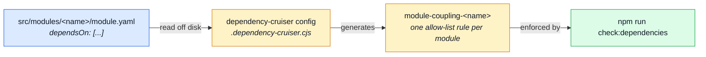

# Dependency graph

`npm run check:dependencies` — [dependency-cruiser](https://github.com/sverweij/dependency-cruiser)
over `src/`, configured in `.dependency-cruiser.cjs`. Runs in `complete` and as its own CI job.
About 1.5 seconds.

## Why a second tool

The tier walls themselves are enforced by
[`eslint-plugin-boundaries`](../theory/layers.md) in `eslint.config.ts`, and that is where a wall
belongs — it reports in the editor, at the offending import, while the code is being written.

This one exists for the two questions a linter structurally cannot answer, because ESLint sees one
file's own imports and nothing further.

### Reachability

> `infrastructure` may not **import** a module

is a lint rule.

> `infrastructure` may not **reach** a module

is a question about the whole graph, and it is the one that survives a refactor. Nobody adds
`import '@modules/orders'` to an infrastructure file — they add a helper that already had it, and
the direct rule stays green while the tier stops being pure. `reachable: true` asks for the path
rather than the edge:

```js
{
    name: 'infrastructure-cannot-reach-domains',
    from: { path: '^src/infrastructure/' },
    to: { path: '^src/(modules|app)/', reachable: true }
}
```

Four rules use it: `infrastructure` against the domains above it, `src-cannot-reach-scenarios`,
`unit-layer-stays-database-free`, and `foundation-cannot-reach-shop`.

### Domain purity — an allow-list, not a deny-list (T11)

`domain/` is a different shape of the same question, and it used to be answered the wrong way
round: naming what `domain/` may NOT reach (`mongoose`, `express`) let anything else — `redis`,
`amqplib`, `node:fs` — straight through uncaught. One rule per module states the opposite instead,
generated from which module folders actually carry a `domain/`:

```js
{
    name: 'domain-purity-orders',
    from: { path: '^src/modules/orders/domain/' },
    to: { pathNot: '^src/modules/orders/domain/|^src/types' }
}
```

A `domain/` file may reach its own module's domain siblings and `@types` — every import a
`domain/` file in this repo makes today — and nothing else. A rule reporting `mongoose` unresolved
would have said nothing about `node:fs`; this one reports anything not on the list, by construction.

### Unresolvable imports

Nothing used to catch a specifier dependency-cruiser cannot resolve to a file on disk at all —
`not-to-unresolvable` does, so a deleted module or package left behind by an incomplete rename
fails here instead of quietly compiling until someone hits the missing file at runtime.
`tests/load/*.js` is exempted: k6 injects its own `k6`/`k6/http` globals at run time, and
dependency-cruiser has no way to see them.

### Module coupling

Every module folder carries its own `module.yaml`, an allow-list of the siblings it may reach:

```yaml
# src/modules/cart/module.yaml
subdomain: core
dependsOn:
    - addresses # the checkout's delivery address
    - delivery # shipping price, pure functions
    - orders # placeOrder — the one function every order is written through
    - payments # listPaymentMethods, to validate the requested method
    - products # prices and availability
    - users # the buyer
```

`.dependency-cruiser.cjs` reads every `module.yaml` off disk and generates one `module-coupling-<name>`
rule per module from it — a module reaching a sibling its own file does not list fails
`check:dependencies`, reported at the offending import. There is no second copy of the map to drift:
the file a module's own docblock and `dependsOn` field describe **is** the rule the graph enforces.



Fails closed both ways: a module folder with no `module.yaml` may reach no sibling at all, rather
than being silently exempt from the rule; a `dependsOn` that is not an array of strings throws,
naming the offending file, instead of matching nothing. `tests/cross-cutting/module-descriptors.test.ts`
is the separate hygiene check — every file exists, parses against a strict schema, and names only
real, non-duplicate, alphabetically-ordered siblings — kept apart from this enforcement on purpose,
so the enforcement config's own logic stays as small as the fail-closed guarantee requires.

`scripts/docs/generate-module-graph.ts` reads the same files for each module's `subdomain` colour in
the generated map at [Modules](../modules/index.md) — see
[Strategic DDD](../theory/strategic-ddd.md#_2-context-map-—-how-a-module-reaches-its-siblings) for why
the relationship _kind_ and _reasoning_ stay in `module.ts`'s docblock instead of here.

### The bootstrap chain

`postinstall` bundles the contracts before it generates `api/`, so on a clean checkout the bundler
may not reach generated code. `.dependency-cruiser.bootstrap.cjs`, the third cruise in
`check:dependencies`, starts at `scripts/contracts/build-bundles.ts` and fails if its static imports
reach `api/` (bar `api/permission-actions.ts`, built first on purpose) or
`src/types/asyncapi.generated.ts`.

It is its own config because it must not follow dynamic `import()`: that is how the client
collections stay opt-in (`bundle-registry.ts`), and a `reachable` rule cannot filter edge types.
Locally nobody sees this break, since every checkout already has `api/` from an earlier run; CI on
a fresh clone does.

### Cycles

`A → B → A` compiles, lints and runs. It fails only in whichever order the module system happens to
initialise it, as an `undefined is not a function` at boot, far from either file. No per-file rule
can see one, because no file in a cycle is doing anything wrong on its own — the failure is a
property of the two modules together, not of either one alone.

`.dependency-cruiser.modules.cjs`, wired into the same `check:dependencies` script, is the rule
that DOES see it: `scope: 'folder'` aggregates every file into its `src/modules/<name>` folder
first, then runs cycle detection over the folders — so two modules that reach each other through
different files, several hops apart, still fail here even though no single file-level rule in
`.dependency-cruiser.cjs` was ever broken. `account ↔ cart` was exactly this shape before the
address book moved into its own module: `cart`'s checkout imported `account` for one function,
`account`'s data export imported `cart` for another, and neither import broke a per-file rule on
its own.

It runs as its own cruise over `src/modules` alone, not folded into the main config's `forbidden`
list, because `scope: 'folder'` rules cannot filter which PATH a cycle runs through — cruising
`src tests` together reports dozens of false cycles purely through test-support code that imports
several modules' `tests/factories.ts` back and forth. `tests/` is excluded from this cruise
entirely rather than filtered after the fact.

The fix for a real cycle is always the same: the sibling that has to reach back moves the read onto
the domain event bus (`kernel/events.ts`) instead — see `webhooks`, which reacts to
`orders`' and `payments`' events without importing either.

## Two settings that decide whether the rules mean anything

Both were wrong in the first working version, and both failed **open** — the run went green while
checking nothing. They are worth knowing before editing the config.

| Setting                                                  | Why it is what it is                                                                                                                                                                                                                                                                                                                          |
| -------------------------------------------------------- | --------------------------------------------------------------------------------------------------------------------------------------------------------------------------------------------------------------------------------------------------------------------------------------------------------------------------------------------- |
| `tsConfig: { fileName: 'tsconfig.json' }`                | The aliases (`@modules`, `@kernel`, `@infrastructure`, `@app`, `@types`) live there. Without it every alias is an unresolvable specifier, the graph is a set of disconnected files, and every rule passes over nothing.                                                                                                                       |
| `node_modules` is in `doNotFollow`, **not** in `exclude` | `doNotFollow` records the module and does not cruise into it. `exclude` drops it from the graph entirely — and a rule whose `to` names `node_modules/mongoose` then matches nothing and reports success.                                                                                                                                      |
| `enhancedResolveOptions.exportsFields`/`conditionNames`  | Without reading a package's own `exports` map, `not-to-unresolvable` (below) reports six false alarms — `altcha-lib`'s deep imports, `@casl/ability/extra`, `@opentelemetry/semantic-conventions/incubating`, and `@typescript-eslint/utils`'s own bare `.` entry — every one of them a package that only ships its real files under `dist/`. |

`tsPreCompilationDeps` is deliberately **off**, so the graph is the one that exists at runtime.
Turned on it also carries `import type` edges, which TypeScript erases: it reported eight "cycles"
across `cache.ts`, `queue.ts`, `dependency-health.ts` and the payments provider port, every one closed by a
type-only import. None can produce the boot-order failure the rule is for, and none can be fixed
except by deleting a type import that is doing its job. Nothing is lost — a direct
`import mongoose` from the domain layer, type-only or not, is already refused by
`no-restricted-imports`.

## What is deliberately not here

The tier walls, restated. Two tools enforcing one property is one tool too many: they drift, and
the second failure is always the confusing one. Anything expressible as "this file may not import
that file" belongs in `eslint.config.ts`.
