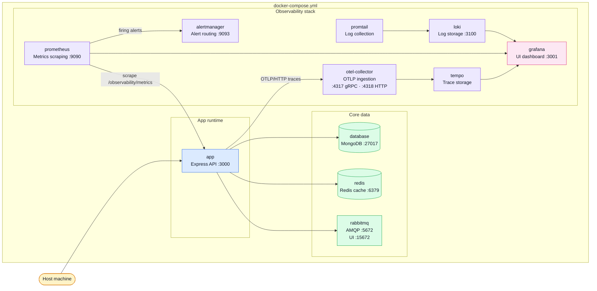

# Docker & Podman

This repo ships one local container implementation built around `docker-compose.yml`.
It works as a Docker flow and also maps cleanly to the Podman helper scripts in `package.json`.

## Container map



## What is implemented

| Area                | Current implementation                                                                                                                |
| ------------------- | ------------------------------------------------------------------------------------------------------------------------------------- |
| App image           | `.docker/Dockerfile` based on `node:25-alpine`, with Chromium installed for Puppeteer-driven PDF rendering                            |
| Local orchestration | `docker-compose.yml` defines app, MongoDB, Redis, RabbitMQ, and the full observability stack                                          |
| Dev workflow        | bind mount source code into `/app`, keep `node_modules` inside the container, switch between single-worker and clustered dev commands |
| Podman support      | `podman:restart`, `podman:rebuild`, and `podman:nuke` scripts wrap the same compose-oriented workflow                                 |

## Container reference

### App runtime

| Container | Image                                            | Port(s)                      | Role                                                                                                                         |
| --------- | ------------------------------------------------ | ---------------------------- | ---------------------------------------------------------------------------------------------------------------------------- |
| `app`     | `.docker/Dockerfile` (node:25-alpine + Chromium) | `NODE_PORT` (default `3000`) | Runs the Express API. In dev: bind-mounted source, hot-reload. Depends on `database`, `redis`, `rabbitmq`, `otel-collector`. |

### Core data

| Container  | Image                   | Port(s)                                | Role                                                                                       |
| ---------- | ----------------------- | -------------------------------------- | ------------------------------------------------------------------------------------------ |
| `database` | `mongo:8`               | `27017`                                | Primary datastore. Persists data in a named Docker volume (`boilerplate_mongodb_volume`).  |
| `redis`    | `redis:7`               | `6379`                                 | Server-side response cache. Cache is intentionally ephemeral — data is lost on restart.    |
| `rabbitmq` | `rabbitmq:3-management` | `5672` (AMQP), `15672` (management UI) | Message broker for async jobs (email, PDF generation). Management UI available in browser. |

### Observability stack

| Container        | Image                                          | Port(s)                      | Role                                                                                                            |
| ---------------- | ---------------------------------------------- | ---------------------------- | --------------------------------------------------------------------------------------------------------------- |
| `otel-collector` | `otel/opentelemetry-collector-contrib:0.114.0` | `4317` (gRPC), `4318` (HTTP) | Single ingestion point for all OTLP telemetry from the app. Fans out traces to Tempo.                           |
| `tempo`          | `grafana/tempo:2.6.1`                          | internal only                | Stores distributed traces received from the OTel Collector. Queried by Grafana.                                 |
| `prometheus`     | `prom/prometheus:v2.55.1`                      | `9090`                       | Scrapes `/observability/metrics` from the app every 15 s. Evaluates alert rules. 7-day retention.               |
| `alertmanager`   | `prom/alertmanager:v0.27.0`                    | `9093`                       | Receives firing alerts from Prometheus. Routes/groups notifications. Null receiver by default in local dev.     |
| `loki`           | `grafana/loki:3.3.2`                           | `3100`                       | Stores log lines shipped by Promtail. Queried by Grafana via LogQL. 7-day retention.                            |
| `promtail`       | `grafana/promtail:3.3.2`                       | internal only                | Tails container log files and pushes entries to Loki. Needs a runtime override for Docker vs Podman log paths.  |
| `grafana`        | `grafana/grafana:11.4.0`                       | `3001`                       | Unified UI: explore traces (Tempo), metrics (Prometheus), and logs (Loki). Anonymous admin access in local dev. |

## Service groups

| Group         | Services                                                                               | Why they are here                                     |
| ------------- | -------------------------------------------------------------------------------------- | ----------------------------------------------------- |
| App runtime   | `app`                                                                                  | runs the backend with container-friendly dev commands |
| Core data     | `database`, `redis`, `rabbitmq`                                                        | persistence, cache/pub-sub, and async jobs            |
| Observability | `otel-collector`, `tempo`, `prometheus`, `alertmanager`, `loki`, `promtail`, `grafana` | traces, metrics, logs, and dashboards                 |

## How to think about the setup

- **Compose is the local truth**: one file wires together the app plus all sidecars needed for demos and local debugging.
- **The Dockerfile is intentionally simple**: install dependencies once, add Chromium for PDF support, then let compose decide runtime commands.
- **Podman is treated as a compatible local engine**, not a separate architecture.

## Podman and Promtail log collection

The main `docker-compose.yml` mounts `/var/lib/docker/containers` and uses Docker's `json-file` log format.
Rootless Podman uses the `k8s-file` log driver (CRI format) and stores logs under a different host path.

A dedicated override file, `docker-compose.podman.yml`, handles this difference. To activate it, add two lines to your `.env` (see `.env-example`):

```dotenv
COMPOSE_FILE=docker-compose.yml:docker-compose.podman.yml
PODMAN_CONTAINERS_PATH=/home/youruser/.local/share/containers/storage/overlay-containers
```

`podman compose` reads `.env` automatically, so the `podman:restart` and `podman:rebuild` scripts stay simple and require no extra flags.

- `COMPOSE_FILE` tells compose to merge the Podman override, which swaps in `.docker/observability/promtail.podman.config.yaml` (CRI pipeline).
- `PODMAN_CONTAINERS_PATH` is the host path where rootless Podman stores container log files.

## When Kubernetes starts to make sense

You do **not** need Kubernetes for this boilerplate by default.
It becomes worth considering when the project grows into:

- multiple deploy environments with stricter secrets/policy handling,
- rolling deploys and autoscaling across several app replicas,
- multi-node scheduling for app + infra,
- platform-level health checks, ingress, and service discovery beyond one host.

Until then, Docker/Podman compose is the simpler mental model.

## Related pages

- [Runtime](./runtime.md)
- [RabbitMQ](./rabbitmq.md)
- [Prometheus](./prometheus.md)
- [Grafana](./grafana.md)
- [Package Scripts](./package-scripts.md)
