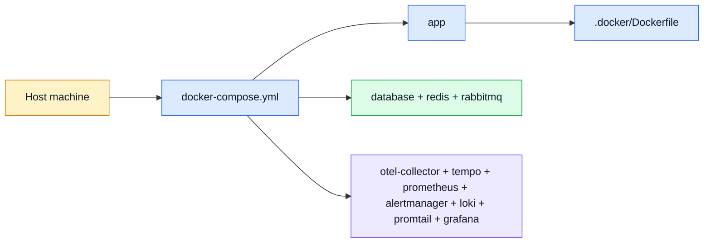

# Docker & Podman

This repo ships one local container implementation built around `docker-compose.yml`.
It works as a Docker flow and also maps cleanly to the Podman helper scripts in `package.json`.

## Container map

## What is implemented

| Area                | Current implementation                                                                                                                |
| ------------------- | ------------------------------------------------------------------------------------------------------------------------------------- |
| App image           | `.docker/Dockerfile` based on `node:25-alpine`, with Chromium installed for Puppeteer-driven PDF rendering                            |
| Local orchestration | `docker-compose.yml` defines app, MongoDB, Redis, RabbitMQ, and the full observability stack                                          |
| Dev workflow        | bind mount source code into `/app`, keep `node_modules` inside the container, switch between single-worker and clustered dev commands |
| Podman support      | `podman:restart`, `podman:rebuild`, and `podman:nuke` scripts wrap the same compose-oriented workflow                                 |

## Service groups

| Group         | Services                                                                               | Why they are here                                     |
| ------------- | -------------------------------------------------------------------------------------- | ----------------------------------------------------- |
| App runtime   | `app`                                                                                  | runs the backend with container-friendly dev commands |
| Core data     | `database`, `redis`, `rabbitmq`                                                        | persistence, cache/pub-sub, and async jobs            |
| Observability | `otel-collector`, `tempo`, `prometheus`, `alertmanager`, `loki`, `promtail`, `grafana` | traces, metrics, logs, and dashboards                 |

## How to think about the setup

- **Compose is the local truth**: one file wires together the app plus all sidecars needed for demos and local debugging.
- **The Dockerfile is intentionally simple**: install dependencies once, add Chromium for PDF support, then let compose decide runtime commands.
- **Podman is treated as a compatible local engine**, not a separate architecture.

## When Kubernetes starts to make sense

You do **not** need Kubernetes for this boilerplate by default.
It becomes worth considering when the project grows into:

- multiple deploy environments with stricter secrets/policy handling,
- rolling deploys and autoscaling across several app replicas,
- multi-node scheduling for app + infra,
- platform-level health checks, ingress, and service discovery beyond one host.

Until then, Docker/Podman compose is the simpler mental model.

## Related pages

- [Runtime](./runtime.md)
- [RabbitMQ](./rabbitmq.md)
- [Prometheus](./prometheus.md)
- [Grafana](./grafana.md)
- [Package Scripts](./package-scripts.md)
