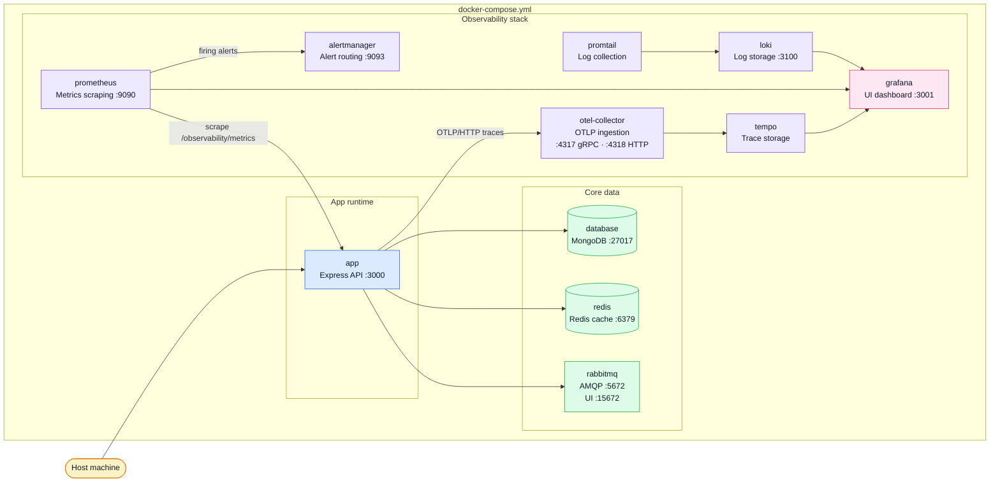

# Docker & Podman

This repo ships one local container implementation built around `docker-compose.yml`.
It works as a Docker flow and also maps cleanly to the Podman helper scripts in `package.json`.

## Container map


```mermaid
%%{init: {'flowchart': {'nodeSpacing': 55, 'rankSpacing': 75}}}%%
flowchart LR
    Host([Host machine])

    subgraph Compose["docker-compose.yml"]
        subgraph AppRuntime["App runtime"]
            App["app\nExpress API :3000"]
        end

        subgraph CoreData["Core data"]
            MongoDB[("database\nMongoDB :27017")]
            Redis[("redis\nRedis cache :6379")]
            RabbitMQ["rabbitmq\nAMQP :5672\nUI :15672"]
        end

        subgraph ObsStack["Observability stack"]
            OTelCol["otel-collector\nOTLP ingestion\n:4317 gRPC · :4318 HTTP"]
            Tempo["tempo\nTrace storage"]
            Prometheus["prometheus\nMetrics scraping :9090"]
            Alertmanager["alertmanager\nAlert routing :9093"]
            Promtail["promtail\nLog collection"]
            Loki["loki\nLog storage :3100"]
            Grafana["grafana\nUI dashboard :3001"]
        end
    end

    Host --> App
    App --> MongoDB
    App --> Redis
    App --> RabbitMQ
    App -->|"OTLP/HTTP traces"| OTelCol
    OTelCol --> Tempo
    Prometheus -->|"scrape /observability/metrics"| App
    Prometheus -->|"firing alerts"| Alertmanager
    Promtail --> Loki
    Tempo --> Grafana
    Prometheus --> Grafana
    Loki --> Grafana

    classDef host fill:#fef3c7,stroke:#d97706,color:#111827;
    classDef app fill:#dbeafe,stroke:#2563eb,color:#111827;
    classDef data fill:#dcfce7,stroke:#16a34a,color:#111827;
    classDef obs fill:#ede9fe,stroke:#7c3aed,color:#111827;
    classDef ui fill:#fce7f3,stroke:#db2777,color:#111827;

    class Host host;
    class App app;
    class MongoDB,Redis,RabbitMQ data;
    class OTelCol,Tempo,Prometheus,Alertmanager,Promtail,Loki obs;
    class Grafana ui;
```

## What is implemented

| Area                | Current implementation                                                                                                                                                                                                               |
| ------------------- | ------------------------------------------------------------------------------------------------------------------------------------------------------------------------------------------------------------------------------------ |
| App image           | `docker/Dockerfile` based on `node:24-trixie-slim` (Debian, glibc), with Chromium for Puppeteer-driven PDF rendering and a `mongod` baked in at build time — see [Running the gate in a container](#running-the-gate-in-a-container) |
| Local orchestration | `docker-compose.yml` defines app, MongoDB, Redis, RabbitMQ, and the full observability stack                                                                                                                                         |
| Dev workflow        | bind mount source code into `/app`, keep `node_modules` inside the container, switch between single-worker and clustered dev commands                                                                                                |
| Podman support      | `compose:restart`, `compose:rebuild` and `compose:kill` run `${CONTAINER_ENGINE:-podman} compose`; export `CONTAINER_ENGINE=docker` to switch                                                                                        |

### After a new dependency: rebuild, don't just restart

`node_modules` lives in an ANONYMOUS VOLUME mounted over `/app/node_modules`, so the bind-mounted
source never shadows the container's own install. That volume is filled from the image **once**,
when the container is first created, and is reused afterwards — so a dependency added to
`package.json` is invisible to a container started with `compose:restart`, and the app crash-loops
on `Cannot find module '<name>'` while every other service reports healthy.

```sh
npm run compose:rebuild      # down -v, build --no-cache, up -d — drops the database too
# or, keeping the data:
podman compose build app && podman compose rm -sf app && podman volume prune -f && podman compose up -d app
```

The symptom is specific enough to recognise: `MODULE_NOT_FOUND` for a package that `ls node_modules`
on the host clearly shows, raised from inside `/app`.

## Container reference

### App runtime

| Container | Image                                                                 | Port(s)                      | Role                                                                                                                         | Read next               |
| --------- | --------------------------------------------------------------------- | ---------------------------- | ---------------------------------------------------------------------------------------------------------------------------- | ----------------------- |
| `app`     | `docker/Dockerfile` (node:24-trixie-slim + Chromium + baked `mongod`) | `NODE_PORT` (default `3000`) | Runs the Express API. In dev: bind-mounted source, hot-reload. Depends on `database`, `redis`, `rabbitmq`, `otel-collector`. | [Runtime](./runtime.md) |

### Core data

| Container  | Image                   | Port(s)                                | Role                                                                                       | Read next                                   |
| ---------- | ----------------------- | -------------------------------------- | ------------------------------------------------------------------------------------------ | ------------------------------------------- |
| `database` | `mongo:8`               | `27017`                                | Primary datastore. Persists data in a named Docker volume (`boilerplate_mongodb_volume`).  | [MongoDB & Mongoose](./mongodb-mongoose.md) |
| `redis`    | `redis:7`               | `6379`                                 | Server-side response cache. Cache is intentionally ephemeral — data is lost on restart.    | [Redis Cache](./redis-cache.md)             |
| `rabbitmq` | `rabbitmq:3-management` | `5672` (AMQP), `15672` (management UI) | Message broker for async jobs (email, PDF generation). Management UI available in browser. | [RabbitMQ](./rabbitmq.md)                   |

### Observability stack

| Container        | Image                                          | Port(s)                      | Role                                                                                                                       | Read next                                  |
| ---------------- | ---------------------------------------------- | ---------------------------- | -------------------------------------------------------------------------------------------------------------------------- | ------------------------------------------ |
| `otel-collector` | `otel/opentelemetry-collector-contrib:0.114.0` | `4317` (gRPC), `4318` (HTTP) | Single ingestion point for all OTLP telemetry from the app. Fans out traces to Tempo.                                      | [OpenTelemetry](./opentelemetry.md)        |
| `tempo`          | `grafana/tempo:2.6.1`                          | internal only                | Stores distributed traces received from the OTel Collector. Queried by Grafana.                                            | [Tempo](./tempo.md)                        |
| `prometheus`     | `prom/prometheus:v2.55.1`                      | `9090`                       | Scrapes `/observability/metrics` from the app every 15 s. Evaluates alert rules. 7-day retention.                          | [Prometheus](./prometheus.md)              |
| `alertmanager`   | `prom/alertmanager:v0.27.0`                    | `9093`                       | Receives firing alerts from Prometheus. Routes/groups notifications. Null receiver by default in local dev.                | [Prometheus](./prometheus.md#alertmanager) |
| `loki`           | `grafana/loki:3.3.2`                           | `3100`                       | Stores log lines shipped by Promtail. Queried by Grafana via LogQL. 7-day retention.                                       | [Loki](./loki.md)                          |
| `promtail`       | `grafana/promtail:3.3.2`                       | internal only                | Tails container log files and pushes entries to Loki. Needs `CONTAINER_LOGS_PATH` / `PROMTAIL_CONFIG` in `.env` on Podman. | [Loki](./loki.md)                          |
| `grafana`        | `grafana/grafana:11.4.0`                       | `3001`                       | Unified UI: explore traces (Tempo), metrics (Prometheus), and logs (Loki). Anonymous admin access in local dev.            | [Grafana](./grafana.md)                    |

### Integrations (opt-in)

The only group behind a compose **profile**. A plain `up` does not start it:

```bash
npm run compose -- --profile integrations up -d
```

| Container        | Image                                      | Port(s)                                | Role                                                                                                                                         | Read next                                     |
| ---------------- | ------------------------------------------ | -------------------------------------- | -------------------------------------------------------------------------------------------------------------------------------------------- | --------------------------------------------- |
| `webhook-tester` | `ghcr.io/tarampampam/webhook-tester:2.3.0` | `WEBHOOK_TESTER_PORT` (default `3070`) | Self-hosted webhook.site. A sink for outbound webhooks in development, showing each captured request with its headers. In-memory, no volume. | [Ports](./pairing-and-ports.md#host-port-map) |

Nothing under `src/` imports it, names it, or fails when it is absent — it receives, and that is
all. It is demo furniture in the same sense as the seeded catalogue, which is why it is gated
rather than always-on.

## Service groups

| Group         | Services                                                                               | Why they are here                                           |
| ------------- | -------------------------------------------------------------------------------------- | ----------------------------------------------------------- |
| App runtime   | `app`                                                                                  | runs the backend with container-friendly dev commands       |
| Core data     | `database`, `redis`, `rabbitmq`                                                        | persistence, cache/pub-sub, and async jobs                  |
| Observability | `otel-collector`, `tempo`, `prometheus`, `alertmanager`, `loki`, `promtail`, `grafana` | traces, metrics, logs, and dashboards                       |
| Integrations  | `webhook-tester`                                                                       | opt-in sink for outbound webhooks; `--profile integrations` |

### The `integrations` profile is where a real consumer would go

`webhook-tester` answers _"did we send it, and what did it look like?"_ — the everyday need, and
the reason it is the default sink.

It does not answer _"can a real consumer actually use this?"_. No sink we point at ourselves can:
that claim needs a tool the audience already uses — n8n, Zapier, Make — verifying a Standard
Webhooks signature in its own environment and calling back in with an API key.

**Nothing is planned for that, deliberately.** It is recorded here because the profile is the
seam it would attach to: another service on this same group, SQLite-backed, a seeded workflow
mounted read-only, and **nothing under `src/`** — the application must not be able to tell whether
it is running. Anyone reaching for it should know the licence question comes first: n8n is
fair-code under the Sustainable Use License, where the line is internal use versus reselling, not
commercial versus non-commercial.

## Running the gate in a container

`docker/Dockerfile` carries everything `npm run complete` needs, baked mongod included. Two ways
to run it, and only one is a CI job:

| Mode         | How                                                                                              | Services                  | Proves                                                                           |
| ------------ | ------------------------------------------------------------------------------------------------ | ------------------------- | -------------------------------------------------------------------------------- |
| **Hermetic** | `docker build -f docker/Dockerfile . && docker run --rm --network=none <image> npm run complete` | none — the baked `mongod` | the image is self-contained; this is the `container-gate` CI job                 |
| **Wired**    | `npm run compose -- -f docker-compose.test.yml run --rm -T gate`                                 | compose Mongo + Redis     | `NODE_TEST_MONGO_URI`/`NODE_TEST_REDIS_URL` work against a real external service |

Hermetic is the stronger claim — no compose, no network, no `depends_on` — so it is what CI gates
on. Wired is the everyday-dev shape: run it by hand before merging a change that touches the image
or the env-var resolvers (`src/infrastructure/runtime/ephemeral-mongo.ts`,
`tests/cluster/support/redis.ts`).

`docker-compose.test.yml` gives itself its own compose project `name:` on purpose — without one,
compose derives the project name from the directory, the same one `docker-compose.yml` uses with
no override, and the two would fight over container names (`redis`, `database`) instead of running
side by side.

The `gate` service builds the image and runs it as built, with **no source bind mount** — that
image IS the thing under test, not a live-reload target. A mount would also fight
`--userns=keep-id`: rootless podman needs that flag to keep a bind-mounted write from landing as
your subuid rather than you, but the image's own `/app` is root-owned from the build, and
`keep-id` remaps the in-container process away from root — so anything the run needs to write
outside a mount (`tsc`'s own `dist/`, for one) loses access instead. Read a wired run's result with
`podman compose -f docker-compose.test.yml logs gate`.

`docker/Dockerfile.dockerignore` overrides the root `.dockerignore` for this one image, keeping
`.git` in the build context — `npm run complete` runs `lint`, and the `local/comment-links` ESLint
rule shells out to `git ls-files`; `docker/Dockerfile.production` has the same gap and sidesteps it
by never running `lint` at all, which is not an option here.

**Image size**: ~2.4 GB, against Alpine's usual few-hundred-MB — Debian itself, Chromium and its
font/rendering libraries, and the baked `mongod` all add up. None of it ships in
`docker/Dockerfile.production`, which stays on Alpine — see the comment at the top of that file.

## How to think about the setup

- **Compose is the local truth**: one file wires together the app plus all sidecars needed for demos and local debugging.
- **The Dockerfile is intentionally simple**: install dependencies once, add Chromium for PDF support, then let compose decide runtime commands.
- **Podman is treated as a compatible local engine**, not a separate architecture.

## Podman and Promtail log collection

Docker writes container logs as `json-file` under `/var/lib/docker/containers`. Podman can write
the same kind of thing with its `k8s-file` driver (CRI format) under its own storage path — but
**it does not do so by default.** Podman's default driver is `journald`, which puts log lines in
the systemd journal and writes no file at all. Promtail tails files, so with the default it tails a
glob matching nothing, Loki stays empty, and Grafana's log panels are blank with no error anywhere
to explain it.

That is the entire difference between the two runtimes, and it is three values in `.env`, which
compose reads by itself:

```dotenv
CONTAINER_LOGS_PATH=/home/youruser/.local/share/containers/storage/overlay-containers
PROMTAIL_CONFIG=promtail.podman.config.yaml
CONTAINER_LOG_DRIVER=k8s-file
```

The defaults in `docker-compose.yml` are docker's, so on docker you set none of them. The driver is
applied to every service through a YAML anchor rather than per service, because Promtail scrapes
the whole directory and any service left on the default would simply be missing from the logs.
Whichever path you give is mounted at `/var/log/host-containers`, so the two promtail configs
differ only in the glob under it and the parser stage — CRI for podman, JSON envelope for docker.

There is no override file and no `-f` list. There used to be both, plus a `scripts/compose.ts` <!-- doc-paths:ignore -->
that chose between them; the whole apparatus existed to move one volume mount, and it went wrong
in the way that machinery does — it selected the docker override on a podman-only machine and
Promtail silently tailed nothing.

### Choosing the engine

```bash
npm run compose:restart                          # podman
CONTAINER_ENGINE=docker npm run compose:restart  # docker
```

`npm run compose` expands `${CONTAINER_ENGINE:-podman} compose`. Export the variable in your shell
profile if you use docker — and note it is a **shell** variable, not a `.env` one. Compose reads
`.env`; npm does not, so the one thing `.env` cannot decide is which binary npm invokes. That suits
it: your engine is a property of your machine, not of this repo.

> **Do not set `COMPOSE_FILE` in `.env`.** Docker Compose honours it there, but podman-compose
> ignores it (verified 2026-08-05 against podman-compose 1.6.0), so anything built on it works on
> one runtime and silently does nothing on the other. Plain variables like the two above are
> substituted by both.

## When Kubernetes starts to make sense

You do **not** need Kubernetes for this boilerplate by default.
It becomes worth considering when the project grows into:

- multiple deploy environments with stricter secrets/policy handling,
- rolling deploys and autoscaling across several app replicas,
- multi-node scheduling for app + infra,
- platform-level health checks, ingress, and service discovery beyond one host.

Until then, Docker/Podman compose is the simpler mental model.

## Related pages

- [Runtime](./runtime.md)
- [RabbitMQ](./rabbitmq.md)
- [Prometheus](./prometheus.md)
- [Grafana](./grafana.md)
- [Package Scripts](./package-scripts.md)
