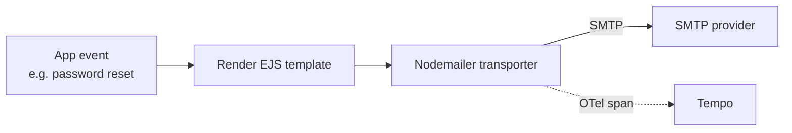
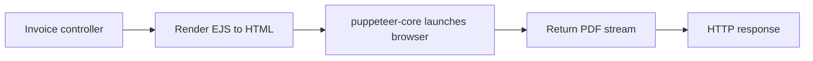

# Email & PDF Rendering

The boilerplate ships two "outbound rendering" examples that are easy to forget about because they sit outside the request/response loop:

- **Email** via [Nodemailer](https://nodemailer.com/) with [EJS](https://ejs.co/) HTML templates.
- **PDF generation** (order invoices) via [puppeteer-core](https://pptr.dev/).

Both are optional: they only activate when the relevant env vars / browser binary are configured.

## Where the code lives

| Concern        | File                                                             |
| -------------- | ---------------------------------------------------------------- |
| SMTP transport | `src/utils/nodemailer.ts`                                        |
| Email triggers | `src/controllers/account/post-reset-request.ts` (password reset) |
| HTML templates | `views/*.ejs`                                                    |
| PDF rendering  | `src/controllers/orders/get-order-invoice.ts`                    |

## Email pipeline

### SMTP configuration

| Env var          | Meaning                                                   |
| ---------------- | --------------------------------------------------------- |
| `NODE_SMTP_HOST` | SMTP server hostname.                                     |
| `NODE_SMTP_PORT` | Defaults to `587` (STARTTLS). `465` enables implicit TLS. |
| `NODE_SMTP_USER` | SMTP username.                                            |
| `NODE_SMTP_PASS` | SMTP password / app password.                             |
| `NODE_SMTP_NAME` | EHLO/HELO name (optional).                                |

Every send is wrapped in an OTel span (`withSpan`) so failures show up in [Tempo](./tempo.md) alongside the request that triggered them.

## PDF pipeline

`puppeteer-core` does **not** download Chromium. You must either install a system browser and point Puppeteer at it, or swap to the full `puppeteer` package. Without an executable the invoice endpoint will error out at request time, not at boot — by design, so the rest of the API keeps running.

## Useful links

- [Nodemailer docs](https://nodemailer.com/about/)
- [Nodemailer SMTP options](https://nodemailer.com/smtp/)
- [Nodemailer message structure](https://nodemailer.com/message/)
- [EJS syntax reference](https://ejs.co/#docs)
- [Puppeteer API](https://pptr.dev/api)
- [puppeteer-core vs puppeteer](https://pptr.dev/guides/configuration#puppeteer-vs-puppeteer-core)
- [Chromium download channels](https://www.chromium.org/getting-involved/download-chromium/)

## Related pages

- [Runtime](./runtime.md)
- [Security](./security.md) — password reset flow ties in here
- [OpenTelemetry](./opentelemetry.md) — SMTP/Puppeteer calls appear as spans
