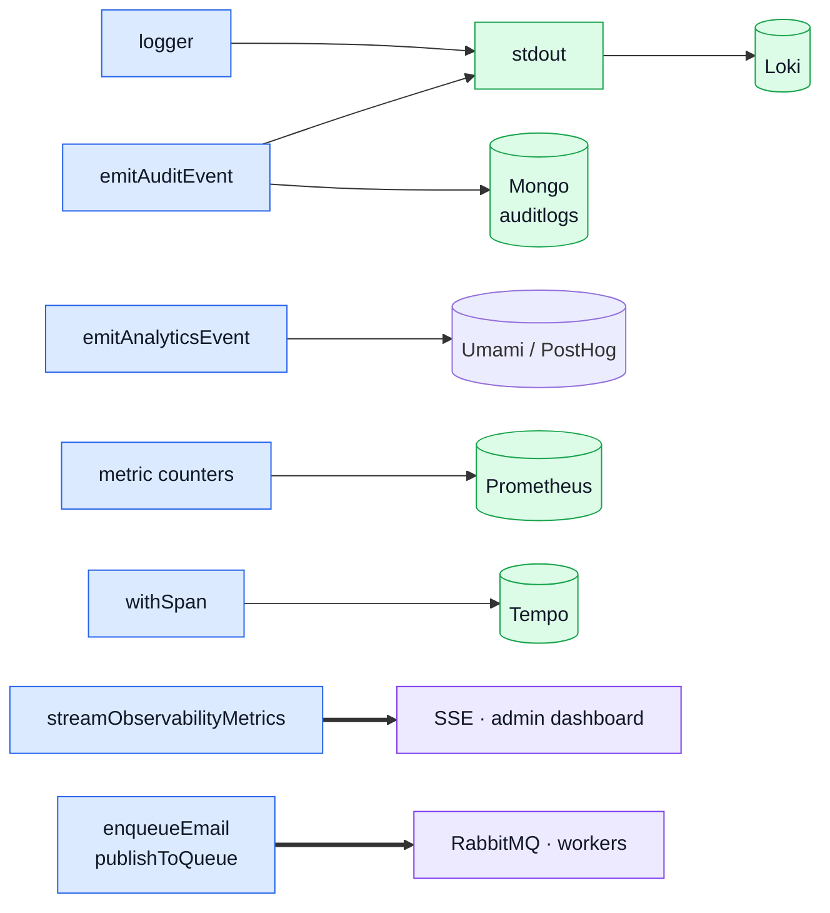

# Events & Logging

Seven things in this codebase can be described as "recording that something happened", and they
are easy to confuse — several live side by side in `src/infrastructure/observability/`, and three of them
are declared in the same `asyncapi.yaml`. This page is the map: what each one is, where it ends
up, who reads it, and which to reach for.

If you only remember one thing: **pick by who reads it**, not by what happened.

## Seven signals, four destinations



The thick arrows are the two that **cross a process boundary** and can therefore fail, retry or
arrive late. Everything else is a one-way recording that never comes back — which is why none of
them belongs on a code path whose correctness depends on the write succeeding.

## The signals at a glance

| Signal                | Entry point                                                           | Where it goes                                            | Who reads it               | Detailed page                                                       |
| --------------------- | --------------------------------------------------------------------- | -------------------------------------------------------- | -------------------------- | ------------------------------------------------------------------- |
| **Application log**   | `logger` — `@infrastructure/adapters/logger`                          | stdout → Promtail → Loki                                 | you, debugging             | [Winston & Audit Logs](./winston.md)                                |
| **Audit trail**       | `emitAuditEvent` — `@infrastructure/observability/audit`              | `auditLogger` → stdout → Loki, **and** Mongo `auditlogs` | admins, compliance         | [Winston & Audit Logs](./winston.md#audit-events)                   |
| **Product analytics** | `emitAnalyticsEvent` — `@infrastructure/observability/analytics`      | Umami (default), PostHog, or none                        | product, marketing         | [Product Analytics](./analytics.md)                                 |
| **Metrics**           | counters in `metrics-http.ts` / each module's `metrics.ts`            | Prometheus registry → `GET /observability/metrics`       | ops, alerting              | [Prometheus](./prometheus.md)                                       |
| **Traces**            | `withSpan` — `@infrastructure/observability/tracer`                   | OTel Collector → Tempo                                   | you, debugging across hops | [OpenTelemetry](./opentelemetry.md) · [Tempo](./tempo.md)           |
| **Live metrics feed** | `streamObservabilityMetrics` — `@infrastructure/observability/stream` | SSE frames on `GET /observability/events`                | the admin dashboard        | [Frontend Observability](./frontend-observability.md)               |
| **Queue jobs**        | `enqueueEmail`, `publishToQueue` — `@infrastructure/adapters/*`       | RabbitMQ → `src/infrastructure/adapters/*.worker.ts`     | the workers themselves     | [RabbitMQ](./rabbitmq.md) · [Email & PDF](./email-and-rendering.md) |

Only the last two cross a process boundary. The rest are one-way recordings that never come back.

## Which one do I want?

- **"I need to see what the code did when this broke."** Application log, and the `trace_id` on
  the line to jump into the trace. Never audit — audit has a closed vocabulary and adding to it
  for debugging pollutes a compliance record.
- **"Someone did something security-relevant, and I may need to prove it later."** Audit.
  Logins, permission denials, admin writes, account deletion.
- **"I want to know how users behave."** Analytics. Views, searches, funnel steps.
- **"I want to know how the system is holding up."** Metrics.
- **"This work should not block the response."** Queue job.

The overlap that catches people out is audit vs analytics. `USER_SIGNED_UP` (analytics) and
`auth.signup.succeeded` (audit) describe the same instant, and both should exist: one answers
"how many signups this week", the other answers "who created this account, from which IP". They
are different questions with different retention rules and different readers.

## Audit is the one with two destinations

Everything else here has a single sink. Audit has two, on purpose:

```
emitAuditEvent()
   ├─→ auditLogger (Winston) → stdout → Promtail → Loki      the compliance record
   └─→ IAuditSink → auditLogService.record → Mongo auditlogs  the queryable copy
```

The **log** is the source of truth. It is append-only, shipped off the box, and is what an
auditor is shown.

The **Mongo collection** exists so `GET /observability/audit` can answer "what has actor X done"
from the API, with no log backend wired up. It carries a TTL index
(`NODE_AUDIT_RETENTION_DAYS`, default 90 days) and is allowed to fail: if the write rejects, the
request continues and the log line has already gone out.

Why a sink rather than a direct call — `src/infrastructure/**` is the bottom of the dependency graph and
`no-restricted-imports` forbids it from reaching up into `@modules/*`, where the audit repository
now lives. So `audit.ts` declares
the port and `app.ts` supplies the implementation at boot, the same shape as `IImageStore`. The
practical payoff: swapping the destination touches one line in `app.ts`, not the 53 call sites.

## The domain event bus, and what it is not

`src/kernel/events.ts` is an in-process bus, and it exists for exactly one job: letting two modules
whose relationship is genuinely mutual talk without importing each other. Deleting a product has to
empty it out of every cart, while the cart needs the catalogue to price a line. As imports that is a
cycle; as an event it is `products` emitting and `cart` listening, and the dependency arrow points
one way only.

It is not a signal in the table above. Nothing reads it, nothing stores it, and it never leaves the
process — it is a call graph device, and the price it pays is the call graph itself: "find all
references" no longer reaches the handler.

**These are deliberately not AsyncAPI channels**, and their absence from `asyncapi.yaml` is not a
gap to fill: a channel is declared only for something that crosses a process boundary
([why](../api/asyncapi-workflow.md#naming-convention), including the one that was declared in error
and removed). Each event's contract — when it fires, what the payload means, and what a listener may
assume — is the JSDoc on the `DomainEventMap` augmentation in the emitting module's own
`events.ts`. That is what a test asserting an event's effect is graded against.

### The three properties that matter

- **Handlers run sequentially and awaited.** The emitters depend on the effect having happened — a
  product leaves every cart before it leaves the database. Fire-and-forget would turn an ordering
  guarantee into a race.
- **A throwing handler is logged and skipped.** It stops neither the remaining handlers nor the
  emitter: a listener must not roll back an operation that was already authorised, and the emitting
  module cannot decide failure modes for code it has never heard of.
- **The payload map is open.** A module declares its own events by augmenting `DomainEventMap` from
  inside its own folder, so adding a domain edits no shared file.

### Why it is not a substitute for the broker

Do not grow it into one. It has no durability, no retry and no replay, and a crash mid-dispatch
loses the event outright. Emails already go through RabbitMQ, which is durable — putting a lossy
in-process hop in front of a durable queue is backwards. Cache invalidation wants the opposite of
async fan-out: it should happen immediately after the write, in the same process.

If cross-process fan-out is ever genuinely needed, the answer is a RabbitMQ topic exchange fed by a
transactional outbox. See
[AsyncAPI Workflow](../api/asyncapi-workflow.md#naming-convention) for why a channel is only
declared for something that actually travels on a wire.

### `resetDomainEvents` is a test seam with a real cost

It drops every subscription, and it ships to production so that suites registering modules per case
do not accumulate handlers. Nothing stops application code from calling it and silently
unsubscribing every module; seven suites depend on it, so it is load-bearing rather than removable.

The shape that would not need it is a bus **instance** owned by the registry — a fresh registry
means a fresh bus, and the reset becomes the constructor. The cost is that `onDomainEvent` and
`emitDomainEvent` stop being importable functions. Whoever makes that change is also deciding where
subscription lives (`AppModule.subscribe`), because those are the same question.

## Everything carries the same correlation ids

Whatever the signal, two fields let you line them up afterwards:

| Field        | Set by                                   | Joins                                           |
| ------------ | ---------------------------------------- | ----------------------------------------------- |
| `request_id` | the request-id middleware                | every log line and audit entry from one request |
| `trace_id`   | ambient OTel context, read by the tracer | logs and audit entries ↔ the Tempo trace        |

This is what makes the split above workable: an audit entry that looks wrong and the application
log lines explaining it are one `request_id` query apart.

## Related pages

- [Winston & Audit Logs](./winston.md)
- [Observability Stack Reference](./observability-reference.md) — the infrastructure the signals land in
- [Observability Endpoints](../api/observability.md)
- [Product Analytics](./analytics.md)
- [Prometheus](./prometheus.md)
- [RabbitMQ](./rabbitmq.md)
