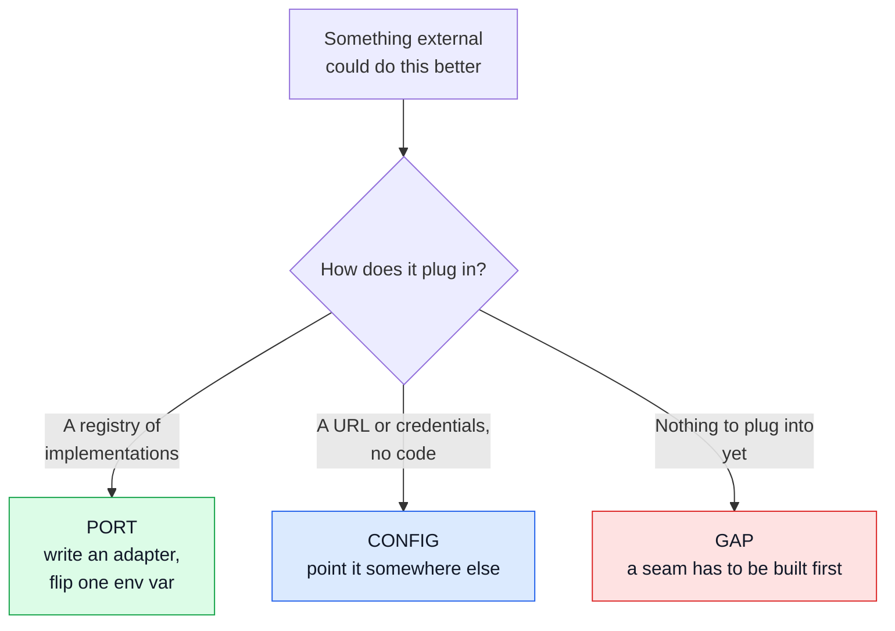

# External Services

Which third-party services this app can use, where each one plugs in, and **what you lose by
plugging in nothing**.

This boilerplate is **provider-neutral, deliberately** — the same stance
[Hosting](./hosting.md) takes. Every seam below either ships with a working provider-free default
or degrades to a documented gap. Nothing here is a recommendation of a vendor; the vendors are
listed as _categories with examples_, so a reader can go shopping knowing what to shop for.

::: warning Facts, not verdicts
Vendor names are examples of a category, not endorsements, and vendors change. The **code** side of
each row — the port, the default, the gap — is read off this repo and is the part that stays true.
:::

## 1 · The three kinds of seam

Not everything swaps the same way, and the difference decides how much work a swap is.

| Kind       | What it means                                                                       |
| ---------- | ----------------------------------------------------------------------------------- |
| **PORT**   | A registry of named implementations. Add a file, register it, set one env var       |
| **CONFIG** | A standard protocol. Point the URL at someone else's server; no code changes at all |
| **GAP**    | No seam exists. Something has to be designed before a vendor can be attached        |

## 2 · The catalogue

### PORT — a registry is already there

Four concerns resolve a named provider at runtime. Each registry re-checks configuration on every
call, so a provider becomes active when its variables are set, with no restart-shaped memoisation
to go stale.

| Concern               | Registry                                         | Ships with                                    | What a vendor adds                                                          |
| --------------------- | ------------------------------------------------ | --------------------------------------------- | --------------------------------------------------------------------------- |
| **Payments**          | `src/modules/payments/providers/`                | `fake` — deterministic test cards, no network | Actually taking money. Also a fraud engine you cannot build (see below)     |
| **Social login**      | `src/modules/account/oauth/providers/`           | `google`, `github`, `fake`                    | More identity providers; any OIDC-shaped one fits the same port             |
| **Human challenge**   | `src/infrastructure/adapters/antibot-providers/` | `none`, `altcha`, `turnstile`                 | Managed bot scoring. **`altcha` is self-hosted** — no vendor needed         |
| **Product analytics** | `src/infrastructure/observability/analytics/`    | `none`, `umami`, `posthog`                    | Hosted retention, funnels, session replay — see [Analytics](./analytics.md) |

**The human-challenge row is the one worth studying**, because it is the shape the others should
grow towards: three providers, one of them a real defence that phones nobody
(`altcha` — proof-of-work in the browser), and `none` as an honest default rather than a stub.

### CONFIG — standard protocols, no code

Nothing to write. These already speak a protocol somebody else's server also speaks.

| Concern                     | Protocol                 | Default                                                                      | Where to read                                 |
| --------------------------- | ------------------------ | ---------------------------------------------------------------------------- | --------------------------------------------- |
| **Transactional email**     | SMTP (nodemailer)        | any SMTP host; a JSON transport under test, and the demo outbox in demo mode | [Email & PDF](./email-and-rendering.md)       |
| **Cache**                   | Redis                    | in-memory when no URL is set                                                 | [Redis Cache](./redis-cache.md)               |
| **Rate-limit counters**     | Redis                    | in-memory; its own URL so it survives a cache flush                          | [Security](./security.md)                     |
| **Message queue**           | AMQP 0-9-1 (amqplib)     | RabbitMQ in the compose stack                                                | [RabbitMQ](./rabbitmq.md)                     |
| **Database**                | MongoDB 8 wire           | the bundled container                                                        | [MongoDB](./mongodb-mongoose.md)              |
| **Logs · metrics · traces** | Loki · Prometheus · OTLP | the bundled Grafana stack                                                    | [Observability](./observability-reference.md) |

Every one of these is a managed offering somewhere. The point of the column is that **choosing a
managed one is a URL change**, not a migration — and that the self-hosted default is a complete
answer, not a placeholder.

### GAP — no seam yet

Honest entries. Each is a decision someone has to make before a vendor can help.

| Concern                     | What is missing                                                                      | Where it is tracked                                                                      |
| --------------------------- | ------------------------------------------------------------------------------------ | ---------------------------------------------------------------------------------------- |
| **Object storage**          | uploads land on a local disk; no S3-shaped port exists                               | [a recipe in Deployment Hardening](./deployment-hardening.md#object-storage-for-uploads) |
| **Fraud / risk scoring**    | nothing consumes a risk verdict; the app's own velocity limits are the whole defence | the payment-velocity plan                                                                |
| **Breached-password check** | a password is checked for shape, never against a corpus                              | the breached-password plan                                                               |

## 3 · What you actually give up by choosing nothing

The column that matters, and the reason this page is not just a list of vendors.

| Choose nothing for… | And you still have                                                           | But you do not have                                                                                                   |
| ------------------- | ---------------------------------------------------------------------------- | --------------------------------------------------------------------------------------------------------------------- |
| Payments            | a complete checkout, order lifecycle, refunds, webhooks — all against `fake` | money. `fake` is for building and testing against, never for a real shop                                              |
| Human challenge     | rate limits, the antibot ladder, and `altcha` if you enable it               | managed bot scoring — but `altcha` closes most of the gap without a vendor                                            |
| Analytics           | audit logs, Prometheus counters, structured logs                             | funnels and retention                                                                                                 |
| Fraud scoring       | per-account velocity and decline limits, once they are built                 | cross-merchant signal. Nobody can build that alone — it is the one category where a vendor is genuinely irreplaceable |
| Object storage      | uploads, on one disk, for one instance                                       | horizontal scaling of the upload path                                                                                 |
| Managed email       | SMTP to anything, including your own server                                  | deliverability reputation — see [Email authentication](./deployment-hardening.md#email-authentication-spf-dkim-dmarc) |

## 4 · Adding a provider to a port

The four registries share a shape, so the work is the same each time:

1. **Write the adapter** next to its siblings, implementing that port's interface.
2. **Register it** in the registry's map, behind a check that its configuration is present — an
   unconfigured provider must resolve to `undefined`, never to a half-working object.
3. **Set the env var.** The switches live in `.env-example`; that file is the list, and it is
   checked, so this page does not copy the names.
4. **Leave the default alone.** A provider-free default is a feature: it is what makes the repo
   clone-and-run, and what the test suite runs against.

A provider that cannot be configured must behave as if the route did not exist — loud (a 404 or a
clear refusal), never silently wrong. That rule is why an unset payment provider is a hard failure
rather than a checkout that quietly succeeds.

## See also

- [Hosting](./hosting.md) — what a host must offer, same provider-neutral stance
- [Deployment Hardening](./deployment-hardening.md) — the defences that live in DNS, CI or a proxy
- [Dependency Vetting](./dependency-vetting.md) — what earns a place in `package.json`
- [Security](./security.md) — the guardrails that ship in the box
