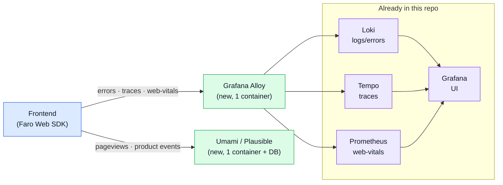

# Frontend Observability

This page covers how the **paired frontend** should be observed, and **why this repo
does not use external SaaS** (Sentry, PostHog cloud) for it.

This backend already ships a full self-hosted, OSS, container-based observability stack
(see [Observability Reference](./observability-reference.md)). The frontend should reuse
it instead of shipping data to third-party services.

## Two jobs, not one

The frontend has two separate observability needs that are easy to conflate:

| Job                         | What it answers                                            | SaaS tool it usually maps to |
| --------------------------- | ---------------------------------------------------------- | ---------------------------- |
| **Error / crash + FE perf** | "What broke, where, how slow was the page/route?"          | Sentry                       |
| **Product analytics**       | "What did users _do_ — funnels, retention, feature flags?" | PostHog                      |

The first job is **already covered** by the backend stack (Tempo/Loki/Prometheus/Grafana)
— running Sentry alongside it would create a second, disconnected observability world.
The second job (product analytics) is genuinely different and is **not** something the
Grafana stack does well.

## What this repo recommends (lightweight)

Two light additions cover both jobs while staying self-hosted and podman-friendly.

### Errors + FE traces → Grafana Faro + Alloy

Put the **Grafana Faro Web SDK** in the frontend and add **one** container,
`grafana/alloy`, as the browser-facing collector. It routes into the stack you already run:

- errors + browser logs → **Loki**
- frontend traces → the **existing Tempo** (so FE spans stitch onto BE spans — one trace
  from button click to Mongoose query, correlated by `trace_id`)
- web-vitals → **Prometheus**
- everything visualized in **Grafana**, next to backend signals

### Product analytics → Umami (or Plausible)

A single lightweight container + a small DB. Self-hosted, privacy-friendly, covers
pageviews and basic events. Replaces PostHog cloud for the common case.



**Cost:** ~2 new containers total, everything else reused. **Trade-off:** no polished
"Issues" triage UI for errors (you build Grafana panels), and Umami is web analytics,
not full product analytics (no rich funnels/retention/feature flags).

## Umami: what a "website id" is, and why we seed it

Umami is **multi-site**: one Umami instance can track many separate properties (a
frontend, a marketing site, a blog…) and keeps their data isolated. Each tracked property
is called a **website** in Umami, and it is identified by a **website id** (a UUID).

That id is the link between the browser and the server. The tracking script must declare
which website its events belong to:

```html
<script
    defer
    src="http://localhost:8090/script.js"
    data-website-id="00000000-0000-4000-8000-000000000001"
></script>
```

Every pageview/event is tagged with that `data-website-id`. Umami files it under the
matching website row — and **rejects events whose id matches no website**. So the frontend
cannot send anything until a valid website id exists.

**The normal flow is manual:** start Umami → log in → _Settings → Websites → Add website_ →
Umami generates a **random** UUID → copy it into the frontend. The id only exists after a
human clicks through the UI, it changes if you recreate the database, and it blocks the
frontend dev until someone hands it over.

**What this repo does instead:** the `umami-init` one-shot job writes the website row
directly into Umami's Postgres with a **fixed id we choose** (`UMAMI_WEBSITE_ID`). Same
idea as the [admin credentials](#umami-comes-up-ready-to-use): seed the row so the stack
boots ready, no dashboard clicks. The frontend can hardcode `data-website-id` once and it
stays stable across `down`/`up`, across machines, and across teammates.

### Umami comes up ready to use

The `umami-init` job (see [`/.docker/observability/umami-init.sh`](https://github.com/Guebbit/boilerplate-node-backend/blob/main/.docker/observability/umami-init.sh))
runs once after the DB is healthy and stamps two things from the environment:

| What            | Env var(s)                                                       | Behaviour                                                                                                 |
| --------------- | ---------------------------------------------------------------- | --------------------------------------------------------------------------------------------------------- |
| Admin login     | `UMAMI_ADMIN_USER`, `UMAMI_ADMIN_PASSWORD`                       | **First run only** — applied while the account still has the factory password, never resets a changed one |
| Default website | `UMAMI_WEBSITE_ID`, `UMAMI_WEBSITE_NAME`, `UMAMI_WEBSITE_DOMAIN` | Inserted with a fixed id; idempotent (`ON CONFLICT DO NOTHING`), so UI edits are preserved                |

**All `UMAMI_*` variables are optional.** Leave them unset and the defaults apply — a
ready-to-use `admin` / `umami` login and a `Frontend` website with the default id above —
exactly like a normal default install. Set them in `.env` only when you want your own
values. See [`.env-example`](https://github.com/Guebbit/boilerplate-node-backend/blob/main/.env-example) for the full list.

## The heavy upgrade path

> **Note for future me.** The lightweight stack above is intentionally small. If the
> project outgrows it and you want the full-featured tools — "have everything" — the
> migration path is a **drop-in replacement per job**, not a rewrite. Faro/Alloy and
> Umami are the light rungs; the tools below are the heavy rungs of the same ladder.

| Job               | Lightweight (current) | Heavy replacement       | What you gain                                                      | What it costs                                                                    |
| ----------------- | --------------------- | ----------------------- | ------------------------------------------------------------------ | -------------------------------------------------------------------------------- |
| Errors / FE perf  | Grafana Faro + Alloy  | **Self-hosted Sentry**  | Issue grouping/triage UI, alerting, release health, session replay | ~20+ containers (ClickHouse, Kafka, Zookeeper, Snuba…); heavy, awkward on Podman |
| Product analytics | Umami / Plausible     | **Self-hosted PostHog** | Funnels, retention, cohorts, feature flags, session recording      | ClickHouse + Kafka stack; heavy; PostHog steers prod users toward their cloud    |

"Have everything" = self-hosted **Sentry + PostHog** running next to the Grafana stack.
It is entirely open-source, but it roughly triples the container footprint of this repo,
so it is a deliberate choice, not a default.

### A cheaper middle rung for errors

If you want Sentry's triage UX **without** the full 20-container deployment, **GlitchTip**
is a lighter, Sentry-API-compatible option: the frontend keeps the `@sentry/browser` SDK
unchanged and only repoints the DSN. It adds ~2–3 containers (web/worker + Postgres; it can
reuse the existing Redis). There is no equivalently light "middle rung" for PostHog.

### How the swap works

Because each job is behind an SDK boundary, switching is localized:

1. **Errors:** keep the frontend instrumentation contract; swap the Faro/Alloy target for a
   Sentry (or GlitchTip) DSN. Backend traces stay in Tempo either way, or forward FE traces
   to both during a transition.
2. **Analytics:** the backend already has a PostHog abstraction in
   [`src/utils/analytics.ts`](../tools/posthog.md) pointing at `NODE_POSTHOG_HOST`. Point it
   (and the frontend SDK) at a self-hosted PostHog host instead of Umami — the event
   taxonomy does not change.
3. Add the new services to [`docker-compose.yml`](./docker-and-podman.md) and, for Podman,
   the `docker-compose.podman.yml` override.

## Related pages

- [Observability Reference](./observability-reference.md) — the backend stack this reuses
- [OpenTelemetry](./opentelemetry.md) — how FE traces stitch onto BE traces via Tempo
- [PostHog](./posthog.md) — the existing analytics abstraction and env config
- [Docker & Podman](./docker-and-podman.md) — where new containers get wired in
