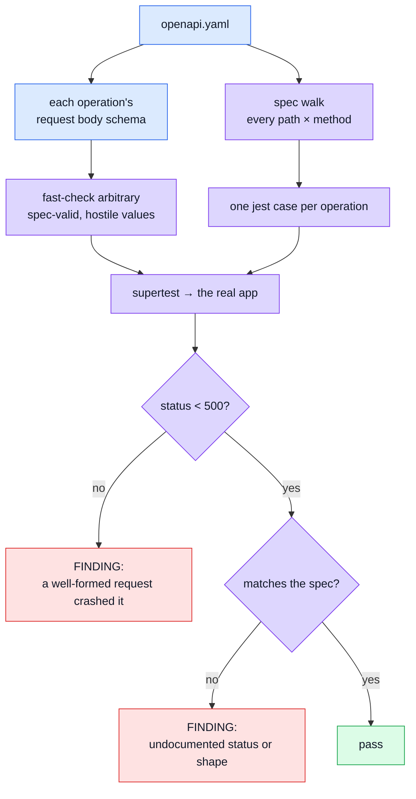

# Spec-Driven Fuzzing

Every other suite tests endpoints somebody thought about. This one tests the endpoints **nobody thought about** — including the ones added after it was written.

It walks `openapi.yaml`, generates requests for every operation it finds, throws them at the real app, and asserts two things: the server never answers **5xx**, and every response **matches the contract**.

## The idea

A test suite has a blind spot shaped exactly like its author's imagination. You write cases for the endpoint you just built, the bug you just fixed, the edge you happen to remember. Nothing writes a case for the endpoint a colleague added last month, or for the field you have never once sent as an empty string.

Fuzzing removes the author from the loop. The list of what to test comes from the contract, and the values come from a generator.

## Why the endpoint list is derived, never written

This is the property that makes it worth having, and it is why the suite does not contain a list of URLs.

A hand-maintained list rots. Somebody adds `PATCH /products/{id}`, nobody adds it to the fuzz list, and the suite reports green over a shrinking fraction of the API — the worst possible outcome, because it _looks_ like coverage.

`listOperations()` reads the spec. Add a route to `openapi.yaml` and it is fuzzed on the next run.

That auto-discovery is the main thing [`schemathesis`](https://schemathesis.readthedocs.io/) offers, and it is why choosing against it needed a reason. The reason is that this is a **boilerplate**: every project derived from it would inherit a Python toolchain alongside Node, for a capability that can be assembled from four things the repo already has — the spec, `fast-check`, `supertest`, and `jest-openapi`.

## Spec-valid, but hostile

The generated values are **legal per the contract** and **nasty within it**. Both halves matter, and getting this backwards is the usual way a fuzzer ends up testing nothing.

Generating outright garbage would mostly re-test the validator: every write endpoint parses its body with a generated Zod schema and answers 422. A wall of expected 422s is where a genuine 500 goes to hide.

So the generator honours `minLength`, `maximum`, `pattern`, `enum`, `format` and `minItems`, and then heads for the edges of what those allow:

| Kind    | What it reaches for                                                                                                                           |
| ------- | --------------------------------------------------------------------------------------------------------------------------------------------- |
| strings | empty, whitespace, `'null'`, `'undefined'`, emoji, right-to-left marks, 1000 characters, regex metacharacters, traversal and injection shapes |
| numbers | exactly `minimum`, exactly `maximum`, `0`, `1`                                                                                                |
| objects | optional properties genuinely omitted — "absent" is a different case from "empty"                                                             |
| arrays  | `minItems` respected, so the request is not rejected before it reaches the handler                                                            |

These are weighted rather than uniform. Uniform random strings essentially never produce an empty one.

## The two assertions

**No 5xx.** A malformed request deserves a 4xx. A 5xx means a well-formed request reached an unhandled throw — a correctness bug and an availability signal at once, especially on a public endpoint.

**The response matches the spec**, via `jest-openapi`'s `toSatisfyApiSpec()`. This checks the status code as well as the body, and it is sharp here because most schemas are `additionalProperties: false` — an undeclared field fails, and so does an undocumented status.

## The tripwire on itself

The obvious objection to a hand-rolled spec walk is: _who maintains it?_

The answer is that it maintains itself, loudly. `SUPPORTED_KEYWORDS` lists every JSON Schema keyword the generator honours, and a test fails when the spec starts using one that is missing.

That matters because the failure mode is otherwise **silent and green**: an unknown keyword means the generator stops constraining that field, the endpoint rightly rejects every request as 422, and the suite passes while testing the validator instead of the handler.

It has already fired once, for `minItems`.

When it fails, there are exactly two honest responses:

1. teach the generator the keyword, or
2. conclude the spec has outgrown a hand-rolled walk and reach for a real OpenAPI tool.

Silencing it is not on the list.

## What it does not cover

`multipart/form-data` operations are skipped. Their bodies are files, and `fast-check` has nothing useful to say about a PNG; the upload path is covered by `tests/integration/upload-security.test.ts`, which drives real magic-byte checks. A test asserts that the skipped set stays small, so "skipped" cannot quietly become "skipped everything".

## Why it is a nightly, not a PR gate

Same reasoning as [Mutation Testing](./mutation-testing.md): it is slow, and a failure is usually a **finding** that needs a person to read it rather than a red X that should stop a merge.

It also means a green PR is not a promise the fuzzer agrees — that is what the nightly is for.

## File map

| Path                                | Contents                                                                                         |
| ----------------------------------- | ------------------------------------------------------------------------------------------------ |
| `tests/fuzz/endpoints.fuzz.test.ts` | The driver: one jest case per operation, the two assertions, the self-tripwire                   |
| `tests/helpers/spec-walk.ts`        | Parses `openapi.yaml`, resolves `$ref`/`allOf`, enumerates operations, owns `SUPPORTED_KEYWORDS` |
| `tests/helpers/spec-arbitraries.ts` | JSON Schema → `fast-check` arbitrary, and the hostile-value tables                               |
| `tests/helpers/http.ts`             | The supertest harness and `authenticateAs`, shared with the integration and contract suites      |
| `tests/helpers/contract.ts`         | Registers `toSatisfyApiSpec()` against `openapi.yaml` (imported for its side effect)             |
| `.github/workflows/fuzz.yml`        | The nightly schedule and manual dispatch                                                         |

## Commands

| Command                                   | Effect                                            |
| ----------------------------------------- | ------------------------------------------------- |
| `npm run test:fuzz`                       | Run the whole fuzzer. Not part of `npm run test`. |
| `npx jest tests/fuzz -t 'POST /products'` | Fuzz one operation while working on it            |

The run is **seeded**, so a failure is reproducible rather than a story about something that happened once. A counterexample printed by `fast-check` can be pasted straight into a regression test.

## Related pages

- [Contract Testing](./contract-testing.md) — the same `toSatisfyApiSpec()` assertion, driven by hand-written cases
- [Contract-Derived Request Data](./contract-request-data.md) — generation from the zod side rather than the spec side
- [Property Testing](./property-testing.md) — the same generate-don't-enumerate idea, applied to pure functions
- [Mutation Testing](./mutation-testing.md) — the other hunter, and the other nightly
- [Testing & Docs](./testing-and-docs.md) — the map
