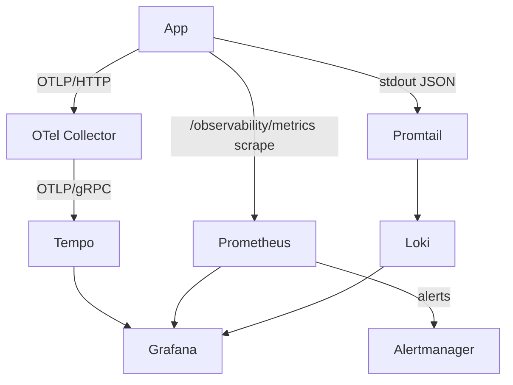

# Grafana

## What it is

Grafana is the **single UI** for all observability signals: traces (Tempo), metrics (Prometheus), and logs (Loki).

## Where to find it

- URL: `http://localhost:3001`
- Login: anonymous Admin in dev (no password)
- Datasources: **Tempo**, **Prometheus**, **Loki** (all auto-provisioned)
- Dashboards: **API Traces** (auto-provisioned)

Grafana dashboard JSON files live in `.docker/observability/grafana/dashboards/`.
Provisioning files live at:

- `.docker/observability/grafana.datasources.yaml`
- `.docker/observability/grafana.dashboard-providers.yaml`

## Find a request that broke

1. Look at the application log line — it carries a `trace_id`.
2. Open Grafana → **Explore** → datasource **Tempo**.
3. Paste the `trace_id`. You see the full span tree (HTTP → Express handler → DB query → Redis), with errors marked red.
4. Click the Loki link next to any span to jump to the correlated log lines.

## Full observability flow

## Stack overview

| Service        | Role                             | Local URL               | Image version                                  |
| -------------- | -------------------------------- | ----------------------- | ---------------------------------------------- |
| OTel Collector | Telemetry fan-out hub            | —                       | `otel/opentelemetry-collector-contrib:0.114.0` |
| Tempo          | Trace store                      | internal only           | `grafana/tempo:2.6.1`                          |
| Prometheus     | Metrics store / alert evaluation | `http://localhost:9090` | `prom/prometheus:v2.55.1`                      |
| Alertmanager   | Alert routing                    | `http://localhost:9093` | `prom/alertmanager:v0.27.0`                    |
| Loki           | Log store                        | `http://localhost:3100` | `grafana/loki:3.3.2`                           |
| Promtail       | Log shipper (Docker → Loki)      | —                       | `grafana/promtail:3.3.2`                       |
| Grafana        | Unified UI                       | `http://localhost:3001` | `grafana/grafana:11.4.0`                       |

## Admin API vs Grafana

The `/observability/*` endpoints expose the same metrics as Grafana but as a **point-in-time JSON snapshot** — no time axis, no historical trend. Use Grafana for SRE workflows; use the observability API as a data layer for a custom dashboard.

→ Full details: [Observability Endpoints](../api/observability.md)

## Useful links

- [Grafana documentation](https://grafana.com/docs/grafana/latest/)
- [Explore view](https://grafana.com/docs/grafana/latest/explore/)
- [Provisioning datasources & dashboards](https://grafana.com/docs/grafana/latest/administration/provisioning/)
- [Correlating logs and traces](https://grafana.com/docs/grafana/latest/datasources/loki/#derived-fields)

## Related pages

- [Observability Reference](./observability-reference.md)
- [Tempo](./tempo.md)
- [OpenTelemetry](./opentelemetry.md)
- [Prometheus](./prometheus.md)
- [Winston & Audit Logs](./winston.md)
