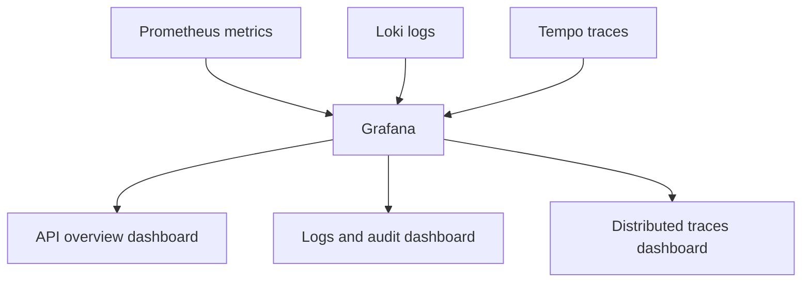

# Grafana

## Why Grafana has its own page

Grafana is where the different observability signals come together.
It is not just another dependency.
It is the **visual layer** over metrics, logs, and traces.

## Grafana view of the repo

## What this repo already gives you

Inside `docs/grafana-dashboards/` you already have dashboard JSON examples for:

- API overview
- logs and audit
- distributed traces

So Grafana is part of the boilerplate story, not a random afterthought.

## How to think about it

- [Prometheus](./prometheus.md) feeds metrics.
- [Winston + Loki](./winston.md) feed logs.
- [OpenTelemetry](./opentelemetry.md) feeds traces.
- Grafana gives the single screen that joins them.

## Related pages

- [Prometheus](./prometheus.md)
- [OpenTelemetry](./opentelemetry.md)
- [Winston & Audit Logs](./winston.md)
