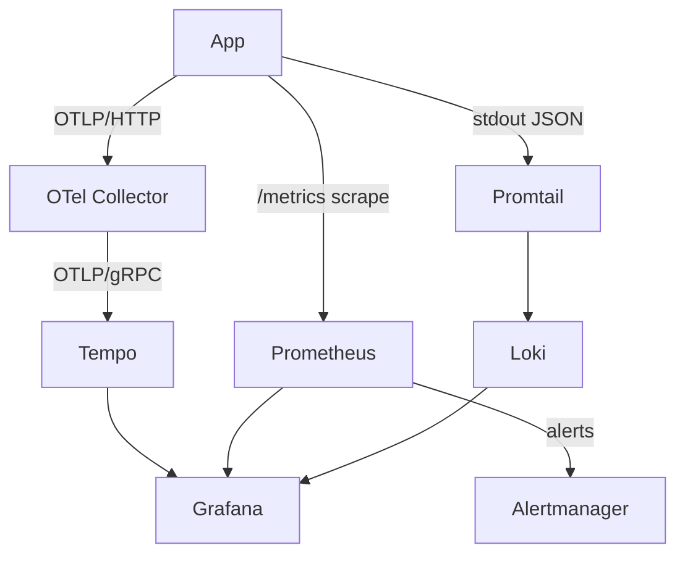

# Grafana

## What it is

Grafana is the **single UI** for all observability signals: traces (Tempo), metrics (Prometheus), and logs (Loki).

## Where to find it

- URL: `http://localhost:3001`
- Login: anonymous Admin in dev (no password)
- Datasources: **Tempo**, **Prometheus**, **Loki** (all auto-provisioned)
- Dashboards: **API Traces** (auto-provisioned)

Container, dashboards, and datasource provisioning all live in `.docker/observability/grafana/`.

## Find a request that broke

1. Look at the application log line — it carries a `trace_id`.
2. Open Grafana → **Explore** → datasource **Tempo**.
3. Paste the `trace_id`. You see the full span tree (HTTP → Express handler → DB query → Redis), with errors marked red.
4. Click the Loki link next to any span to jump to the correlated log lines.

## Full observability flow

## Stack overview

| Service       | Role                             | Local URL                    | Image version                              |
| ------------- | -------------------------------- | ---------------------------- | ------------------------------------------ |
| OTel Collector| Telemetry fan-out hub            | —                            | `otel/opentelemetry-collector-contrib:0.114.0` |
| Tempo         | Trace store                      | internal only                | `grafana/tempo:2.6.1`                      |
| Prometheus    | Metrics store / alert evaluation | `http://localhost:9090`      | `prom/prometheus:v2.55.1`                  |
| Alertmanager  | Alert routing                    | `http://localhost:9093`      | `prom/alertmanager:v0.27.0`                |
| Loki          | Log store                        | `http://localhost:3100`      | `grafana/loki:3.3.2`                       |
| Promtail      | Log shipper (Docker → Loki)      | —                            | `grafana/promtail:3.3.2`                   |
| Grafana       | Unified UI                       | `http://localhost:3001`      | `grafana/grafana:11.4.0`                   |

## Admin API vs Grafana

`GET /admin/*` endpoints return **the same underlying numbers you see in Grafana, but as a JSON snapshot** instead of a time-series graph.

| Admin endpoint | Grafana equivalent | Notes |
| --- | --- | --- |
| `GET /admin/metrics/summary` | Grafana KPI panels (requests, errors, latency, auth, business) | Reads the same prom-client counters/histograms that Prometheus scrapes. Identical numbers, no time axis. |
| `GET /admin/health` | Grafana health/uptime panels | Overlaps with Prometheus data (uptime, memory, DB status) but also adds info Prometheus doesn't track (Node version, OS info, integration flags). |
| `GET /admin/audit` | Loki log search | **Not** a Prometheus metric. Reads from an in-memory ring buffer of security/access events. You'd find the same data in Loki, not in a Grafana metric panel. |

**When to use which:**
- **Grafana** — historical time-series, trends, alerts, operator/SRE workflows.
- **`/admin/*`** — current point-in-time snapshot; useful for a custom product dashboard or lightweight health check without needing the full Grafana stack running.

## Custom app endpoints

These are separate from Grafana and serve a custom frontend or product UI:

| Endpoint                    | Auth     | Description                                       |
| --------------------------- | -------- | ------------------------------------------------- |
| `GET /metrics`              | public   | Prometheus exposition format — scraped by Prometheus |
| `GET /admin/metrics/summary`| admin JWT| Curated KPI snapshot for a custom dashboard       |
| `GET /admin/health`         | admin JWT| Full health: DB, Redis, integrations, memory      |
| `GET /observability/events` | public   | SSE stream: live metrics snapshot every 5 s       |

Use **Grafana** for operator/SRE workflows. Use **your backend endpoints** as the data layer for a custom product UI.

## Useful links

- [Grafana documentation](https://grafana.com/docs/grafana/latest/)
- [Explore view](https://grafana.com/docs/grafana/latest/explore/)
- [Provisioning datasources & dashboards](https://grafana.com/docs/grafana/latest/administration/provisioning/)
- [Correlating logs and traces](https://grafana.com/docs/grafana/latest/datasources/loki/#derived-fields)

## Related pages

- [Tempo](./tempo.md)
- [OpenTelemetry](./opentelemetry.md)
- [Prometheus](./prometheus.md)
- [Winston & Audit Logs](./winston.md)
