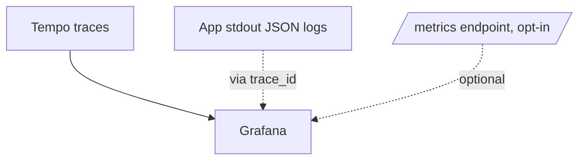

# Grafana

## What it is

Grafana is the **single UI** in this boilerplate's observability story.
You open it, search a trace, and see what happened.

## Where to find it

- URL: `http://localhost:3001`
- Login: anonymous Admin in dev (no password)
- Datasource: **Tempo** (auto-provisioned, default)
- Dashboards: **API Traces** (auto-provisioned)

Container, dashboards, and datasource provisioning all live in `.docker/observability/grafana/`.

## Find a request that broke

1. Look at the application log line — it carries a `trace_id`.
2. Open Grafana → **Explore** → datasource **Tempo**.
3. Paste the `trace_id`. You see the full span tree (HTTP → Express handler → DB query → Redis), with errors marked red.

## How signals come together

The current default ships **traces only** (Tempo). Logs stay on stdout (Docker captures them); metrics are exposed at `/metrics` for whoever wants to add a Prometheus scrape later.

## Useful links

- [Grafana documentation](https://grafana.com/docs/grafana/latest/)
- [Explore view](https://grafana.com/docs/grafana/latest/explore/)
- [Provisioning datasources & dashboards](https://grafana.com/docs/grafana/latest/administration/provisioning/)
- [Tempo datasource](https://grafana.com/docs/grafana/latest/datasources/tempo/)
- [Anonymous access config](https://grafana.com/docs/grafana/latest/setup-grafana/configure-security/configure-authentication/grafana/#anonymous-authentication)

## Related pages

- [Tempo](./tempo.md)
- [OpenTelemetry](./opentelemetry.md)
- [Prometheus](./prometheus.md)
- [Winston & Audit Logs](./winston.md)
