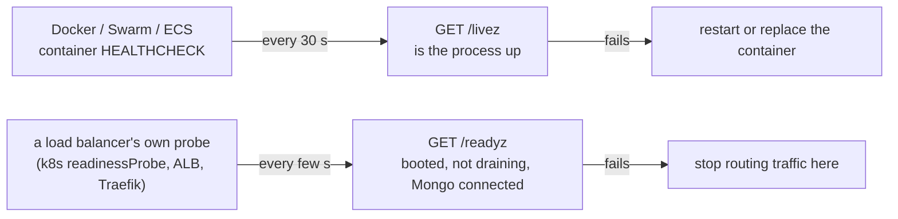

# Health checks

A container health check is a command Docker runs on a timer. Docker records `healthy` or
`unhealthy`, and other tools act on that word. This page says what each container's check tests,
and why it never tests more.

## The rule: one container, one job, one check

A health check tests **this container's own job**. Nothing else.

- **A web container** checks that the web process answers: `GET /livez`.
- **A long-running worker** checks its own loop, not the web port. `cron` asks supercronic's
  `/health`. Mastodon's `sidekiq` and Sentry's workers do the same.
- **A one-shot job** has no check. Its exit code is the signal, and
  `depends_on: service_completed_successfully` already reads it. `setup` sets `disable: true`.
- **A container never inherits a check for a job it does not do.** It could never pass. That is a
  permanent false alarm, and under Swarm a restart loop.

| Container  | Its check                                       | Where declared                                       |
| ---------- | ----------------------------------------------- | ---------------------------------------------------- |
| `app`      | `GET /livez`                                    | the image, and compose again (see [Podman](#podman)) |
| `cron`     | supercronic's `GET /health` on `127.0.0.1:9746` | compose                                              |
| `setup`    | none: `healthcheck: disable: true`              | `docker-compose.production.yml`                      |
| `database` | the database's own ping                         | compose                                              |
| `cache`    | the cache's own ping                            | compose                                              |
| `queue`    | the broker's own diagnostics                    | compose                                              |

## Liveness and readiness

Two questions, two endpoints.



| Endpoint                    | Answers                                                 | I/O  | Read by                           |
| --------------------------- | ------------------------------------------------------- | ---- | --------------------------------- |
| `GET /livez`                | Is the process up?                                      | none | every container HEALTHCHECK       |
| `GET /readyz`               | Should this instance receive traffic right now?         | none | a load balancer's own probe, only |
| `GET /`                     | The client-facing ping (the frontend's API-down banner) | none | a browser, never an orchestrator  |
| `GET /observability/health` | What exactly is missing? Admin only                     | some | an operator or a dashboard        |

Liveness never looks at a dependency:

- Spring Boot: a failing external system "would trigger massive restarts and cascading failures".
  [docs](https://docs.spring.io/spring-boot/reference/features/spring-application.html)
- Kubernetes: liveness must "truly indicate unrecoverable application failure".
  [docs](https://kubernetes.io/docs/concepts/configuration/liveness-readiness-startup-probes/)
- Microsoft's Health Endpoint Monitoring keeps the shallow and deep checks on separate endpoints.
  [pattern](https://learn.microsoft.com/en-us/azure/architecture/patterns/health-endpoint-monitoring)

A restart does not bring a downed Mongo back. So `/readyz` (which reads the Mongo connection) is
never a container check.

### Who reads Docker's HEALTHCHECK

| Platform                  | What "unhealthy" does                                                                                |
| ------------------------- | ---------------------------------------------------------------------------------------------------- |
| Plain Docker              | status only; restart policies act on exit, not health. `service_healthy` reads it                    |
| Docker Swarm              | kills and replaces the task                                                                          |
| Traefik (Docker provider) | drops the container from routing. The overlay uses the file provider instead, which does not read it |
| ECS / Fargate             | replaces the task, if the check is in the task definition                                            |
| Podman                    | only for images built with `--format docker`; the default OCI format drops it                        |
| Kubernetes                | ignores it. Use `livenessProbe` and `readinessProbe`                                                 |

## Readiness at the load balancer

Traefik does **not** read `/readyz` by default. There is one `app` replica on one host, so an
unready instance has nowhere else to send traffic. Traefik's own 503 also carries no CORS headers,
so the SPA would see a network error, not a readable one.

With two or more `app` replicas, uncomment `healthCheck` in the client's route file
(`traefik/dynamic/<name>.yml`, from `traefik/client.example.yml`):

```yaml
http:
    services:
        acme:
            loadBalancer:
                healthCheck:
                    path: /readyz
                    interval: 10s
```

`/readyz` answers 503 from the moment a shutdown signal arrives, but `server.close()` runs in the
same tick, so no probe sees it yet. A lame-duck delay between the two belongs with this change.

## Kubernetes and PaaS

| Here                 | There                                   |
| -------------------- | --------------------------------------- |
| `app` `GET /livez`   | `livenessProbe`                         |
| `app` `GET /readyz`  | `readinessProbe`                        |
| a startup wait       | `startupProbe` (optional; not built)    |
| `cron` (supercronic) | a `CronJob`, one per schedule. No probe |
| `setup`              | a `Job`, or a pre-upgrade hook          |

## Podman

Podman builds OCI images by default, and OCI has no `HEALTHCHECK`. So the `app` service repeats the
check in `docker-compose.production.yml` instead of leaning on the image. The compose block works
on both engines.

## Supercronic's `/health`

`cron` starts supercronic with `-prometheus-listen-address 127.0.0.1:9746`. That serves `/health`,
which answers `OK` while the scheduler runs, and `/metrics` (success and failure counters per job).
The loopback bind keeps both private to the container. Scraping `/metrics` needs a non-loopback
bind, which is not set up.
[source](https://github.com/aptible/supercronic/blob/master/prometheus_metrics/prommetrics.go)

Related: [The Observability Layer](./observability-layer.md), [Docker & Podman](./docker-and-podman.md).
