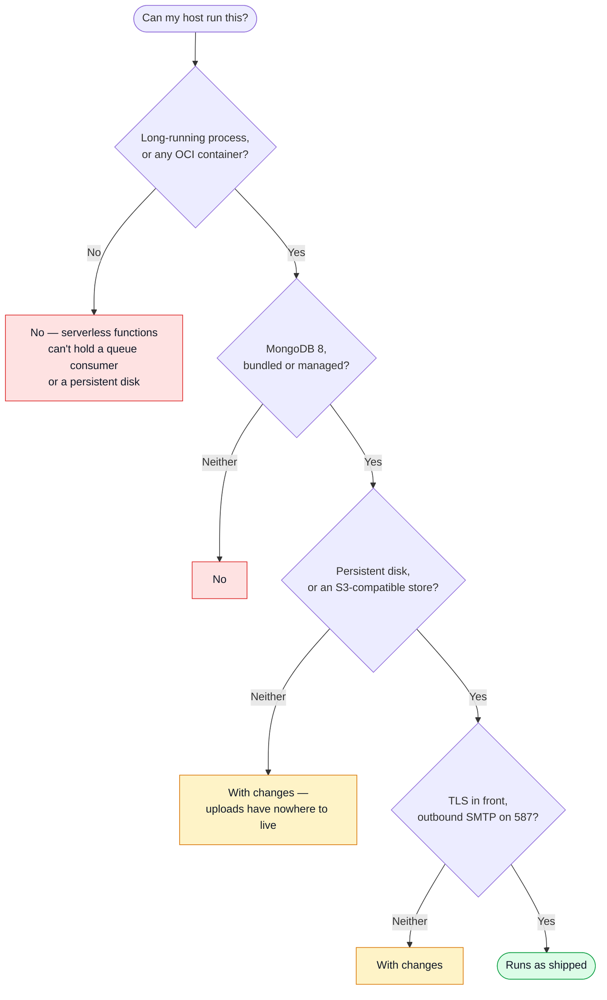
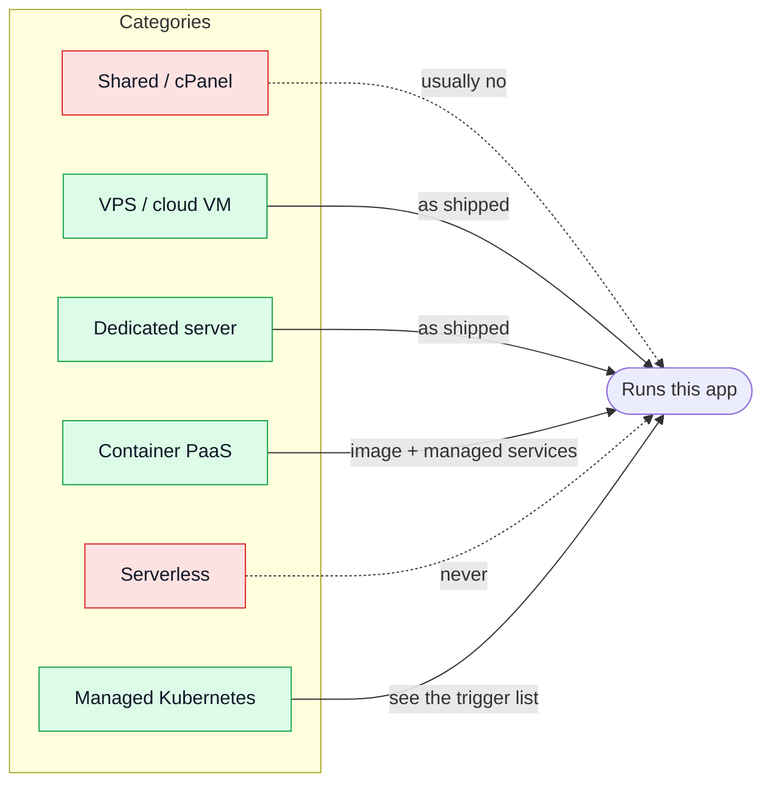

# Hosting

This boilerplate is **provider-neutral, deliberately.** It names what a host must offer and which
categories of provider offer it; it never picks one. Different deployments use different
providers, and this page stays a map rather than a recommendation.

::: warning Facts, not verdicts
Every fact below carries a **Verified** date — the day it was last checked against the vendor's own
pages. No automated check keeps these current; a stale row misleads rather than breaks, so
re-verify before you rely on one. The only verdict this page makes is "does the stack run here, and
how" — never "should you use this vendor."
:::

## 1 · What this app needs from a host

Read off the code, not assumed:

| Need                                                         | Required?                               | Why                                                                                                                                         |
| ------------------------------------------------------------ | --------------------------------------- | ------------------------------------------------------------------------------------------------------------------------------------------- |
| A long-running Node 25+ process, or an OCI container runtime | **Yes**                                 | The API, its queue consumers and its graceful shutdown all assume a process that stays up                                                   |
| MongoDB 8 — bundled or managed                               | **Yes**                                 | The only store of record; a single-node replica set is what the shipped compose file runs (see [Two Client Stacks](./two-client-stacks.md)) |
| A persistent disk for uploads                                | **Yes**, until an S3 image store exists | Uploaded images live on disk today; an ephemeral filesystem loses them on every deploy                                                      |
| TLS termination in front                                     | **Yes**                                 | The API listens on plain HTTP; its auth cookies need HTTPS                                                                                  |
| Outbound email (SMTP)                                        | **Yes**                                 | Signup verification, password reset. Some clouds block port 25 — 587 is what matters                                                        |
| A scheduler for the `ops/` jobs                              | **Yes**                                 | Reapers and sweeps. The compose file ships a `cron` container; a platform's own scheduler works too                                         |
| Redis                                                        | Optional                                | Response cache and shared rate-limit buckets — see [Redis Cache](./redis-cache.md). Without it, each process counts on its own              |
| RabbitMQ                                                     | Optional                                | Without it, email sends inline and webhook deliveries wait for the sweep — see [RabbitMQ](./rabbitmq.md)                                    |
| Chromium                                                     | Optional                                | Only the PDF invoice endpoint. About +200 MB of image                                                                                       |
| Memory                                                       | ~1–1.5 GB per full stack                | Node 250–400 MB, MongoDB's cache, the OS. 4 GB comfortably runs two stacks, 8 GB runs 8–10 small ones                                       |

**Serverless functions cannot run this app** — no long-lived process, no queue consumer, no local
disk to hold an upload between requests.

## 2 · Hosting categories, drawn

## 3 · The capability matrix

Prices move every few months — this page stopped tracking them ([§7](#7-keeping-it-true)). What
doesn't move nearly as fast is **control**: whether you get a shell, whether a database is a
managed add-on, where the region is. Those are the questions that actually decide "can I run the
shipped compose file here."

| Column            | Meaning                                                                                       |
| ----------------- | --------------------------------------------------------------------------------------------- |
| Node / Containers | Can it run a Node process at all? Any OCI image, docker-compose included?                     |
| Root / shell      | A host shell you install things on, versus a shell into a container the platform runs for you |
| Managed MongoDB   | A first-party database-as-a-service, not just "you can `docker run mongo` yourself"           |
| EU region         | Where the data can physically live                                                            |
| HQ jurisdiction   | Whose law governs the company that holds the data — see [§6](#6-the-data-protection-lens)     |
| Runs this stack   | **As shipped** (compose) · **With changes** (say which) · **No** (say why)                    |
| Pricing           | Link only — no figure restated here, see the warning above                                    |

A handful of concrete hosts, one or two per category, chosen by the rule in
[§7](#7-keeping-it-true):

| Host                      | Category       | Node/Containers        | Root/shell                             | Managed MongoDB                                    | EU region                          | HQ                   | Runs this stack | Pricing                                                                  | Verified   |
| ------------------------- | -------------- | ---------------------- | -------------------------------------- | -------------------------------------------------- | ---------------------------------- | -------------------- | --------------- | ------------------------------------------------------------------------ | ---------- |
| HostGator shared (cPanel) | Shared         | No                     | No                                     | No                                                 | No                                 | US                   | No              | [Plans](https://www.hostgator.com/web-hosting)                           | 2026-09-12 |
| HostGator VPS (KVM)       | VPS            | Yes                    | Full root, SSH                         | No — self-install only                             | No                                 | US                   | As shipped      | [VPS plans](https://www.hostgator.com/vps-hosting)                       | 2026-09-12 |
| Hetzner Cloud             | VPS            | Yes                    | Full root, SSH                         | No — self-install only                             | Yes (Germany, Finland)             | Germany              | As shipped      | [Cloud pricing](https://www.hetzner.com/cloud/)                          | 2026-09-12 |
| OVHcloud Public Cloud     | VPS            | Yes                    | Full root, SSH                         | **Yes** — managed database add-on                  | Yes (France + more)                | France (SecNumCloud) | As shipped      | [Public Cloud pricing](https://www.ovhcloud.com/en/public-cloud/prices/) | 2026-09-12 |
| DigitalOcean Droplets     | VPS            | Yes                    | Full root, SSH                         | No — self-install only                             | Yes (Amsterdam, London, Frankfurt) | US                   | As shipped      | [Droplet pricing](https://www.digitalocean.com/pricing/droplets)         | 2026-09-12 |
| Render                    | Container PaaS | Image only, no compose | Shell into the container, not the host | No — a self-managed private service, not an add-on | Yes (Frankfurt only)               | US                   | With changes    | [Pricing](https://render.com/pricing)                                    | 2026-09-12 |

A dedicated server from a shared-hosting vendor (HostGator's own included) profiles identically to
that vendor's VPS row — physical rather than virtual, same root and network story.

**A shared/cPanel host is the example that motivated the "with changes" — really "no" — outcome.**
`.env-example` names HostGator as an SMTP host precisely because "can't run the app, can still send
its mail" is a real, useful answer for a host that can do nothing else here.

**Container PaaS** (Render above; Railway, Fly.io, Heroku, DigitalOcean App Platform and Koyeb read
the same way) runs a built image directly — the compose file itself doesn't apply. A platform
without a persistent disk needs the (not-yet-built) S3 image store, and its managed
Postgres/Redis-shaped add-ons stand in for the bundled services. **None of the PaaS options checked
manage MongoDB itself** — only Postgres/MySQL/Redis-family engines — so Mongo there means "run your
own container," the opposite of what "managed" means for every other engine on the same platform.

**Managed Kubernetes** is out of scope for this table entirely — only relevant once
[a trigger fires](../theory/tenancy.md#9-when-to-revisit-this-decision), and nothing here is
provider work until then.

## 4 · How to deploy, per category

| Category           | What actually runs                                                                                                                                                                                                      |
| ------------------ | ----------------------------------------------------------------------------------------------------------------------------------------------------------------------------------------------------------------------- |
| VPS / dedicated    | The compose file as shipped — see [Getting Started — Production](../getting-started-production.md)                                                                                                                      |
| Container PaaS     | The image `docker build -f docker/Dockerfile.production` produces, plus the platform's own managed Postgres/Redis in place of the bundled ones — none checked manage MongoDB itself, see [§3](#3-the-capability-matrix) |
| Managed Kubernetes | Not yet — see the trigger list linked above                                                                                                                                                                             |

## 5 · Managed backing services — "compatible, not identical"

A managed MongoDB, Redis or RabbitMQ is not a drop-in guarantee of identical behaviour, only of the
same wire protocol:

- **MongoDB Atlas** is 75% of MongoDB Inc.'s own Q3 FY2026 revenue (confirmed against the
  [company's own filing](https://investors.mongodb.com/news-releases/news-release-details/mongodb-inc-announces-third-quarter-fiscal-2026-financial),
  re-checked 2026-09-12) and the dominant managed offering; its free M0 tier includes EU regions
  (Milan among them) but is capped at 512 MB, pauses after 30 idle days, and ships no backups —
  fine for evaluating this boilerplate, not for a client relying on it.
- **Azure Cosmos DB for MongoDB** and **AWS DocumentDB** both speak the MongoDB wire protocol
  without being MongoDB — features this app might one day use (a specific aggregation operator, a
  specific index type) are the risk, not a certainty; check the specific feature against the
  vendor's own compatibility page before relying on it.
- Switching from bundled to managed is already a config change, not a code one —
  `COMPOSE_PROFILES` and three `NODE_*_URL` variables are the whole switch. See
  [Two Client Stacks](./two-client-stacks.md).

## 6 · The data-protection lens

Facts to weigh, not a verdict this page makes for you:

- The **US CLOUD Act** lets US authorities compel a US-headquartered provider to produce data
  wherever it is stored — a tension with GDPR Article 48 that remains unresolved as of this
  writing.
- **EU-headquartered options exist at every tier**: Hetzner (German GmbH), OVHcloud and Scaleway
  (French), Aruba (Italian). OVHcloud additionally holds the French SecNumCloud qualification.
- **MongoDB Atlas itself runs on AWS, Google Cloud or Azure** — choosing Atlas over a self-hosted
  Mongo does not remove a US company from the processing chain, it adds a second one.
- None of this is a recommendation for or against any provider — it is what a client's own DPA and
  risk tolerance should be weighed against.

## 7 · Keeping it true

- Re-verify a row by visiting the vendor's own docs, not its marketing page — a capability drifts
  far slower than a price, but it still drifts: a provider adds or drops a managed engine, opens or
  closes a region. Re-check by updating that row's **Verified** date, not the whole table.
- This page deliberately carries no prices. A **Pricing** link points at the vendor's own current
  page instead of a number that would be wrong within months — this page tracked two managed
  Kubernetes prices in euros once, and both had moved by the time they were next checked.
- The provider list itself is chosen by rule, not by taste: a large US hyperscaler-adjacent VPS
  (DigitalOcean), the largest EU-native VPS providers (Hetzner, OVHcloud), the shared-hosting
  example that motivated the "with changes" column (HostGator), and one representative container
  PaaS (Render). Add a row when a rule-based candidate is missing; drop one only when it stops
  meeting the rule.

## Where to go next

| You want to                                | Read                                                             |
| ------------------------------------------ | ---------------------------------------------------------------- |
| Run a single stack, start to finish        | [Getting Started — Production](../getting-started-production.md) |
| Run two, on one host                       | [Two Client Stacks](./two-client-stacks.md)                      |
| Understand why one stack serves one client | [Tenancy](../theory/tenancy.md)                                  |
| Back up what a stack holds                 | [Backups](./backups.md)                                          |
