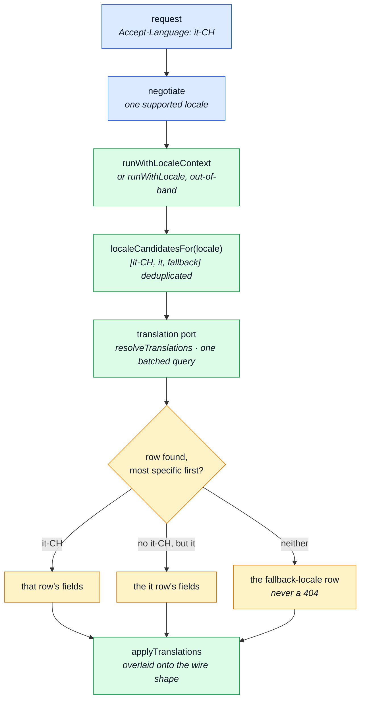

# Internationalisation

Every user-facing string this API answers with comes from a dictionary, never from a literal at the
call site — `eslint/rules/no-hardcoded-user-text.ts` enforces it. This page is how the dictionary
reaches a request, and where that mechanism stops working.

---

## Why `t` is not imported from `i18next`

`i18next`'s default export is a **single global instance with a single active language**. Importing
`t` from it gives every request the same language, and the only way to change it —
`i18next.changeLanguage()` — mutates that global _and_ is async.

Two overlapping requests in different languages therefore interleave, and one gets answered in the
other's language. That is a bug which only appears under concurrency: never in a test, always in
production.

`getFixedT(locale)` returns a `t` bound to one language and touches no global. An
`AsyncLocalStorage` carries it down the request's async chain, so code twelve calls deep reaches it
without `t` being threaded through twelve signatures. Call sites import `t` from
`@infrastructure/i18n` and otherwise keep their shape.

## What is in the module

`@infrastructure/i18n` is a directory with a barrel, not a file. Four change drivers, four files:

| File           | Answers                                                                                   |
| -------------- | ----------------------------------------------------------------------------------------- |
| `catalog.ts`   | Where translations come from — which languages exist, and the per-module dictionary merge |
| `overrides.ts` | The database overlay on top of those files, and the timer that re-reads it                |
| `context.ts`   | The `AsyncLocalStorage` carrying one request's `t`, and the ambient `t` itself            |
| `negotiate.ts` | Turning an `Accept-Language` header into one supported locale                             |

Every call site imports `@infrastructure/i18n` and none of them names a file, which is what lets
the split move. The only edge inside the directory is `overrides` → `catalog`, one way — so a
project that does not want admin-editable copy deletes `overrides.ts` and its two lines in the boot
sequence, rather than performing surgery on the file that also owns request-scoped `t`.

## Where the ambient `t` stops working

ALS is scoped to an async **call chain**, not to a block or a variable. Anything that leaves the
chain leaves the store behind, and `t` falls back to the global instance — silently.

| Boundary                                          | What happens                                                                                                                | What to do                                                           |
| ------------------------------------------------- | --------------------------------------------------------------------------------------------------------------------------- | -------------------------------------------------------------------- |
| **Queued work**                                   | `enqueueEmail` publishes to a queue a worker drains later, possibly in another process. The store does not survive the hop. | Carry the locale in the payload and bind with `runWithLocale`.       |
| **Callbacks registered before the chain started** | Module-scope subscriptions and timers set at boot run outside any store.                                                    | Bind explicitly if they produce copy.                                |
| **Jobs, scripts, tests**                          | No request at all.                                                                                                          | Nothing — the fallback is deliberate and is what keeps them working. |

The fallback never throws and never returns a raw key: outside a request you get the boot locale.

## Which languages exist

`NODE_SUPPORTED_LOCALES` wins when set — useful to ship a dictionary without exposing it yet.
Otherwise **the directory listing is the list**, so adding `src/locales/<locale>.json` is the only step
needed to add a language.

::: warning Read once, then cached — and that is load-bearing
`i18next.init()` registers its resources from this list at boot and never revisits them. A
per-request directory read would let the two disagree: drop a new `<locale>.json` onto a running server and the
middleware starts negotiating `es` and answering `Content-Language: es`, while i18next has no
Spanish resource and silently serves the fallback.

**A header that lies is worse than the language being unavailable.** Caching makes "what we
negotiate" and "what we can actually resolve" the same list, at the cost of a restart to add a
locale — which is what a deploy does anyway.
:::

## Two tiers, and they never merge

The API's own dictionaries (`src/locales/*.json` plus every module's `locales/`) are what `t()`
resolves. They are separate from the frontend-tenant rows a frontend downloads for its own UI —
see the `locales` module.

A module's contribution is layered on top of the shared file, so a module _can_ shadow a shared key.
Nothing does, and `tests/cross-cutting/locale-namespaces.test.ts` fails if one starts: a module
quietly overriding `generic.error-internal` would change copy the paired frontend also reads.

## Database overrides

The files are **defaults**. Someone who never opens a code editor can override any key from the
admin screens, and those edits are backend-tenant rows in the `locales` module's collection.

Three properties this layer keeps, in the order they matter:

1. **The files still stand alone.** Nothing in the overlay is awaited on the request path, and an
   empty overlay is indistinguishable from no overlay. Mongo down, provider unregistered, refresh
   never called — `t()` resolves from the deployed files exactly as it did before overrides
   existed. This is the property the whole locales module was arranged around, and the one the
   addition was most at risk of quietly spending.
2. **Overrides never accumulate.** A refresh restores the file baseline **before** re-applying, so
   deleting a row actually removes its effect. Merging onto whatever the last refresh left would
   make a deleted override permanent until a restart — the failure nobody reports, because it looks
   like the delete simply did not save. Every supported language is restored, not just the ones the
   refresh carries overrides for.
3. **Only a language with a file can be overridden.** The supported list is read once at boot and
   is what the middleware negotiates against, so a language reachable only through the database
   would be one this instance answers `Content-Language` for and cannot resolve. Rows for such a
   language are skipped and logged.

Cross-worker staleness is real and bounded: each worker holds its own overlay, so an edit is
visible immediately in the worker that served the write and within one refresh interval in the
others. That is the cost of keeping a database read off the request path, and it is the right trade
for copy.

## Tier 3: user-authored content

Tiers 1 and 2 are the shop's OWN copy — buttons, messages, screens. Tier 3 is a different axis
entirely: words an editor writes, about something the shop sells — a product's
`title`, its `description`. Stored as rows in the `translations` collection, one per
`(entityType, entityId, locale)` — see [`locales`](../modules/locales.md#the-translations-collection)
for the row shape and its two write doors.

It reuses tier 1/2's own concepts rather than inventing new ones:

- **Which languages exist, and which are `active`** — the same `locales` collection tier 2's
  override rows key off, read through `localeRepository`, not a second list.
- **The fallback locale** — `getFallbackLocale()` (`NODE_FALLBACK_LOCALE`, defaulting to `en`,
  `src/infrastructure/i18n/catalog.ts`), the same constant tier 1 falls back to on a missing key.
  A product's fallback-locale row IS its source: there is no separate `sourceLocale` field.

### The resolve/fallback path

`localeCandidatesFor(locale)` (`src/infrastructure/i18n/translation.ts`) turns one negotiated
locale into the fallback CHAIN a resolver query walks, most specific first: the exact tag, its base
language, then the deployment's fallback — deduplicated, so a base tag requested directly does not
appear twice. All three are known before any query runs, which is what keeps a whole page's
resolution to one query rather than one per entity.

Two callers drive this, both through the same port
(`resolveTranslations`/`applyTranslations` in `src/infrastructure/i18n/translation.ts`):

- **The read path** — a product list or detail read overlays the caller's own negotiated locale,
  ambient via `AsyncLocalStorage` (`context.ts`), no signature threading.
- **An order-snapshot freeze** — resolves into the BUYER's locale, not the request's, so it binds
  explicitly with `runWithLocale` (the snapshot resolver in `src/modules/orders/services/`) rather than reading
  the ambient one. Once frozen onto the order line, it is never re-resolved.

An entity search follows the same chain: `searchTranslatedEntityIds` unions a match in the caller's
locale candidates with the entity's own fallback-language column, so a term that only appears in
one translated row is still found.

## Related pages

- [`locales`](../modules/locales.md#the-translations-collection) — the collection tier 3 stores rows in
- [`products`](../modules/products.md#translated-content) — the one entity translatable today
- [Request Flow](../theory/request-flow.md) — where locale negotiation sits in the middleware stack
- [Email & PDF Rendering](./email-and-rendering.md) — why a queued email carries its own locale
- [Modules](../theory/modules.md) — how a module registers its `locales/` directory
