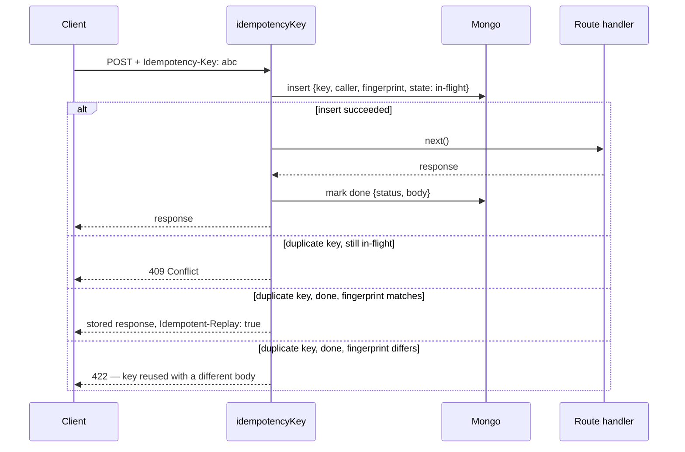

# Idempotency

## The problem it solves

HTTP clients retry. A mobile app POSTs `/orders`, the server commits, and the connection drops
before the response arrives. The client retries — correctly, by its own lights. Two orders, one
charge each. The same happens with a load balancer's retry policy, a `fetch` wrapper with
backoff, or a user double-tapping a submit button. This is the default behaviour of every
network, not an edge case.

The repo already has plenty of DOMAIN idempotency — a reservation keyed on a reservation id, a
provider callback keyed on its own reference — but none of it helps a client retrying a request
the server has never seen before, because the client's own "this is the same attempt" fact is
one only the client holds. `Idempotency-Key` is how it hands that fact to the server.

## How it works

`src/infrastructure/http/middlewares/idempotency.ts` is the middleware; the schema lives beside
it in `idempotency-model.ts`. Mounted per route — never globally, the same way
`src/infrastructure/http/middlewares/cache.ts`'s `setCache` is — and a no-op when the caller
sends no header at all: the feature is a courtesy the client opts into, not a requirement the
server makes.

The lock is one atomic insert against a unique index on `(key, caller)`. Whoever's insert lands
first runs the handler; every other insert collides with `E11000`, and that collision — not a
second lookup — is what decides which of the three outcomes above a retry gets. "Caller" is the
authenticated account id, or the request's address for a public route with no account yet
(signup, the contact form) — scoping by caller is what stops one person from reading another's
cached reply merely by guessing or observing their key.

## Why Mongo, not Redis

`docker-compose.yml` runs the cache with `--maxmemory-policy allkeys-lru`: under memory
pressure Redis evicts **any** key, including one written seconds ago with hours left on its TTL.
An evicted idempotency record does not fail loudly — it silently becomes a duplicate write, at
exactly the moment the system is under load and least able to notice. An idempotency ledger is a
source of truth, so — like every other durable, TTL-bound collection in this repo
(`auditlogs`, `carts`, `feedbackrequests`) — it lives in Mongo.

## Where it is mounted

| Route                                   | Why                                                                                        |
| --------------------------------------- | ------------------------------------------------------------------------------------------ |
| `POST /orders`                          | Admin order creation; a retried request must replay the same order, not mint a second one. |
| `POST /payments/intent`                 | Freezes an order's price into a payment intent.                                            |
| `POST /payments/{id}/confirm`           | Charges the card.                                                                          |
| `POST /payments/order/{orderId}/refund` | Returns money — a double submit must refund once.                                          |
| `POST /account/signup`                  | Sybil accounts aside, a retried signup must not create two.                                |
| `POST /feedback/contact`                | The public contact form has no other identity to dedupe a retry on.                        |

`POST /payments/{id}/sync` deliberately has no `idempotencyKey`: it is already idempotent by
construction, keyed on the provider's own payment reference rather than a client-supplied one.

## Retention

`NODE_IDEMPOTENCY_RETENTION_HOURS` (default 24) backs a TTL index on `createdAt`, the same
pattern as every other retained collection — see
[Data retention](../reference/data.md#ttl-windows) for the caveat on changing it after the index
already exists.
