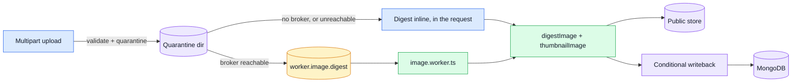

# Image processing

Every uploaded image goes through a **digest pipeline** before it is ever served: metadata (EXIF
GPS, camera serial, capture timestamp) is stripped, dimensions are capped, and the bytes are
re-encoded through [sharp](https://sharp.pixelplumb.com/) — which is also the real content check
`validateUploadedImages`'s magic-byte read cannot be. A WebP thumbnail is produced alongside it.
Nothing reaches `public/` until both exist.

This page is the pointer to the code and the operational knobs: what the pipeline does, where each
stage lives, and which environment variables move it.

## Why quarantine

`static-assets.ts` serves `public/` with `maxAge: '1y', immutable: true` — the URL a client fetches
**is** the persisted `imageUrl`, and it can never be revalidated or cache-busted. That makes one rule
non-negotiable: **nothing that will mutate the bytes may happen after they are publicly reachable.**

So an upload lands in `NODE_QUARANTINE_PATH` first — durable (it must survive a restart while a job
is pending), but outside `NODE_PUBLIC_PATH`, so nothing unvalidated is ever fetchable. Only the
digest job promotes it.

| Path                       | Lifetime                | Durability                     | Served           |
| -------------------------- | ----------------------- | ------------------------------ | ---------------- |
| `NODE_UPLOAD_STAGING_PATH` | during the request      | ephemeral, tmp is fine         | no               |
| `NODE_QUARANTINE_PATH`     | until the job completes | **durable, outside `public/`** | no               |
| `NODE_PUBLIC_PATH`         | forever                 | durable                        | yes, `immutable` |

`NODE_QUARANTINE_PATH`'s own unset default happens to live under `tmp/`, gitignored like everything
else there — a local-dev convenience, not a contradiction of "durable": a real deployment always
overrides the variable to point at its own mounted volume instead (see
`docker-compose.production.yml`), and durability comes from that mount, never from the default
path's name.

## Architecture

## Where the code lives

| Concern                                          | File                                                                         |
| ------------------------------------------------ | ---------------------------------------------------------------------------- |
| sharp wrapper — `digestImage`/`thumbnailImage`   | `src/infrastructure/adapters/image.ts`                                       |
| Storage — quarantine/promote/derivative/remove   | `src/infrastructure/adapters/image-store.ts`                                 |
| Upload middleware — quarantine + inline fallback | `src/infrastructure/http/middlewares/upload.ts` → `quarantineUploadedImages` |
| Shared pipeline + queue worker + inline dispatch | `src/infrastructure/adapters/image.worker.ts`                                |
| Queue name                                       | `src/infrastructure/adapters/queue.ts` → `IMAGE_QUEUE`                       |
| Worker registration                              | `src/app/workers.ts`                                                         |
| Module writeback registration                    | `src/kernel/registry.ts` → `ImageTarget`, `resolveImageTargets`              |
| `products` writeback                             | `src/modules/products/repository.ts` → `writebackImage`                      |
| `users`/`account` writeback                      | `src/modules/users/repository.ts` → `writebackImage`                         |
| Quarantine reaper                                | `scripts/ops/reap-quarantine.ts`                                             |

## How it's used

### Queue reachable (the normal path)

1. `quarantineUploadedImages` quarantines the staged upload and sets `request.quarantinedImageKeys`
   — gated on `queueState() === 'ready'`, a live reachability check, not just "a broker is
   configured somewhere". A broker that's configured but down takes the fallback below, the same as
   no broker at all.
2. The controller persists the document with the pending-image placeholder
   (`imageUrl`/`thumbnailUrl`) and the quarantine key as `pendingImageKey`.
3. The module's service calls `enqueueImageDigest`, which publishes to `worker.image.digest`.
4. `handleImageDigestJob` digests, promotes both files, then writes back — **conditionally**, on
   `pendingImageKey` still matching the job's key — before clearing the quarantine file.

### No broker, or one that's unreachable (fallback)

`quarantineUploadedImages` runs the entire pipeline inline, synchronously, before the request
reaches the controller. The response carries the real `imageUrl`/`thumbnailUrl` immediately; the
placeholder and `pendingImageKey` are never touched. Same shape as `enqueueEmail` falling back to
sending inline — see `docs/tools/rabbitmq.md` — except gated on liveness rather than
configuration, for the reason above.

### The residual race, and why it's awaited

`pendingImageKey` can still end up set even though the broker is down: `queueState()` is a cached
signal, not a probe on every request, so the very first request after a broker dies (before
anything has failed against it yet) still takes the queue path. When `enqueueImageDigest`'s
`publishToQueue` call then fails, it falls back to running the digest inline — same code as the
no-broker path, but reached from the shared `enqueueIfImagePending` helper that `users`'/`products`'
`enqueueIfPending` both call, instead of the middleware. That fallback is **awaited**, not
fire-and-forget: without it, the response can return
before the file is on disk, and if the document changes before the inline run's writeback
resolves, the conditional writeback described below "corrects" it by deleting the file the inline
run just promoted.

### Why the writeback is conditional

`pendingImageKey` is not bookkeeping — it is what makes two concurrency problems resolve
themselves instead of needing a lock:

- **A second upload racing the first job.** The writeback only applies when `pendingImageKey`
  still equals the job's key. A stale/duplicate delivery therefore matches nothing, and the worker
  unlinks the files it just promoted — safely, now that `promote`/`putDerivative` name a file from
  the RE-ENCODED bytes' own content hash rather than the quarantine key: a second upload is
  different content, lands under a different name, and this cleanup can no longer touch it. Before
  that fix, both uploads' files shared the same key-derived name, so this branch could delete the
  newer upload's live file, not just the stale one's.
- **Two documents sharing byte-identical images.** The content hash alone is not enough: two
  different products uploading the exact same picture would land on the same filename, and one
  document's delete or replace would silently remove the other's still-live file. `contentStem`
  salts the hash with the owning document's id (`<ownerId>-<hash>`, or the quarantine key itself
  before the document exists yet), so identical bytes still get distinct files per owner.
- **The document being deleted mid-flight.** Same mechanism — no match, no orphaned write, files
  cleaned up.

It also makes `db.products.find({ pendingImageKey: { $exists: true } })` the answer to "which
records are stuck on the placeholder", with the dead-letter queue explaining why.

## The pending-image placeholder

`public/images/system/pending.png` and `public/images/system/pending-thumb.webp` are committed,
blank placeholders — override with `NODE_PENDING_IMAGE_URL` / `NODE_PENDING_THUMBNAIL_URL`. They
are a real, fetchable url for the duration of the digest job, distinct from
`NODE_DEFAULT_IMAGE_PRODUCT` / `NODE_DEFAULT_IMAGE_USER` (a record that never had an upload at
all) and from the frontend's own "no image" placeholder — three different states worth telling
apart.

## Configuration

| Variable                          | Default                             | Meaning                                                                                           |
| --------------------------------- | ----------------------------------- | ------------------------------------------------------------------------------------------------- |
| `NODE_QUARANTINE_PATH`            | `tmp/quarantine`                    | Where uploads wait between staging and digesting                                                  |
| `NODE_IMAGE_MAX_INPUT_PIXELS`     | `50_000_000`                        | Decompression-bomb guard, checked before any resize                                               |
| `NODE_IMAGE_MAX_DIMENSION`        | `2048`                              | Longest edge of a digested original                                                               |
| `NODE_IMAGE_THUMBNAIL_DIMENSION`  | `320`                               | Longest edge of a thumbnail                                                                       |
| `NODE_PENDING_IMAGE_URL`          | `/images/system/pending.png`        | Placeholder shown while a digest job is pending                                                   |
| `NODE_PENDING_THUMBNAIL_URL`      | `/images/system/pending-thumb.webp` | Placeholder thumbnail, same lifetime as the above                                                 |
| `NODE_QUARANTINE_RETENTION_HOURS` | `24`                                | Age at which `reap:quarantine` unlinks a leftover file                                            |
| `NODE_MAX_UPLOAD_BYTES`           | `5242880` (5 MB)                    | Largest file multer accepts, per file — its own default is unlimited, so this is the only ceiling |

## Maintenance

- **`npm run reap:quarantine`** — deletes quarantine files older than
  `NODE_QUARANTINE_RETENTION_HOURS`. Meant to run periodically (cron, a scheduled container task);
  a normal run of the pipeline never leaves a file behind for it to find.

## Operational notes

- **`sharp.concurrency(1)` and `sharp.cache(false)`** are set once, at import — `registerWorkers()`
  runs in every cluster fork, so without this a multi-core deployment runs N forks × sharp's own
  thread pool × libvips's own cache.
- **Alpine/musl.** The runtime image is `node:25-alpine`. `@img/sharp-linuxmusl-x64`/`-arm64` both
  exist, so `npm install` needs no compiler, but sharp's own docs flag allocator fragmentation
  under musl for long-running processes — worth a `k6` soak test before relying on it at scale.
- **Remote and default images get no thumbnail.** `thumbnailUrl` stays absent when `imageUrl` is a
  body-supplied or default url rather than an upload; there is nothing local to derive one from.
- **A dead broker logs at `error`, not `warn`.** Unlike Redis (a pure optimisation loss),
  `queue.ts`'s `unavailableLevel: 'error'` reflects that losing RabbitMQ here changes real
  behavior — every image upload starts paying the full inline digest cost — so it's worth routing
  to on-call. `onRecovered` logs the matching "reachable again" line. See
  `db.<collection>.find({ pendingImageKey: { $exists: true } })` above for the complementary,
  per-record signal.
