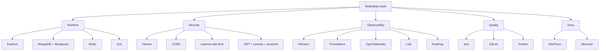

# Tools

This section explains **why dependencies exist**.

> OpenAPI-specific tools are documented in [API](../api/), not here.

## Tool map

## Read by intent

| Need | Go to |
| --- | --- |
| Understand runtime and security dependencies | [Runtime & Security](./runtime-and-security.md) |
| Understand logging, metrics, tracing, testing, and docs tooling | [Observability & Quality](./observability-and-quality.md) |
| Understand OpenAPI Generator, Spectral, Prism, Bruno, or Mockoon | [API](../api/) |

## Boilerplate reminder

These tools are here as **good defaults and examples**.
Use them as building blocks, not as rules that every future project must copy 1:1.
