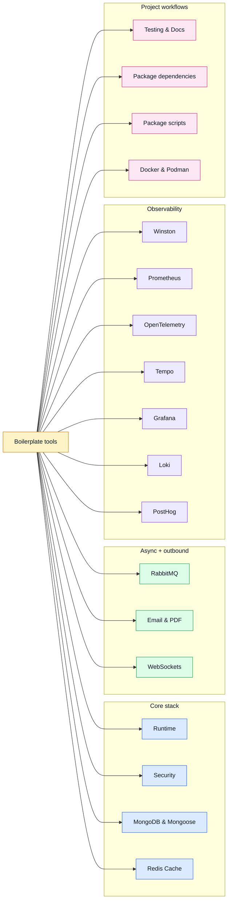

# Tools

This section explains **why dependencies exist** and where they fit in the app.

> OpenAPI-specific tools are documented in [API](../api/), not here.

## Tool map

## Read by intent

| Need                                                             | Go to                                                                                                                                                                                                                                          |
| ---------------------------------------------------------------- | ---------------------------------------------------------------------------------------------------------------------------------------------------------------------------------------------------------------------------------------------- |
| Understand framework-level dependencies                          | [Runtime](./runtime.md)                                                                                                                                                                                                                        |
| Understand security middleware and auth helpers                  | [Security](./security.md)                                                                                                                                                                                                                      |
| Understand persistence and cache tools                           | [MongoDB & Mongoose](./mongodb-mongoose.md) and [Redis Cache](./redis-cache.md)                                                                                                                                                                |
| Understand transactional email and PDF generation                | [Email & PDF Rendering](./email-and-rendering.md)                                                                                                                                                                                              |
| Understand message queue patterns                                | [RabbitMQ](./rabbitmq.md)                                                                                                                                                                                                                      |
| Understand real-time messaging scaffolding                       | [WebSockets](./websockets.md)                                                                                                                                                                                                                  |
| Understand logs, metrics, traces, dashboards, and analytics      | [Observability Reference](./observability-reference.md), [Winston](./winston.md), [Prometheus](./prometheus.md), [OpenTelemetry](./opentelemetry.md), [Tempo](./tempo.md), [Grafana](./grafana.md), [Loki](./loki.md), [PostHog](./posthog.md) |
| Understand tests and docs tooling                                | [Testing & Docs](./testing-and-docs.md)                                                                                                                                                                                                        |
| Understand `package.json` dependency groups                      | [Package Dependencies](./package-dependencies.md)                                                                                                                                                                                              |
| Understand `package.json` scripts                                | [Package Scripts](./package-scripts.md)                                                                                                                                                                                                        |
| Understand local container setup                                 | [Docker & Podman](./docker-and-podman.md)                                                                                                                                                                                                      |
| Understand OpenAPI Generator, Spectral, Prism, Bruno, or Mockoon | [API](../api/)                                                                                                                                                                                                                                 |

## Why this section is bigger now

This boilerplate does not only give you Express + Mongo.
It also gives you **opinionated example tooling** around security, observability, and maintenance.
That is why major tools now have their own pages.
