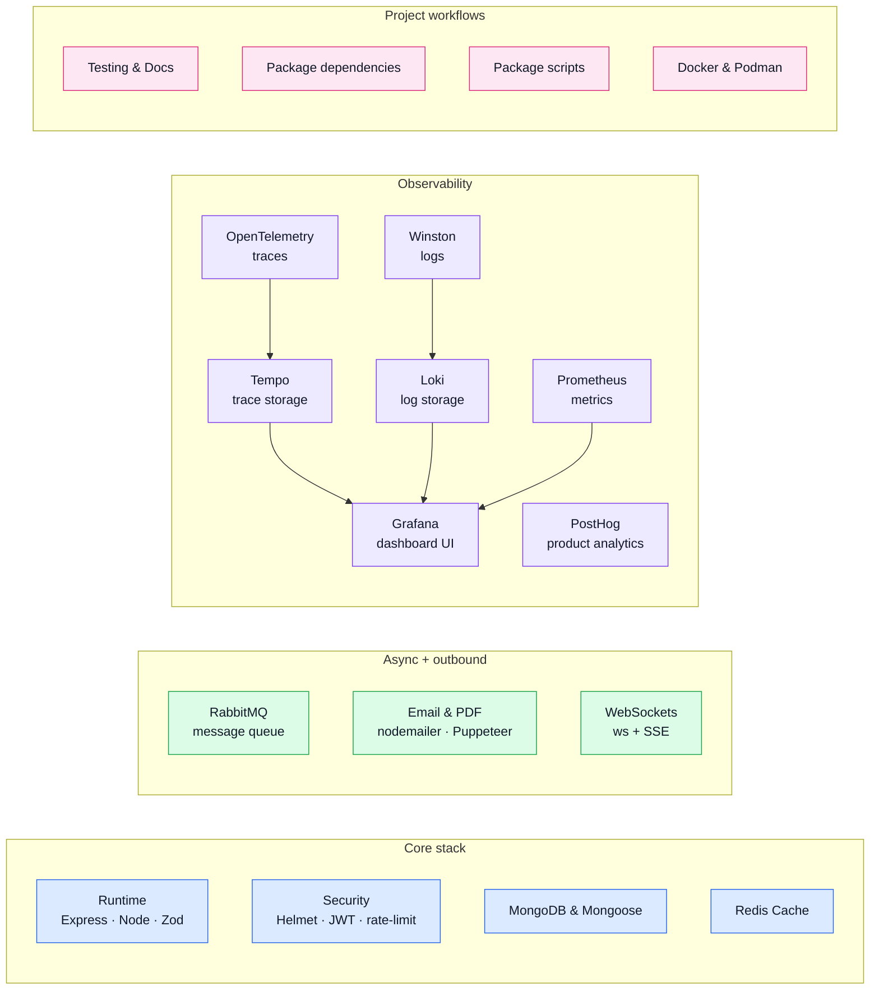

# Tools

This section explains **why dependencies exist** and where they fit in the app.

> OpenAPI-specific tools are documented in [API](../api/), not here.

## Tool map

## Read by intent

| Group         | Page                                                        | What you'll find                                                                                                               |
| ------------- | ----------------------------------------------------------- | ------------------------------------------------------------------------------------------------------------------------------ |
| Overview      | **[Tools Explained](./tools-explained.md)**                 | "What is X and why is it here?" for every tool: plain-English definition, problem it solves, and how it's wired in this repo.  |
| Core          | **[Runtime](./runtime.md)**                                 | Express 5, Zod, Multer, i18next, TypeScript, tsx: the framework-level packages that make the app run.                          |
| Core          | **[Security](./security.md)**                               | Helmet, CORS, rate limiting, JWT split-token auth, bcrypt: every guardrail between the internet and your controllers.          |
| Core          | **[MongoDB & Mongoose](./mongodb-mongoose.md)**             | Document store, schema/model layer, migrations, and seeds.                                                                     |
| Core          | **[Redis Cache](./redis-cache.md)**                         | Optional in-memory response cache with tag-based invalidation and multi-instance pub/sub sync.                                 |
| Async         | **[Email & PDF Rendering](./email-and-rendering.md)**       | Nodemailer + EJS for transactional email; Puppeteer for async PDF generation (invoices).                                       |
| Async         | **[RabbitMQ](./rabbitmq.md)**                               | Message queue for fire-and-forget jobs: controllers publish, background workers consume independently.                         |
| Async         | **[WebSockets](./websockets.md)**                           | Real-time bidirectional messaging (ws) and one-way server-sent events (SSE) scaffolding.                                       |
| Observability | **[Observability Reference](./observability-reference.md)** | Full picture of logs, metrics, traces, and dashboards as one system — start here.                                              |
| Observability | **[Winston](./winston.md)**                                 | Structured request and app logs forwarded to Loki; `trace_id` injected per request.                                            |
| Observability | **[Prometheus](./prometheus.md)**                           | Numeric time-series: request rates, latency histograms, business counters, alert rules.                                        |
| Observability | **[OpenTelemetry](./opentelemetry.md)**                     | Distributed tracing: auto-instruments HTTP, Mongoose, Redis; exports spans to Tempo; injects `trace_id` into every log line.   |
| Observability | **[Tempo](./tempo.md)**                                     | Stores and queries distributed traces; correlates with Loki logs via shared `trace_id`.                                        |
| Observability | **[Loki](./loki.md)**                                       | Stores and queries log streams; links forward to Tempo traces via injected `trace_id`.                                         |
| Observability | **[Grafana](./grafana.md)**                                 | Dashboard UI reading Prometheus, Tempo, and Loki in one place — the normal entry point for all observability work.             |
| Observability | **[PostHog](./posthog.md)**                                 | Product analytics: event funnels, feature flags, session recording.                                                            |
| Observability | **[Frontend Observability](./frontend-observability.md)**   | How the paired frontend reuses this stack (Faro + Alloy, Umami) instead of Sentry/PostHog cloud — plus the heavy upgrade path. |
| Project       | **[Testing & Docs](./testing-and-docs.md)**                 | Vitest, Supertest, Bruno, and VitePress: how the repo tests itself and generates this docs site.                               |
| Project       | **[Package Dependencies](./package-dependencies.md)**       | Guided tour of `package.json` grouped by concern (runtime, dev, optional, peer).                                               |
| Project       | **[Package Scripts](./package-scripts.md)**                 | What every `npm run <script>` does and when to reach for it.                                                                   |
| Project       | **[Docker & Podman](./docker-and-podman.md)**               | 11-container local stack: what each container is for and how to run it.                                                        |
| API           | **[API](../api/)**                                          | OpenAPI Generator, Spectral, Prism, Bruno, Mockoon: contract-first API tooling.                                                |

## Why this section is bigger now

This boilerplate does not only give you Express + Mongo.
It also gives you **opinionated example tooling** around security, observability, and maintenance.
That is why major tools now have their own pages.
