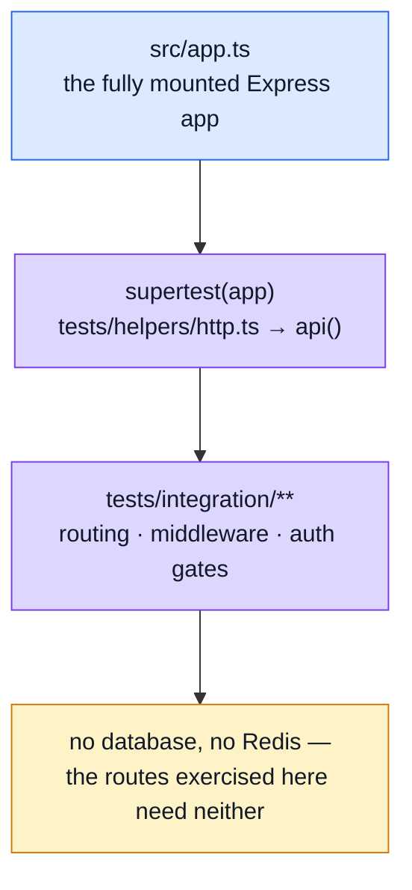

# Integration Testing

The layer that answers: **are the units actually wired together?** A service, its repository and its Mongoose model can each be individually correct (see [Unit Testing](./unit-testing.md)) while the router that's supposed to connect them to the outside world mounts the wrong middleware, or mounts nothing at all. This layer drives the real Express app to check the wiring, not the logic behind it.

## Tools

| Tool                                            | Role                                                                                                           |
| ----------------------------------------------- | -------------------------------------------------------------------------------------------------------------- |
| [Jest](https://jestjs.io/)                      | Same runner as the unit suite, different scope (`tests/integration --runInBand`)                               |
| [supertest](https://github.com/ladjs/supertest) | Drives `src/app.ts` over real HTTP semantics (headers, status codes, streaming) without binding an actual port |

## Where it sits

Same harness (`api()` from `tests/helpers/http.ts`) as [Contract Testing](./contract-testing.md) and [Contract-Derived Request Data](./contract-request-data.md) — the difference is what each layer asserts on the response, not how the request is sent. Integration asks "did the right middleware run" (status code, header presence); contract testing asks "does the _shape_ match `openapi.yaml`".

## Why `src/app.ts` and not a hand-assembled test app

The file's own header comment is worth repeating here because it names a real, already-fixed risk: this suite used to assemble a private Express app from two routers plus a hand-copied request-id middleware, because importing the real `src/app.ts` failed to compile under the Jest tsconfig. That blocker (the mailer used `import.meta`, subpath exports didn't resolve) is gone — see [Unit Testing](./unit-testing.md)'s note on `tsconfig.jest.json`'s `module: "node16"` — so the duplicate app is gone with it. Testing a hand-assembled stand-in risks passing against a middleware stack the real app doesn't have; testing `src/app.ts` directly cannot drift from itself.

`src/app.ts` skips its auto-listen when `NODE_ENV === 'test'`, so importing it here starts no server, no Mongo connection, no Redis, no queue.

## What it currently covers

Deliberately thin: one file, `tests/integration/app-health.test.ts`, covering the system and observability routes — the ones that need neither a database nor Redis, since the auth middleware answers `401` for an unauthenticated request without touching either:

- `GET /` — the welcome payload
- an unknown route — `404`
- `GET /observability/metrics` — Prometheus exposition format
- `GET /observability/events` — an SSE stream (read by aborting after the first chunk, since `supertest` buffers the whole response and the endpoint streams indefinitely)
- `GET /observability/{health,metrics/overview,audit}` without auth — `401`, specifically proving the auth middleware is mounted on the path at all, not merely that the path is unreachable (`401`, not `404` or `500`)

Routes that need a persisted user/product/order are exercised through HTTP too, but by [Contract Testing](./contract-testing.md) and [Contract-Derived Request Data](./contract-request-data.md) instead, both of which already need `setupTestDb()` for their own assertions — there was no reason to duplicate that coverage here under a different name.

## File map

| Path                                   | Contents                                                                         |
| -------------------------------------- | -------------------------------------------------------------------------------- |
| `tests/integration/app-health.test.ts` | System + observability routes                                                    |
| `tests/helpers/http.ts`                | `api()` — the shared `supertest(app)` wrapper, also used by both contract layers |
| `src/app.ts`                           | The app under test — auto-start guarded by `NODE_ENV === 'test'`                 |

## Commands

| Command                    | Effect                               |
| -------------------------- | ------------------------------------ |
| `npm run test:integration` | `jest tests/integration --runInBand` |

## Related pages

- [Testing](./testing-and-docs.md) — suite overview
- [Unit Testing](./unit-testing.md) — the layer below this one
- [Contract Testing](./contract-testing.md) — same HTTP harness, asserts shape instead of wiring
