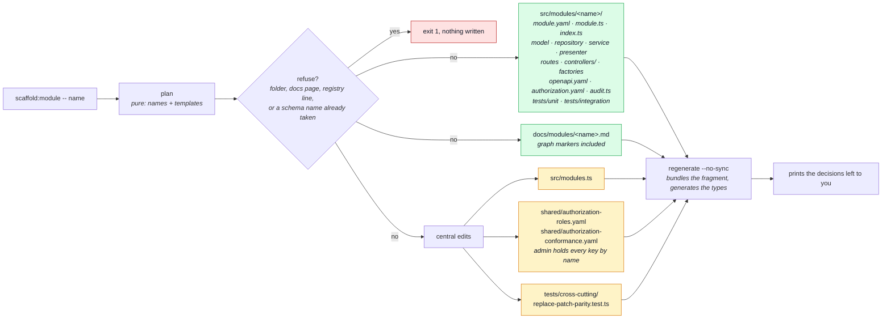

# Module scaffolder

`npm run scaffold:module -- <name>` writes a working module from the [`feedback`](../modules/feedback.md)
shape, so a new domain starts from something that compiles, lints and passes the gate instead of
from a copy-and-rename.

```sh
npm run scaffold:module -- field-notes
npm run scaffold:module -- categories --entity Category --group shop --summary "Product groupings."
npm run scaffold:module -- audits-lite --no-audit
```

| Option             | Default                | Meaning                                                             |
| ------------------ | ---------------------- | ------------------------------------------------------------------- |
| `<name>`           | required               | Folder name: lower-case letters and single hyphens. No digits.      |
| `--entity <Name>`  | naive singular of name | The record's type name. Use it when `-ies`/`-s` gets the noun wrong |
| `--group <group>`  | `foundation`           | `shop` marks the demo shop's own module, which `demo:remove` takes  |
| `--summary <text>` | a TODO sentence        | The line in the docs index and sidebar                              |
| `--no-audit`       | audits                 | No `audit.ts`; `module.yaml` carries a `noAudit` reason to fill in  |
| `--no-regenerate`  | regenerates            | Write the files and stop before `regenerate --no-sync`              |

## What it generates

The template is the admin half of `feedback`: a collection with a required `name` and optional
`notes`, listed, created, replaced (PUT), merged (PATCH) and deleted behind one gate and four
permission keys. It is deliberately not a shop module, so it depends on nothing.



Everything is formatted with the repo's own Prettier config as it is written, and every edit is
computed before any file is touched: a central file that has changed shape refuses the scaffold
instead of leaving a half-written module.

## The central edits, and why there are still four

[The lifecycle page](../theory/module-lifecycle.md) promises one registry line. That holds for
routing, seeding, i18n, contracts and the docs index. Three hand-kept lists remain, each edited
by the scaffolder, and each is a candidate for deletion rather than for more tooling:

| File                                               | Why the module is named there                                                        |
| -------------------------------------------------- | ------------------------------------------------------------------------------------ |
| `shared/authorization-roles.yaml`                  | `admin` lists every tenant key by name; `system` aliases that list                   |
| `shared/authorization-conformance.yaml`            | its fixture copy of the same list, kept identical by hand                            |
| `tests/cross-cutting/replace-patch-parity.test.ts` | the exact set of PUT/PATCH pairs, so a renamed schema cannot empty the sweep quietly |

## What it does not decide

It prints these instead of guessing:

- **Personal data.** `personalData: 'none'` until a record names a person.
- **Roles.** Only `admin` (and `system`) hold the new keys.
- **Rate limits.** None declared. Add a budget for any public or expensive route.
- **Frontend.** Nothing is generated over there. Declare `module.yaml#frontend` if the paired
  module has another name.
- **The prose.** `module.yaml`, `module.ts` and the docs page carry `TODO`s for the parts only
  the author knows.

## How it is checked

| Check                                       | Where                                                       | Cost    |
| ------------------------------------------- | ----------------------------------------------------------- | ------- |
| The plan, names, registry and central edits | `tests/unit/scripts/scaffold/` — pure functions             | unit    |
| A real scaffold into a scratch registry     | the same folder — writes to a temp directory, refuses twice | unit    |
| The generated module passes the gate        | `npm run measure:scaffold`                                  | minutes |

`measure:scaffold` copies the checkout to a scratch directory (like
[`measure:demo-strip`](../getting-started-new-project.md)), scaffolds a module there and runs
`regenerate`, `ts-check`, `lint`, the module's own tests, the cross-cutting suite and `docs:build`.
It scaffolds two modules, one with the defaults and one with `--no-audit --group shop`, so both
template variants compile. It is report-only and not part of the commit gate.

## Related pages

- [Adding & removing a module](../theory/module-lifecycle.md) — the procedure this automates
- [The `feedback` module](../modules/feedback.md) — what the template was cut from
- [Contract ownership & fragmentation](../api/contract-fragmentation.md) — what reads the generated `openapi.yaml`
