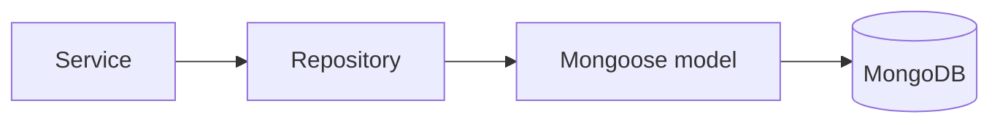

# MongoDB & Mongoose

## Why this stack exists in this repo

This repository is the **MongoDB + Mongoose** flavor of the backend family.
That means the persistence example is document-oriented, not SQL-oriented.

## What each piece does

| Tool          | Job                             |
| ------------- | ------------------------------- |
| MongoDB       | document database               |
| Mongoose      | schema, model, and query layer  |
| migrate-mongo | migrations for database changes |

## Persistence visual

## Strategy in this boilerplate

- repositories own query shape,
- models define the persistence shape,
- services should not scatter raw queries everywhere.

That separation is what makes it easier to swap this flavor for something like Sequelize later.

## Related pages

- [Layers](../theory/layers.md)
- [Redis Cache](./redis-cache.md)
- [Architecture](../theory/architecture.md)
