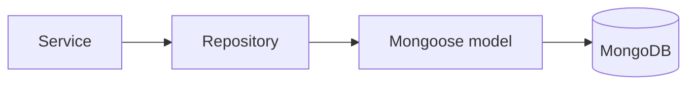

# MongoDB & Mongoose

## Why this stack exists in this repo

This repository is the **MongoDB + Mongoose** flavor of the backend family.
That means the persistence example is document-oriented, not SQL-oriented.

## What each piece does

| Tool                                                             | Job                             |
| ---------------------------------------------------------------- | ------------------------------- |
| [MongoDB](https://www.mongodb.com/docs/manual/)                  | document database               |
| [Mongoose](https://mongoosejs.com/docs/)                         | schema, model, and query layer  |
| [migrate-mongo](https://github.com/seppevs/migrate-mongo#readme) | migrations for database changes |

## Persistence visual



## Strategy in this boilerplate

- repositories own query shape,
- models define the persistence shape,
- services should not scatter raw queries everywhere.

That separation is what makes it easier to swap this flavor for something like Sequelize later.

## Migrations

Migrations handle **schema and data changes** across environments in a reproducible way.
This repo uses [migrate-mongo](https://github.com/seppevs/migrate-mongo#readme), which stores each migration as a plain JS file and tracks applied runs in a `migrations_changelog` collection.

### Config

`migrate-mongo-config.js` at the project root points at `db/migrations/` and uses the `NODE_DB_URI` env var.

```js
module.exports = {
    mongodb: { url: process.env.NODE_DB_URI },
    migrationsDir: 'db/migrations',
    changelogCollectionName: 'migrations_changelog',
    migrationFileExtension: '.js',
    useFileHash: false,
    moduleSystem: 'commonjs'
};
```

### Commands

| Script                      | What it does                            |
| --------------------------- | --------------------------------------- |
| `npm run db:migrate:up`     | Apply all pending migrations            |
| `npm run db:migrate:down`   | Roll back the last applied migration    |
| `npm run db:migrate:status` | Show which migrations have been applied |

### Writing a migration

Each file in `db/migrations/` exports an `up` and a `down` function that receive the raw MongoDB `db` driver:

```js
module.exports = {
    async up(db) {
        await db.collection('users').createIndex({ email: 1 }, { unique: true });
    },
    async down(db) {
        await db.collection('users').dropIndex('email_1');
    }
};
```

Name files with a timestamp prefix so they run in order, e.g. `20240101000000-initial-indexes.js`.

---

## Seeds

Seeds populate the database with **known test data** for local development.
The seed runner lives in `db/seeds/index.ts` and uses the Mongoose repository layer (not raw Mongo), so pre-save hooks (e.g. password hashing) run normally.

### Commands

| Script                  | What it does                                                        |
| ----------------------- | ------------------------------------------------------------------- |
| `npm run db:seed`       | Insert seed documents (safe to run multiple times if IDs are fixed) |
| `npm run db:seed:reset` | Drop the database first, then seed                                  |

### What gets seeded

The default seed creates:

- **2 users** — `root@root.it` (admin) and `gino@pino.it` (regular user), each with a pre-filled cart
- **5 products** — mix of active, inactive, and soft-deleted items
- **2 orders** — linked to the root user

Fixed `ObjectId` values are used so the data is repeatable and predictable across resets.

---

## Useful links

- [MongoDB CRUD operations](https://www.mongodb.com/docs/manual/crud/)
- [MongoDB indexes](https://www.mongodb.com/docs/manual/indexes/)
- [Mongoose schema guide](https://mongoosejs.com/docs/guide.html)
- [Mongoose queries](https://mongoosejs.com/docs/queries.html)
- [Mongoose plugins](https://mongoosejs.com/docs/plugins.html) — used in `src/utils/database.ts` for query metrics
- [migrate-mongo usage](https://github.com/seppevs/migrate-mongo#usage)

## Related pages

- [Layers](../theory/layers.md)
- [Redis Cache](./redis-cache.md)
- [Architecture](../theory/architecture.md)
- [OpenTelemetry](./opentelemetry.md) — Mongoose spans expose every query
