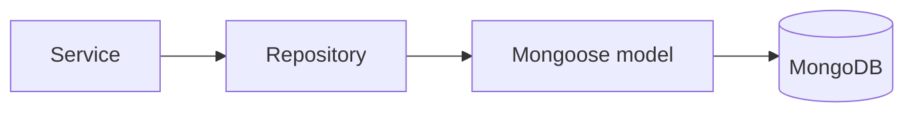

# MongoDB & Mongoose

## Why this stack exists in this repo

This repository is the **MongoDB + Mongoose** flavor of the backend family.
That means the persistence example is document-oriented, not SQL-oriented.

## What each piece does

| Tool                                                                    | Job                             |
| ----------------------------------------------------------------------- | ------------------------------- |
| [MongoDB](https://www.mongodb.com/docs/manual/)                         | document database               |
| [Mongoose](https://mongoosejs.com/docs/)                                | schema, model, and query layer  |
| [migrate-mongo](https://github.com/seppevs/migrate-mongo#readme)        | migrations for database changes |

## Persistence visual

## Strategy in this boilerplate

- repositories own query shape,
- models define the persistence shape,
- services should not scatter raw queries everywhere.

That separation is what makes it easier to swap this flavor for something like Sequelize later.

## Useful links

- [MongoDB CRUD operations](https://www.mongodb.com/docs/manual/crud/)
- [MongoDB indexes](https://www.mongodb.com/docs/manual/indexes/)
- [Mongoose schema guide](https://mongoosejs.com/docs/guide.html)
- [Mongoose queries](https://mongoosejs.com/docs/queries.html)
- [Mongoose plugins](https://mongoosejs.com/docs/plugins.html) — used in `src/utils/database.ts` for query metrics
- [migrate-mongo usage](https://github.com/seppevs/migrate-mongo#usage)

## Related pages

- [Layers](../theory/layers.md)
- [Redis Cache](./redis-cache.md)
- [Architecture](../theory/architecture.md)
- [OpenTelemetry](./opentelemetry.md) — Mongoose spans expose every query
