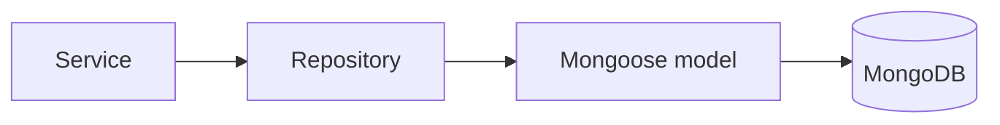

# MongoDB & Mongoose

## Why this stack exists in this repo

This repository is the **MongoDB + Mongoose** flavor of the backend family.
That means the persistence example is document-oriented, not SQL-oriented.

## What each piece does

| Tool                                                             | Job                             |
| ---------------------------------------------------------------- | ------------------------------- |
| [MongoDB](https://www.mongodb.com/docs/manual/)                  | document database               |
| [Mongoose](https://mongoosejs.com/docs/)                         | schema, model, and query layer  |
| [migrate-mongo](https://github.com/seppevs/migrate-mongo#readme) | migrations for database changes |

## Persistence visual


```mermaid
flowchart LR
    Service --> Repository
    Repository --> Model[Mongoose model]
    Model --> Mongo[(MongoDB)]
```

## Strategy in this boilerplate

- repositories own query shape,
- models define the persistence shape,
- services should not scatter raw queries everywhere.

That separation is what makes it easier to swap this flavor for something like Sequelize later.

## Migrations

Migrations handle **schema and data changes** across environments in a reproducible way.
This repo uses [migrate-mongo](https://github.com/seppevs/migrate-mongo#readme), which stores each migration as a plain JS file and tracks applied runs in a `migrations_changelog` collection.

### Config

`migrate-mongo-config.js` at the project root points at `db/migrations/` and uses the `NODE_DB_URI` env var. That directory is **assembled, not authored** — see [Writing a migration](#writing-a-migration).

```js
module.exports = {
    mongodb: { url: process.env.NODE_DB_URI },
    migrationsDir: 'db/migrations',
    changelogCollectionName: 'migrations_changelog',
    migrationFileExtension: '.js',
    useFileHash: false,
    moduleSystem: 'commonjs'
};
```

### Commands

| Script                      | What it does                            |
| --------------------------- | --------------------------------------- |
| `npm run db:migrate:up`     | Apply all pending migrations            |
| `npm run db:migrate:down`   | Roll back the last applied migration    |
| `npm run db:migrate:status` | Show which migrations have been applied |

### Writing a migration

A migration belongs to the module whose collection it touches — `src/modules/<name>/migrations/`, next to the `model.ts` it must never import. The module points at the directory from its manifest, exactly as it does for `locales`:

```ts
export default {
    name: 'orders',
    migrations: path.join(__dirname, 'migrations')
    // …
} satisfies AppModule;
```

`npm run gen:migrations` then copies every enabled module's files into `db/migrations/`, alongside the generated index baseline, and that assembled directory is the only one `migrate-mongo` reads. It is gitignored; `postinstall` and `db:bootstrap` both rebuild it.

Each file exports an `up` and a `down` function that receive the raw MongoDB `db` driver:

```js
module.exports = {
    async up(db) {
        await db.collection('users').createIndex({ email: 1 }, { unique: true });
    },
    async down(db) {
        await db.collection('users').dropIndex('email_1');
    }
};
```

Name files `<14-digit timestamp>-kebab-name.js`, e.g. `20261110120000-detach-user.js`. The timestamp is what sequences one module's migration against another's, so the assembler refuses a name without one — and refuses two modules claiming the same name, since the changelog records by name and a collision would mark one module's work as already applied.

A migration talks to the **driver**, never to this application: it is replayed against databases written before today's schema existed, so reaching for a Mongoose model would run today's hooks, defaults and validators over yesterday's documents. ESLint enforces this on both the authored copies and the assembled bundle.

### The index rule

Two places can create an index, and both are legitimate:

- **the schema** — `unique: true`, `index: true`, or `schema.index(...)`. Mongoose builds these at boot, because `autoIndex` is on. This is what gives the test suite its constraints for free: `mongodb-memory-server` never runs a migration.
- **a migration** — explicit DDL, applied by `migrate-mongo`, independent of whether the app has started.

They collide on **names**. Mongo treats an index's name as part of its identity, so `createIndex` is a no-op only when the name _and_ the key spec match what is already stored. The same key under a different name is `IndexKeySpecsConflict`, which Mongoose reports at startup as `Index already exists with a different name` — on every migrated database, and on none of the fresh ones the tests use.

> **The rule: an index may be declared on the schema, in a migration, or in both — but if in both, they must give it the same name.**

**Declare indexes on the schema.** That is where an index is authored — one author, so nothing can disagree. A migration is still the only way to _drop_ an index: a schema says what should exist, not what should stop existing.

The generated `20260905000000-baseline.js` then mirrors that declaration, so `db:migrate:up` alone is enough to put the whole index set in place — including the ten unique constraints that are correctness, not speed. Without it those would exist only because `autoIndex` is on, and would silently vanish the day it is turned off.

| Index                                          | Where it is built                                                                                                                                                                                                                                     |
| ---------------------------------------------- | ----------------------------------------------------------------------------------------------------------------------------------------------------------------------------------------------------------------------------------------------------- |
| Everything except TTL                          | Schema **and** the baseline, same key spec and same name. The baseline is grouped by owning module, which is who decides an entry belongs there.                                                                                                      |
| TTL — `auditlogs`, `carts`, `feedbackrequests` | Schema only. `expireAfterSeconds` comes from an env var, and a second copy of that arithmetic in a migration could disagree with the schema's and make every boot a conflict. Changing a live window is a `collMod` — see [Ops](../reference/ops.md). |

Adding an index is therefore one edit — the schema. `npm run gen:migrations` rewrites the baseline's table from it, and `postinstall`, `db:bootstrap` and `regenerate` all run it, so there is no committed copy that can be left stale.

Options count too: same key and name but a different `unique`, `expireAfterSeconds` or partial filter fails the same way.

`tests/integration/db/migration-model-indexes.test.ts` enforces this. It runs every migration and every model's index build against one database in both orders, and fails on a conflict or on two indexes sharing a key — the state no other suite can reach, since every other test runs on a database that has never been migrated.

---

## Seeds

Seeds populate the database with **known test data** for local development.
The seed runner lives in `db/demo/index.ts` and uses the Mongoose repository layer (not raw Mongo), so pre-save hooks (e.g. password hashing) run normally.

The dataset is split by ROLE, and the split matters:

| File                             | Holds                                                                                                                                                                                                                                                           |
| -------------------------------- | --------------------------------------------------------------------------------------------------------------------------------------------------------------------------------------------------------------------------------------------------------------- |
| `src/modules/<name>/fixtures.ts` | The **builder** — `makeProduct(overrides)`. States only what the schema requires; anything carrying a `default:` is deliberately left out, so a row records what the model really does. Shared with that module's tests, which is what a fixture builder is for |
| `src/modules/<name>/demo.ts`     | The **records** — the demo catalogue, the two accounts, the order book. Built from the factory and owned by the module that owns the collection. Declared as `seeds` in the manifest; `db/demo/index.ts` walks the registry and names no domain                 |
| `src/kernel/seed-accounts.ts`    | The **six shared literals** — two account ids and four credentials. In the kernel because four modules need a piece of them and only one owns the record; the file explains why that beats three registry edges                                                 |
| `db/demo/demo-data.json`         | The **output** — every row as the API actually serves it. Written by `npm run seed:export`, never by hand                                                                                                                                                       |

### The dataset is published, not shared

`npm run seed:export` seeds a throwaway `mongodb-memory-server` with the real seeders, reads every
row back through the real serializers, and writes `db/demo/demo-data.json`. The file lives only
here now: the paired frontend used to hold a byte-identical copy for its MSW mocks, and since
those retired in favour of this repo's demo profile — which seeds from the same fixtures
directly — the snapshot's one job is pinning serializer drift in this repo.

```bash
npm run seed:export          # write it
npm run check:seed-export    # fail if the committed copy is stale
npm run check:spec-identity  # fail if the frontend's copy has forked
```

Publishing the OUTPUT rather than the input is the whole design, and it corrects an earlier one. The
two repos used to share a file of plain FACTS — `db/seeds/seed-identities.ts`, assembled from a <!-- doc-paths:ignore -->
fragment in every module — and each side wrote its own mapper from those facts into the shape it
needed. Identical facts could not keep the two mappers honest: the frontend's mock hand-wrote
`active: true` and `verified: true` from a reading of this repo's schema defaults, and carried no
`locale` at all, because nobody remembered the column existed. Both suites passed, each consistent
with its own copy. There is one mapper now, and it is the API's.

The parity this protects is not hypothetical — the frontend's mock once served all 5 products to
everyone while this API served 3 to non-admins, and the spec asserted the mock's number and passed.

Determinism is therefore a hard requirement, and three things buy it: a fixture pins its own
`createdAt`, read off its ObjectId — whose leading four bytes already encode one — the seed writes
pass `{ timestamps: false }` so Mongoose cannot overwrite it, and the exporter sorts every key on
the way out. A value that cannot be pinned does not belong in the dataset.

The export also refuses to publish a **dangling reference**: every `<something>Id` in the file must
name a record the file also contains. That replaces the one safety property the shared file had for
free, back when a cart line and the product it pointed at were literally the same constant.

### `_meta.shapes` — which rows a GET actually serves

The published collections are not the same kind of thing, and the reader who needs to know is in
the other repo, writing a mock handler against the artefact and nothing else. So the artefact says
it:

```json
{
    "_meta": { "shapes": { "products": "response", "addressBooks": "stored" } },
    "collections": { "...": [] },
    "credentials": { "...": {} }
}
```

| Value      | Means                                                                                                                                                               |
| ---------- | ------------------------------------------------------------------------------------------------------------------------------------------------------------------- |
| `response` | A GET answers this row as it stands — `products`, `users`, `orders`. A mock may hand it straight back                                                               |
| `stored`   | No endpoint serves the row raw. `GET /account/addresses` answers `{ addresses: [...] }` built from a book's `items`; `GET /locales` answers a capabilities envelope |

Two values rather than three, because that is the whole of the question anyone asks of the file:
can I return this row? A collection that is composed and one that is never served differ only in
how the response is built, which the consumer is writing anyway.

Each module states its own entries as `demoShapes` beside `seedExport`, and the manifest type pairs
them — declaring the export without the classification is a compile error. `seed:export` then
reconciles the map against what was actually published and refuses both an unclassified collection
and a label naming one that no longer exists, so neither state reaches the artefact.
`tests/cross-cutting/seed-conformance.test.ts` holds the committed file to the same rule, in both
repos.

The labels are **stated, not derived**. A matcher that tried each collection against the generated
schemas would mark the locale rows `response` — a stored language does parse against the CREATE
response — and a confidently wrong label is worse than none, because the reader stops checking.

### Commands

| Script                      | What it does                                                        |
| --------------------------- | ------------------------------------------------------------------- |
| `npm run db:seed`           | Insert seed documents (safe to run multiple times if IDs are fixed) |
| `npm run db:seed:reset`     | Drop the database first, then seed                                  |
| `npm run seed:export`       | Publish `db/demo/demo-data.json` from a throwaway database          |
| `npm run check:seed-export` | Fail if that file is stale; write nothing                           |

### What gets seeded

The default seed creates:

- **2 users** — `root@root.it` (admin) and `gino@pino.it` (regular user)
- **1 cart** — the admin's, in the `carts` collection; `gino@pino.it` gets none, because an empty cart and no cart are the same state
- **5 products** — mix of active, inactive, and soft-deleted items
- **2 wishlists** — one per user
- **3 orders** — two the admin's, one the ordinary user's and soft-deleted, so "the owner cannot see their own deleted order" has a fixture behind it

Fixed `ObjectId` values are used so the data is repeatable and predictable across resets — and so
each record can date itself, since an ObjectId's leading bytes are a timestamp.

---

## Works with

- **[OpenTelemetry](./opentelemetry.md)** — every Mongoose query (`find`, `save`, `aggregate`, …) is automatically wrapped as a child span in the active request trace. No code changes needed. Slow queries show up in Grafana → Tempo as wide bars in the span tree, sitting visually under the HTTP span that triggered them. → [What is instrumented out of the box](./opentelemetry.md#what-is-instrumented-out-of-the-box)

## External references

- [Mongoose plugins](https://mongoosejs.com/docs/plugins.html) — used in `src/infrastructure/runtime/database.ts` for query metrics
- [migrate-mongo usage](https://github.com/seppevs/migrate-mongo#usage)

## Related pages

- [Layers](../theory/layers.md)
- [Redis Cache](./redis-cache.md)
- [Architecture](../theory/architecture.md)
- [OpenTelemetry](./opentelemetry.md) — Mongoose spans expose every query
