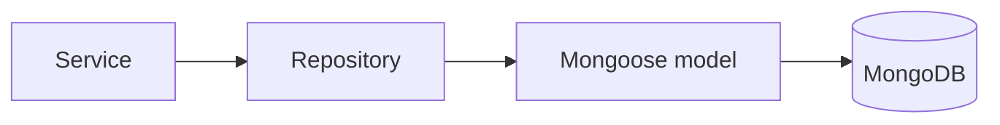

# MongoDB & Mongoose

## Why this stack exists in this repo

This repository is the **MongoDB + Mongoose** flavor of the backend family.
That means the persistence example is document-oriented, not SQL-oriented.

## What each piece does

| Tool                                                             | Job                             |
| ---------------------------------------------------------------- | ------------------------------- |
| [MongoDB](https://www.mongodb.com/docs/manual/)                  | document database               |
| [Mongoose](https://mongoosejs.com/docs/)                         | schema, model, and query layer  |
| [migrate-mongo](https://github.com/seppevs/migrate-mongo#readme) | migrations for database changes |

## Persistence visual


```mermaid
flowchart LR
    Service --> Repository
    Repository --> Model[Mongoose model]
    Model --> Mongo[(MongoDB)]
```

## Strategy in this boilerplate

- repositories own query shape,
- models define the persistence shape,
- services should not scatter raw queries everywhere.

That separation is what makes it easier to swap this flavor for something like Sequelize later.

## Migrations

Migrations handle **schema and data changes** across environments in a reproducible way.
This repo uses [migrate-mongo](https://github.com/seppevs/migrate-mongo#readme), which stores each migration as a plain JS file and tracks applied runs in a `migrations_changelog` collection.

### Config

`migrate-mongo-config.js` at the project root points at `db/migrations/` and uses the `NODE_DB_URI` env var.

```js
module.exports = {
    mongodb: { url: process.env.NODE_DB_URI },
    migrationsDir: 'db/migrations',
    changelogCollectionName: 'migrations_changelog',
    migrationFileExtension: '.js',
    useFileHash: false,
    moduleSystem: 'commonjs'
};
```

### Commands

| Script                      | What it does                            |
| --------------------------- | --------------------------------------- |
| `npm run db:migrate:up`     | Apply all pending migrations            |
| `npm run db:migrate:down`   | Roll back the last applied migration    |
| `npm run db:migrate:status` | Show which migrations have been applied |

### Writing a migration

Each file in `db/migrations/` exports an `up` and a `down` function that receive the raw MongoDB `db` driver:

```js
module.exports = {
    async up(db) {
        await db.collection('users').createIndex({ email: 1 }, { unique: true });
    },
    async down(db) {
        await db.collection('users').dropIndex('email_1');
    }
};
```

Name files with a timestamp prefix so they run in order, e.g. `20240101000000-initial-indexes.js`.

### The index rule

Two places can create an index, and both are legitimate:

- **the schema** — `unique: true`, `index: true`, or `schema.index(...)`. Mongoose builds these at boot, because `autoIndex` is on. This is what gives the test suite its constraints for free: `mongodb-memory-server` never runs a migration.
- **a migration** — explicit DDL, applied by `migrate-mongo`, independent of whether the app has started.

They collide on **names**. Mongo treats an index's name as part of its identity, so `createIndex` is a no-op only when the name _and_ the key spec match what is already stored. The same key under a different name is `IndexKeySpecsConflict`, which Mongoose reports at startup as `Index already exists with a different name` — on every migrated database, and on none of the fresh ones the tests use.

> **The rule: an index may be declared on the schema, in a migration, or in both — but if in both, they must give it the same name.**

**Declare indexes on the schema.** That is the rule for anything new: one author, so nothing can disagree. A migration is still the only way to _drop_ an index — a schema can say what should exist, not what should stop existing — and the only way to build one on a deployed database ahead of the code that needs it.

| Collection                                 | Where its indexes are declared                                                                                                                                                               |
| ------------------------------------------ | -------------------------------------------------------------------------------------------------------------------------------------------------------------------------------------------- |
| `carts`, `feedback-requests`, `audit-logs` | Schema only. Mongoose names them.                                                                                                                                                            |
| `users`, `products`, `orders`              | Schema, **and** `20240101000000-initial-indexes.js` under the same explicit names. That migration is already applied everywhere, so it agrees with the schema rather than competing with it. |

Options count too: same key and name but a different `unique`, `expireAfterSeconds` or partial filter fails the same way.

`tests/unit/db/migration-model-indexes.test.ts` enforces this. It runs every migration and every model's index build against one database in both orders, and fails on a conflict or on two indexes sharing a key — the state no other suite can reach, since every other test runs on a database that has never been migrated.

---

## Seeds

Seeds populate the database with **known test data** for local development.
The seed runner lives in `db/seeds/index.ts` and uses the Mongoose repository layer (not raw Mongo), so pre-save hooks (e.g. password hashing) run normally.

The dataset is split by ROLE, and the split matters:

| File                            | Holds                                                                                                                                                                                                                                                   |
| ------------------------------- | ------------------------------------------------------------------------------------------------------------------------------------------------------------------------------------------------------------------------------------------------------- |
| `src/modules/<name>/factory.ts` | The **builder** — `makeProduct(overrides)`. States only what the schema requires; anything carrying a `default:` is deliberately left out, so a row records what the model really does. Shared with that module's tests, which is what a factory is for |
| `src/modules/<name>/seeds.ts`   | The **records** — the demo catalogue, the two accounts, the order book. Built from the factory and owned by the module that owns the collection. Declared as `seeds` in the manifest; `db/seeds/index.ts` walks the registry and names no domain        |
| `src/kernel/seed-accounts.ts`   | The **six shared literals** — two account ids and four credentials. In the kernel because four modules need a piece of them and only one owns the record; the file explains why that beats three registry edges                                         |
| `db/seeds/dataset.json`         | The **output** — every row as the API actually serves it. Written by `npm run seed:export`, never by hand                                                                                                                                               |

### The dataset is published, not shared

`npm run seed:export` seeds a throwaway `mongodb-memory-server` with the real seeders, reads every
row back through the real serializers, and writes `db/seeds/dataset.json`. That file is
**byte-identical** to a copy in the paired frontend (`tests/support/mocks/dataset.json`), which its
MSW mocks load directly.

```bash
npm run seed:export          # write it
npm run check:seed-export    # fail if the committed copy is stale
npm run check:spec-identity  # fail if the frontend's copy has forked
```

Publishing the OUTPUT rather than the input is the whole design, and it corrects an earlier one. The
two repos used to share a file of plain FACTS — `db/seeds/seed-identities.ts`, assembled from a
fragment in every module — and each side wrote its own mapper from those facts into the shape it
needed. Identical facts could not keep the two mappers honest: the frontend's mock hand-wrote
`active: true` and `verified: true` from a reading of this repo's schema defaults, and carried no
`locale` at all, because nobody remembered the column existed. Both suites passed, each consistent
with its own copy. There is one mapper now, and it is the API's.

The parity this protects is not hypothetical — the frontend's mock once served all 5 products to
everyone while this API served 3 to non-admins, and the spec asserted the mock's number and passed.

Determinism is therefore a hard requirement, and three things buy it: a fixture pins its own
`createdAt`, read off its ObjectId — whose leading four bytes already encode one — the seed writes
pass `{ timestamps: false }` so Mongoose cannot overwrite it, and the exporter sorts every key on
the way out. A value that cannot be pinned does not belong in the dataset.

The export also refuses to publish a **dangling reference**: every `<something>Id` in the file must
name a record the file also contains. That replaces the one safety property the shared file had for
free, back when a cart line and the product it pointed at were literally the same constant.

### Commands

| Script                      | What it does                                                        |
| --------------------------- | ------------------------------------------------------------------- |
| `npm run db:seed`           | Insert seed documents (safe to run multiple times if IDs are fixed) |
| `npm run db:seed:reset`     | Drop the database first, then seed                                  |
| `npm run seed:export`       | Publish `db/seeds/dataset.json` from a throwaway database           |
| `npm run check:seed-export` | Fail if that file is stale; write nothing                           |

### What gets seeded

The default seed creates:

- **2 users** — `root@root.it` (admin) and `gino@pino.it` (regular user)
- **1 cart** — the admin's, in the `carts` collection; `gino@pino.it` gets none, because an empty cart and no cart are the same state
- **5 products** — mix of active, inactive, and soft-deleted items
- **2 wishlists** — one per user
- **3 orders** — two the admin's, one the ordinary user's and soft-deleted, so "the owner cannot see their own deleted order" has a fixture behind it

Fixed `ObjectId` values are used so the data is repeatable and predictable across resets — and so
each record can date itself, since an ObjectId's leading bytes are a timestamp.

---

## Works with

- **[OpenTelemetry](./opentelemetry.md)** — every Mongoose query (`find`, `save`, `aggregate`, …) is automatically wrapped as a child span in the active request trace. No code changes needed. Slow queries show up in Grafana → Tempo as wide bars in the span tree, sitting visually under the HTTP span that triggered them. → [What is instrumented out of the box](./opentelemetry.md#what-is-instrumented-out-of-the-box)

## External references

- [Mongoose plugins](https://mongoosejs.com/docs/plugins.html) — used in `src/infrastructure/runtime/database.ts` for query metrics
- [migrate-mongo usage](https://github.com/seppevs/migrate-mongo#usage)

## Related pages

- [Layers](../theory/layers.md)
- [Redis Cache](./redis-cache.md)
- [Architecture](../theory/architecture.md)
- [OpenTelemetry](./opentelemetry.md) — Mongoose spans expose every query
