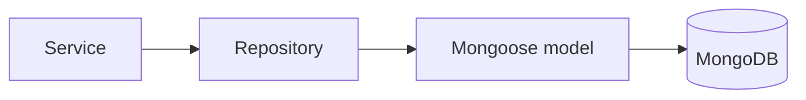

# MongoDB & Mongoose

## Why this stack exists in this repo

This repository is the **MongoDB + Mongoose** flavor of the backend family.
That means the persistence example is document-oriented, not SQL-oriented.

## What each piece does

| Tool                                                             | Job                             |
| ---------------------------------------------------------------- | ------------------------------- |
| [MongoDB](https://www.mongodb.com/docs/manual/)                  | document database               |
| [Mongoose](https://mongoosejs.com/docs/)                         | schema, model, and query layer  |
| [migrate-mongo](https://github.com/seppevs/migrate-mongo#readme) | migrations for database changes |

## Persistence visual


```mermaid
flowchart LR
    Service --> Repository
    Repository --> Model[Mongoose model]
    Model --> Mongo[(MongoDB)]
```

## Strategy in this boilerplate

- repositories own query shape,
- models define the persistence shape,
- services should not scatter raw queries everywhere.

That separation is what makes it easier to swap this flavor for something like Sequelize later.

## Migrations

Migrations handle **schema and data changes** across environments in a reproducible way.
This repo uses [migrate-mongo](https://github.com/seppevs/migrate-mongo#readme), which stores each migration as a plain JS file and tracks applied runs in a `migrations_changelog` collection.

### Config

`migrate-mongo-config.js` at the project root points at `db/migrations/` and uses the `NODE_DB_URI` env var.

```js
module.exports = {
    mongodb: { url: process.env.NODE_DB_URI },
    migrationsDir: 'db/migrations',
    changelogCollectionName: 'migrations_changelog',
    migrationFileExtension: '.js',
    useFileHash: false,
    moduleSystem: 'commonjs'
};
```

### Commands

| Script                      | What it does                            |
| --------------------------- | --------------------------------------- |
| `npm run db:migrate:up`     | Apply all pending migrations            |
| `npm run db:migrate:down`   | Roll back the last applied migration    |
| `npm run db:migrate:status` | Show which migrations have been applied |

### Writing a migration

Each file in `db/migrations/` exports an `up` and a `down` function that receive the raw MongoDB `db` driver:

```js
module.exports = {
    async up(db) {
        await db.collection('users').createIndex({ email: 1 }, { unique: true });
    },
    async down(db) {
        await db.collection('users').dropIndex('email_1');
    }
};
```

Name files with a timestamp prefix so they run in order, e.g. `20240101000000-initial-indexes.js`.

---

## Seeds

Seeds populate the database with **known test data** for local development.
The seed runner lives in `db/seeds/index.ts` and uses the Mongoose repository layer (not raw Mongo), so pre-save hooks (e.g. password hashing) run normally.

The dataset itself is split across two files next to it, and the split matters:

| File                          | Holds                                                                                                                                                   |
| ----------------------------- | ------------------------------------------------------------------------------------------------------------------------------------------------------- |
| `db/seeds/seed-identities.ts` | The **facts** — ids, emails, admin flags, titles, prices, active/deleted state, who has what in their cart and their orders. Dependency-free plain data |
| `db/seeds/fixtures.ts`        | The **mapper** into mongoose shape — `Types.ObjectId`s, real `Date`s, the embedded cart, and the denormalised product snapshot each order item carries  |

`seed-identities.ts` is **byte-identical** to a copy in the paired frontend (`tests/mocks/shared/seed-identities.ts`), on the same convention as `scripts/gen-asyncapi-types.ts`: change it in one repo, copy it to the other, and let `diff` answer "have the seeds drifted?".

```bash
diff boilerplate-node-api-mongodb-mongoose/db/seeds/seed-identities.ts \
     boilerplate-vue-frontend/tests/mocks/shared/seed-identities.ts
```

It holds identities rather than whole fixtures because the two sides genuinely need different shapes from the same facts — mongoose documents here, API response entities there — so each repo keeps its own mapper. It must stay dependency-free (no mongoose import, however tempting): the frontend loads it under Vite/vitest ESM, and a single Node-only import would make it unloadable there. The parity it protects is not hypothetical — the frontend's mock once served all 5 products to everyone while this API served 3 to non-admins, and the spec asserted the mock's number and passed.

### Commands

| Script                  | What it does                                                        |
| ----------------------- | ------------------------------------------------------------------- |
| `npm run db:seed`       | Insert seed documents (safe to run multiple times if IDs are fixed) |
| `npm run db:seed:reset` | Drop the database first, then seed                                  |

### What gets seeded

The default seed creates:

- **2 users** — `root@root.it` (admin) and `gino@pino.it` (regular user), each with a pre-filled cart
- **5 products** — mix of active, inactive, and soft-deleted items
- **2 orders** — linked to the root user

Fixed `ObjectId` values are used so the data is repeatable and predictable across resets.

---

## Works with

- **[OpenTelemetry](./opentelemetry.md)** — every Mongoose query (`find`, `save`, `aggregate`, …) is automatically wrapped as a child span in the active request trace. No code changes needed. Slow queries show up in Grafana → Tempo as wide bars in the span tree, sitting visually under the HTTP span that triggered them. → [What is instrumented out of the box](./opentelemetry.md#what-is-instrumented-out-of-the-box)

## External references

- [Mongoose plugins](https://mongoosejs.com/docs/plugins.html) — used in `src/core/bootstrap/database.ts` for query metrics
- [migrate-mongo usage](https://github.com/seppevs/migrate-mongo#usage)

## Related pages

- [Layers](../theory/layers.md)
- [Redis Cache](./redis-cache.md)
- [Architecture](../theory/architecture.md)
- [OpenTelemetry](./opentelemetry.md) — Mongoose spans expose every query
