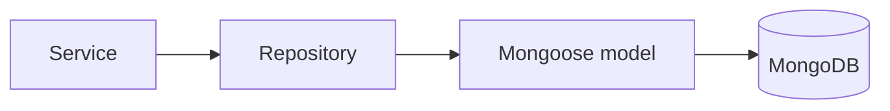

# MongoDB & Mongoose

## Why this stack exists in this repo

This repository is the **MongoDB + Mongoose** flavor of the backend family.
That means the persistence example is document-oriented, not SQL-oriented.

## What each piece does

| Tool                                                                                                           | Job                                        |
| -------------------------------------------------------------------------------------------------------------- | ------------------------------------------ |
| [MongoDB](https://www.mongodb.com/docs/manual/)                                                                | document database                          |
| [Mongoose](https://mongoosejs.com/docs/)                                                                       | schema, model, and query layer             |
| [Mongoose `syncIndexes`](<https://mongoosejs.com/docs/api/connection.html#Connection.prototype.syncIndexes()>) | reconciles stored indexes with the schemas |

## Persistence visual


```mermaid
flowchart LR
    Service --> Repository
    Repository --> Model[Mongoose model]
    Model --> Mongo[(MongoDB)]
```

## Strategy in this boilerplate

- repositories own query shape,
- models define the persistence shape,
- services should not scatter raw queries everywhere.

That separation is what makes it easier to swap this flavor for something like Sequelize later.

## Schema changes

There is no migration tool here. An index is **derivable from the domain model**, so it is
declared once — on the schema — and a reconciliation makes the database agree. A change to data
that already exists is not derivable, so it is a one-off script. The two are covered in full in
[Data](../reference/data.md); this section is the Mongoose-specific half.

### `db:sync`

```bash
npm run db:sync              # create what is missing, drop what no schema declares
npm run db:sync -- --check   # print the plan, change nothing
```

`db/index-sync.ts` imports the module registry — which registers every enabled module's models —
and calls [`connection.syncIndexes()`](<https://mongoosejs.com/docs/api/connection.html#Connection.prototype.syncIndexes()>).
Collections whose model is not registered are left alone, so disabling a module does not strip its
indexes.

Before it builds anything it scans every declared unique index for values already held by more than
one document, and refuses the whole run if it finds any — `createIndex` would report only the first
collision, and merging duplicates is a product decision.

### The index rule

There is exactly **one author**: `schema.index(keys, options)` in a module's `model.ts`. Nothing
else creates an index, so nothing can disagree with it.

That is worth stating because Mongo makes disagreement expensive. It treats an index's NAME as part
of its identity, so `createIndex` is a no-op only when the name _and_ the key spec _and_ the options
all match what is stored. The same key under a different name is `IndexKeySpecsConflict`, which
Mongoose reports at startup as `Index already exists with a different name`. With a second author —
a hand-written DDL file, say — that failure lands on every long-lived database and on none of the
fresh ones the tests use.

**Name indexes explicitly.** Mongoose derives `field_direction` for an index declared without a
name, and a derived name changes when the key does — which leaves the old index in place until the
next sync drops it.

**`autoIndex` is still on**, and that is what gives the test suite its constraints for free:
`mongodb-memory-server` starts empty and Mongoose builds every declared index on connect. It is not
what production relies on — `db:bootstrap` syncs before the server starts, so the index set is in
place even on a deployment that runs with `autoIndex` off.

`tests/integration/db/index-sync.test.ts` is what holds this. It runs the reconciliation against a
real database from nothing, against deliberately constructed drift, and twice over, and asserts
each collection ends up holding **exactly** what its schema declares — the state no other suite can
reach, since every other test runs against a database that has never disagreed with the code.

### TTL windows

`auditlogs`, `carts` and `feedbackrequests` expire rows with a TTL index whose `expireAfterSeconds`
is computed from an env var. Mongo will not modify an existing window in place: after changing one,
a **restart fails to boot** (`autoIndex` asks for the new value and Mongo refuses the conflicting
options), while `npm run db:sync` drops the index and rebuilds it. See
[Ops](../reference/ops.md).

### Changing data, not shape

A rename, a type change, a backfill or a de-duplication cannot be derived from a schema. Those are
one-shot scripts under `ops/`, written against the **driver** rather than a Mongoose model —
running today's hooks, defaults and validators over rows that predate them is what corrupts them —
idempotent, and deleted once they have run everywhere. See
[Data](../reference/data.md#data-a-one-off-script-under-ops).

---

## Seeds

Seeds populate the database with **known test data** for local development.
The seed runner lives in `scenarios/apply.ts` and uses the Mongoose repository layer (not raw Mongo), so pre-save hooks (e.g. password hashing) run normally.

The dataset is split by ROLE, and the split matters:

| File                              | Holds                                                                                                                                                                                                                                                   |
| --------------------------------- | ------------------------------------------------------------------------------------------------------------------------------------------------------------------------------------------------------------------------------------------------------- |
| `src/modules/<name>/factories.ts` | The **builder** — `makeProduct(overrides)`. States only what the schema requires; anything carrying a `default:` is deliberately left out, so a row records what the model really does. Shared with that module's tests, which is what a factory is for |
| `scenarios/<name>.ts`             | The **records** — the demo catalogue, the two accounts, the order book. Built from the factory, but living outside `src/` entirely: `scenarios/index.ts` tables it by name, and `scenarios/apply.ts` walks that table                                   |
| `src/kernel/seed-accounts.ts`     | The **six shared literals** — two account ids and four credentials. In the kernel because four modules need a piece of them and only one owns the record; the file explains why that beats three registry edges                                         |
| `scenarios/subjects.ts`           | The **named ids** a consumer that cannot import module code still needs — a generated API client collection, a future `GET /__test/scenario`. Import-free, so it resolves before `api/` exists                                                          |

### Conformance is a test, not a build step

No generated dataset file publishes what the API answers for a seeded row. Instead,
`tests/integration/scenarios/shop.test.ts` seeds the `shop` scenario against a real database and
checks two things directly, in `npm test`: every module's declared `scenario.shop` guarantee
actually holds, and a seeded row — read back through the real Mongoose serializer — parses as
valid input to the contract's own generated response schema for that entity.

The client collections (`npm run contracts:bundle -- bruno insomnia mockoon postman`) still need
values that reference REAL rows, but only ids and credentials:
`scripts/contracts/client-collections-bundle.ts` reads those from `scenarios/subjects.ts` rather
than importing a module's fixtures directly, which would reintroduce the same `@api/` import cycle
`scripts/contracts/openapi-bundle.ts` had to stop triggering (see
[Contract Ownership & Fragmentation](../api/contract-fragmentation.md)). A realistic title, price
or description is no longer available to a generated example — `npm run demo` plus the API is how
you see the whole shop.

### Commands

| Script                         | What it does                                                        |
| ------------------------------ | ------------------------------------------------------------------- |
| `npm run scenario:apply`       | Insert seed documents (safe to run multiple times if IDs are fixed) |
| `npm run scenario:apply:reset` | Drop the database first, then seed                                  |

### What gets seeded

The default seed creates:

- **2 users** — `root@root.it` (admin) and `customer@example.com` (regular user)
- **1 cart** — the admin's, in the `carts` collection; `customer@example.com` gets none, because an empty cart and no cart are the same state
- **5 products** — mix of active, inactive, and soft-deleted items
- **2 wishlists** — one per user
- **3 orders** — two the admin's, one the ordinary user's and soft-deleted, so "the owner cannot see their own deleted order" has a fixture behind it

Fixed `ObjectId` values are used so the data is repeatable and predictable across resets — and so
each record can date itself, since an ObjectId's leading bytes are a timestamp.

---

## Works with

- **[OpenTelemetry](./opentelemetry.md)** — every Mongoose query (`find`, `save`, `aggregate`, …) is automatically wrapped as a child span in the active request trace. No code changes needed. Slow queries show up in Grafana → Tempo as wide bars in the span tree, sitting visually under the HTTP span that triggered them. → [What is instrumented out of the box](./opentelemetry.md#what-is-instrumented-out-of-the-box)

## External references

- [Mongoose plugins](https://mongoosejs.com/docs/plugins.html) — used in `src/infrastructure/runtime/database.ts` for query metrics
- [Mongoose: `syncIndexes()`](<https://mongoosejs.com/docs/api/connection.html#Connection.prototype.syncIndexes()>)

## Related pages

- [Layers](../theory/layers.md)
- [Redis Cache](./redis-cache.md)
- [Architecture](../theory/architecture.md)
- [OpenTelemetry](./opentelemetry.md) — Mongoose spans expose every query
